# NIO的概述

- nio翻译成 no-blocking io 或者 new io 

# 为什么使用 NIO


# NIO 的快速入门

- IO 和 NIO的区别

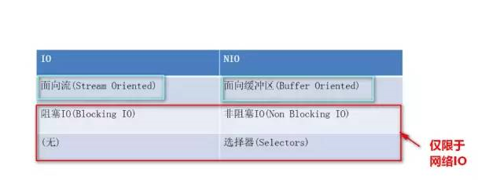

- 可简单认为：IO是面向流的处理，NIO是面向块(缓冲区)的处理

- - 面向流的I/O 系统一次一个字节地处理数据。
  - 一个面向块(缓冲区)的I/O系统以块的形式处理数据。

NIO主要有三个核心部分组成：

- buffer缓冲区
- Channel管道
- Selector选择器

## buffer缓冲区和Channel管道

在NIO中并不是以流的方式来处理数据的，而是以buffer缓冲区和Channel管道配合使用来处理数据。

> Channel管道比作成铁路，buffer缓冲区比作成火车(运载着货物)

而我们的NIO就是通过Channel管道运输着存储数据的Buffer缓冲区的来实现数据的处理！

- 要时刻记住：Channel不与数据打交道，它只负责运输数据。与数据打交道的是Buffer缓冲区

- - Channel-->运输
  - Buffer-->数据

相对于传统IO而言，流是单向的。对于NIO而言，有了Channel管道这个概念，我们的读写都是双向的(铁路上的火车能从广州去北京、自然就能从北京返还到广州)！

## buffer缓冲区核心要点

Buffer是缓冲区的抽象类：

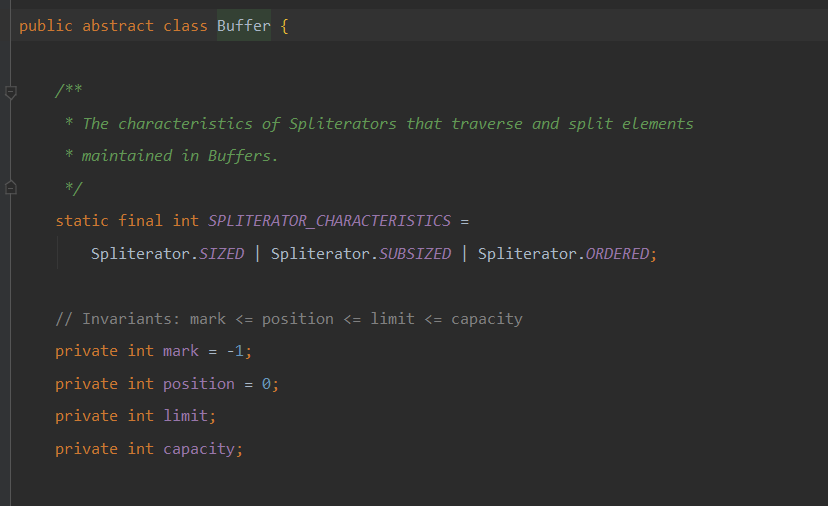

- 其中ByteBuffer是用得最多的实现类(在管道中读写字节数据)。


拿到一个缓冲区我们往往会做什么？很简单，就是读取缓冲区的数据/写数据到缓冲区中。所以，缓冲区的核心方法就是:

- put()
- get()

Buffer类维护了4个核心变量属性来提供关于其所包含的数组的信息。它们是:

- 容量Capacity

- - 缓冲区能够容纳的数据元素的最大数量。容量在缓冲区创建时被设定，并且永远不能被改变。(不能被改变的原因也很简单，底层是数组嘛)

- 上界Limit

- - 缓冲区里的数据的总数，代表了当前缓冲区中一共有多少数据。

- 位置Position

- - 下一个要被读或写的元素的位置。Position会自动由相应的 get( )和 put( )函数更新。

- 标记Mark

- - 一个备忘位置。用于记录上一次读写的位置。

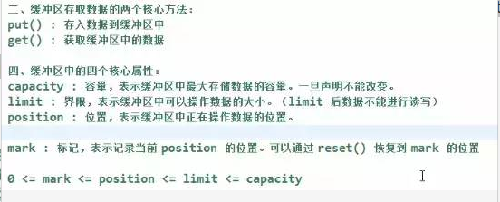

### buffer 代码演示

```java
public static void main(String[] args) {
        //创建一个缓冲区
        ByteBuffer buffer = ByteBuffer.allocate(1024);
        System.out.println("初始时的limit (代表当前有多少数据):"+buffer.limit());
        System.out.println("当前的position(缓冲区正在操作的数据位置):"+buffer.position());
        System.out.println("初始容量capacity(缓冲区能够存储数据的最大容量):"+buffer.capacity());
        System.out.println("标记mark,(用来记录当前 position 的位置):"+buffer.mark());

        //添加一些数据到缓冲区
        String s = "hello word";
        buffer.put(s.getBytes());
        //看一下四个核心变量的值
        System.out.println("=--------添加完数据后------------=");
        System.out.println("初始时的limit (代表当前有多少数据):"+buffer.limit());
        System.out.println("当前的position(缓冲区正在操作的数据位置):"+buffer.position());
        System.out.println("初始容量capacity(缓冲区能够存储数据的最大容量):"+buffer.capacity());
        System.out.println("标记mark,(用来记录当前 position 的位置):"+buffer.mark());
    }
```

返回值

```shell
初始时的limit (代表当前有多少数据):1024
当前的position(缓冲区正在操作的数据位置):0
初始容量capacity(缓冲区能够存储数据的最大容量):1024
标记mark,(用来记录当前 position 的位置):java.nio.HeapByteBuffer[pos=0 lim=1024 cap=1024]
=--------添加完数据后------------=
初始时的limit (代表当前有多少数据):1024
当前的position(缓冲区正在操作的数据位置):10
初始容量capacity(缓冲区能够存储数据的最大容量):1024
标记mark,(用来记录当前 position 的位置):java.nio.HeapByteBuffer[pos=10 lim=1024 cap=1024]
```

#### 想要从buffer缓冲中获取数据,怎么操作呢?

NIO给了我们一个flip()方法。这个方法可以改动position和limit的位置！

```java
System.out.println("=--------获取完部分数据后------------=");
Buffer flip = buffer.flip();
System.out.println("初始时的limit (代表当前有多少数据):"+flip.limit());
System.out.println("当前的position(缓冲区正在操作的数据位置):"+flip.position());
System.out.println("初始容量capacity(缓冲区能够存储数据的最大容量):"+flip.capacity());
System.out.println("标记mark,(用来记录当前 position 的位置):"+flip.mark());
```


运行结果

```java
=--------添加完数据后------------=
初始时的limit (代表当前有多少数据):1024
当前的position(缓冲区正在操作的数据位置):10
初始容量capacity(缓冲区能够存储数据的最大容量):1024
标记mark,(用来记录当前 position 的位置):java.nio.HeapByteBuffer[pos=10 lim=1024 cap=1024]
=--------获取完部分数据后------------=
初始时的limit (代表当前有多少数据):10
当前的position(缓冲区正在操作的数据位置):0
初始容量capacity(缓冲区能够存储数据的最大容量):1024
标记mark,(用来记录当前 position 的位置):java.nio.HeapByteBuffer[pos=0 lim=10 cap=1024]
```

很明显的是：

- limit变成了position的位置了
- 而position变成了0

当调用完filp()时：**limit是限制读到哪里，而position是从哪里读**

一般我们称filp()为**“切换成读模式”**

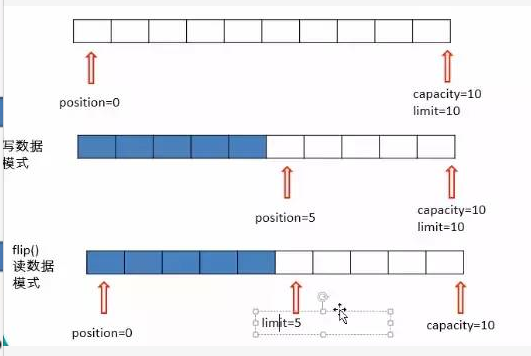

切换成读模式之后，我们就可以读取缓冲区的数据了：

```java
System.out.println("=--------开始读取数据------------=");
//创建一个limit 大小的字节数组（因为就只有limit 个数据可读）
byte[] bytes = new byte[flip.limit()];
//将数据读取到我们 的字节数组中
buffer.get(bytes);
//输出数据
System.out.println(new String(bytes));
```

调用完获取数据的方法后，核心变量：

```java
System.out.println("=--------输出完之后打印------------=");
System.out.println("get完数据后，初始时的limit (代表当前有多少数据):"+buffer.limit());
System.out.println("get完数据后，当前的position(缓冲区正在操作的数据位置):"+buffer.position());
System.out.println("get完数据后，初始容量capacity(缓冲区能够存储数据的最大容量):"+buffer.capacity());
System.out.println("get完数据后，标记mark,(用来记录当前 position 的位置):"+buffer.mark());
```

```shell
get完数据后，初始时的limit (代表当前有多少数据):10
get完数据后，当前的position(缓冲区正在操作的数据位置):10
get完数据后，初始容量capacity(缓冲区能够存储数据的最大容量):1024
get完数据后，标记mark,(用来记录当前 position 的位置):java.nio.HeapByteBuffer[pos=10 lim=10 cap=1024]
```

读完我们还想写数据到缓冲区，那就使用clear()函数，这个函数会“清空”缓冲区：

```java
System.out.println("=--------清理buffer------------=");
buffer.clear();
System.out.println("=--------调用完clear清除后------------=");
System.out.println("clear清除后，初始时的limit (代表当前有多少数据):"+buffer.limit());
System.out.println("clear清除后，当前的position(缓冲区正在操作的数据位置):"+buffer.position());
System.out.println("clear清除后，初始容量capacity(缓冲区能够存储数据的最大容量):"+buffer.capacity());
System.out.println("clear清除后，标记mark,(用来记录当前 position 的位置):"+buffer.mark());
```


- 数据没有真正被清空，只是被遗忘掉了

```shell
=--------清理buffer------------=
=--------调用完clear清除后------------=
clear清除后，初始时的limit (代表当前有多少数据):1024
clear清除后，当前的position(缓冲区正在操作的数据位置):0
clear清除后，初始容量capacity(缓冲区能够存储数据的最大容量):1024
clear清除后，标记mark,(用来记录当前 position 的位置):java.nio.HeapByteBuffer[pos=0 lim=1024 cap=1024]
```

- "清空缓冲区"---》核心变量回归“写模式”
- 缓冲区的数据时没有被清空的，但是被“遗忘了”，因为操作数据的核心变量都清空了。

# FileChannel 通道核心要点

## 通道（Channel）

用于 **源节点** 与 **目标节点** 链接。 在java NIO 模型中负责缓冲区（Buffer） 数据的传输，Channel 本身不存储数据，因此需要配合缓冲区进行数据传输。

通道的主要实现类：

```shell
java.nio.channels.Channel 接口：
|--FileChannel
|--SocketChannel
|--ServerSocketChannel
|--DategramChannel
```

获取通道：

1. java 支持通道的类提供了getChannel() 方法
   - 本地IO:
     - FileInputStream/FileOutputStream
     - RandAccessFile
   - 网络IO:
     - Socket
     - ServerSocket
     - DategramSocket
2. 在jdk1.7 中的 NIO.2 针对各个通道提供了静态方法 open();
3. 在jdk1.7 中的 NIO.2 的Files 的newByteChannel()

Channel通道只负责传输数据、不直接操作数据的。操作数据都是通过Buffer缓冲区来进行操作！

```java
 // 1. 通过本地IO的方式来获取通道
 FileInputStream fileInputStream = new FileInputStream("F:\\3yBlog\\JavaEE常用框架\\Elasticsearch就是这么简单.md");
// 得到文件的输入通道
FileChannel inchannel = fileInputStream.getChannel();

// 2. jdk1.7后通过静态方法.open()获取通道
FileChannel.open(Paths.get("F:\\3yBlog\\JavaEE常用框架\\Elasticsearch就是这么简单2.md"), StandardOpenOption.WRITE);
```

使用FileChannel配合缓冲区实现文件复制的功能：

```java
//使用FileChannel配合缓冲区实现文件复制的功能
    public static void main(String[] args) {
        FileInputStream fis = null;
        FileOutputStream fos = null;
        //创建通道
        FileChannel inChannel = null;
        FileChannel outChannel = null;

        try {
            fis = new FileInputStream("D:\\照片\\故宫\\wechat\\women.jpg");
            fos = new FileOutputStream("D:\\照片\\故宫\\2.jpg");
            inChannel = fis.getChannel();
            outChannel = fos.getChannel();

            //分配指定大小的缓冲
            ByteBuffer buffer = ByteBuffer.allocate(1024);
            //将通道中的数据存储缓冲区buffer中
            while (inChannel.read(buffer) != -1){
                //切换数据的读取模式
                buffer.flip();
                //将数据与输出管道链接
                outChannel.write(buffer);
                //清空缓存
                buffer.clear();
            }
        } catch (FileNotFoundException e) {
            e.printStackTrace();
        } catch (IOException e) {
            e.printStackTrace();
        }finally {
            try {
                fis.close();
                fos.close();
            } catch (IOException e) {
                e.printStackTrace();
            }
        }
    }
```

使用内存映射文件的方式实现文件复制的功能(直接操作缓冲区)：

```java
private static void copyFile2() {
    try {
        FileChannel inChannel = FileChannel.open(Paths.get("D:\\照片\\故宫\\wechat\\women.jpg"), StandardOpenOption.READ);
        FileChannel outChannel = FileChannel.open(Paths.get("D:\\照片\\故宫\\2.jpg"), StandardOpenOption.WRITE,
                                                  StandardOpenOption.READ,StandardOpenOption.CREATE_NEW);
        //内存映射文件
        MappedByteBuffer inMappedBuffer = inChannel.map(FileChannel.MapMode.READ_ONLY, 0, inChannel.size());
        MappedByteBuffer outMappedBuffer = outChannel.map(FileChannel.MapMode.READ_WRITE, 0, inChannel.size());
        //直接对缓冲区进行数据的读写
        byte[] dst= new byte[inMappedBuffer.limit()];
        inMappedBuffer.get(dst);
        outMappedBuffer.put(dst);
    } catch (IOException e) {
        e.printStackTrace();
    }
}
```

通道之间通过transfer()实现数据的传输(直接操作缓冲区)：

```java
//通道之间通过transfer()实现数据的传输(直接操作缓冲区)：
private static void copyFile3() {
    try {
        FileChannel inChannel = FileChannel.open(Paths.get("D:\\照片\\故宫\\wechat\\women.jpg"), StandardOpenOption.READ);
        FileChannel outChannel = FileChannel.open(Paths.get("D:\\照片\\故宫\\2.jpg"), StandardOpenOption.WRITE,
                                                  StandardOpenOption.READ,StandardOpenOption.CREATE_NEW);
        //outChannel.transferFrom(inChannel, 0,inChannel.size());
        inChannel.transferTo(0, inChannel.size(), outChannel);
        inChannel.close();
        outChannel.close();
    } catch (IOException e) {
        e.printStackTrace();
    }
}
```

# 直接与非直接缓冲区

- 非直接缓冲区是需要经过一个：copy的阶段的(从内核空间copy到用户空间)
- 直接缓冲区不需要经过copy阶段，也可以理解成--->内存映射文件，(上面的图片也有过例子)。

## 直接缓存

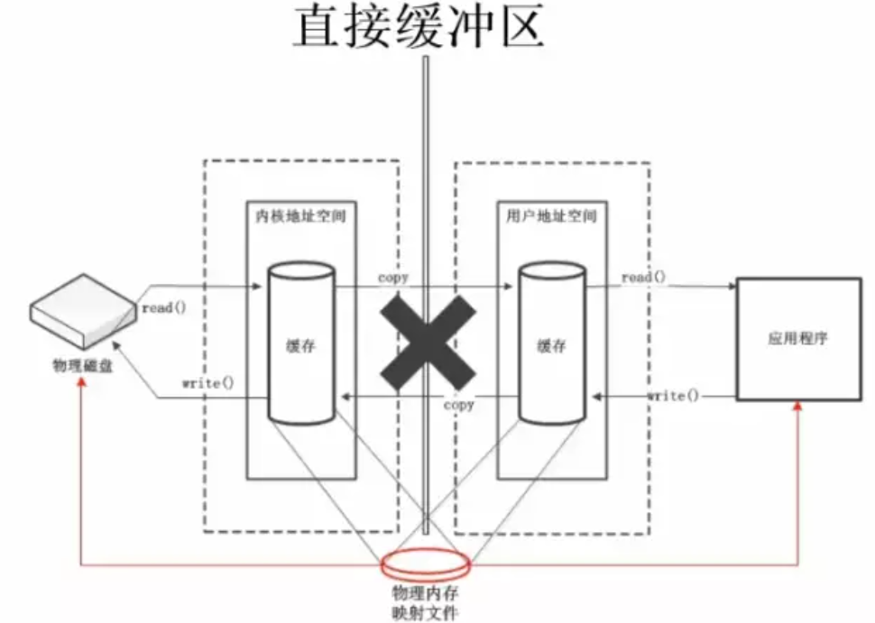

## 非直接缓存

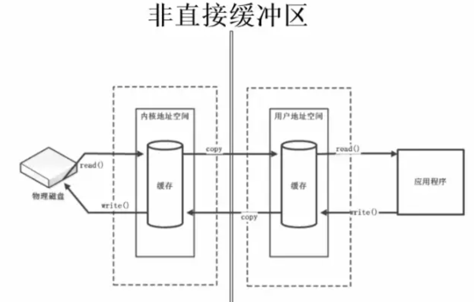

使用直接缓冲区有两种方式：

- 缓冲区创建的时候分配的是直接缓冲区
- 在FileChannel上调用map()方法，将文件直接映射到内存中创建

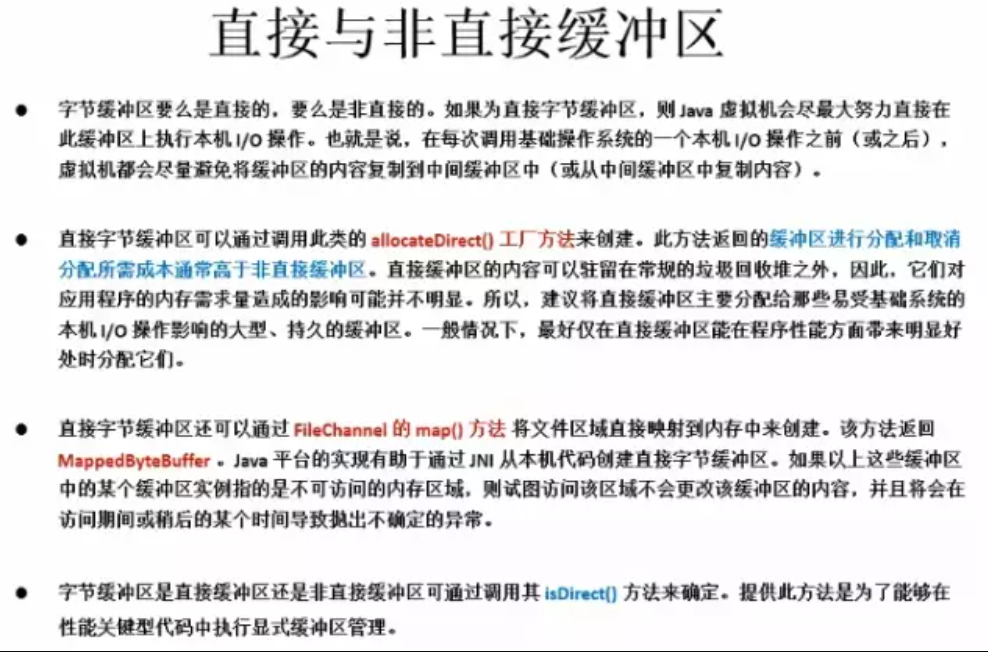

# scatter和gather、字符集

- 分散读取(scatter)：将一个通道中的数据分散读取到多个缓冲区中
- 聚集写入(gather)：将多个缓冲区中的数据集中写入到一个通道中

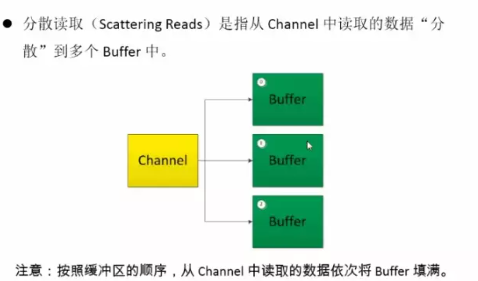

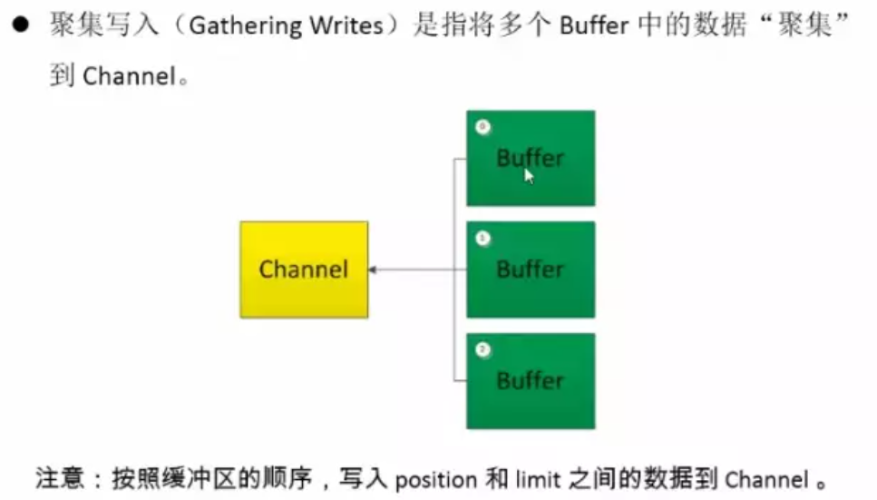

## 分散读取

```java
private static void scatterRead() {
        FileInputStream fis = null;
        try {
            fis = new FileInputStream("D:\\temp\\lucene-resource\\chinesetext.txt");
            FileChannel inChannel = fis.getChannel();
            //分配指定大小的缓冲区
            ByteBuffer buffer1 = ByteBuffer.allocate(100);
            ByteBuffer buffer2 = ByteBuffer.allocate(1024);
            //分散读取
            ByteBuffer[] bufs = {buffer1,buffer2};
            if(inChannel.read(bufs) != -1){
                for (ByteBuffer buf : bufs){
                    buf.flip();
                    byte[] result = new byte[buf.limit()];
                    buf.get(result);
                    System.out.println("读取的内容：" + new String(result));
                }
            }
        } catch (FileNotFoundException e) {
            e.printStackTrace();
        } catch (IOException e) {
            e.printStackTrace();
        }

    }
```


## 聚集写入

```java
private static void gatherWrither() {
        FileInputStream fis = null;
        FileOutputStream fos = null;
        RandomAccessFile rfos = null;
        try {
            fis = new FileInputStream("D:\\temp\\lucene-resource\\chinesetext.txt");
            FileChannel inChannel = fis.getChannel();
            //分配指定大小的缓冲区
            ByteBuffer buffer1 = ByteBuffer.allocate(100);
            ByteBuffer buffer2 = ByteBuffer.allocate(1024);
            //分散读取
            ByteBuffer[] bufs = {buffer1,buffer2};
            //聚集写入
            fos = new FileOutputStream("D:\\temp\\lucene-resource\\demoGenerate.txt");
            FileChannel fosChannel = fos.getChannel();
            rfos = new RandomAccessFile("D:\\temp\\lucene-resource\\demo222.txt", "rw");
            FileChannel rosChannel = rfos.getChannel();
            if(inChannel.read(bufs) != -1){
                for (ByteBuffer buf : bufs) {
                    buf.flip();
                }
                fosChannel.write(bufs);
                //调整 position 位置，让其可以重新写
                for (ByteBuffer buf : bufs) {
                    buf.position(0);
                }
                rosChannel.write(bufs);
            }

            fis.close();
            fos.close();
        } catch (FileNotFoundException e) {
            e.printStackTrace();
        } catch (IOException e) {
            e.printStackTrace();
        }
    }
```

## 字符集(只要编码格式和解码格式一致，就没问题了)

```java
public static void main(String[] args) {
    Charset cs = Charset.forName("GBK");
    //获取编码器
    CharsetEncoder ce = cs.newEncoder();
    //解码器
    CharsetDecoder cd = cs.newDecoder();
    CharBuffer cBuff = CharBuffer.allocate(1024);
    cBuff.put("我看看测试问题！我想学习。");
    cBuff.flip();

    try {
        //编码
        ByteBuffer bBuff = ce.encode(cBuff);
        for (int i = 0; i < bBuff.limit(); i++){
            System.out.println(bBuff.get());
        }
        //解码
        bBuff.flip();
        CharBuffer decode = cd.decode(bBuff);
        int i = 0;
        while (i < decode.limit()){
            System.out.println(decode.get());
            i++;
        }
    } catch (CharacterCodingException e) {
        e.printStackTrace();
    }
}
```


# IO 模型

根据UNIX网络编程对I/O模型的分类，在UNIX可以归纳成5种I/O模型：

- 阻塞I/O
- 非阻塞I/O
- I/O多路复用
- 信号驱动I/O
- 异步I/O

## IO 模型基础

###　文件描述符

Linux 的内核将所有外部设备都看做一个文件来操作，对一个文件的读写操作会调用内核提供的系统命令(api)，返回一个file descriptor（fd，文件描述符）。而对一个socket的读写也会有响应的描述符，称为socket fd（socket文件描述符），描述符就是一个数字，指向内核中的一个结构体（文件路径，数据区等一些属性）。

所以说：在Linux下对文件的操作是利用文件描述符(file descriptor)来实现的。

## 用户空间和内核空间

为了保证用户进程不能直接操作内核（kernel），保证内核的安全，操心系统将虚拟空间划分为两部分:

- 一部分为内核空间。
- 一部分为用户空间。

## I/O运行过程

我们来看看IO在系统中的运行是怎么样的(我们以read为例)


可以发现的是：当应用程序调用read方法时，是需要等待的--->从内核空间中找数据，再将内核空间的数据拷贝到用户空间的。

- 这个等待是必要的过程！

下面只讲解用得最多的3个I/0模型：

- 阻塞I/O
- 非阻塞I/O
- I/O多路复用

## 阻塞I/O模型

在进程(用户)空间中调用recvfrom，其系统调用直到数据包到达且被复制到应用进程的缓冲区中或者发生错误时才返回，在此期间一直等待。

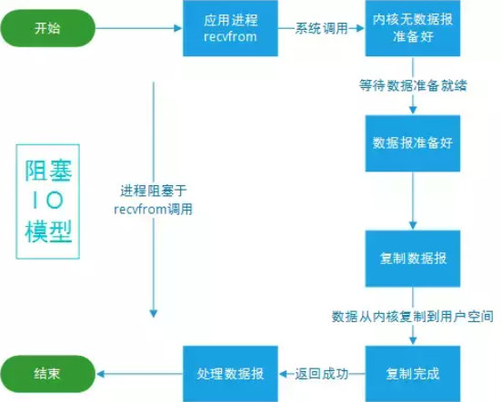

## 非阻塞I/O模型

recvfrom从应用层到内核的时候，如果没有数据就直接返回一个EWOULDBLOCK错误，一般都对非阻塞I/O模型进行轮询检查这个状态，看内核是不是有数据到来。


## I/O复用模型

前面也已经说了：在Linux下对文件的操作是利用文件描述符(file descriptor)来实现的。

在Linux下它是这样子实现I/O复用模型的：

- 调用select/poll/epoll/pselect其中一个函数，传入多个文件描述符，如果有一个文件描述符就绪，则返回，否则阻塞直到超时。

比如poll()函数是这样子的：int poll(struct pollfd *fds,nfds_t nfds, int timeout);

其中 pollfd 结构定义如下：

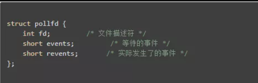

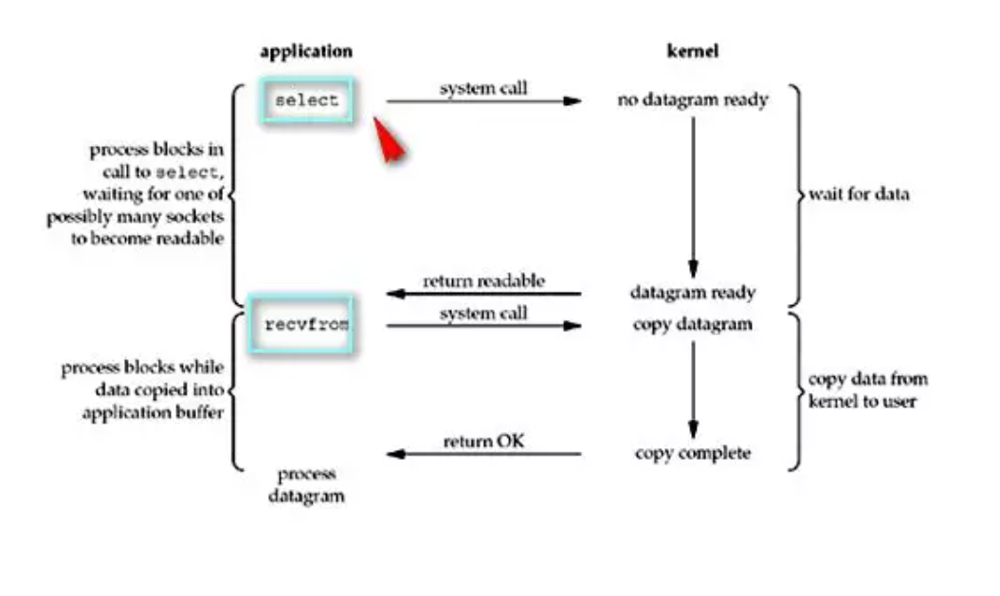

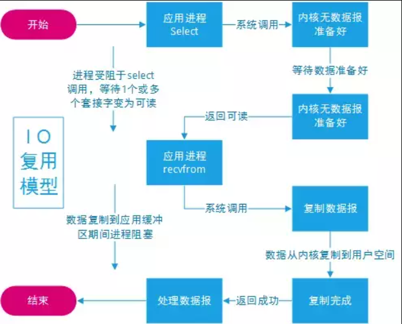

- （1）当用户进程调用了select，那么整个进程会被block；
- （2）而同时，kernel会“监视”所有select负责的socket；
- （3）当任何一个socket中的数据准备好了，select就会返回；
- （4）这个时候用户进程再调用read操作，将数据从kernel拷贝到用户进程(空间)。
- 所以，I/O 多路复用的特点是通过一种机制一个进程能同时等待多个文件描述符，而这些文件描述符其中的任意一个进入读就绪状态，select()函数就可以返回。

select/epoll的优势并不是对于单个连接能处理得更快，而是在于能处理更多的连接。

## I/O模型总结

略


# NIO 网络通信

## NIO 基础模型

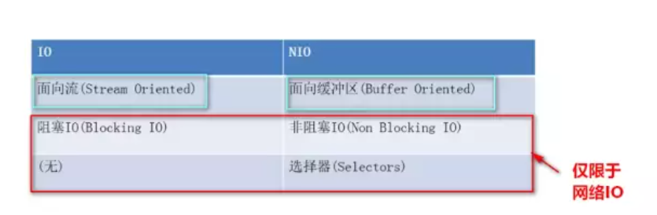

NIO被叫为 no-blocking io，其实是在网络这个层次中理解的，对于FileChannel来说一样是阻塞。

我们前面也仅仅讲解了FileChannel，对于我们网络通信是还有几个Channel的~

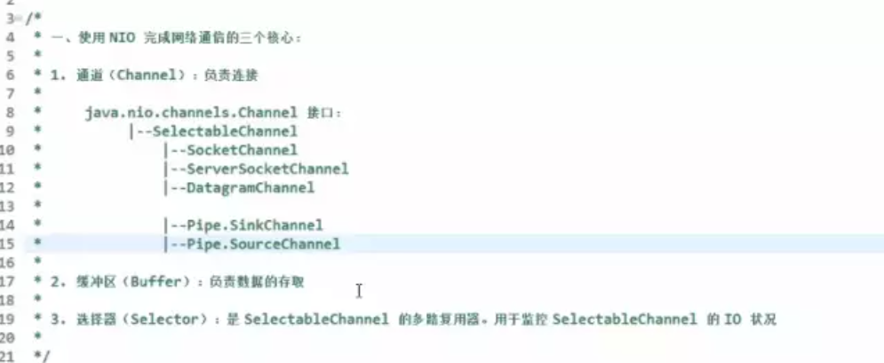

所以说：我们通常使用NIO是在网络中使用的，网上大部分讨论NIO都是在网络通信的基础之上的！说NIO是非阻塞的NIO也是网络中体现的！

从上面的图我们可以发现还有一个Selector选择器这么一个东东。从一开始我们就说过了，nio的核心要素有：

- Buffer缓冲区
- Channel通道
- Selector选择器

我们在网络中使用NIO往往是I/O模型的多路复用模型！

- Selector选择器就可以比喻成麦当劳的广播。
- 一个线程能够管理多个Channel的状态

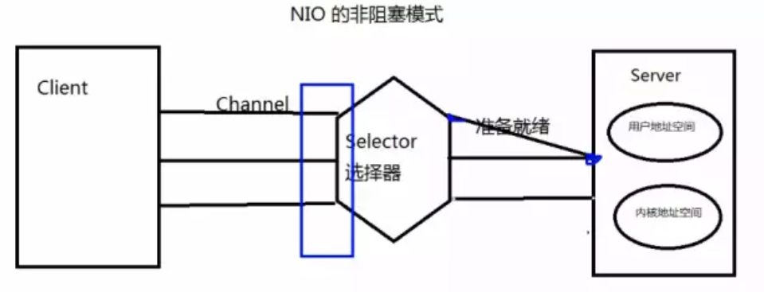

## NIO阻塞形态

为了更好地理解，我们先来写一下NIO在网络中是阻塞的状态代码，随后看看非阻塞是怎么写的就更容易理解了。

- 是阻塞的就没有Selector选择器了，就直接使用Channel和Buffer就完事了。

### 客户端

```java
public static void main(String[] args) {
    try (
        //1. 获取通道
        SocketChannel socketChannel = SocketChannel.open(new InetSocketAddress("127.0.0.1", 8081));
        // 2. 发送一张图片给服务端
        FileChannel open = FileChannel.open(Paths.get("D:\\照片\\故宫\\wechat\\women.jpg"), StandardOpenOption.READ);
    ) {

        //3.要使用NIO，有了Channel，就必然要有Buffer，Buffer是与数据打交道的呢
        ByteBuffer buffer = ByteBuffer.allocate(1024);
        //4.读取本地文件(图片)，发送到服务器
        while (open.read(buffer) != -1) {
            // 在读之前都要切换成读模式
            buffer.flip();
            socketChannel.write(buffer);
            // 读完切换成写模式，能让管道继续读取文件的数据
            buffer.clear();
        }
    } catch (IOException e) {
        e.printStackTrace();
    }
}
```

### 服务端

```java
public static void main(String[] args) {
    try {
        //1.获取通道
        ServerSocketChannel server = ServerSocketChannel.open();
        //2.得到文件通道，将客户端传递过来的图片写到本地项目下(写模式、没有则创建)
        FileChannel fileChannel = FileChannel.open(Paths.get("D:\\照片\\故宫\\wechat\\copy.jpg"), StandardOpenOption.WRITE, StandardOpenOption.CREATE);
        //3.绑定链接
        server.bind(new InetSocketAddress(8081));
        //4. 获取客户端的连接(阻塞的)
        SocketChannel client = server.accept();
        //5. 要使用NIO，有了Channel，就必然要有Buffer，Buffer是与数据打交道的呢
        ByteBuffer buffer = ByteBuffer.allocate(1024);
        //6.将客户端传递过来的图片保存在本地中
        while (client.read(buffer) != -1){
            //修改为读模式
            buffer.flip();
            fileChannel.write(buffer);
            // 读完切换成写模式，能让管道继续读取文件的数据
            buffer.clear();
        }

        // 7.关闭通道
        fileChannel.close();
        client.close();
        server.close();
    } catch (IOException e) {
        e.printStackTrace();
    }
}
```

- 此时服务端保存完图片想要告诉客户端已经收到图片啦：

```java
  //此时服务端保存完图片想要告诉客户端已经收到图片
buffer.put(Byte.valueOf("img is success"));
buffer.flip();
client.write(buffer);
buffer.clear();
```

- 客户端接收服务端带过来的数据：

```java
 //客户端接收服务端带过来的数据
while (socketChannel.read(buffer) != -1){
    //切换为阅读模式
    buffer.flip();
    System.out.println(new String(buffer.array()));
}
```

**发现：通道阻塞了**

如果仅仅是上面的代码是不行的！这个程序会阻塞起来！

- 因为服务端不知道客户端还有没有数据要发过来(与刚开始不一样，客户端发完数据就将流关闭了，服务端可以知道客户端没数据发过来了)，导致服务端一直在读取客户端发过来的数据。
- 进而导致了阻塞！

于是客户端在写完数据给服务端时，显式告诉服务端已经发完数据了！

```java
//客户端告诉服务端数据已经写完了
socketChannel.shutdownOutput();

//客户端接收服务端带过来的数据
while (socketChannel.read(buffer) != -1){
    //切换为阅读模式
    buffer.flip();
    System.out.println(new String(buffer.array(),0,buffer.limit()));
}
```

## NIO 的非阻塞形态

如果使用非阻塞模式的话，那么我们就可以不显式告诉服务器已经发完数据了。我们下面来看看怎么写：

### 客户端

```java
public static void main(String[] args) {
    try {
        SocketChannel client = SocketChannel.open(new InetSocketAddress("127.0.0.1", 8083));
        //设置成非阻塞模式
        client.configureBlocking(false);
        //发送一张图片给服务端
        FileChannel fileChannel = FileChannel.open(Paths.get("D:\\照片\\故宫\\wechat\\women.jpg"), StandardOpenOption.READ);
        //创建与数据交互的换从
        ByteBuffer buffer = ByteBuffer.allocate(1024);
        while (fileChannel.read(buffer) != -1){
            //设置为读模式
            buffer.flip();
            client.write(buffer);
            //重置point 节点，设置成写模式
            buffer.clear();
        }

        //关闭流
        fileChannel.close();
        client.close();
    } catch (IOException e) {
        e.printStackTrace();
    }

}
```

### 服务端

```java
public static void main(String[] args) {
    try {
        //获取通道
        ServerSocketChannel server = ServerSocketChannel.open();
        //设置为非阻塞模式
        server.configureBlocking(false);
        //绑定链接
        server.bind(new InetSocketAddress(8083));
        //获取选择器
        Selector selector = Selector.open();
        //将通道注册到选择器上,指定接收“监听通道”事件
        server.register(selector, SelectionKey.OP_ACCEPT);
        //轮询的获取选择器上已“就绪”的事件（select()>0）说明已就绪
        while (selector.select() > 0){
            //获取当前选择器上所有注册的“选择键”（已就绪的监听事件）
            Iterator<SelectionKey> iterator = selector.selectedKeys().iterator();
            //获取就绪的事件
            while (iterator.hasNext()){
                SelectionKey selectionKey = iterator.next();
                //接受事件就绪
                if(selectionKey.isAcceptable()){
                    //获取客户端的链接
                    SocketChannel client = server.accept();
                    //client 模式也设置成 false
                    client.configureBlocking(false);
                    //注册到选择器上--》 拿到客户端的链接为了读取通道的数据（监听读就绪事件）
                    client.register(selector, SelectionKey.OP_READ);

                }else if (selectionKey.isReadable()){//读事件就绪
                    //获取当前选择器读就绪状态的通道
                    SocketChannel client = (SocketChannel)selectionKey.channel();
                    //读取数据的 buffer
                    ByteBuffer byteBuffer = ByteBuffer.allocate(1024);
                    //得到文件通道，将客户端发过来的文件写到本地目录下
                    FileChannel outChannel = FileChannel.open(Paths.get("D:\\照片\\故宫\\wechat\\copy2.jpg"), StandardOpenOption.WRITE, StandardOpenOption.CREATE);
                    while (client.read(byteBuffer)!= -1){
                        //转换为读取模式
                        byteBuffer.flip();
                        outChannel.write(byteBuffer);
                        //转换为写模式
                        byteBuffer.clear();
                    }
                }
                iterator.remove();
            }
        }
    } catch (IOException e) {
        e.printStackTrace();
    }

}
```

服务端保存了图片以后，告诉客户端已经收到图片了。

在服务端上只要在后面写些数据给客户端就好了：

```java
//服务器接受到信息后，给客户端答复图片已经收到了
CharBuffer writeBuffer = CharBuffer.allocate(1024);
writeBuffer.put("the msg is received,  you can do any otherThing");
writeBuffer.flip();
Charset charset = Charset.forName("UTF-8");
ByteBuffer encode = charset.encode(writeBuffer);
client.write(encode);
writeBuffer.clear();
```

在客户端上要想获取得到服务端的数据，也需要注册在register上(监听读事件)！

```java
//获取服务器上返回的信息
//轮训的获取选择器上已经 “就绪” 的事件 ----》只要 select.select() > 0, 说明已经就绪
while (selector.select() > 0){
    //获取当前选择器所注册的 “注册键” （已就绪的监听事件）
    Iterator<SelectionKey> iterator = selector.selectedKeys().iterator();
    //获取就绪的事件，不同的事件处理不同的事
    while (iterator.hasNext()){
        SelectionKey selectionKey = iterator.next();
        //读事件就绪
        if(selectionKey.isReadable()){
            SocketChannel channel = (SocketChannel)selectionKey.channel();
            ByteBuffer byteBuffer = ByteBuffer.allocate(1024);
            //读取服务端响应的数据
            int read = channel.read(byteBuffer);
            if (read > 0){
                //设置为读模式
                byteBuffer.flip();
                System.out.println(new String(byteBuffer.array(),0,read));
            }
        }

    }
```

下面就简单总结一下使用NIO时的要点：

- 将Socket通道注册到Selector中，监听感兴趣的事件
- 当感兴趣的时间就绪时，则会进去我们处理的方法进行处理
- 每处理完一次就绪事件，删除该选择键(因为我们已经处理完了)

## 管道 和DataGramChannel

### UDP

- 客户端

```java
public static void main(String[] args) {
    try {
        DatagramChannel open = DatagramChannel.open();
        open.configureBlocking(false);
        ByteBuffer buffer = ByteBuffer.allocate(1024);
        Scanner scanner = new Scanner(System.in);
        while (scanner.hasNext()){
            String next = scanner.next();
            buffer.put((LocalDateTime.now().toString() + ":\n" + next).getBytes());
            buffer.flip();
            open.send(buffer,new InetSocketAddress("127.0.0.1", 8084));
            buffer.clear();
        }
        open.close();
    } catch (IOException e) {
        e.printStackTrace();
    }
}
```

- 服务端

```java
public static void main(String[] args) {
    try {
        DatagramChannel dc = DatagramChannel.open();
        dc.bind(new InetSocketAddress(8084));
        dc.configureBlocking(false);
        Selector selector = Selector.open();
        dc.register(selector, SelectionKey.OP_READ);
        while (selector.select() > 0){
            Iterator<SelectionKey> iterator = selector.selectedKeys().iterator();
            while (iterator.hasNext()){
                SelectionKey sk = iterator.next();
                if (sk.isReadable()){
                    ByteBuffer allocate = ByteBuffer.allocate(1024);
                    dc.receive(allocate);
                    allocate.flip();
                    System.out.println(new String(allocate.array(),0, allocate.limit()));
                    allocate.clear();
                }
                iterator.remove();
            }
            dc.close();
        }
    } catch (IOException e) {
        e.printStackTrace();
    }
}
```


### 管道

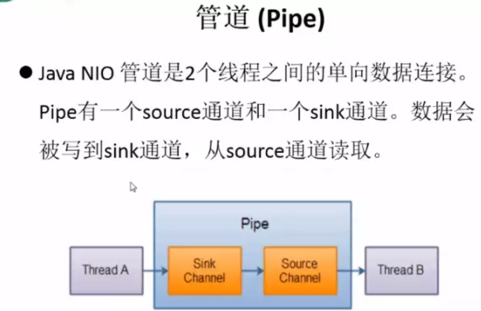

代码：

```java
 public static void main(String[] args) throws IOException {
        //获取管道
        Pipe pipe = Pipe.open();
        Thread A = new Thread(() -> {
            System.out.println("进入写数据方法");
            //将缓冲区的数据写入管道
            ByteBuffer byteBuffer = ByteBuffer.allocate(1024);
            Pipe.SinkChannel sink = pipe.sink();
            byteBuffer.put("通过单项管道发送数据".getBytes());
            byteBuffer.flip();
            try {
                sink.write(byteBuffer);
                sink.close();
            } catch (IOException e) {
                e.printStackTrace();
            }
        });

        Thread B = new Thread(() -> {
            System.out.println("进入读数据方法");
            //读取缓冲区中的数据
            Pipe.SourceChannel source = pipe.source();
            ByteBuffer byteBuffer = ByteBuffer.allocate(1024);
            try {
                source.read(byteBuffer);
                byteBuffer.flip();
                System.out.println(new String(byteBuffer.array(), 0, byteBuffer.limit()));
                source.close();
            } catch (IOException e) {
                e.printStackTrace();
            }
        });
        A.start();
        B.start();
    }
```


# 参考

- https://mp.weixin.qq.com/s/XCtS9d4uLM8WQLhhMU-0qA