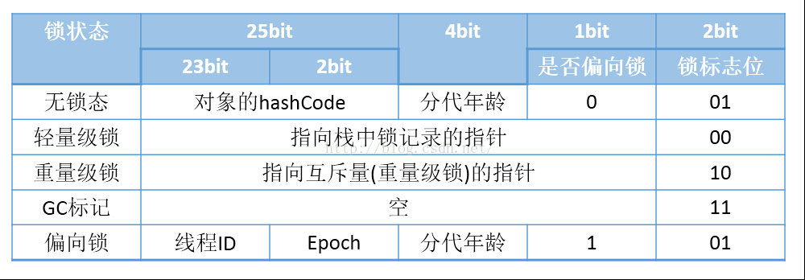
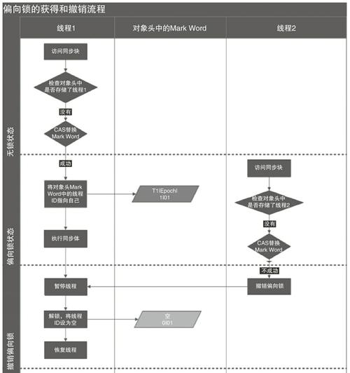
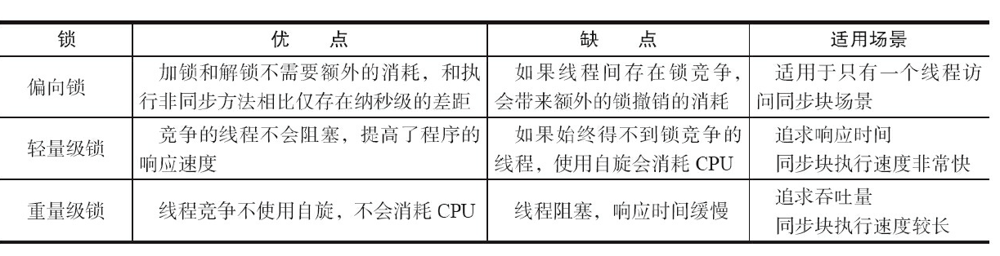
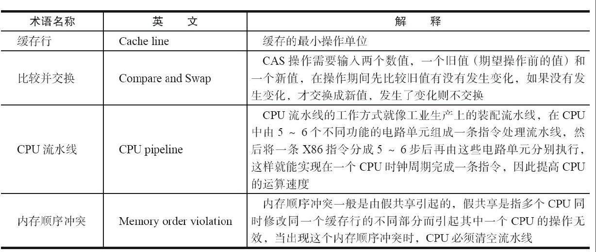

# 基本术语

##  上下文切换
1. 单核处理器也支持多线程执行代码.
2. cpu 通过时间分配算法来循环执行任务,当前任务执行一个时间片后会切换到一下个任务.
3. 在切换前会保存上一个任务的状态,以便于下一次切换回这个任务时,可以再加载这个任务的之前状态.
4. __定义:__ 任务从保存到再加载的过程就是一次上下文切换.
5. __注意:__ 多线程不一定比单线程快.数据量不超过百万次时,多线程比单线程反而慢.
<!--more-->

### 如合减少上下文切换
1. 无锁并发编程
2. CAS 算法
3. 使用最少线程
4. 协程:单线程中的多任务调度,单个线程中维持多个任务切换.

### 死锁  
避免死锁的常见的几个方法:
1. 避免一个线程同时获取多个锁
2. 避免一个线程再所内同时占用多个资源,尽量保证一个锁只占用一个资源
3. 尝试使用锁时,使用 `lock.tryLock(timeOut) `来代替使用内部锁机制.
4. 对于数据库锁,加锁和解锁必须再同一个数据库连接中,否则回出现解锁失败的情况.

### 资源限制的挑战  
资源限制是指程序的执行速度受限于计算机硬件资源或者软件限制.  
####  硬件资源限制
1. 带宽的上传/下载
2. 硬盘的读写速度
3. CPU 的处理速度

####  软件的资源限制
1. 数据库的连接数
2. socket 的连接数

# java 并发机制的底层实现

## volatile的应用

多处理器并发中，保证了共享变量的可见性（可见性是指一个线程修改共享变量时，另外一个线程能读到修改的值）。

如果一个字段被声明成volatile，Java线程内存模型确保所有线程看到这个变量的值是一致的。

### CPU 术语定义


1. 内存屏障(memiry Barrier)
2. 缓冲行(Cache Line)
3. 原子操作(atomic operations)
4. 缓存行填充(cache line fill)
5. 缓存命中(cache hit)
6. 写命中(write hit)
7. 写缺失(write misses the cache)

###  增加volatile 后的作用
1. 将当前系统缓存行的数据诙谐到系统内存
2. 写的操作会使得其他CPU中缓存了该内存地址得到数据无效

## synchronized 实现原理与应用 
java中的每种对象都可以作为锁。具体表现为：
1. 对于普通的同步方法，锁是当前对象
2. 对于静态同步方法，锁是当前类的class 对象
3. 对于同步方法块，锁是Synchronized 括号中的对象

### 实现原理

- JVM基于进入和退出Monitor对象来实现方法同步和代码块同步，但两者的实现细节不一样。
- 代码块同步是使用monitorenter和monitorexit指令实现的，而方法同步是使用另外一种方式实现的，细节在JVM规范里并没有
  详细说明。但是，方法的同步同样可以使用这两个指令来实现。
- monitorenter指令是在编译后插入到同步代码块的开始位置，而monitorexit是插入到方法结束处和异常处，JVM要保证每个monitorenter必须有对应的monitorexit与之配对。
- 任何对象都有一个monitor与之关联，当且一个monitor被持有后，它将处于锁定状态。
- 线程执行到monitorenter指令时，将会尝试获取对象所对应的monitor的所有权，即尝试获得对象的锁。

#  java 对象头 
数组类型对象，则虚拟机用3个个字宽（word）存储对象头。 

```shell
|---------------------------------------------------------------------------------|
|                                 Object Header (96 bits)                         |
|--------------------------------|-----------------------|------------------------|
|        Mark Word(32bits)       |    Klass Word(32bits) |  array length(32bits)  |
|--------------------------------|-----------------------|------------------------|
```

对象为非数组类型，则使用两个字宽存储对象头。 

```shell
|--------------------------------------------------------------|
|                     Object Header (64 bits)                  |
|------------------------------------|-------------------------|
|        Mark Word (32 bits)         |    Klass Word (32 bits) |
|------------------------------------|-------------------------|
```

在32位虚拟机中，1个字宽等于4个字节（32bit）。
__对象头分解:__

1. `markWord` `32/64bit `存储对象hashCode 或锁信息
2. `Class MataData Address` 32/64bit 存储对象类型数据的指针
3. `Array length` `32/32bit` 数组的长度（如果当前对象是数组）  

## markWord 对象头

主要用来存储对象自身的运行时数据，如hashcode、gc分代年龄等。`mark word`的位长度为JVM的一个Word大小，也就是说32位JVM的`Mark word`为32位，64位JVM为64位。

为了让一个字大小存储更多的信息，JVM将字的最低两个位设置为标记位，不同标记位下的Mark Word示意如下：

```shell
|-------------------------------------------------------|--------------------|
|                  Mark Word (32 bits)                  |       State        |
|-------------------------------------------------------|--------------------|
| identity_hashcode:25 | age:4 | biased_lock:1 | lock:2 |       Normal       |
|-------------------------------------------------------|--------------------|
|  thread:23 | epoch:2 | age:4 | biased_lock:1 | lock:2 |       Biased       |
|-------------------------------------------------------|--------------------|
|               ptr_to_lock_record:30          | lock:2 | Lightweight Locked |
|-------------------------------------------------------|--------------------|
|               ptr_to_heavyweight_monitor:30  | lock:2 | Heavyweight Locked |
|-------------------------------------------------------|--------------------|
|                                              | lock:2 |    Marked for GC   |
|-------------------------------------------------------|--------------------|
```



其中各个位置的含义如下：	

- **lock**:2位的锁状态标记位，由于希望用尽可能少的二进制位表示尽可能多的信息，所以设置了lock标记。该标记的值不同，整个mark word表示的含义不同。
- **biased_lock**：对象是否启用偏向锁标记，只占1个二进制位。为1时表示对象启用偏向锁，为0时表示对象没有偏向锁。

| biased_lock | lock |   状态   |
| :---------: | :--: | :------: |
|      0      |  01  |   无锁   |
|      1      |  01  |  偏向锁  |
|      0      |  00  | 轻量级锁 |
|      0      |  10  | 重量级锁 |
|      0      |  11  |  GC标记  |

- **age**：4位的Java对象年龄。在GC中，如果对象在Survivor区复制一次，年龄增加1。当对象达到设定的阈值时，将会晋升到老年代。默认情况下，并行GC的年龄阈值为15，并发GC的年龄阈值为6。由于age只有4位，所以最大值为15，这就是`-XX:MaxTenuringThreshold`选项最大值为15的原因。

- **identity_hashcode**：25位的对象标识Hash码，采用延迟加载技术。调用方法`System.identityHashCode()`计算，并会将结果写到该对象头中。当对象被锁定时，该值会移动到管程Monitor中。
- **thread**：持有偏向锁的线程ID。
- **epoch**：偏向时间戳。
- **ptr_to_lock_record**：指向栈中锁记录的指针。
- **ptr_to_heavyweight_monitor**：指向管程Monitor的指针。

### 64位下的标记字与32位的相似，不再赘述：

```shell
|------------------------------------------------------------------------------|--------------------|
|                                  Mark Word (64 bits)                         |       State        |
|------------------------------------------------------------------------------|--------------------|
| unused:25 | identity_hashcode:31 | unused:1 | age:4 | biased_lock:1 | lock:2 |       Normal       |
|------------------------------------------------------------------------------|--------------------|
| thread:54 |       epoch:2        | unused:1 | age:4 | biased_lock:1 | lock:2 |       Biased       |
|------------------------------------------------------------------------------|--------------------|
|                       ptr_to_lock_record:62                         | lock:2 | Lightweight Locked |
|------------------------------------------------------------------------------|--------------------|
|                     ptr_to_heavyweight_monitor:62                   | lock:2 | Heavyweight Locked |
|------------------------------------------------------------------------------|--------------------|
|                                                                     | lock:2 |    Marked for GC   |
|------------------------------------------------------------------------------|--------------------|
```


## CLASS POINT  对象的类型指针

该指针指向它的类元数据，JVM通过这个指针确定对象是哪个类的实例。该指针的位长度为JVM的一个字大小，即32位的JVM为32位，64位的JVM为64位。

如果应用的对象过多，使用64位的指针将浪费大量内存，统计而言，64位的JVM将会比32位的JVM多耗费50%的内存。为了节约内存可以使用选项`+UseCompressedOops`开启指针压缩，其中，oop即ordinary object pointer普通对象指针。开启该选项后，下列指针将压缩至32位：

- 每个Class的属性指针（即静态变量）
- 每个对象的属性指针（即对象变量）
- 普通对象数组的每个元素指针

当然，也不是所有的指针都会压缩，一些特殊类型的指针JVM不会优化，比如指向PermGen的Class对象指针(JDK8中指向元空间的Class对象指针)、本地变量、堆栈元素、入参、返回值和NULL指针等。

## array length 储数组的长度（数组对象）

如果对象是一个数组，那么对象头还需要有额外的空间用于存储数组的长度，这部分数据的长度也随着JVM架构的不同而不同：32位的JVM上，长度为32位；64位JVM则为64位。64位JVM如果开启`+UseCompressedOops`选项，**该区域长度也将由64位压缩至32位**。

# 锁的升级与对比

一共有四种锁，级别从低到高：无锁状态、偏向锁状态、轻量级锁状态 和重量级锁状态。 
锁状态会随着竞争条件主键提升。锁可以升级，但是不可以降级。

## 偏向锁 
大多数情况下，锁不存在多线程的竞争，而是总是同一线程多次获得。所以，为了降低获得锁的代价引入了偏向锁。

当一个线程访问同步块并且获取锁时，会在对象头和栈帧对应的所记录里存储偏向的线程id，以后该线程在进入或者退出同步代码块时，不需要进行CAS 操作来枷锁和解锁，只是简单的测试一下对象头的markword里是否存储着指向当前线程的偏向锁。如果测试成功，表示当前线程已经获取到了锁。如果测试失败，则需要再测试一下MarkWord中的偏向锁的标识是否设置成了1（表示当前是偏向锁）：如果没有设置，则使用CAS竞争锁；如果设置了，则尝试使用CAS 将对象头的偏向锁指向当前线程。

### 偏向锁的撤销

- 偏向锁使用了一种等到竞争出现时，才释放锁的机制，所以当其他线程尝试竞争偏向锁时，持有偏向锁的线程才会释放偏向锁。
- 偏向锁的撤销需要等到全局安全点（这个时间点上没有正在执行的字节码）。



### 偏向锁的关闭

通过配置JVM 参数关闭偏向锁：`-XX:-UseBiasedLocking=false`.设置后程序默认会进入轻量级锁状态。

## 轻量级锁

### 轻量级锁加锁
线程在执行同步块之前，JVM会先在当前线程的栈桢中创建用于存储锁记录的空间，并将对象头中的Mark Word复制到锁记录中，官方称为Displaced Mark Word。然后线程尝试使用CAS将对象头中的Mark Word替换为指向锁记录的指针。如果成功，当前线程获得锁，如果失败，表示其他线程竞争锁，当前线程便尝试使用自旋来获取锁。

### 轻量级锁解锁

轻量级解锁时，会使用原子的CAS操作将Displaced Mark Word替换回到对象头，如果成功，则表示没有竞争发生。如果失败，表示当前锁存在竞争，锁就会膨胀成重量级锁。


因为自旋会消耗CPU，为了避免无用的自旋（比如获得锁的线程被阻塞住了），一旦锁升级成重量级锁，就不会再恢复到轻量级锁状态。

### 重量级锁

了避免无用的自旋（比如获得锁的线程被阻塞住了），一旦锁升级
成重量级锁，就不会再恢复到轻量级锁状态。当锁处于重量级锁的状态下，其他线程试图获取锁时，都会被阻塞住，当持有锁的线程释放锁之后会唤醒这些线程，被唤醒的线程就会进行新一轮的夺锁之争。

### 锁的优缺点对比




# 原子操作的实现原理

## 术语定义



## 处理器如何实现原子操作

### 使用总线锁保证原子性

总线锁：就是使用处理器提供一个`LOCK#` 信号，当一个处理器在总线上输出此信号时，其他处理器的请求会被阻塞住，那么该处理器将独占共享内存。

### 使用缓存锁保证原子性

- 缓存锁定：内存区域如果被缓存在处理器的缓存行中，并且在lock操作期间被锁定，那么当它执行写操作会写到内存时，处理器不在总线上申明`LOCK#`信号，而是修改内部的内存地址，并允许他的缓存一致性机制来保证操作的原子性。
- 缓存一致性的作用：会阻止同时修改两个以上的处理器缓存的内存区域数据。当其他处理器回写已经被锁定的缓存行的数据时，会使得缓存行无效。

## Java如何实现原子操作

原子（atomic）操作 - 不能被中断或者分割的一个或者一系列操作。

### 使用循环CAS实现原子操作

JVM中的CAS操作正是利用了处理器提供的CMPXCHG指令实现的。

**自旋CAS实现的基本思路就是循环进行CAS操作直到成功为止.**

以下代码实现了一个基于CAS线程安全的计数器方法safeCount:

```java
 /**
   * 利用自旋操CAS作+1
   */
public static void safeCount(){
    for (;;){
        int i = atomI.get();
        boolean succ = atomI.compareAndSet(i, i++);
        if(succ){
            break;
        }
    }
}
```


### CAS实现原子操作的三大问题

#### ABA 问题

CAS需要在操作值的时候，检查值有没有发生变化，如果没有发生变化则更新，但是如果一个值原来是A，变成了B，又变成了A，那么使用CAS进行检查时会发现它的值没有发生变化，但是实际上却变化了.

- 解决思路：

> 的解决思路就是使用版本号.在变量前面追加上版本号，每次变量更新的时候把版本号加1，那么A→B→A就会变成1A→2B→3A。

> JDK的Atomic包里提供了一个类AtomicStampedReference来解决ABA问题。这个类的compareAndSet方法的作用是首先检查当前引用是否等于预期引用，并且检查当前标志是否等于预期标志，如果全部相等，则以原子方式将该引用和该标志的值设置为给定的更新值。

```java
public boolean compareAndSet(
V expectedReference, // 预期引用
V newReference, // 更新后的引用
int expectedStamp, // 预期标志
int newStamp // 更新后的标志
)
```


#### 循环时间长开销大

- 自旋CAS如果长时间不成功，会给CPU带来非常大的执行开销。

#### 只能保证一个共享变量的原子操作.

- 当对一个共享变量执行操作时，我们可以使用循环CAS的方式来保证原子操作，但是对多个共享变量操作时，循环CAS就无法保证操作的原子性，这个时候就可以用锁。
- 还有一个取巧的办法，就是把多个共享变量合并成一个共享变量来操作。比如，有两个共享变量i＝2，j=a，合并一下ij=2a，然后用CAS来操作ij。
- JDK提供了AtomicReference类来保证引用对象之间的原子性，就可以把多个变量放在一个对象里来进行CAS操作。

#### 使用锁机制实现原子操作

锁机制保证了只有获得锁的线程才能够操作锁定的内存区域。JVM内部实现了很多种锁机制，有偏向锁、轻量级锁和互斥锁。有意思的是除了偏向锁，JVM实现锁的方式都用了循环CAS，即当一个线程想进入同步块的时候使用循环CAS的方式来获取锁，当它退出同步块的时
候使用循环CAS释放锁。

# 小结

volatile 、synchronize 和原子操作的实现原理。