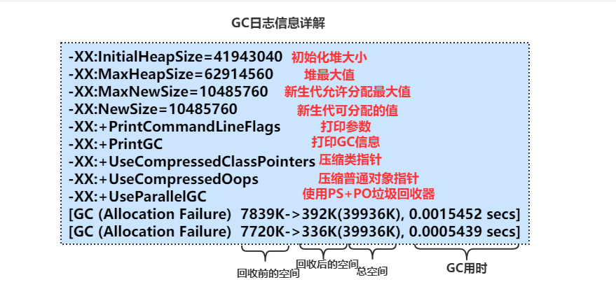
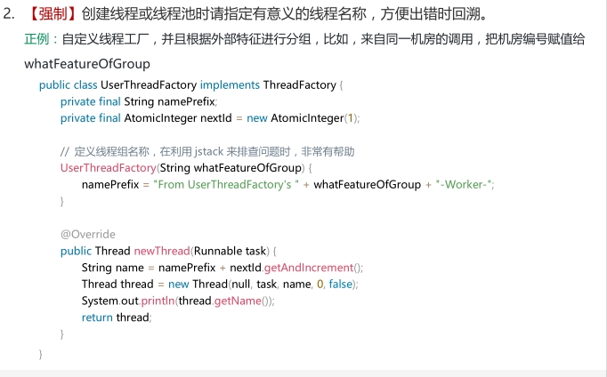
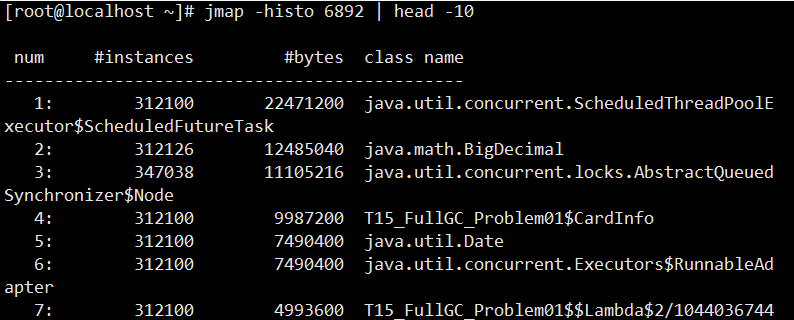
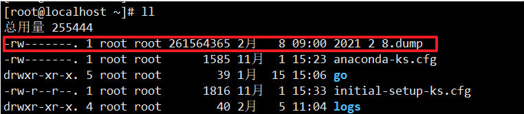
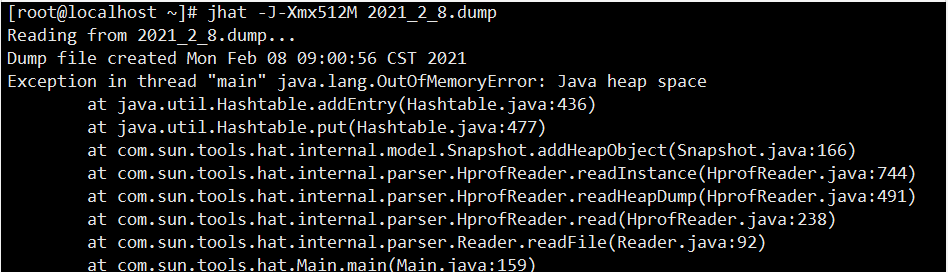
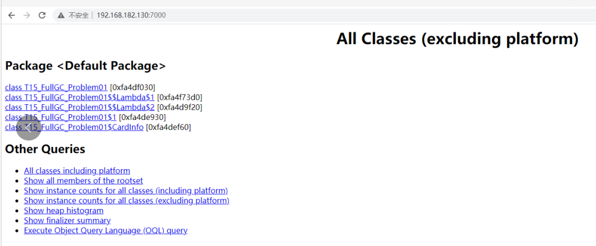

## JVM 调优案例

示例类:

```java
public class T01_HelloGC {

    public static void main(String[] args) {
        for (int i=0; i<10000; i++){
            byte[] b = new byte[1024 * 1024];
        }
    }
}
```


1. `-XX:+PrintCommandLineFlags`   命令行:  `java -XX:+PrintCommandLineFlags T01_HelloGC*`

```shell
-XX:InitialHeapSize=132318784 -XX:MaxHeapSize=2117100544 -XX:+PrintCommandLineFlags -XX:+UseCompressedClassPointers -XX:+UseCompressedOops -XX:-UseLargePagesIndividualAllocation -XX:+UseParallelGC
```


2. `-Xmn10M -Xms40M -Xmx60M -XX:+PrintCommandLineFlags -XX:+PrintGC`  命令行: `java -Xmn10M -Xms40M -Xmx60M -XX:+PrintCommandLineFlags -XX:+PrintGC HelloGC PrintGCDetails PrintGCTimeStamps PrintGCCauses`

```shell
-XX:InitialHeapSize=41943040 -XX:MaxHeapSize=62914560 -XX:MaxNewSize=10485760 -XX:NewSize=10485760 -XX:+PrintCommandLineFlags -XX:+PrintGC -XX:+UseCompressedClassPointers -XX:+UseCompressedOops -XX:-UseLargePagesIndividualAllocation -XX:+UseParallelGC 
[GC (Allocation Failure)  7334K->848K(39936K), 0.0011107 secs]
[GC (Allocation Failure)  8172K->880K(39936K), 0.0009446 secs]
[GC (Allocation Failure)  8362K->752K(39936K), 0.0007328 secs]
[GC (Allocation Failure)  8072K->848K(39936K), 0.0007350 secs]
[GC (Allocation Failure)  8171K->832K(39936K), 0.0009140 secs]
[GC (Allocation Failure)  8157K->832K(39936K), 0.0007324 secs]
[GC (Allocation Failure)  8158K->704K(39424K), 0.0010137 secs]
[GC (Allocation Failure)  8031K->704K(39424K), 0.0004187 secs]
[GC (Allocation Failure)  6987K->704K(39424K), 0.0003248 secs]
[GC (Allocation Failure)  6987K->704K(39424K), 0.0005243 secs]
[GC (Allocation Failure)  6988K->704K(39424K), 0.0005282 secs]
[GC (Allocation Failure)  6988K->704K(39424K), 0.0004130 secs]
```


命令行解释:

```shell
java:表示使用java执行器执行
-Xmn10M :表示设置年轻代值为10M
-Xms40M :表示设置堆内存的最小Heap值为40M
-Xmx60M :表示设置堆内存的最大Heap值为60M
-XX:+PrintCommandLineFlags:打印显式隐式参数,就是结果前三行
-XX:+PrintGC : 打印垃圾回收有关信息
HelloGC :这是需要执行的启动类
PrintGCDetails :打印GC详细信息
PrintGCTimeStamps :打印GC时间戳
PrintGCCauses	:打印GC产生的原因
```

结果集 解释:



3. `-XX:+UseConcMarkSweepGC -XX:+PrintCommandLineFlags` 命令行: `java -XX:+UseConcMarkSweepGC -XX:+PrintCommandLineFlags HelloGC`

表示使用CMS垃圾收集器,同时打印参数

结果打印:

```shell
-XX:InitialHeapSize=61780800 
-XX:MaxHeapSize=988492800 
-XX:MaxNewSize=329252864 
-XX:MaxTenuringThreshold=6 
-XX:OldPLABSize=16 
-XX:+PrintCommandLineFlags 
-XX:+UseCompressedClassPointers 
-XX:+UseCompressedOops 
-XX:+UseConcMarkSweepGC 
-XX:+UseParNewGC
```

4. java -XX:+PrintFlagsInitial 默认参数值
5. java -XX:+PrintFlagsFinal 最终参数值
6. java -XX:+PrintFlagsFinal | grep xxx 找到对应的参数
7. java -XX:+PrintFlagsFinal -version |grep GC

##  JVM调优流程

JVM调优,设计到三个大的方面,在服务器出现问题之前要先根据业务场景选择合适的 **垃圾处理器**,设置不同的 **虚拟机参数**,运行中观察 **GC日志**, 分析性能,分析问题定位问题,虚拟机排错等内容,如果服务器挂掉了,要及时生成日志文件便于找到问题所在。

### 基础概念

- 吞吐量 = 应用程序运行的时间 / (用户代码执行时间+垃圾回收执行时间)
- 响应时间：STW越短，响应时间越好
- 对吞吐量、响应时间、QPS、并发数相关概念可以参考:吞吐量（TPS）、QPS、并发数、响应时间（RT）概念.

所谓调优，首先确定追求什么,是吞吐量? 还是追求响应时间？还是在满足一定的响应时间的情况下，要求达到多大的吞吐量,等等。一般情况下追求吞吐量的有以下领域: 科学计算、数据挖掘等。

**吞吐量优先的垃圾处理器组合一般为：Parallel Scavenge + Parallel Old （PS + PO）**。

**而追求响应时间的业务有：网站相关 （JDK 1.8之后 G1,之前可以ParNew + CMS + Serial Old）**

### 什么是调优？

1. 根据需求进行JVM规划和预调优
2. 优化运行JVM运行环境（慢，卡顿）
3. 解决JVM运行过程中出现的各种问题(OOM)

### 调优之前的规划

1. 调优，从业务场景开始，没有业务场景的调优都是耍流氓
2. 无监控（压力测试，能看到结果），不调优
3. 步骤

```shell
-Xloggc:/opt/xxx/logs/xxx-xxx-gc-%t.log 
-XX:+UseGCLogFileRotation 
-XX:NumberOfGCLogFiles=5 
-XX:GCLogFileSize=20M 
-XX:+PrintGCDetails 
-XX:+PrintGCDateStamps 
-XX:+PrintGCCause
```

参数说明:

```shell
/opt/xxx/logs/xxx-xxx-gc-%t.log 中XXX表示路径,%t表示时间戳,意思是给日志文件添加一个时间标记,如果不添加的话,也就意味着每次虚拟机启动都会使用原来的日志名,那么会被重写。
Rotation中文意思是循环、轮流,意味着这个GC日志会循环写
GCLogFileSize=20M 指定一个日志大小为20M,太大了不利于分析,太小又会产生过多的日志文件
NumberOfGCLogFiles=5 : 指定生成的日志数目
PrintGCDateStamps :PrintGCDateStamps会打印具体的时间，而PrintGCTimeStamps 主要打印针对JVM启动的时候的相对时间，相对来说前者更消耗内存。
```

1. 获取每天产生一个日志文件

```

1. 响应时间、停顿时间 [CMS G1 ZGC] （需要给用户作响应）
2. 吞吐量 = 用户时间 /( 用户时间 + GC时间) [PS+PO]
3. 熟悉业务场景（没有最好的垃圾回收器，只有最合适的垃圾回收器）
4. 选择回收器组合
5. 计算内存需求（经验值 1.5G 16G）
6. 选定CPU（越高越好）
7. 设定年代大小、升级年龄
8. 设定日志参数
9. 观察日志情况
   日志有分析工具,可视化分析工具有GCeasy和GCViewer。

## CPU高负荷排查流程

- 系统CPU经常100%，如何调优？(面试高频) CPU100%那么一定有线程在占用系统资源，
  1. 找出哪个进程cpu高（top）
  2. 该进程中的哪个线程cpu高（top -Hp）
  3. 导出该线程的堆栈 (jstack)
  4. 查找哪个方法（栈帧）消耗时间 (jstack)
  5. 工作线程占比高 | 垃圾回收线程占比高
- 系统内存飙高，如何查找问题？（面试高频）
  1. 导出堆内存 (jmap)
  2. 分析 (jhat jvisualvm mat jprofiler ... )
- 如何监控JVM
  - `jstat jvisualvm jprofiler arthas top...`

# 案例

## CPU高负荷排查案例

1. 测试代码

```java
public class T15_FullGC_Problem01 {

    private static class CardInfo {
        BigDecimal price = new BigDecimal(0.0);
        String name = "张三";
        int age = 5;
        Date birthdate = new Date();

        public void m() {}
    }

    private static ScheduledThreadPoolExecutor executor = new ScheduledThreadPoolExecutor(50,
            new ThreadPoolExecutor.DiscardOldestPolicy());

    public static void main(String[] args) throws Exception {
        executor.setMaximumPoolSize(50);

        for (;;){
            modelFit();
            Thread.sleep(100);
        }
    }

    private static void modelFit(){
        List<CardInfo> taskList = getAllCardInfo();
        taskList.forEach(info -> {
            // do something
            executor.scheduleWithFixedDelay(() -> {
                //do sth with info
                info.m();

            }, 2, 3, TimeUnit.SECONDS);
        });
    }

    private static List<CardInfo> getAllCardInfo(){
        List<CardInfo> taskList = new ArrayList<>();

        for (int i = 0; i < 100; i++) {
            CardInfo ci = new CardInfo();
            taskList.add(ci);
        }

        return taskList;
    }
}
```

2. 运行代码 `java -Xms200M -Xmx200M -XX:+PrintGC com.courage.jvm.gc.T15_FullGC_Problem01`

3. 收到CPU报警信息（CPU Memory）
4. top命令观察到问题：内存不断增长 CPU占用率居高不下

```shell
[root@localhost ~]# top
top - 22:03:18 up 40 min,  5 users,  load average: 0.09, 0.16, 0.34
Tasks: 210 total,   1 running, 209 sleeping,   0 stopped,   0 zombie
%Cpu(s):  0.2 us,  3.0 sy,  0.0 ni, 96.8 id,  0.0 wa,  0.0 hi,  0.0 si,  0.0 st
KiB Mem :  3861300 total,  2355260 free,   904588 used,   601452 buff/cache
KiB Swap:  4063228 total,  4063228 free,        0 used.  2716336 avail Mem 

   PID USER      PR  NI    VIRT    RES    SHR S  %CPU %MEM     TIME+ COMMAND                 
  3751 root      20   0 3780976  93864  11816 S  42.2  2.4   0:21.00 java
  1868 mysql     20   0 1907600 357452  14744 S   0.7  9.3   0:17.40 mysqld
  3816 root      20   0  162124   2352   1580 R   0.3  0.1   0:00.12 top
```

5. top -Hp 观察进程中的线程，哪个线程CPU和内存占比高

```shell
[root@localhost ~]# top -Hp 3751
top - 22:03:15 up 40 min,  5 users,  load average: 0.09, 0.16, 0.34
Threads:  66 total,   0 running,  66 sleeping,   0 stopped,   0 zombie
%Cpu(s):  0.0 us,  2.5 sy,  0.0 ni, 97.5 id,  0.0 wa,  0.0 hi,  0.0 si,  0.0 st
KiB Mem :  3861300 total,  2354800 free,   905048 used,   601452 buff/cache
KiB Swap:  4063228 total,  4063228 free,        0 used.  2715876 avail Mem 

   PID USER      PR  NI    VIRT    RES    SHR S %CPU %MEM     TIME+ COMMAND              
  3801 root      20   0 3780976  93864  11816 S  1.3  2.4   0:00.40 java
  3766 root      20   0 3780976  93864  11816 S  1.0  2.4   0:00.37 java
  3768 root      20   0 3780976  93864  11816 S  1.0  2.4   0:00.36 java
  3770 root      20   0 3780976  93864  11816 S  1.0  2.4   0:00.39 java
```

6. jps定位具体java进程,jstack 定位线程状况

```shell
[root@localhost ~]# jstack 3751
2021-02-07 22:03:03
Full thread dump Java HotSpot(TM) 64-Bit Server VM (25.271-b09 mixed mode):

"Attach Listener" #59 daemon prio=9 os_prio=0 tid=0x00007f66bc002800 nid=0xf10 waiting on condition [0x0000000000000000]
   java.lang.Thread.State: RUNNABLE

"pool-1-thread-50" #58 prio=5 os_prio=0 tid=0x00007f66fc1de800 nid=0xee7 waiting on condition [0x00007f66e4ecd000]
   java.lang.Thread.State: WAITING (parking)
	at sun.misc.Unsafe.park(Native Method)
	- parking to wait for  <0x00000000ff0083a0> (a java.util.concurrent.locks.AbstractQueuedSynchronizer$ConditionObject)
......
```

需要注意的是,`jstack`与`top -Hp Port`导出的栈端口号存在十六进制转换关系,例如jstack导出的" nid=0xf10 "对应"3801"。
对于上面打印的信息,重点关注跟Waiting有关的,看看在等待什么,例如:

```shell
WAITING BLOCKED eg. waiting on <0x0000000088ca3310> (a java.lang.Object)
```

假如有一个进程中100个线程，很多线程都在waiting on ，一定要找到是哪个线程持有这把锁,怎么找？搜索jstack dump的信息，看哪个线程持有这把锁RUNNABLE。

如果仅仅是看JAVA线程,可以使用`jps`命令重点关注：

```shell
[root@localhost ~]# jps
4818 Jps
4746 T15_FullGC_Problem01
```

7. 为什么阿里规范里规定，线程的名称（尤其是线程池）都要写有意义的名称 怎么样自定义线程池里的线程名称？（自定义ThreadFactory）



8. jinfo pid 进程详细信息

```shell
[root@localhost ~]# jinfo 6741
Attaching to process ID 6741, please wait...
Debugger attached successfully.
Server compiler detected.
JVM version is 25.271-b09
Java System Properties:

java.runtime.name = Java(TM) SE Runtime Environment
java.vm.version = 25.271-b09
sun.boot.library.path = /usr/local/java/jdk1.8.0_271/jre/lib/amd64
java.vendor.url = http://java.oracle.com/
java.vm.vendor = Oracle Corporation
path.separator = :
file.encoding.pkg = sun.io
java.vm.name = Java HotSpot(TM) 64-Bit Server VM
sun.os.patch.level = unknown
sun.java.launcher = SUN_STANDARD
user.country = CN
user.dir = /usr/courage/gc/com/courage
java.vm.specification.name = Java Virtual Machine Specification
java.runtime.version = 1.8.0_271-b09
java.awt.graphicsenv = sun.awt.X11GraphicsEnvironment
os.arch = amd64
java.endorsed.dirs = /usr/local/java/jdk1.8.0_271/jre/lib/endorsed
java.io.tmpdir = /tmp
line.separator = 

java.vm.specification.vendor = Oracle Corporation
os.name = Linux
sun.jnu.encoding = UTF-8
java.library.path = /usr/java/packages/lib/amd64:/usr/lib64:/lib64:/lib:/usr/
libjava.specification.name = Java Platform API Specification
java.class.version = 52.0
sun.management.compiler = HotSpot 64-Bit Tiered Compilers
os.version = 3.10.0-1127.el7.x86_64
user.home = /root
user.timezone = 
java.awt.printerjob = sun.print.PSPrinterJob
file.encoding = UTF-8
java.specification.version = 1.8
user.name = root
java.class.path = .
java.vm.specification.version = 1.8
sun.arch.data.model = 64
sun.java.command = T15_FullGC_Problem01
java.home = /usr/local/java/jdk1.8.0_271/jre
user.language = zh
java.specification.vendor = Oracle Corporation
awt.toolkit = sun.awt.X11.XToolkit
java.vm.info = mixed mode
java.version = 1.8.0_271
java.ext.dirs = /usr/local/java/jdk1.8.0_271/jre/lib/ext:/usr/java/packages/l
ib/extsun.boot.class.path = /usr/local/java/jdk1.8.0_271/jre/lib/resources.jar:/usr
/local/java/jdk1.8.0_271/jre/lib/rt.jar:/usr/local/java/jdk1.8.0_271/jre/lib/sunrsasign.jar:/usr/local/java/jdk1.8.0_271/jre/lib/jsse.jar:/usr/local/java/jdk1.8.0_271/jre/lib/jce.jar:/usr/local/java/jdk1.8.0_271/jre/lib/charsets.jar:/usr/local/java/jdk1.8.0_271/jre/lib/jfr.jar:/usr/local/java/jdk1.8.0_271/jre/classesjava.vendor = Oracle Corporation
file.separator = /
java.vendor.url.bug = http://bugreport.sun.com/bugreport/
sun.io.unicode.encoding = UnicodeLittle
sun.cpu.endian = little
sun.cpu.isalist = 

VM Flags:
Non-default VM flags: -XX:CICompilerCount=3 -XX:InitialHeapSize=209715200 -XX
:MaxHeapSize=209715200 -XX:MaxNewSize=69730304 -XX:MinHeapDeltaBytes=524288 -XX:NewSize=69730304 -XX:OldSize=139984896 -XX:+PrintGC -XX:+UseCompressedClassPointers -XX:+UseCompressedOops -XX:+UseFastUnorderedTimeStamps -XX:+UseParallelGC Command line:  -Xms200M -Xmx200M -XX:+PrintGC
```

9. jstat -gc 动态观察gc情况 / 阅读GC日志发现频繁GC / arthas观察 / jconsole/jvisualVM/ Jprofiler（最好用）

jstat gc 4655 500 : 每500毫秒打印端口4655的GC的情况


- **S0C：**第一个幸存区的大小
- **S1C：**第二个幸存区的大小
- **S0U：**第一个幸存区的使用大小
- **S1U：**第二个幸存区的使用大小
- **EC：**伊甸园区的大小
- **EU：**伊甸园区的使用大小
- **OC：**老年代大小
- **OU：**老年代使用大小
- **MC：**方法区大小
- **MU：**方法区使用大小
- **CCSC:**压缩类空间大小
- **CCSU:**压缩类空间使用大小
- **YGC：**年轻代垃圾回收次数
- **YGCT：**年轻代垃圾回收消耗时间
- **FGC：**老年代垃圾回收次数
- **FGCT：**老年代垃圾回收消耗时间
- **GCT：**垃圾回收消耗总时间

如果面试官问你是怎么定位OOM问题的？能否用图形界面（不能!因为图形界面会影响服务器性能）

 	   1：已经上线的系统不用图形界面用什么？（cmdline arthas）
		2：图形界面到底用在什么地方？测试！测试的时候进行监控！（压测观察）

10. jmap -histo 6892 | head -10，查找有多少对象产生



这明显能看出来是1对应的类创造的实例instances太多了,反过来追踪代码

11. jmap -dump:format=b,file=xxx pid ：

线上系统，内存特别大，jmap执行期间会对进程产生很大影响，甚至卡顿（电商不适合）

1：设定了参数HeapDump，OOM的时候会自动产生堆转储文件
2：很多服务器备份（高可用），停掉这台服务器对其他服务器不影响
3：在线定位(一般小点儿公司用不到)

```shell
[root@localhost ~]# jmap -dump:format=b,file=2021_2_8.dump 6892
Dumping heap to /root/2021_2_8.dump ...
Heap dump file created
```

dump文件存放位置:



12. `java -Xms20M -Xmx20M -XX:+UseParallelGC -XX:+HeapDumpOnOutOfMemoryError zbcn.com.gc.T15_FullGC_Problem01`

上面的意思是当发生内存溢出时自动生成堆转储文件,需要注意的是,如果生成了这个文件先不要重启服务器,将这个文件保存好之后再重启。

13. 使用MAT / jhat /jvisualvm 进行dump文件分析

```shell
[root@localhost ~]# jhat -J-Xmx512M 2021_2_8.dump
```

报错:



原因是设置的堆最大值太小了,将512M设置成1024M重新启动即可:

```sehll
[root@localhost ~]# jhat -J-Xmx1024M 2021_2_8.dump
Reading from 2021_2_8.dump...
Dump file created Mon Feb 08 09:00:56 CST 2021
Snapshot read, resolving...
Resolving 4609885 objects...
Chasing references, expect 921 dots..........................................................
.........................................................................................Eliminating duplicate references.............................................................
......................................................................................Snapshot resolved.
Started HTTP server on port 7000
Server is ready.
```

浏览器输入请求http://192.168.182.130:7000 即可查看,拉到最后：找到对应链接 可以使用OQL查找特定问题对象



14. 最后找到代码的问题

# JVM 调优工具

## jconsole远程连接

1. 程序启动加入参数：

```java
java -Djava.rmi.server.hostname=192.168.182.130 
-Dcom.sun.management.jmxremote 
-Dcom.sun.management.jmxremote.port=11111 
-Dcom.sun.management.jmxremote.authenticate=false 
-Dcom.sun.management.jmxremote.ssl=false XXX
```

2. 如果遭遇 Local host name unknown：XXX的错误，修改/etc/hosts文件，把XXX加入进去

```shell
192.168.182.130 basic localhost localhost.localdomain localhost4 localhost4.localdomain4
::1         localhost localhost.localdomain localhost6 localhost6.localdomain6
```

3. 关闭linux防火墙（实战中应该打开对应端口）

```shell
service iptables stop
chkconfig iptables off #永久关闭
```

4. windows上打开 jconsole远程连接 192.168.182.130:11111

## jvisualvm远程连接

这个软件在JDK8以后版本中移除了,使用的话需要额外下载,并且要在etc/visualvm.conf中修改默认的JDK_Home地址。
参考:使用jvisualvm的jstatd方式远程监控Java程序

## 阿里巴巴Arthas

这个直接看官网就行了,纯中文:Arthas 用户文档

## JVM调优案例

### 参数设置之承受海量访问的动态Web应用

服务器配置：8 核 CPU, 8G MEM, JDK 1.6.X

**参数方案：**

```shell
-server -Xmx3550m -Xms3550m -Xmn1256m -Xss128k -XX:SurvivorRatio=6 -XX:MaxPermSize=256m -XX:ParallelGCThreads=8 -XX:MaxTenuringThreshold=0 -XX:+UseConcMarkSweepGC
```

**调优说明：**

- -Xmx 与 -Xms 相同以避免JVM反复重新申请内存。-Xmx 的大小约等于系统内存大小的一半，即充分利用系统资源，又给予系统安全运行的空间。
- `-Xmn1256m` 设置年轻代大小为1256MB。此值对系统性能影响较大，Sun官方推荐配置年轻代大小为整个堆的3/8。
- `-Xss128k` 设置较小的线程栈以支持创建更多的线程，支持海量访问，并提升系统性能。
- `-XX:SurvivorRatio=6` 设置年轻代中Eden区与Survivor区的比值。系统默认是8，根据经验设置为6，则2个Survivor区与1个Eden区的比值为2:6，一个Survivor区占整个年轻代的1/8。
- `-XX:ParallelGCThreads=8` 配置并行收集器的线程数，即同时8个线程一起进行垃圾回收。此值一般配置为与CPU数目相等。
- `-XX:MaxTenuringThreshold=0` 设置垃圾最大年龄（在年轻代的存活次数）。如果设置为0的话，则年轻代对象不经过Survivor区直接进入年老代。对于年老代比较多的应用，可以提高效率；如果将此值设置为一个较大值，则年轻代对象会在Survivor区进行多次复制，这样可以增加对象再年轻代的存活时间，增加在年轻代即被回收的概率。根据被海量访问的动态Web应用之特点，其内存要么被缓存起来以减少直接访问DB，要么被快速回收以支持高并发海量请求，因此其内存对象在年轻代存活多次意义不大，可以直接进入年老代，根据实际应用效果，在这里设置此值为0。
- `-XX:+UseConcMarkSweepGC` 设置年老代为并发收集。CMS（ConcMarkSweepGC）收集的目标是尽量减少应用的暂停时间，减少Full GC发生的几率，利用和应用程序线程并发的垃圾回收线程来标记清除年老代内存，适用于应用中存在比较多的长生命周期对象的情况。

### 参数设置之内部集成构建服务器

高性能数据处理的工具应用
服务器配置：1 核 CPU, 4G MEM, JDK 1.6.X
**参数方案：**
`-server -XX:PermSize=196m -XX:MaxPermSize=196m -Xmn320m -Xms768m -Xmx1024m`
**调优说明：**
 `-XX:PermSize=196m -XX:MaxPermSize=196m` 根据集成构建的特点，大规模的系统编译可能需要加载大量的Java类到内存中，所以预先分配好大量的持久代内存是高效和必要的。
`-Xmn320m` 遵循年轻代大小为整个堆的3/8原则。
`-Xms768m -Xmx1024m ` 根据系统大致能够承受的堆内存大小设置即可。