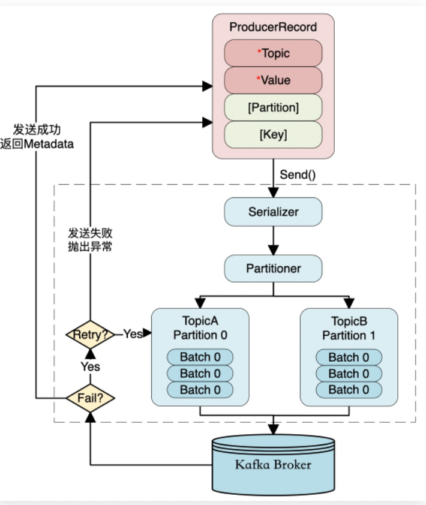

## 概述

kafka 是由 linkedin 公司开发的，他是一个分布式的，支持多分区多副本，基于zookeeper 的分布式消息流平台， 它同时也是一款开源的基于发布订阅模式的消息引擎系统。

### 基本概念

- 消息：kafka 中的数据单元，也被称为记录，即 数据表中的一行记录。
- 批次：为了提高效率，消息会分批次写入kaafka，批次指的是一组消息
- 主题：消息的种类称为主题（topic）,可以说一个主题代表了一类消息，相当于是对消息的分类，主题就像 数据库中的 “表”
- 分区：主题可以分给若干个分区（partition），同一个主题中的分区可以在不同的机器上，有可能在多个机器上，由此来实现kafka 的伸缩性，单一主题中的分区有序，但是无法保证主题中的所有分区有序。

- 生产者：向主题发布消息的客户端应用程序称为生产者（Producer），生产者用于持续不断的向某个主题发送消息。
- 消费者：订阅主题消息的客户端称为消费者（consumer），消费者用于处理生产者生产的消息
- 消费者群组：生产者与消费者的关系就如同餐厅中的厨师和顾客中的关系，一个厨师对应多个顾客，也就是说一个生产者对应多个消费者，消费者群组就是 **一个或者多个消费者组成的群体**。

- 偏移量：偏移量（consumer offerset）是一种元数据，他是一个不断递增的正数值，用来记录消费者发生重平衡时的位置，以便于用来恢复数据。
- broker：一个独立的kafka服务器就称为 broker，broker 用来接受生产的消息，为消息设置偏移量，并将消息保存到磁盘。
- broker集群：broker 是集群的组成部分，broker 集群 是由一个或者多个broker 组成。每一个集群都是一个broker 同时充当了集群控制器角色（自动从集群中活跃的broker 中选举）。
- 副本： kafka 中的消息备份又叫做 副本（RepliSet），副本的数量是可以配置的，kafka 中的副本分为两类：领导者副本（leader Repliset），追随者副本（fllower Repliset），前者对外提供服务，后者只是被动跟随。
- 重平衡：reblanace 消费者组内某个消费者实例挂掉之后，其他消费者实例自动重新分配订阅主题分区过程. reblance 是kafka 实现高可用的重要手段。

## 系统架构

- Producer：可以是web前端产生的Page View，或者是服务器日志，系统CPU、Memory等
- Broker：Kafka支持水平扩展，一般broker数量越多，集群吞吐率越高
- Consumer Group
- Zookeeper集群

Kafka通过Zookeeper管理集群配置，选举leader，以及在Consumer Group发生变化时进行rebalance。Producer使用push模式将消息发布到broker，Consumer使用pull模式从broker订阅并消费消息。

## 生产者

### **数据执行流程**

生产消息的一方，称为生产者。

消息格式：每个消息是一个ProducerRecord对象，必须的属性有Topic和消息Value值，此外还可以包含消息的Partition以及消息的Key。

1. 序列化ProducerRecord有多个构造器，这里使用了三个参数的，topic、key、value
2. 如果ProducerRecord中指定了Partition，则Partitioner不做任何事情；否则，Partitioner根据消息的key得到一个Partition。这时生产者就知道向哪个Topic下的哪个Partition发送这条消息。
3. 消息被添加到相应的batch中，独立的线程将这些batch发送到Broker上
4. broker收到消息会返回一个响应。如果消息成功写入Kafka，则返回RecordMetaData对象，该对象包含了Topic信息、Patition信息、消息在Partition中的Offset信息；若失败，返回一个错误

### 分区策略

kafka 对数据的读写是以 分区为粒度的，分区可以分布在多个主机（broker）中，这样每个节点能够独立的实现数据的读取和写入操作，并且能够通过增加 节点（broker）来增加kafka 集群的吞吐量。

## 数据分区的选择

### 1. 顺序轮询 （默认）

顺序分配，消息是均匀的分配给每个 partition，即每个分区存储一次消息，见下图。轮训策略是 Kafka Producer 提供的默认策略，如果你不使用指定的轮训策略的话，Kafka 默认会使用顺序轮训策略的方式 

### 2. 随机轮询

本质上随机轮询策略，也是力求将数据均匀的打散到各个分区，但是从实际表现来看，要逊于轮询策略，所以如果追求数据的均匀分布，还是使用轮询策略比较好。事实上，随机策略是老版本生产者使用的分区策略，在新版本中已经改为轮询了。

### 3. key hash

这个策略也叫做 key-ordering 策略，Kafka 中每条消息都会有自己的key，一旦消息被定义了 Key，那么你就可以保证同一个 Key 的所有消息都进入到相同的分区里面，由于每个分区下的消息处理都是有顺序的，故这个策略被称为按消息键保序策略，如下图所示：

## 消费者

### 消费者群组

应用程序使用 kafkaConsumer 从 kafka 中订阅主题，并接受来自这些主题的消息，然后再把他们存起来。应用程序首先需要创建一个 KafkaConsumer 对象，订阅主题并开始接受消息，验证消息并保存结果。

生产者往主题写入的速度超过了应用程序验证数据的速度，这时候该如何处理？

如果只使用单个消费者的话，应用程序会跟不上消息生成的速度，就像多个生产者像相同的主题写入消息一样，这时候就需要多个消费者共同参与消费主题中的消息，对消息进行分流处理。Kafka 消费者从属于消费者群组。一个群组中的消费者订阅的都是相同的主题，每个消费者接收主题一部分分区的消息。

1. 一个消费者模式

2. 多个消费者模式

3. 消费者组

**Kafka 一个很重要的特性就是，只需写入一次消息，可以支持任意多的应用读取这个消息**

如果应用需要读取全量消息，那么请为该应用设置一个消费组；如果该应用消费能力不足，那么可以考虑在这个消费组里增加消费者。

## 消费者重平衡

最初是一个消费者订阅一个主题并消费其全部分区的消息，后来有一个消费者加入群组，随后又有更多的消费者加入群组，而新加入的消费者实例分摊了最初消费者的部分消息，这种把分区的所有权通过一个消费者转到其他消费者的行为称为重平衡，英文名也叫做 Rebalance 。如下图所示。

重平衡非常重要，它为消费者群组带来了高可用性 和 伸缩性，我们可以放心的添加消费者或移除消费者，不过在正常情况下我们并不希望发生这样的行为。在重平衡期间，消费者无法读取消息，造成整个消费者组在重平衡的期间都不可用。另外，当分区被重新分配给另一个消费者时，消息当前的读取状态会丢失，它有可能还需要去刷新缓存，在它重新恢复状态之前会拖慢应用程序。

消费者通过向组织协调者（Kafka Broker）发送心跳来维护自己是消费者组的一员并确认其拥有的分区。对于不同不的消费群体来说，其组织协调者可以是不同的。只要消费者定期发送心跳，就会认为消费者是存活的并处理其分区中的消息。当消费者检索记录或者提交它所消费的记录时就会发送心跳。如果过了一段时间 Kafka 停止发送心跳了，会话（Session）就会过期，组织协调者就会认为这个 Consumer 已经死亡，就会触发一次重平衡。如果消费者宕机并且停止发送消息，组织协调者会等待几秒钟，确认它死亡了才会触发重平衡。在这段时间里，死亡的消费者将不处理任何消息。在清理消费者时，消费者将通知协调者它要离开群组，组织协调者会触发一次重平衡，尽量降低处理停顿。

重平衡是一把双刃剑，它为消费者群组带来高可用性和伸缩性的同时，还有有一些明显的缺点(bug)，而这些 bug 到现在社区还无法修改。重平衡的过程对消费者组有极大的影响。因为每次重平衡过程中都会导致万物静止，参考 JVM 中的垃圾回收机制，也就是 Stop The World ，STW。也就是说，在重平衡期间，消费者组中的消费者实例都会停止消费，等待重平衡的完成，而且重平衡这个过程很慢......

## 特性分析

这里才是内容的重点，不仅需要知道Kafka的特性，还需要知道支持这些特性的原因：

- 消息路由（不支持）：Kafka在处理消息之前是不允许消费者过滤一个主题中的消息。一个订阅的消费者在没有异常情况下会接受一个分区中的所有消息。
- 
- 消息有序（支持）：当消费消息时，如果消费失败，消息不会被放回，所以整个消费过程都是有序进行；
- 消息时序（不支持）：消息直接发送，不会延迟发送，或者指定消息的TTL。
- 容错处理（集群支持/消息不支持）：集群容错能力高，因为是分布式部署，但是消息容错处理弱，因为消息消费失败，需要程序员手动处理，Kafka不支持消息重新进行消费。
- 伸缩（非常好）：通过扩充分区和消费者数量，实现分区扩容，并提升消费速度。
- 持久化（非常好）：数据存储在磁盘，可以随时订阅消费，消费完后，数据仍然保留。
- 消息回溯（支持）：因为消息支持持久化，就支持回溯，可以理解是附带的功能。
- 高吞吐（非常好）：因为Kafka内部同一个主题包含多个分区，所以实现分布式存储，然后消费者数量可以扩充到和分区数量一致，保证了Kafka的高吞吐。

## 参考

- http://www.hnbian.cn/posts/a028cfba.html
- https://mp.weixin.qq.com/s/vnpVvQInl5KlDR78_VaW-A