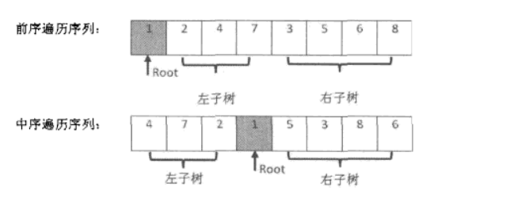

# 数组

## 二维数组中的查找

- 在二维数组中，每行都按照从左到右递增的顺序排序，每列都按照从上到下递增的顺序排序。 完成一个函数，输入这样一个二维数组和整数，判断二维数组中是否包含该整数。

**解析题目**：

```shell
1  2  8  9
2  4  9  12
4  7  10  13
6  8  11  15
```

1. 分为三种情况：a.  数组中选取的和刚好要查找的相等时，就查找结束； b. 如果选取的小于要查找的数字，则要查找的数字位于 选取数字的右边或者下边；c. 如果选取的大于要查找的数字，则要查找的数字位于选取数字的左边或者上边

该类问题，我们一般选择是从右上角，或者左下角开始。按照行和列逐个排除，最终查找的范围会越来越小，直到定位到目标数值。

代码：

```java
 /**
     *  1, 2, 8,  9
     *  2, 4, 9,  12
     *  4, 7, 10, 13
     *  6, 8, 11, 15
     * @param args
     */
    public static void main(String[] args) {
        int[][] a = {{1,2,8,9},{2,4,9,12},{4,7,10,13},{6,8,11,15}};
        int columns = a.length;
        int rows = a[0] != null ? a[0].length : 0;
        boolean b = find2(a, rows, columns, 10);
        System.out.println(b);
        System.out.println(a[1][2]);
    }

    //从右上角进行检查
    private static boolean find(int[][] array, int rows, int columns, int target) {
        boolean found = false;
        if (array != null && rows > 0 && columns > 0) {
            int row = 0;
            int column = columns - 1;
            while (row < rows && column > 0) {
                int dest = array[row][column];
                if (dest == target) {
                    found = true;
                    break;
                } else if (target < dest) {
                    column--;
                } else if (target > dest) {
                    row++;
                }
            }
        }
        return found;
    }

    // 从左下角进行检查
    public static boolean find2(int[][] array, int rows, int columns, int target) {
        boolean found = false;
        if (array != null && rows > 0 && columns > 0) {
            int row = rows-1;
            int column = 0;
            while (row > 0 && column < columns) {
                int dest = array[row][column];
                if(dest == target){
                    found = true;
                    break;
                }else if( dest < target){
                    column++;
                }else{
                   row--;
                }
            }
        }
        return found;
    }
```

# 字符串

## 把字符串中的每个空格都替换成 "%20" 

eg: we are happy   --> we%20are%20happy

### 时间为 O(n) 的解法

```java
public class StringDemo_02 {

    public static void main(String[] args) {
        String str = "we are happy";
        String replacer = "%20";
        //String s = replaceFunc(str, replacer);
        String s = replaceFunc2(str, replacer);
        System.out.println(s);
    }

    private static String replaceFunc(String str, String replacer) {
        if(StringUtils.isBlank(str)){
            return str;
        }
        //计算需要修改空格的次数
        char[] chars = str.toCharArray();
        int length = chars.length;
        int times = 0;
        for (int i = 0; i < length; i++){
            char c = chars[i];
            if(c == ' '){
                times++;
            }
        }
        if(times == 0){
            return str;
        }
        char[] replacers = replacer.toCharArray();
        char[] dest = new char[length + times*2];
        int pos = 0;
        for (int i = 0; i < chars.length; i++){
            char c = chars[i];
            if (c == ' '){
                dest[pos] = replacers[0];
                dest[++pos]= replacers[1];
                dest[++pos] = replacers[2];
            }else{
                //先使用后指针后移动
                dest[pos++] = chars[i];
            }
        }
        return new String(dest);
    }


    private static String replaceFunc2(String str, String replacer){
        if(StringUtils.isBlank(str)){
            return str;
        }
        //计算需要修改空格的次数
        char[] chars = str.toCharArray();
        int length = chars.length;
        int times = 0;
        for (int i = 0; i < length; i++){
            char c = chars[i];
            if(c == ' '){
                times++;
            }
        }
        if(times == 0){
            return str;
        }
        char[] newChars = new char[length + times*2];
        int firstPos = length-1;
        int secondPos = length-1 + times*2;
        //secondPos == firstPos 时，说明没有空格了
        while(firstPos >= 0){
            char c = chars[firstPos];
            if(c != ' '){
                newChars[secondPos--] = c;
            }else{
                newChars[secondPos] = '%';
                newChars[--secondPos] = '2';
                newChars[--secondPos] = '0';
            }
            firstPos--;
        }
        return new String(newChars);
    }
}
```

# 链表

- 链表是一种动态的数据结构，其操作就是对指针进行操作。而且链表的数据结构很灵活。
- 链表是一种动态的数据结构，创建时无需知道链表的长度。当插入一个节点时，我们只需要为新创建的节点分配内存，然后调节指针的指向来确保新节点被链接到链表中。
- 链表的内存是新添加节点时才分配，所以没有空闲的内存，因此链表的空间利用率比数组高。

## 示例代码

- 链表节点

```java
/**
* 链表节点信息
*/
@Data
static class LinkNode {
    int val;
    LinkNode next;
    public LinkNode(int val) {
        this.val = val;
    }
}
```

- 添加链表节点

  ```java
  /**
       * 添加节点
       * @param head
       * @param value
       * @return
       */
  public static LinkNode addNode(LinkNode head, int value){
      //创建新节点
      LinkNode newNode = new LinkNode(value);
      //如果头节点为空 则新节点赋值给头结点
      if(head == null){
          head = newNode;
      }else{
          //添加到节点的尾部
          while (head.next == null){
              head.next = newNode;
          }
      }
      return head;
  }
  ```

  - 移除节点

  ```java
  /**
       * 移除给定值相同的节点
       * @param head
       * @param value
       * @return
       */
      public static LinkNode removeNode(LinkNode head, int value){
          //如果链表为空
          if(head == null){
              return null;
          }
          //如果头结点就是 需要移动的节点
          LinkNode preNode = head;
          LinkNode des = head.next;
          while (des != null){
              if(preNode.val == value){ //如果为头节点,则需要改动一下头节点的指向
                  preNode = des;
                  des = des.next;
                  head = preNode;
              } else if (des.val == value){ //中间节点中找到了需要删除的内容
                  des = des.next;
                  preNode.next = des;
              }else{ //未找到节点
                  preNode = des;
                  des = des.next;
              }
          }
          return head;
      }
  
      private static LinkNode remove2(LinkNode head, int value){
          //如果头节点是需要删除的节点
          while(head != null){
              if(head.val != value){
                  break;
              }
              head = head.next;
          }
          //如果为非头节点
          //前趋节点
          LinkNode preNode = head;
          LinkNode currNode = head.next;
          while (currNode != null){
              if (currNode.val == value){
                  preNode.next = currNode.next;
              }else{
                  preNode = currNode;
              }
              currNode = currNode.next;
          }
          return head;
      }
  
      //fixme: 空间复杂度太大了
      public static LinkNode removeNodeUseStack(LinkNode head, int value){
          //如果链表为空
          if(head == null){
              return null;
          }
          Stack<LinkNode> stack = new Stack<>();
          LinkNode cur = head;
          while (cur != null){
              if(cur.val != value){
                  stack.push(cur);
              }
              cur = cur.next;
          }
          // 重新组装数据
          // 尾节点为 null, 第一次循环式, 上一次循环已经将 cur 置为 null了
          while (!stack.isEmpty()){
              stack.peek().next = cur;
              cur = stack.pop();
          }
          return cur;
      }
  ```

  

- 遍历节点(从尾到头打印链表)

输入一个链表的头节点,然后从尾部到头部打印每个节点的值

```java
 /**
     * 反转链表打印
     * @param head
     */
    private static void reversePrint(LinkNode head){
        //反转链表 打印
        if (head == null){
            return;
        }
        //反转链表
        LinkNode des = null;
        LinkNode cur = head;
        while (cur != null){
            //cur 的后继节点,接下来需要遍历的节点
            LinkNode temp = cur.next;
            // 当前节点cur 的后继节点 指向 前一次遍历时存储的节点des(第一次时,des = null)
            cur.next = des;
            // 位置交换完毕,将 des 节点指向 当前节点 cur
            des = cur;
            // 让当前节点指向之前保存的临时节点(下一次遍历的起始位置)
            cur = temp;
        }
        //循环打印
        while (des != null){
            System.out.println("-->" + des.val);
            des = des.next;
        }
    }

    /**
     * 用栈的方式打印
     * @param head
     */
    private static void printUseStack(LinkNode head){
        Stack<Integer> stack = new Stack<>();
        //将数据压入栈中
        while (head != null){
            stack.push(head.val);
            head = head.next;
        }
        //循环打印栈中的数据
        while (!stack.isEmpty()) {
            System.out.println("---->" + stack.pop());
        }
    }

    /**
     * 使用递归的方式打印
     * @param head
     */
    private static void printUseRecursion(LinkNode head){
        if(head== null){
            System.out.println("空的链表....");
        }
        if (head.next != null){ //递归
            printUseRecursion(head.next);
        }
        System.out.println("---->" + head.val);
    }
```

# 树

除了根节点外,每个节点都有一个父节点(跟节点没有父亲节点),除了叶子节点外,每个节点有一个或者多个子节点(叶子节点没有子节点)

## 二叉树

遍历方式:

- 前序遍历: root --> left --> right
- 中序遍历: left --> root --> right
- 后续遍历: left --> right --> root

没用遍历的实现,递归要比循环简单的多.

- 深度优先遍历
- 宽度优先遍历

## 二叉搜索树

- 左子树的节点总是小于或者等于根节点,右子树总是大于等于跟节点
- 我们一般可以平均在 o(logn)的时间范围内在二叉搜索树中找到目标节点.

二叉树的另外两个特里时: **堆** 和 **红黑树**

### 红黑树

### 堆

- 最大堆:跟节点值最大
- 最小堆: 跟节点值最小

## 重建二叉树

- 输入某个二叉树的前序遍历和后续遍历的结果，请重建二叉树。加入输入的前序遍历和中续遍历的结果中都不包含重复的数字。

  eg: 输入前序遍历列｛1,2,4,7,5,6,8｝ 和中序遍历｛4,7,2,1,5,3,8,6｝,则重建出如下图的二叉树，并输出头节点。二叉树的定义：

```java
 /**
     * 二叉树的节点
     */
class BTreeNode{
    int value;
    BTreeNode left;
    BTreeNode right;
}
```

重建后的二叉树：


中序遍历和前序遍历



分析特点：

1. 前序遍历：root 节点位于数组的开始位置（前序遍历确定根节点）
2. 中序遍历： root 节点位于数组的中间。（后续遍历确认左右子树）

操作思路：

1. 依据前序遍历序列的第一个数字，确认出根节点：root
2. 中序遍历中找到根节点的位置
3. 确定左右子树的数量，在前序遍历和中序遍历的序列中划分左右子树的值，
4. 递归的调用函数，分别构造他的左右子树

```java
 /**
     *有了前序遍历，首先我们可以知道根节点的值，也就是数组中下标为0的位置，由此创建根节点。
     * 然后在中序遍历中找到根的值所在的下标，切出左右子树的前序和中序。
     * @param preOrder
     * @param inOrder
     * @return
     */
    private BTreeNode buildTree(int[] preOrder, int[] inOrder){

        if(preOrder.length == 0 || inOrder.length == 0){
            return null;
        }
        //前序遍历的第一个节点就是根节点
        //根节点
        BTreeNode root = new BTreeNode();
        root.value = preOrder[0];
       //中序遍历的根节点位置
        int leftSize = find(inOrder, root.value);

        // 左子树
        int[] leftPreOrder = Arrays.copyOfRange(preOrder,1,leftSize+1);
        int[] leftInOrder = Arrays.copyOfRange(inOrder, 0, leftSize);
        root.left = buildTree(leftPreOrder,leftInOrder);
        //右子树
        int[] rightPreOrder = Arrays.copyOfRange(preOrder, leftSize+1, preOrder.length);
        int[] rightInOrder = Arrays.copyOfRange(inOrder,leftSize +1, inOrder.length);
        root.right = buildTree(rightPreOrder,rightInOrder);
        return root;
    }
//寻找中序遍历中 root 节点的位置
private int find(int[] inOrder, int value) {
        for (int i =0 ; 0 < inOrder.length ; i++){
            if(value == inOrder[i]){
                return i;
            }
        }
        return -1;
    }

    public static void main(String[] args) {
        int[] preOrders= new int[]{1, 2, 4, 7, 3, 5, 6, 8};
        int[] inOrder= new int[]{4,7,2,1,5,3,8,6};
        T4_RebuildBTree t4_rebuildBTree = new T4_RebuildBTree();
        BTreeNode bTreeNode = t4_rebuildBTree.buildTree(preOrders, inOrder);
        System.out.println(bTreeNode);
    }
```

# 栈 和队列

## 栈

特点： 后进先出（FILO）

## 队列

特点： 先进先出（FIFO）

## 用两个栈实现队列

用两个栈实现一个队列。队列的声明如下，请实现它的两个函数appendTail 和deleteHead, 分别完成队列尾部插入节点和头部删除节点的功能。

```java
/**
     * 插入栈
     */
    private Stack<Integer> stack1 = new Stack<>();

    /**
     * 删除栈
     */
    private Stack<Integer> stack2 = new Stack<>();
    
    /**
     * 删出头节点
     */
    public Integer deleteHead(){
        if(stack2.empty()){
            while (!stack1.empty()){
                stack2.push(stack1.pop());
            }
            if (stack2.empty()){
                throw new RuntimeException("queue is empty");
            }
            return stack2.pop();
        }else{
            return stack2.pop();
        }
    }

    public void appendTail(Integer value){
        stack1.push(value);
    }
```


# 算法和数据操作

## 旋转数组中的最小数字

- 把一个数组最开始的若干个元素搬到数组的尾部，我们称之为数组的旋转。输入一个递增排序的数组的一个旋转，输出旋转数组的最小元素。

  - eg: 数组：{3，4，5，1，2} 为{1，2，3，4，5}的一个旋转 ，改数组的最小值为1.

  ```java
  public static void main(String[] args) {
          int[] arr = {3,4,5,1,2};
          int spin = spin(arr);
          System.out.println(spin);
      }
  
      public static int spin(int[] arr){
          if(arr == null || arr.length == 0){
              return -1;
          }
          //两个指针
          int index1 = 0;
          int index2 = arr.length-1;
          int indexMid = index1;
  
          while (arr[index1] >= arr[index2]){
              if(index2 - index1 == 1 || index2 - index1 == 0){//相邻元素
                  indexMid = index2;
                  break;
              }
              // 中间元素位置
              indexMid = (index1 + index2)/2;
              if(arr[indexMid] > arr[index1]){// 第一个子数组当前元素小于 indexMid 指定的 元素
                  index1 = indexMid;
              }else if(arr[indexMid] < arr[index2]){// 第二个子数组的 index2 指定的元素大于 indexMid指定的
                  index2 = indexMid;
              }
          }
          return arr[indexMid];
      }
  ```

## 递归和循环

  需要重复的多次计算相同的问题。

  递归：在一个函数内部调用这个函数自身。

  循环：设置计算的初始值及计算条件，在一个范围内重复运算。

### 递归效率问题

- 递归是由于函数调用自身，而调用自身是有时间和空间的消耗的：每一次调用都需要在栈内存中分配空间以保存参数和返回地址及临时变量等。同时往栈中压入和弹出同样需要耗费时间。
- 递归中有可能很多计算都是重复的。
- 递归的本质是把一个问题分解成两个或者多个小问题。
- 递归还有可能引起栈内存溢出问题。（当调用的层级太多，超出栈容量）

## 斐波那契数列

写一个函数，输入n,求斐波那契（Fibonacci）数列的第n项。 


### 递归方式

```java
//递归方式 (递归实现效率差，重复计算次数多)
    private static int  recursionFunc(int num){
        if(num == 0 || num == 1){
            return num;
        }
        return recursionFunc(num -1) + recursionFunc(num -2);
    }
```

效率很低：计算的时间复杂度以n的指数方式递增。


### 非递归的方式（推荐）

```java
//非递归的方式
private static int forFunc(int num){
    if(num == 0 || num == 1){
        return num;
    }
    int fin = 0;
    int first = 0;
    int second = 1;
    for(int i = 2; i<= num; i++){
        fin = first + second;
        System.out.println("结果:" + fin);
        first = second;
        second = fin;
    }
    return fin;
}
```

#### 斐波那契数列变体：青蛙跳台阶问题

一只青蛙一次可以跳上一个台阶，也可以跳上2级。求改青蛙跳上n 个台阶总共有多少种跳法。

分析：

简化：

1. 如果只有一个台阶：只有一种跳法。
2. 两个台阶： 两种跳法： 
   1. 分两次跳：一次一个台阶
   2. 分一次跳：一次两个台阶

一般情况：

1. 我们把n 个台阶的跳法看成是n 的函数，记为 f(n).
2. 当 n > 2 时，第一次跳就有两种不同的选择
   1. 第一次跳一个台阶 ，后续的跳法为 f(n-1)
   2. 第一次跳两个台阶，后续的跳法为 f(n-2)
3. 总的跳法： f(n) = f(n-1) + f(n-2)

## 位运算

把数字用二进制表示后，对每一位上 0 或者 1  的运算。

### 与 或 异或 的运算规律


### 位移

- **左位移**：m<<n 表示把m向左移动 n位。左移n位的时候，最左边的 n位将会被丢弃掉，同时在右边补上n个 0；

```shell
00001010 << 2  = 00101000
00001010 << 3  = 01010000
```

- **右位移**：m>>n表示把m 向右移动 n位。最右边的n位将会被丢弃。

  - 如果数字是一个无符号数值，则用 0 填补最左边的 n位。
  - 如果数字是一个右符号数值，则用数字的符号位填补最左边的 n位。

  ```shell
  00001010 >> 2 = 00000010
  10001010 >> 3 = 11110001
  ```

## 二进制中 1 的个数

请实现一个函数，输入一个整数，输出二进制中表示1 的个数。

eg：9 表示 成 二进制是：1001，有2位是1。所以如果输入 9 ，则输出是 2。

技巧：

1 的二进制为 00000001，所以 如果末尾为1，则 与 1 & 运算后 ，等于1，反之，为 0；

解题思路：

1. 先判断二进制的最右边一位是不是1。
2. 把输入的数字向右 移动一位，此时原来从右边开始数的倒数第二位变成了最右边的一位了。
3. 然后再执行 步骤 1

### 方式1

```java
 //可能回引起死循环： 如果输入为负数的时候
private static int numberOf_1(int n) {
    //计算 1 的数量
    int count = 0;

    while (n > 0){
        if((n & 1) == 1){
            count ++;
        }
        n = n >> 1;
    }
    return count;
}
```

### 方式 2

以上当 输入值为负数的时候回引起死循环，所以我们选择将 基准数字 1 坐位移。来判断。

这个算法中不需要 进行死循环： 32位的整数只需要循环32 次而已(实际上和要比较的值差不多大就可以)

```java
    private static int numberOf_12(int n){
        int count = 0;
        int flag = 1;
        while (flag <= n+1){
            if((n & flag) != 0){
                count++;
            }
            flag = flag << 1;
        }
        return count;
    }
```

### 方式3

把一个整数减去1，再和原有整数做 & 运算，回把整数最右边的一个1变成0。那么一个整数二进制表示中有多少个1， 就可以做多少个	这样的操作。

```java
private static int numberOf_13(int n){
    int count = 0;
    while (n != 0){
        count++;
        n = (n-1) & n;
    }
    return count;
}
```


