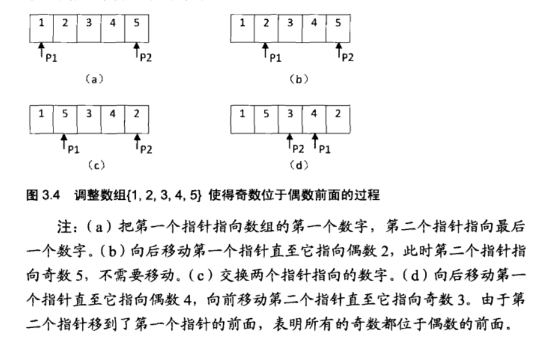
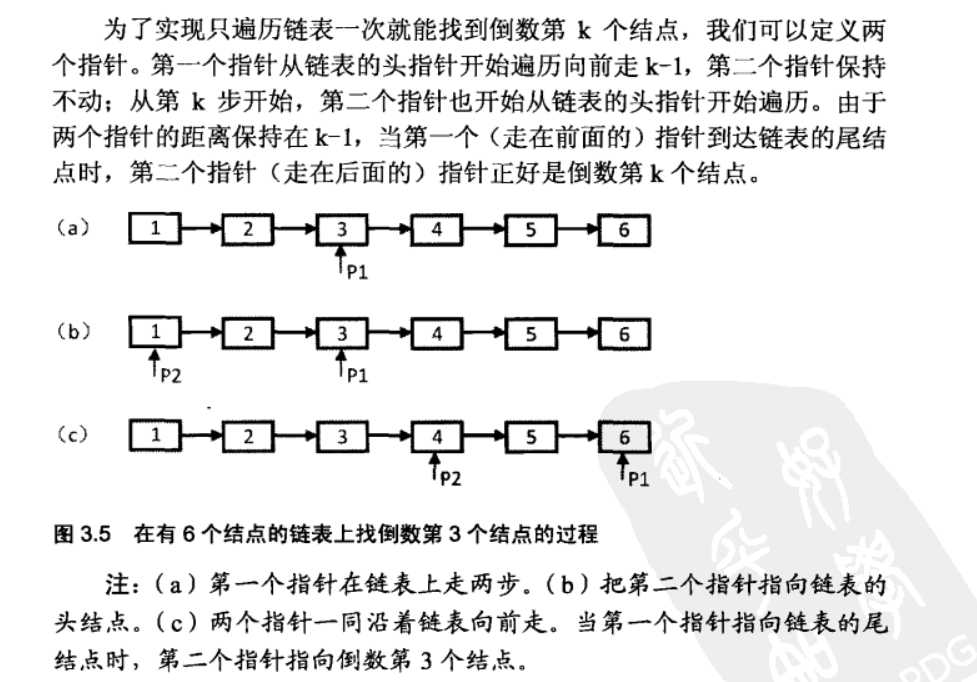

# 数值的整数次方

实现函数 double power(double base, int exponent), 求base 的exponent 次方。 不得用库函数，同时不考虑大数据问题。

技巧：

1. 用 右位移运算符代替 除以 2，
2. 用 位 于 运算符 代替求余 运算符（%）

```java
public class T9_IntegerPower {

    public static void main(String[] args) {
        double base = 5.00d;
        int exponent = 5;
        power(base, exponent);
        power2(base, exponent);

        power3(base, exponent);
    }

    private static double power3(double base, int exponent) {
        double result = 0.00d;
        if (equal(base, 0.00d) && exponent < 0) {
            throw new RuntimeException("无意义的值！");
        }
        if (exponent == 0) {
            return 1.0;
        } else if (exponent < 0) {
            result = powerWithExponent(1 / base, -exponent);
        }else if(exponent > 0){
            result= powerWithExponent( base, exponent);
        }
        return result;
    }

    //a^n = a^(n/2) * a^(n/2)；n为偶数；
    //a^n = a^[(n-1)/2] * a^[(n-1)/2] * a；n为奇数；
    private static double powerWithExponent(double base, int exponent) {
        if (exponent == 0) {
            return 1;
        }
        if (exponent == 1) {
            return base;
        }
        double result = powerWithExponent(base, exponent >> 1);//用右移代替了除以2
        result *= result;
        //用位与运算符代替了求余运算符（%）来判断一个数是奇数还是偶数，如果是奇数还需要再乘一个base
        if ((exponent & 0x1) == 1){
            result *= base;
        }
        return result;
    }


    /**
     * 判断double 类型的值是否相等
     *
     * @param num1
     * @param num2
     * @return
     */
    public static boolean equal(double num1, double num2) {
        if (Math.abs(num1 - num2) < 0.0000001) {
            return true;
        } else {
            return false;
        }
    }

    //方式2
    private static double power2(double base, int exponent) {
        double result = 0.00d;
        if (exponent == 0) {
            return result;
        }
        if (exponent > 0 || exponent < 0) {

            for (int i = 0; i < exponent || i < -exponent; i++) {
                result = result * base;
            }
            if (exponent < 0) {
                result = 1 / exponent;
            }
        }
        return result;

    }

    //方式1
    private static double power(double base, int exponent) {
        double result = 0.00d;
        if (exponent == 0) {
            return 0;
        } else if (exponent == 1) {
            return base;
        } else if (exponent > 1) {
            for (int i = 0; i < exponent; i++) {
                result = result * base;
            }
            return result;
        } else {
            exponent = -exponent;
            for (int i = 0; i < exponent; i++) {
                result = result * base;
            }
            result = 1 / result;
            return result;
        }
    }
}
```

# 打印1 到最大的n位数

输入一个数字n,按照顺序打印出1最大的n位十进制数，比如输入3，则打印1,2,3……999，一直到最大的三位数999. 

```java
	public static void main(String[] args) {
        int n = 3;
        //print1ToMaxOfDigits_1(n);
        print1ToMaxOfDigits_2(n);
    }

    private static void print1ToMaxOfDigits_2(int n) {
        if (n < 0) {
            return;
        }
        //将数组中的每一位都初始化为 0
        char[] number = initNun(n);
        while (!increment(number)){
            printNumber(number);
        }
    }

    //打印数值
    private static void printNumber(char[] number) {
        //判断是否以 0 开始
        boolean isBeginZero = true;
        for (int i = 0; i < number.length; i++){
            if (isBeginZero && number[i] != '0'){
                isBeginZero = false;
            }
            if (!isBeginZero){
                System.out.print(number[i]);
            }
        }
        System.out.println("");
    }

    private static boolean increment(char[] number) {
        // 判断位数是否已经超了
        boolean isOverflow = false;
        //进位值(一般有进位 为 1, 没有进位 为 0)
        int nTakeOver = 0;
        int length = number.length;
        for (int i = length -1; i >= 0; i--){
            // 第n 位数求和
            int sum = number[i] - '0' + nTakeOver;
            if (i == length -1){ // 如果为 个位 自加 1
                sum++;
            }
            if (sum >= 10){ //当 sum 大于10时,说明要进位
                if (i == 0){ //如果 最左边一位的数值 >10,说明数据已经超过最大位了
                    isOverflow = true;
                    break;
                }else {
                    //进位后,当前值
                    sum -= 10;
                    //进位 值为 1
                    nTakeOver = 1;
                    number[i] = (char) ('0' + sum);
                }
            }else {
                //无进位
                number[i] = (char) ('0' + sum);
                break;
            }
        }
        return isOverflow;
    }

    private static char[] initNun(int n) {
        char[] number = new char[n];
        for (int i = 0; i < n; i++){
            number[i] = '0';
        }
        return number;
    }

    //如果不考虑数组越界问题
    private static void print1ToMaxOfDigits_1(int n) {
        if (n <= 0) {
            return;
        }
        int number = 1;
        int i = 0;
        while (i++ < n) {
            number *= 10;
        }
        for (int j = 1; j < number; j++) {
            System.out.println(j);
        }
    }
```

# 在O(1) 的时间内删除链表节点

给定单向链表的头指针和一个节点指针，定义一个函数在O(1)时间删除该节点。链表的结构定义如下

```java
class ListNode{
    int value;
    ListNode next;
}
```

解题思路：

- 如果要删除的节点非尾节点，且要删除的节点和链表中的节点是同一个对象，则我们获取要删除节点的下一个 节点，然后使用要删除的节点的下一个节点 的值覆盖 要删除的节点的值，要删除节点的next 取要删除节点下一个节点的下一个节点（curr.next.next）
- 要删除的节点或者链表为nul， 直接返回
- 要删除的节点是尾节点：
  - 链表只有一个节点
  - 链表多个节点，则需要往下遍历

**优化方案：不必要得到删除节点的前一个节点，可以使用要删除节点的下一个节点来覆盖要删除的当前节点。**

代码：

```java
public static void main(String[] args) {
        ListNode head = new ListNode();
        head.value = 0;
        ListNode curr = head;
        for (int i = 0; i <= 5; i++){
            curr.next = new ListNode();
            curr.next.value = i + 1;
            curr = curr.next;
        }
        ListNode target = new ListNode();
        target.value = 6;
        ListNode listNode = deleteNode(head, target);
    }


    public static ListNode deleteNode(ListNode head, ListNode target){
        //如果只有一个节点
        if (head== null || target== null){
            return head;
        }
        //如果要删除的节点 不是 尾节点
        if(target.next != null){
            //用当前节点的next 节点的 value 和 next 去替换 target 中的值
            ListNode pNext = target.next;
            target.value = pNext.value;
            target.next = pNext.next;
            pNext.next = null;
        }else if(target.next == null){ // 删除的节点是尾节点
            // 如果头节点也只有一个
            if(head.next == null && head.value == target.value){
                head = null;
            }
            //链表中有多个节点，删除尾部节点
            ListNode preDel = head;
            while (preDel.next.value != target.value){
                preDel = preDel.next;
            }
            preDel.next = null;
        }
        return head;
    }

    static class ListNode {
        int value;
        ListNode next;
    }
```

# 调整数组顺序，使得 奇数位于偶数之前

输入一个整数数组，实现一个函数来调整该数组中数字的顺序，使得所有的奇数位于数组的前半部分，所有偶数位于数组的后半部分

解题思路1：

从数组的头部开始扫描这个数组，如果碰到偶数，则取出这个偶数，并把这个数字后面的所有元素往前移动一位，挪动完后，数组的尾部有一个空位，把取出的偶数放到空位位置。

时间复杂度: O(n^2)

解题思路2：



代码：

```java
 public static void main(String[] args) {
        int[] arr = {1,3,4,5,6,7};
//        sortArray(arr);
//        System.out.println(0x1);
//        System.out.println(7&0x1);
//        System.out.println(6&0x1);
        sortArray(arr);
        System.out.println(arr);
    }

    private static void sortArray(int[] arr) {
        if(arr == null){
            return;
        }
        //第一个指针指向开始
        int preIndex = 0;
        //第二个指针指向数组的尾部位置
        int tailIndex = arr.length-1;
        while (preIndex <tailIndex){
            //向后移动 preIndex ，直到他指向 偶数位
            while (preIndex < tailIndex && (arr[preIndex] & 0x1) != 0){//如果为奇数则自增
                preIndex ++;
            }
            //向前移动 tailIndex ，直到他指向奇数位
            while (preIndex < tailIndex && (arr[tailIndex] & 0x1) == 0){//如果为偶数则自减
                tailIndex--;
            }
            if(preIndex < tailIndex){
                int temp = arr[preIndex];
                arr[preIndex] = arr[tailIndex];
                arr[tailIndex] = temp;

            }
        }
    }
```

# 链表中的倒数第K 个节点

输入一个链表，输出该链表的倒数第k个节点。为了符合大多数人的习惯，本题从1开始计数，即链表的尾节点是倒数第1个节点。例如链表有6个节点。从头节点开始他们的节点依次是 1,2,3,4,5,6。这个链表的倒数第三个节点时 4.

解题思路1：（循环2遍）

从头节点开始，第k个节点就是 n-k+1 个节点。我们得到链表的长度 n(第一次循环链表)， 然后走到 n-k+1 个节点就是目标节点。

解题思路2：



代码实现：

```java
public class T14_KthNodeFromEnd {

    public static void main(String[] args) {

        int len = 6;
        //创建链表
        ListNode head = createLinkNode(len);
        //倒数第 ？ 节点
        int reciprocal = 3;
        ListNode target = findKKth2Tail(head, reciprocal);

        ListNode target2 = findKKth2Tail2(head, reciprocal);
        ListNode target3 = findKKth2Tail3(head, reciprocal);
    }

    private static ListNode findKKth2Tail3(ListNode head, int reciprocal) {
        if (head == null){
            return null;
        }
        if (reciprocal < 0){
            throw new IllegalArgumentException("非法的参数。");
        }
        ListNode preNode = head;
        ListNode lastNode = head;
        for (int i = 0; i <= reciprocal; i++){
            if (preNode != null){
                preNode = preNode.next;
            }else{
                preNode = null;
                break;
            }
        }
        while (preNode != null){
            lastNode = lastNode.next;
            preNode = preNode.next;
        }
        return lastNode;
    }

    /**
     *
     * @param head
     * @param reciprocal
     */
    private static ListNode findKKth2Tail2(ListNode head, int reciprocal) {
        if (head == null){
            return null;
        }
        if (reciprocal < 0){
            throw new IllegalArgumentException("非法的参数。");
        }
        // 快指针
        int count = 0;
        ListNode slow = head;
        ListNode pre = head;
        while (pre.next != null){
            count ++;
            pre = pre.next;
            if (count >= reciprocal){
                slow = slow.next;
            }
        }
        return slow;
    }

    /**
     * 倒数第 ？ 节点
     * 简单的方式，遍历  两次： 第一次获取 链表长度，第二次 获取第 k 个节点
     * @param head
     * @param reciprocal
     */
    private static ListNode findKKth2Tail(ListNode head, int reciprocal) {
        // 获取 链表长度
        int count = 0;
        ListNode curr = head;
        while (curr != null){
            count ++;
            curr = curr.next;
        }
        if (reciprocal > count || reciprocal < 0){
            throw new IllegalArgumentException("非法的参数。");
        }
        // 倒数第 k 个节点，即 顺数  第 n - k + 1 个 为目标节点
        int target = count - reciprocal + 1;
        // 给 count 重新赋值
        count = 1;
        curr = head;
        while (count != target){
            curr = curr.next;
            count++;
        }
        return curr;
    }

    private static ListNode createLinkNode(int len) {
        if (len <= 0){
            throw new IllegalArgumentException("非法的参数。");
        }
        ListNode head = new ListNode();
        head.value = 1;
        ListNode pre = head;
        for (int i = 1; i <=len; i++){
            ListNode next = new ListNode();
            next.value = i+1;
            pre.next = next;
            pre = next;
        }
        return head;
    }

    /**
     * 节点实体
     */
    static class ListNode {
        int value;
        ListNode next;
    }
}
```

## 反转链表

