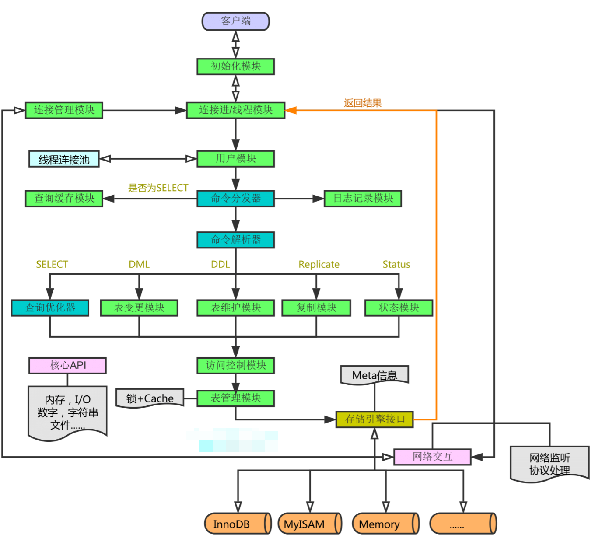
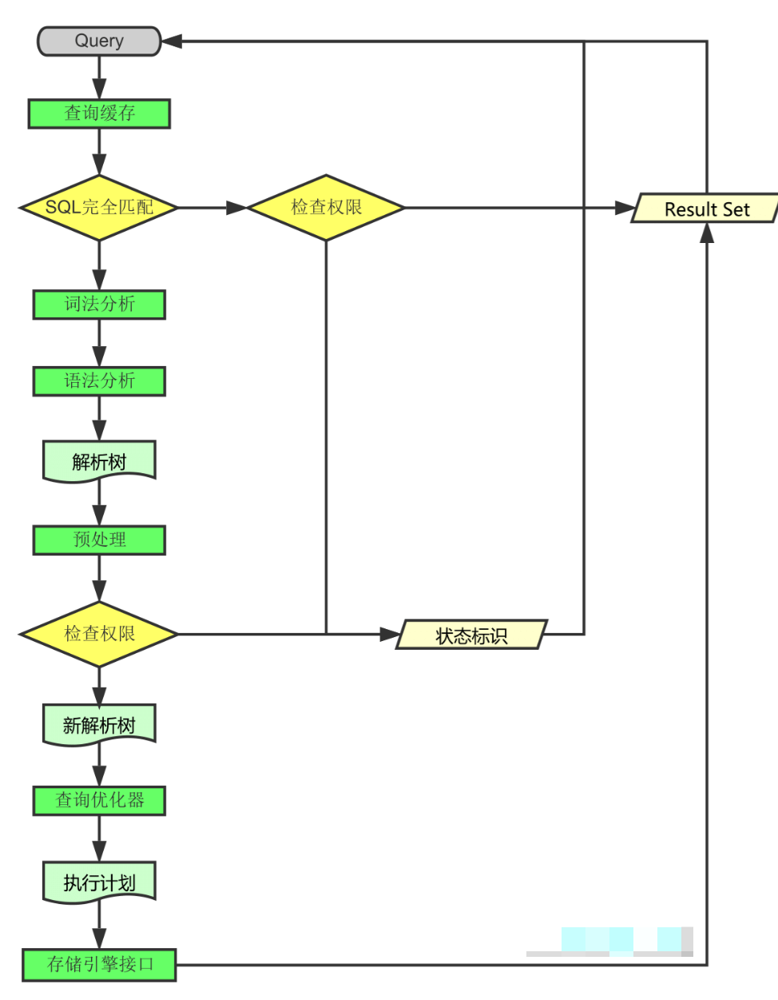
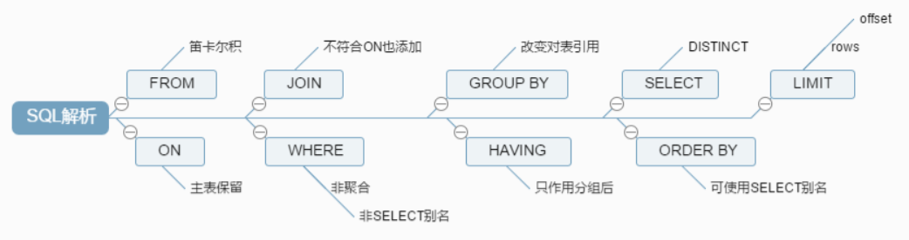
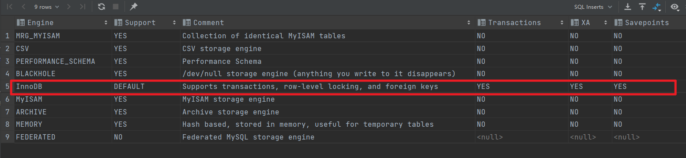
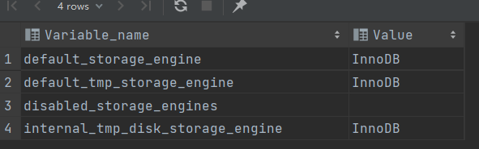
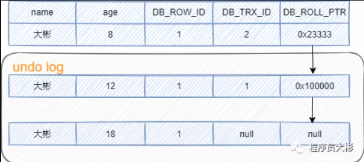

## **MySQL架构总览：**




### **查询执行流程**

1. **连接**

​		1.1 客户端发起一条Query请求，监听客户端的‘连接管理模块’接收请求

　　1.2 将请求转发到‘连接进/线程模块’

　　1.3 调用‘用户模块’来进行授权检查

　　1.4 通过检查后，‘连接进/线程模块’从‘线程连接池’中取出空闲的被缓存的连接线程和客户端请求对接，如果失败则创建一个新的连接请求

2. **处理**

​		2.1 先查询缓存，检查Query语句是否完全匹配，接着再检查是否具有权限，都成功则直接取数据返回

　　2.2 上一步有失败则转交给‘命令解析器’，经过词法分析，语法分析后生成解析树

　　2.3 接下来是预处理阶段，处理解析器无法解决的语义，检查权限等，生成新的解析树

　　2.4 再转交给对应的模块处理

　　2.5 如果是SELECT查询还会经由‘查询优化器’做大量的优化，生成执行计划

　　2.6 模块收到请求后，通过‘访问控制模块’检查所连接的用户是否有访问目标表和目标字段的权限

　　2.7 有则调用‘表管理模块’，先是查看table cache中是否存在，有则直接对应的表和获取锁，否则重新打开表文件

　　2.8 根据表的meta数据，获取表的存储引擎类型等信息，通过接口调用对应的存储引擎处理

　　2.9 上述过程中产生数据变化的时候，若打开日志功能，则会记录到相应二进制日志文件中

3. **结果**

​		3.1 Query请求完成后，将结果集返回给‘连接进/线程模块’

　　3.2  返回的也可以是相应的状态标识，如成功或失败等

　　3.3 连接进/线程模块’进行后续的清理工作，并继续等待请求或断开与客户端的连接

### 一图小总结





## 查询数据库的引擎

`show engines`



`show variables like "%storage_engine%";`



### 指定数据库对象的存储引擎

```sql
create table tb(
    id int(4) auto_increment,
    name varchar(5),
    dept varchar(5),
    primary key(id)
) engine=myISAM auto_increment=1 default charset=utf8;
```

## SQL优化

### mysql的编写过程和解析过程

- 编写过程

```sql
select dinstinct  ..from  ..join ..on ..where ..group by ..having ..order by ..limit ..
```

- 解析过程

```sql
from .. on.. join ..where ..group by ..having ..select dinstinct ..order by ..limit ..
```

### 创建索引的方式

- 创建单值索引

```sql
create index dept_index on tb(dept);
alter table tb add index dept_index(dept);
```

- 创建唯一索引：这里我们假定name字段中的值都是唯一的

```sql
create unique index name_index on tb(name);
alter table tb add unique index name_index(name);
```

- 创建复合索引

```sql
create index dept_name_index on tb(dept,name);
alter table tb add index dept_name_index(dept,name);
```

如果某个字段是primary key，那么该字段默认就是主键索引。

主键索引和唯一索引非常相似。相同点：该列中的数据都不能有相同值；不同点：主键索引不能有null值，但是唯一索引可以有null值。

### 索引删除和索引查询

#### 索引删除

```sql
drop index name_index on tb;
```

#### 查询索引

```sql
show index from tb;
```

## exist和in的区别？

`exists`用于对外表记录做筛选。`exists`会遍历外表，将外查询表的每一行，代入内查询进行判断。当`exists`里的条件语句能够返回记录行时，条件就为真，返回外表当前记录。反之如果`exists`里的条件语句不能返回记录行，条件为假，则外表当前记录被丢弃。

```
select a.* from A awhere exists(select 1 from B b where a.id=b.id)
```

`in`是先把后边的语句查出来放到临时表中，然后遍历临时表，将临时表的每一行，代入外查询去查找。

```
select * from Awhere id in(select id from B)
```

**子查询的表比较大的时候**，使用`exists`可以有效减少总的循环次数来提升速度；**当外查询的表比较大的时候**，使用`in`可以有效减少对外查询表循环遍历来提升速度。

## truncate、delete与drop区别？

**相同点：**

1. `truncate`和不带`where`子句的`delete`、以及`drop`都会删除表内的数据。
2. `drop`、`truncate`都是`DDL`语句（数据定义语言），执行后会自动提交。

**不同点：**

1. truncate 和 delete 只删除数据不删除表的结构；drop 语句将删除表的结构被依赖的约束、触发器、索引；
2. 一般来说，执行速度: drop > truncate > delete。

## having和where的区别？

- 二者作用的对象不同，`where`子句作用于表和视图，`having`作用于组。
- `where`在数据分组前进行过滤，`having`在数据分组后进行过滤。

## 乐观锁和悲观锁是什么？

数据库中的并发控制是确保在多个事务同时存取数据库中同一数据时不破坏事务的隔离性和统一性以及数据库的统一性。乐观锁和悲观锁是并发控制主要采用的技术手段。

- 悲观锁：假定会发生并发冲突，在查询完数据的时候就把事务锁起来，直到提交事务。实现方式：使用数据库中的锁机制。
- 乐观锁：假设不会发生并发冲突，只在提交操作时检查是否数据是否被修改过。给表增加`version`字段，在修改提交之前检查`version`与原来取到的`version`值是否相等，若相等，表示数据没有被修改，可以更新，否则，数据为脏数据，不能更新。实现方式：乐观锁一般使用版本号机制或`CAS`算法实现。

## 用过processlist吗？

`show processlist` 或 `show full processlist` 可以查看当前 MySQL 是否有压力，正在运行的`SQL`，有没有慢`SQL`正在执行。返回参数如下：

1. **id**：线程ID，可以用`kill id`杀死某个线程

2. **db**：数据库名称

3. **user**：数据库用户

4. **host**：数据库实例的IP

5. **command**：当前执行的命令，比如`Sleep`，`Query`，`Connect`等

6. **time**：消耗时间，单位秒

7. **state**：执行状态，主要有以下状态：

8. - `Sleep`，线程正在等待客户端发送新的请求
   - `Locked`，线程正在等待锁
   - `Sending data`，正在处理`SELECT`查询的记录，同时把结果发送给客户端
   - `Kill`，正在执行`kill`语句，杀死指定线程
   - `Connect`，一个从节点连上了主节点
   - `Quit`，线程正在退出
   - `Sorting for group`，正在为`GROUP BY`做排序
   - `Sorting for order`，正在为`ORDER BY`做排序

9. **info**：正在执行的`SQL`语句

## MVCC 实现原理？

MVCC(`Multiversion concurrency control`) 就是同一份数据保留多版本的一种方式，进而实现并发控制。在查询的时候，通过`read view`和版本链找到对应版本的数据。

作用：提升并发性能。对于高并发场景，MVCC比行级锁开销更小。

**MVCC 实现原理如下：**

MVCC 的实现依赖于版本链，版本链是通过表的三个隐藏字段实现。

- `DB_TRX_ID`：当前事务id，通过事务id的大小判断事务的时间顺序。
- `DB_ROLL_PRT`：回滚指针，指向当前行记录的上一个版本，通过这个指针将数据的多个版本连接在一起构成`undo log`版本链。
- `DB_ROLL_ID`：主键，如果数据表没有主键，InnoDB会自动生成主键。

每条表记录大概是这样的：


使用事务更新行记录的时候，就会生成版本链，执行过程如下：

1. 用排他锁锁住该行；
2. 将该行原本的值拷贝到`undo log`，作为旧版本用于回滚；
3. 修改当前行的值，生成一个新版本，更新事务id，使回滚指针指向旧版本的记录，这样就形成一条版本链。

下面举个例子方便大家理解。

1、初始数据如下，其中`DB_ROW_ID`和`DB_ROLL_PTR`为空。


2. 事务A对该行数据做了修改，将`age`修改为12，效果如下：


3. 之后事务B也对该行记录做了修改，将`age`修改为8，效果如下：



4. 此时undo log有两行记录，并且通过回滚指针连在一起。

**read view的概念。**

`read view`可以理解成将数据在每个时刻的状态拍成“照片”记录下来。在获取某时刻t的数据时，到t时间点拍的“照片”上取数据。

在`read view`内部维护一个活跃事务链表，表示生成`read view`的时候还在活跃的事务。这个链表包含在创建`read view`之前还未提交的事务，不包含创建`read view`之后提交的事务。

不同隔离级别创建read view的时机不同。

- read committed：每次执行select都会创建新的read_view，保证能读取到其他事务已经提交的修改。
- repeatable read：在一个事务范围内，第一次select时更新这个read_view，以后不会再更新，后续所有的select都是复用之前的read_view。这样可以保证事务范围内每次读取的内容都一样，即可重复读。

**read view的记录筛选方式**

**前提**：`DATA_TRX_ID` 表示每个数据行的最新的事务ID；`up_limit_id`表示当前快照中的最先开始的事务；`low_limit_id`表示当前快照中的最慢开始的事务，即最后一个事务。


- 如果`DATA_TRX_ID` < `up_limit_id`：说明在创建`read view`时，修改该数据行的事务已提交，该版本的记录可被当前事务读取到。

- 如果`DATA_TRX_ID` >= `low_limit_id`：说明当前版本的记录的事务是在创建`read view`之后生成的，该版本的数据行不可以被当前事务访问。此时需要通过版本链找到上一个版本，然后重新判断该版本的记录对当前事务的可见性。

- 如果`up_limit_id` <= `DATA_TRX_ID` < `low_limit_i`：

- 1. 需要在活跃事务链表中查找是否存在ID为`DATA_TRX_ID`的值的事务。
  2. 如果存在，因为在活跃事务链表中的事务是未提交的，所以该记录是不可见的。此时需要通过版本链找到上一个版本，然后重新判断该版本的可见性。
  3. 如果不存在，说明事务trx_id 已经提交了，这行记录是可见的。

**总结**：InnoDB 的`MVCC`是通过 `read view` 和版本链实现的，版本链保存有历史版本记录，通过`read view` 判断当前版本的数据是否可见，如果不可见，再从版本链中找到上一个版本，继续进行判断，直到找到一个可见的版本。

## 快照读和当前读


## bin log/redo log/undo log

MySQL日志主要包括查询日志、慢查询日志、事务日志、错误日志、二进制日志等。其中比较重要的是 `bin log`（二进制日志）和 `redo log`（重做日志）和 `undo log`（回滚日志）。

**bin log**

`bin log`是MySQL数据库级别的文件，记录对MySQL数据库执行修改的所有操作，不会记录select和show语句，主要用于恢复数据库和同步数据库。

**redo log**

`redo log`是innodb引擎级别，用来记录innodb存储引擎的事务日志，不管事务是否提交都会记录下来，用于数据恢复。当数据库发生故障，innoDB存储引擎会使用`redo log`恢复到发生故障前的时刻，以此来保证数据的完整性。将参数`innodb_flush_log_at_tx_commit`设置为1，那么在执行commit时会将`redo log`同步写到磁盘。

**undo log**

除了记录`redo log`外，当进行数据修改时还会记录`undo log`，`undo log`用于数据的撤回操作，它保留了记录修改前的内容。通过`undo log`可以实现事务回滚，并且可以根据`undo log`回溯到某个特定的版本的数据，**实现MVCC**。

## bin log和redo log有什么区别？

1. `bin log`会记录所有日志记录，包括InnoDB、MyISAM等存储引擎的日志；`redo log`只记录innoDB自身的事务日志。
2. `bin log`只在事务提交前写入到磁盘，一个事务只写一次；而在事务进行过程，会有`redo log`不断写入磁盘。
3. `bin log`是逻辑日志，记录的是SQL语句的原始逻辑；`redo log`是物理日志，记录的是在某个数据页上做了什么修改。

## 共享锁和排他锁

SELECT 的读取锁定主要分为两种方式：共享锁和排他锁。

```
select * from table where id<6 lock in share mode;--共享锁
select * from table where id<6 for update;--排他锁
```

这两种方式主要的不同在于`LOCK IN SHARE MODE`多个事务同时更新同一个表单时很容易造成死锁。

申请排他锁的前提是，没有线程对该结果集的任何行数据使用排它锁或者共享锁，否则申请会受到阻塞。在进行事务操作时，MySQL会对查询结果集的每行数据添加排它锁，其他线程对这些数据的更改或删除操作会被阻塞（只能读操作），直到该语句的事务被`commit`语句或`rollback`语句结束为止。

`SELECT... FOR UPDATE` 使用注意事项：

1. `for update` 仅适用于innodb，且必须在事务范围内才能生效。
2. 根据主键进行查询，查询条件为`like`或者不等于，主键字段产生**表锁**。
3. 根据非索引字段进行查询，会产生**表锁**。

## 大表怎么优化？

某个表有近千万数据，查询比较慢，如何优化？

当MySQL单表记录数过大时，数据库的性能会明显下降，一些常见的优化措施如下：

- 限定数据的范围。比如：用户在查询历史信息的时候，可以控制在一个月的时间范围内；
- 读写分离：经典的数据库拆分方案，主库负责写，从库负责读；
- 通过分库分表的方式进行优化，主要有垂直拆分和水平拆分。

## 快照读和当前读

表记录有两种读取方式。

- 快照读：读取的是快照版本。普通的`SELECT`就是快照读。通过mvcc来进行并发控制的，不用加锁。
- 当前读：读取的是最新版本。`UPDATE、DELETE、INSERT、SELECT … LOCK IN SHARE MODE、SELECT … FOR UPDATE`是当前读。

快照读情况下，InnoDB通过`mvcc`机制避免了幻读现象。而`mvcc`机制无法避免当前读情况下出现的幻读现象。因为当前读每次读取的都是最新数据，这时如果两次查询中间有其它事务插入数据，就会产生幻读。

**那么MySQL是如何避免幻读？**

- 在快照读情况下，MySQL通过`mvcc`来避免幻读。
- 在当前读情况下，MySQL通过`next-key`来避免幻读（加行锁和间隙锁来实现的）。

next-key包括两部分：行锁和间隙锁。行锁是加在索引上的锁，间隙锁是加在索引之间的。

`Serializable`隔离级别也可以避免幻读，会锁住整张表，并发性极低，一般不会使用。

## 更新语句执行过程？

更新语句执行流程如下：分析器、权限校验、执行器、引擎、`redo log`（`prepare`状态）、`binlog`、`redo log`（`commit`状态）

举个例子，更新语句如下：

```
update user set name = '大彬' where id = 1;
```

1. 先查询到 id 为1的记录，有缓存会使用缓存。
2. 拿到查询结果，将 name 更新为大彬，然后调用引擎接口，写入更新数据，innodb 引擎将数据保存在内存中，同时记录`redo log`，此时`redo log`进入 `prepare`状态。
3. 执行器收到通知后记录`binlog`，然后调用引擎接口，提交`redo log`为`commit`状态。
4. 更新完成。

为什么记录完`redo log`，不直接提交，而是先进入`prepare`状态？

假设先写`redo log`直接提交，然后写`binlog`，写完`redo log`后，机器挂了，`binlog`日志没有被写入，那么机器重启后，这台机器会通过`redo log`恢复数据，但是这个时候`binlog`并没有记录该数据，后续进行机器备份的时候，就会丢失这一条数据，同时主从同步也会丢失这一条数据。