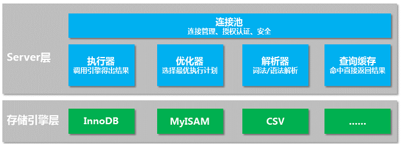
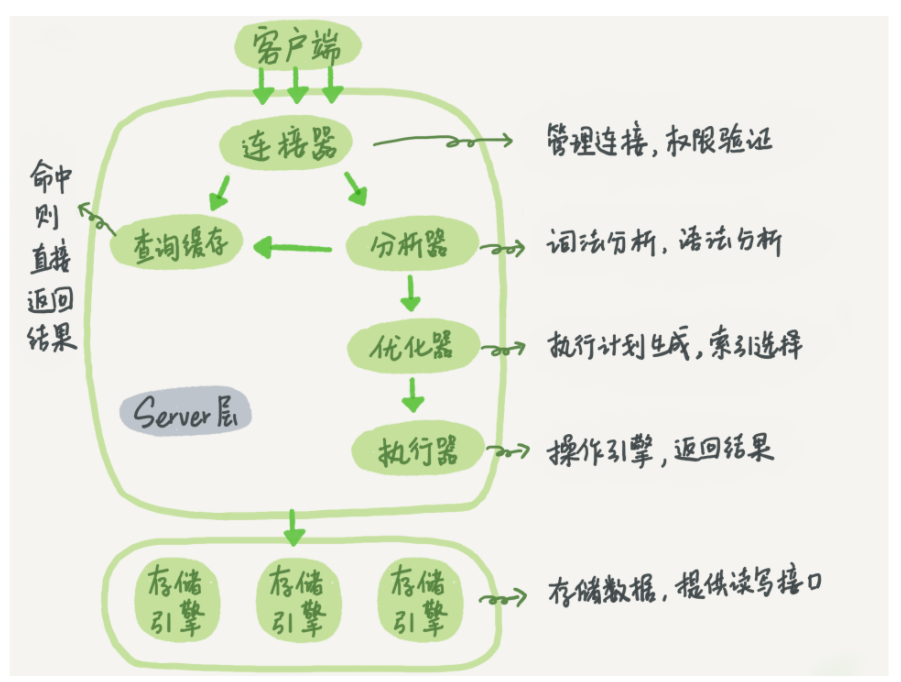

## 逻辑架构组成



MySQL 包含 Server 层和存储引擎层两大部分。

- **Server 层**: 包括连接池、查询缓存、解析器、优化器、执行器等，MySQL 的核心服务都在这一层。以及所有的内置函数（如日期、时间、数学和加密函数等），所有跨存储引擎的功能都在这一层实现，比如存储过程、触发器、视图等。

- **存储引擎层**:负责数据的存储和提取，MySQL 采用插件式的存储引擎，常见的存储引擎有 InnoDB、MyISAM、 CSV 等。其中 InnoDB 是最常用的存储引擎，也是 MySQL 的默认存储引擎（从5.5.5版本开始）。

# 一条查询语句是如何执行的

一条最简单的查询语句为例子，我们一起来看看这条语句在 MySQL 内部是如何执行的。

```sql
select id from a where id=1;
```




## 连接池

首先，我们通过 mysql 这个客户端工具进行数据库的连接，这时遇到的是连接池。连接池负责客户端的连接管理、授权认证。

连接命令如下（输入完连接命令后，需要输入用户密码）：

```sql
mysql -h localhost -u root -p
```

- 如果用户名和密码认证通过，连接池会通过权限表获取这个用户名所拥有的权限信息；
- 如果用户名或密码认证不通过，则会收到一个错误提示：“ERROR 1045 (28000): Access denied for user ‘root’@‘localhost’”；

建立连接后，会产生相应的连接信息，可以通过 show processlist 命令查看。下方图中 Id 为 5048 这一行，即为成功连接数据库所建立的连接信息，**请注意 Command 这一列，值为”Sleep“**，表明这是一个**空闲连接**。成功连接数据库后，如果没有任何动作，这个连接就会变成空闲状态。

```sql
root@localhost [(none)]>show processlist;
+------+------+-----------+------+---------+------+----------+------------------+
| Id   | User | Host      | db   | Command | Time | State    | Info             |
+------+------+-----------+------+---------+------+----------+------------------+
| 4771 | root | localhost | NULL | Query   |    0 | starting | show processlist |
| 5048 | root | localhost | NULL | Sleep   |    3 |          | NULL             |
+------+------+-----------+------+---------+------+----------+------------------+
2 rows in set (0.00 sec)
```

### Mysql怎么解决全部使用长连接后，有些时候 MySQL 占用内存涨得特别快，可能导致内存占用太大，被系统强行杀掉（OOM），从现象看就是 MySQL 异常重启了的问题：

全部使用长连接后，你可能会发现，有些时候 MySQL 占用内存涨得特别快，这是因为 MySQL 在执行过程中临时使用的内存是管理在连接对象里面的。这些资源会在连接断开的时候才释放。所以如果长连接累积下来，可能导致内存占用太大，被系统强行杀掉（OOM），从现象看就是 MySQL 异常重启了。

**两种方案:**

1. 定期断开长连接。使用一段时间，或者程序里面判断执行过一个占用内存的大查询后，断开连接，之后要查询再重连。
2. 如果你用的是 MySQL 5.7 或更新版本，可以在每次执行一个比较大的操作后，通过执行 mysql_reset_connection 来重新初始化连接资源。这个过程不需要重连和重新做权限验证，但是会将连接恢复到刚刚创建完时的状态。

## 查询缓存

连接成功建立后，来到第二步查询缓存。查询缓存负责将执行过的语句和结果缓存在内存中。

在获取一个查询请求后，MySQL会先到查询缓存进行查看：

- 如果select语句在查询缓存中能够找到，则直接返回结果给客户端，跳过解析、优化、执行阶段。
- 如果select语句没能在查询缓存中找到，则继续后面的解析、优化、执行阶段。

从这里可以看到，如果**命中查询缓存，MySQL 会直接返回结果给客户端**，后面的一系列操作不需要再执行，是非常高效的。但实际情况并非如此，**查询缓存非常容易失效**。

因为只要**一个表有更新操作，那这个表所有的查询缓存都会被清空**。对一个承载正常业务的数据库来说，更新操作是非常频繁的，这就意味着查询缓存经常失效，从而导致查询缓存的命中率非常低。所以，**使用查询缓存反而会给数据库带来额外的负担，在实际生产环境中，我们建议关闭查询缓存**。

关闭查询缓存的方法有两种：

- 临时：在 MySQL 中直接用命令行执行；

```mysql
set global query_cache_size=0
set global query_cache_type=0
```

- 永久：将以下两个参数添加至配置文件 my.cnf，并重启 MySQL；

```sql
query_cache_type=0
query_cache_size=0
```

- 确定要使用查询缓存的语句，可以用 SQL_CACHE 显式指定，像下面这个语句一样：

```sql
mysql> select SQL_CACHE * from T where ID=10；
```

**TIPS**:需要注意的是，MySQL 8.0 版本直接将查询缓存的整块功能删掉了，也就是说 8.0 开始彻底没有这个功能了。

## 解析器

> 词法分析器 和语法分析器

如果没有命中查询缓存，接下来就要进入解析器阶段了。解析器负责词法解析和语法解析。

首先是词法解析，MySQL 需要识别所输入的字符串分别代表什么，它会从左到右一个字符、一个字符地输入，然后根据构词规则识别单词。

```sql
select id from a where id=1;
```

| 关键字 | 非关键字 | 关键字 | 非关键字 | 关键字 | 非关键字    |
| :----- | :------- | :----- | :------- | :----- | :---------- |
| select | 字段id   | from   | 表名a    | where  | 字段id等于1 |

接下来是语法解析，判断输入的这个SQL语句是否符合MySQL语法规则。如果语法不对，会收到错误信息提示：“ERROR 1064 (42000): You have an error in your SQL syntax;”。如下面这个SQL语句的where少了一个e。

```sql
root@localhost [tempdb]>select id from a wher id=1;
ERROR 1064 (42000): You have an error in your SQL syntax; check the manual that corresponds to your MySQL server version for the right syntax to use near 'id=1' at line 1
```

**TIPS**: 一般语法错误会提示第一个出现错误的位置，所以你要关注的是紧接“use near”的内容

## 优化器

从解析器出来，就到了优化器阶段。优化器负责找到最优的执行计划，也就是决定SQL语句的执行方案。

一条查询可以有很多种执行方式，最后都返回相同的结果 。比如下面这个查询SQL，查询表a中字段id等于1的值

```sql
select id from a where id=1;
```

- 可以遍历表a所有行，找出所有id等于1的值
- 也可以通过索引idx_id，找到id等于1的值。当然，前提是字段id有创建索引idx_id。

两种方案的结果是一样的，但是执行效率不一样，优化器的作用就是选择最优的执行方案。

## 执行器

现在到了执行SQL语句的阶段，也就是执行器。执行器负责调用存储引擎，拿到查询结果。

```sql
select id from a where id=1;
```

假设这个例子中的字段id没有索引，执行器的流程大致如下：

1. 调用 InnoDB 引擎接口获取表 a 的第一行，如果 id 值等于 1，则将 id 值存进结果集，如果 id 值不等于 1，则跳过，取下一行；
2. 调用 InnoDB 引擎接口获取下一行，重复第一步的逻辑，一直到表 a 的最后一行；
3. 将符合查询条件的结果集返回给客户端。

开始执行的时候，要先判断一下你对这个表 T 有没有执行查询的权限，如果没有，就会返回没有权限的错误，如下所示 (在工程实现上，如果命中查询缓存，会在查询缓存返回结果的时候，做权限验证。查询也会在优化器之前调用 precheck 验证权限)。

```sql
mysql> select * from T where ID=10;

ERROR 1142 (42000): SELECT command denied to user 'b'@'localhost' for table 'T'
```

对于有索引的表，执行的逻辑也差不多。第一次调用的是“取满足条件的第一行”这个接口，之后循环取“满足条件的下一行”这个接口，这些接口都是引擎中已经定义好的。

你会在数据库的慢查询日志中看到一个 rows_examined 的字段，表示这个语句执行过程中扫描了多少行。这个值就是在执行器每次调用引擎获取数据行的时候累加的。

在有些场景下，执行器调用一次，在引擎内部则扫描了多行，因此**引擎扫描行数跟 rows_examined 并不是完全相同的。**

# 小结

一条 SQL 查询的过程，大致就是这样的流程：连接池、查询缓存、解析器、优化器、执行器。

连接池负责连接管理，查询缓存建议关闭，解析器让 MySQL 知道要做什么，优化器让 MySQL 知道怎么做，执行器负责执行取数。

