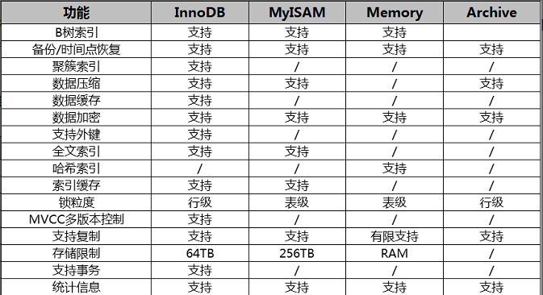

#  常用存储引擎的对比



# InnoDB 存储引擎

从 5.5 版本开始，InnoDB 是MySQL的默认事务性引擎，也是最重要、使用最广泛的存储引擎。InnoDB 具有提交、回滚、自动崩溃恢复的事务安全保障，拥有独立的缓存和日志，提供行级别的锁粒度和强大的并发能力。

在大多数使用场景中，包括事务型和非事务型存储需求，InnoDB 都是更好的选择，除非有非常特别的原因需要使用其他存储引擎。

下面将介绍 InnoDB 区别于其他存储引擎的特点。

## 自动增长列

InnoDB 表的自动增长列，插入的值可以为空，也可以人工插入，如果插入的值为空，则实际插入的值是自动增长后的值。

下面定义表 t1，字段 c1 为自动增长列，对该表进行 insert 操作，可以发现，当插入值为空时，实际插入的值是自动增长后的值。

```sql
mysql> create table t1(
    ->     c1 int not null auto_increment,
    ->     c2 varchar(10) default null,
    ->     primary key(c1)
    -> ) engine = innodb;
Query OK, 0 rows affected (0.05 sec)

mysql> insert into t1(c1,c2) values(null,'1'),(2,'2');
Query OK, 2 rows affected (0.00 sec)
Records: 2  Duplicates: 0  Warnings: 0

mysql> select * from t1;
+----+------+
| c1 | c2   |
+----+------+
|  1 | 1    |
|  2 | 2    |
+----+------+
2 rows in set (0.00 sec)
```

InnoDB中，自增长列必须是索引，同时必须是索引的第一个列 。如果不是第一个列，数据库会报出异常

```sql
mysql> create table t2(
    ->     c1 int not null auto_increment,
    ->     c2 varchar(10) default null,
    ->     key(c2,c1)
    -> ) engine = innodb;
ERROR 1075 (42000): Incorrect table definition; there can be only one auto column and it must be defined as a key

mysql> create table t2(
    ->     c1 int not null auto_increment,
    ->     c2 varchar(10) default null,
    ->     key(c1,c2)
    -> ) engine = innodb;
Query OK, 0 rows affected (0.05 sec)
```

## 主键和索引

InnoDB 表是基于聚簇索引建立的，聚簇索引也叫主索引，也是表的主键，InnoDB 表的每行数据都保存在主索引的叶子节点上。InnoDB 表必须包含主键，如果创建表时，没有显式指定主键，InnoDB 会自动创建一个长度为 6 个字节的 long 类型隐藏字段作为主键。所有的 InnoDB 表都应该显式指定主键。

InnoDB 表中，除主键之外的索引，叫做二级索引。二级索引必须包含主键列，如果主键列很大的话，其他的所有索引都会很大。因此，主键是否设计合理，对所有的索引都会产生影响。

一般来说，主键的设计原则大致如下：

- 满足唯一和非空约束；
- 主键字段应尽可能地小；
- 主键字段值基本不会被修改；
- 优先考虑自增字段，或查询最频繁的字段。

## 存储方式

InnoDB 存储表和索引的方式，有以下两种：

- **独享表空间的存储方式**：表结构保存在 .frm 文件中，每个表的数据和索引单独保存在 .ibd 文件中；
- **共享表空间的存储方式**：表结构保存在 .frm 文件中，数据和索引保存在表空间 ibdata 文件中。

使用共享表空间时，随着数据的不断增长，表空间的维护会越来越困难，一般情况，都建议使用独享表空间。可以通过配置参数 innodb_file_per_table 来开启独享表空间。

```sql
innodb_file_per_table = 1 #1为开启独享表空间
```

使用独享表空间时，可以很方便对单表进行备份和恢复操作，但是直接复制 .ibd 文件是不行的，因为缺少共享表空间的数据字典信息，但是可以通过下面的命令，实现 .ibd 文件和 .frm 文件能被正确识别和恢复。

```sql
alter table xxx discard tablespace;
alter table xxx import tablespace;
```

# 小结

本小节介绍了常用存储引擎的对比，以及 InnoDB 存储引擎区别于其他存储引擎的特点：自动增长列、主键和索引、存储方式。