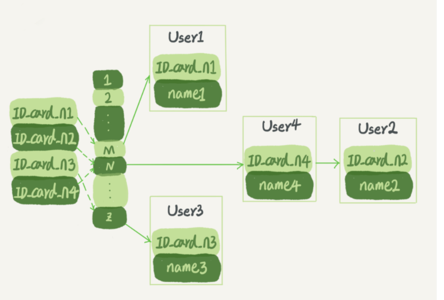
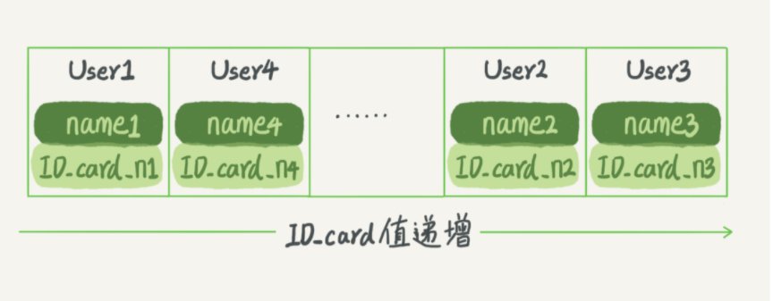
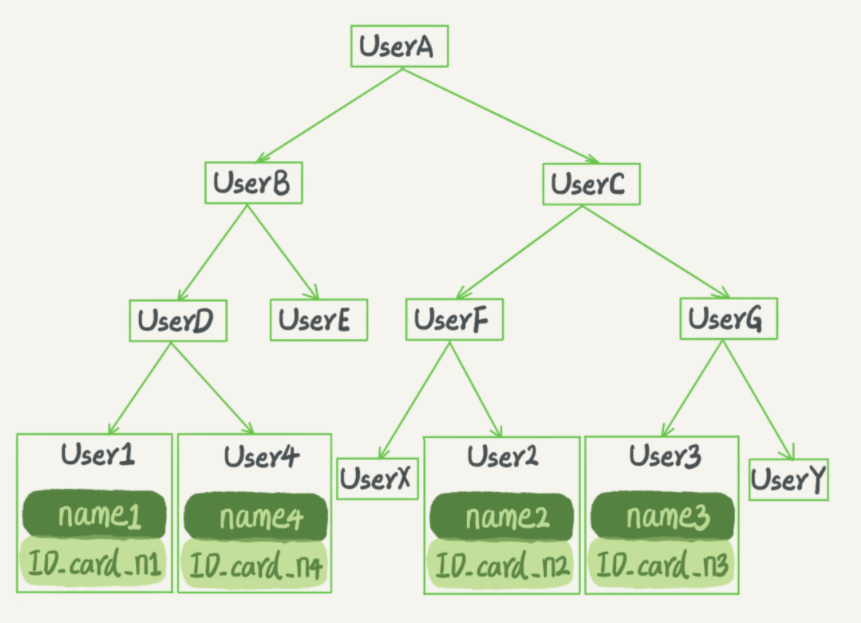
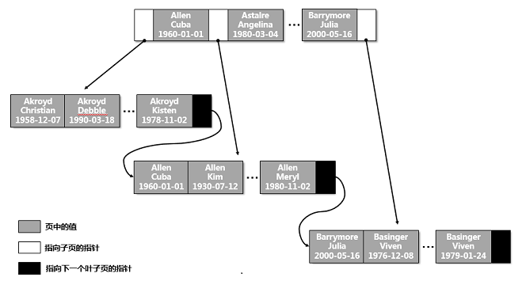

# 索引的常见模型

索引的出现是为了提高查询效率，但是实现索引的方式却有很多种，所以这里也就引入了索引模型的概念。可以用于提高读写效率的数据结构很多，

三种常见、也比较简单的数据结构，它们分别是

- 哈希表
- 有序数组
- 搜索树。

## 哈希表

哈希表是一种以键 - 值（key-value）存储数据的结构，我们只要输入待查找的值即 key，就可以找到其对应的值即 Value。哈希的思路很简单，把值放在数组里，用一个哈希函数把 key 换算成一个确定的位置，然后把 value 放在数组的这个位置。

多个 key 值经过哈希函数的换算，会出现同一个值的情况。处理这种情况的一种方法是，拉出一个链表。

假设，你现在维护着一个身份证信息和姓名的表，需要根据身份证号查找对应的名字，这时对应的哈希索引的示意图如下所示：



图中，User2 和 User4 根据身份证号算出来的值都是 N，但没关系，后面还跟了一个链表。假设，这时候你要查 ID_card_n2 对应的名字是什么，处理步骤就是：首先，将 ID_card_n2 通过哈希函数算出 N；然后，按顺序遍历，找到 User2。

需要注意的是，图中四个 ID_card_n 的值并不是递增的，这样做的好处是增加新的 User 时速度会很快，只需要往后追加。但缺点是，因为不是有序的，所以哈希索引做区间查询的速度是很慢的。

你可以设想下，如果你现在要找身份证号在 [ID_card_X, ID_card_Y] 这个区间的所有用户，就必须全部扫描一遍了。

所以，**哈希表这种结构适用于只有等值查询的场景**，比如 Memcached 及其他一些 NoSQL 引擎


## 有序数组

而**有序数组在等值查询和范围查询场景中的性能就都非常优秀**。还是上面这个根据身份证号查名字的例子，如果我们使用有序数组来实现的话，示意图如下所示




这里我们假设身份证号没有重复，这个数组就是按照身份证号递增的顺序保存的。这时候如果你要查 ID_card_n2 对应的名字，用二分法就可以快速得到，这个时间复杂度是 O(log(N))。

同时很显然，这个索引结构支持范围查询。你要查身份证号在 [ID_card_X, ID_card_Y] 区间的 User，可以先用二分法找到 ID_card_X（如果不存在 ID_card_X，就找到大于 ID_card_X 的第一个 User），然后向右遍历，直到查到第一个大于 ID_card_Y 的身份证号，退出循环。

如果仅仅看查询效率，有序数组就是最好的数据结构了。但是，在需要更新数据的时候就麻烦了，你往中间插入一个记录就必须得挪动后面所有的记录，成本太高。

所以，**有序数组索引只适用于静态存储引擎**，比如你要保存的是 2017 年某个城市的所有人口信息，这类不会再修改的数据。


## 搜索树

二叉搜索树也是课本里的经典数据结构了。还是上面根据身份证号查名字的例子，如果我们用二叉搜索树来实现的话，示意图如下所示：



二叉搜索树的特点是：每个节点的左儿子小于父节点，父节点又小于右儿子。这样如果你要查 ID_card_n2 的话，按照图中的搜索顺序就是按照 UserA -> UserC -> UserF -> User2 这个路径得到。这个时间复杂度是 O(log(N))。

当然为了维持 O(log(N)) 的查询复杂度，你就需要保持这棵树是平衡二叉树。为了做这个保证，更新的时间复杂度也是 O(log(N))。

树可以有二叉，也可以有多叉。多叉树就是每个节点有多个儿子，儿子之间的大小保证从左到右递增。二叉树是搜索效率最高的，但是实际上大多数的数据库存储却并不使用二叉树。其原因是，索引不止存在内存中，还要写到磁盘上。

可以想象一下一棵 100 万节点的平衡二叉树，树高 20。一次查询可能需要访问 20 个数据块。在机械硬盘时代，从磁盘随机读一个数据块需要 10 ms 左右的寻址时间。也就是说，对于一个 100 万行的表，如果使用二叉树来存储，单独访问一个行可能需要 20 个 10 ms 的时间，这个查询可真够慢的。

为了让一个查询尽量少地读磁盘，就必须让查询过程访问尽量少的数据块。那么，我们就不应该使用二叉树，而是要使用“N 叉”树。这里，“N 叉”树中的“N”取决于数据块的大小。

以 InnoDB 的一个整数字段索引为例，这个 N 差不多是 1200。这棵树高是 4 的时候，就可以存 1200 的 3 次方个值，这已经 17 亿了。

考虑到树根的数据块总是在内存中的，一个 10 亿行的表上一个整数字段的索引，查找一个值最多只需要访问 3 次磁盘。其实，树的第二层也有很大概率在内存中，那么访问磁盘的平均次数就更少了。

N 叉树由于在读写上的性能优点，以及适配磁盘的访问模式，已经被广泛应用在数据库引擎中了。

## 总结

**心里要有个概念，数据库底层存储的核心就是基于这些数据模型的。每碰到一个新数据库，我们需要先关注它的数据模型，这样才能从理论上分析出这个数据库的适用场景。**


# B-Tree 索引类型详解 

索引有很多种类型，可以为不同的应用场景提供更好的性能。在 MySQL 中，索引是在存储引擎层实现的。接下来重点介绍四种常见的索引类型：B-Tree 索引、哈希索引、空间数据索引（R-Tree）、全文索引

# B-Tree 索引

B-Tree 索引是最常见的索引之一，当大家在谈论索引的时候，如果没有特别说明，那多半说的就是 B-Tree 索引。在 MySQL 中，大多数的存储引擎都支持 B-Tree 索引。

## 存储结构

B-Tree 对索引列的值是按顺序存储的，并且每一个叶子页到根的距离相同。B-Tree 索引可以加快数据查找的速度，因为存储引擎不需要全表扫描来获取数据，只要从索引的根节点开始搜索即可

以表 customer 为例，我们来看看索引是如何组织数据的存储的。

```sql
mysql> create table customer(
		 id int,
         last_name varchar(30),
		 first_name varchar(30),
		 birth_date date,
		 gender char(1),
		 key idx1_customer(last_name,first_name,birth_date)
     );
```

如图，对于表中的每行数据，索引包含了 last_name、first_name 和 birth_date 的值。



## 适合 B-Tree 索引的查询类型

### **全值匹配**

和索引中的所有列进行匹配，如查找姓名为 George Bush、1960-08-08 出生的客户。

```shell
mysql> explain select * from customer where first_name='George' and last_name='Bush' and birth_date='1960-08-08'\G
*************************** 1. row ***************************
           id: 1
  select_type: SIMPLE
        table: customer
   partitions: NULL
         type: ref
possible_keys: idx1_customer
          key: idx1_customer
      key_len: 190
          ref: const,const,const
         rows: 1
     filtered: 100.00
        Extra: NULL
1 row in set, 1 warning (0.00 sec)
```

### **匹配最左前缀**

只使用索引的第一列，如查找所有姓氏为 Bush 的客户：

```sql
mysql> explain select * from customer where last_name='Bush'\G
*************************** 1. row ***************************
           id: 1
  select_type: SIMPLE
        table: customer
   partitions: NULL
         type: ref
possible_keys: idx1_customer
          key: idx1_customer
      key_len: 93
          ref: const
         rows: 1
     filtered: 100.00
        Extra: NULL
1 row in set, 1 warning (0.00 sec)

```

### 匹配列前缀

只匹配某一列的值的开头部分，如查找所有以 B 开头的姓氏的客户，这里使用了索引的第一列

```sql
mysql> explain select * from customer where last_name like 'B%'\G
*************************** 1. row ***************************
           id: 1
  select_type: SIMPLE
        table: customer
   partitions: NULL
         type: range
possible_keys: idx1_customer
          key: idx1_customer
      key_len: 93
          ref: NULL
         rows: 1
     filtered: 100.00
        Extra: Using index condition
1 row in set, 1 warning (0.00 sec)
```

### 匹配范围值

查找所有姓氏在 Allen 和 Bush 之间的客户，这里使用了索引的第一列：

```sql
mysql> explain select * from customer where last_name between 'Allen' and 'Bush'\G
*************************** 1. row ***************************
           id: 1
  select_type: SIMPLE
        table: customer
   partitions: NULL
         type: range
possible_keys: idx1_customer
          key: idx1_customer
      key_len: 93
          ref: NULL
         rows: 1
     filtered: 100.00
        Extra: Using index condition
1 row in set, 1 warning (0.00 sec)

```

### 精确匹配某一列，并范围匹配另一列

第一列全匹配，第二列范围匹配，如查找姓氏为 Bush，名字以 G 开头的客户：

```shell
mysql> explain select * from customer where last_name='Bush' and first_name like 'G'\G
*************************** 1. row ***************************
           id: 1
  select_type: SIMPLE
        table: customer
   partitions: NULL
         type: range
possible_keys: idx1_customer
          key: idx1_customer
      key_len: 186
          ref: NULL
         rows: 1
     filtered: 100.00
        Extra: Using index condition
1 row in set, 1 warning (0.00 sec)
```

### **只访问索引的查询**

只需要访问索引即可获取数据，不需要回表访问数据行，这种查询也叫覆盖索引：

```sql
mysql> explain select last_name from customer where last_name='Bush'\G
*************************** 1. row ***************************
           id: 1
  select_type: SIMPLE
        table: customer
   partitions: NULL
         type: ref
possible_keys: idx1_customer
          key: idx1_customer
      key_len: 93
          ref: const
         rows: 1
     filtered: 100.00
        Extra: Using index
1 row in set, 1 warning (0.00 sec)
```

除了上述这些查询类型外，索引还可以用于 order by 排序操作，因为索引中的节点是有序的。如果 B-Tree 可以按照某种方式查找到数据，那么也可以按照这种方式进行排序。

## B-Tree 索引的限制

如果不是按照索引的最左列开始查找数据，则无法使用索引。如查找名字为 George 的客户：

```sql
mysql> explain select * from customer where first_name='George'\G
*************************** 1. row ***************************
           id: 1
  select_type: SIMPLE
        table: customer
   partitions: NULL
         type: ALL
possible_keys: NULL
          key: NULL
      key_len: NULL
          ref: NULL
         rows: 1
     filtered: 100.00
        Extra: Using where
1 row in set, 1 warning (0.00 sec)
```

不能跳过索引的列。如查找姓氏为 Bush，生日为 1960-08-08 的客户，这种查询只能使用索引的第一列：

```sql
mysql> explain select * from customer where last_name='Bush' and birth_date='1960-08-08'\G
*************************** 1. row ***************************
           id: 1
  select_type: SIMPLE
        table: customer
   partitions: NULL
         type: ref
possible_keys: idx1_customer
          key: idx1_customer
      key_len: 93
          ref: const
         rows: 1
     filtered: 100.00
        Extra: Using index condition
1 row in set, 1 warning (0.00 sec)
```

如果查询中有某个列的范围查询，在其右边的列都无法使用索引进行查找数据。如查找姓氏为以 B 开头，名字为 George 的客户。这个查询只能使用第一列，因为 like 是一个范围查询：

```sql
mysql> explain select * from customer where last_name like 'B%' and first_name='George'\G;
*************************** 1. row ***************************
           id: 1
  select_type: SIMPLE
        table: customer
   partitions: NULL
         type: range
possible_keys: idx1_customer
          key: idx1_customer
      key_len: 186
          ref: NULL
         rows: 1
     filtered: 100.00
        Extra: Using index condition
1 row in set, 1 warning (0.00 sec)
```

## 小结

本小节介绍了 B-Tree 索引的存储结构、适合 B-Tree 索引的查询类型和相关限制，从中我们可以看出，索引列的顺序非常重要。在某些应用场景，可能需要创建相同列，但顺序不同的索引，来满足性能的优化。


# 哈希索引

哈希索引基于哈希表实现，仅支持精确匹配索引所有列的查询。对于每行数据，存储引擎都会对所有的索引列计算出一个哈希码。哈希索引将所有的哈希码存储在索引中，同时保存指向每个数据行的指针。

## 存储结构

常见的存储引擎中，MEMORY 存储引擎显式支持哈希索引。如果多个列的哈希值相同，哈希索引会以链表的方式存放多个记录指针到同一个哈希条目中。（拉链法）

以 customer 表为例，我们来看看索引是如何组织数据的存储的：

```sql
mysql> create table customer(
		 id int,
         last_name varchar(30),
		 first_name varchar(30),
		 birth_date date,
		 key idx1_customer(first_name) using hash
     ) ENGINE=MEMORY;
     
mysql> select * from customer;
+------+-----------+------------+------------+
| id   | last_name | first_name | birth_date |
+------+-----------+------------+------------+
|    1 | Allen     | Cuba       | 1960-01-01 |
|    2 | Barrymore | Julia      | 2000-05-06 |
|    3 | Basinger  | Viven      | 1979-01-24 |
+------+-----------+------------+------------+
3 rows in set (0.00 sec)

假设哈希索引使用哈希函数f()，返回的值如下：

f('Cuba')=1212

f('Julia')=5656

f('Viven')=2323

哈希索引的数据结构如下：
+-----------+-----------------------+
| 槽(Slot)  | 值(Value)              |
+-----------+-----------------------+
|      1212 | 指向第1行的指针          |
|      2323 | 指向第3行的指针          |
|      5656 | 指向第2行的指针          |
+-----------+-----------------------+

```

InnoDB 存储引擎也能支持哈希索引，但它所支持的哈希索引是自适应的。InnoDB 存储引擎会根据表的使用情况，在内存中基于 B-Tree 索引之上再创建一个哈希索引，这种行为是自动的、内部的行为，不能人为去干预是否在一张表中生成哈希索引。

## 适合哈希索引的查询类型

## 精确匹配所有列

和索引中的所有列进行精确匹配，如查找名字为Julia的客户。

数据库先会计算first_name='Julia’的哈希值5656，然后在索引中查找5656，找到对应的指针为：指向第2行的指针，最后根据指针从原表拿到具体值，并进行比较是否为Julia

```sql
mysql> explain select * from customer where first_name='Julia'\G
*************************** 1. row ***************************
           id: 1
  select_type: SIMPLE
        table: customer
   partitions: NULL
         type: ref
possible_keys: idx1_customer
          key: idx1_customer
      key_len: 93
          ref: const
         rows: 2
     filtered: 100.00
        Extra: NULL
1 row in set, 1 warning (0.00 sec)
```

## 哈希索引的限制

- 哈希索引只支持等值查询，包括=、IN、<=>；
- 哈希索引不存储字段值，只包含哈希值和行指针，不能使用索引中的值来避免读取行；
- 哈希索引不是按照索引值顺序存储的，不能用于排序；
- 哈希索引不支持部分索引列匹配查找，如在字段(last_name,first_name)创建哈希索引，此时需要查找last_name='Allen’的数据行，这种查询无法使用该哈希索引；
- 哈希索引不支持范围查询，如查找所有姓氏在Allen和Bush之间的客户，这种查询无法使用哈希索引；
- 如果出现很多哈希冲突（不同的索引列值有相同的哈希值），索引的维护成本是很高的，应尽量避免在选择性很低的字段上创建哈希索引。

# 空间数据索引 R-Tree

常见的存储引擎中，MyISAM 存储引擎支持空间索引，主要用作地理数据存储。空间索引会从所有维度来索引数据，查询时，可以使用任意维度来组合查询。这点和 B-Tree 索引不同，空间索引不需要前缀查询。MySQL 的 GIS 支持其实并不完善，一般情况并不建议在 MySQL 中使用空间索引。

# 全文索引

全文索引查找的是文本中的关键词，并不是直接比较索引中的值，它是一种特殊类型的索引。全文索引和其他索引的匹配方式完全不一样，更类似于搜索引擎，并不是简单的 where 条件匹配。

在相同的列上可以同时创建全文索引和 B-Tree 索引，全文索引适用于 match against 操作，不是简单的where 条件操作。

# 小结

本小节介绍了哈希索引、空间数据索引、全文索引这三种索引类型。重点介绍了哈希索引的存储结构、适合哈希索引的查询类型和相关限制。哈希索引仅支持精确匹配所有列的查询，在这种查询中，哈希索引是非常高效的，因为哈希索引存储的是哈希值，存储结构非常紧凑。