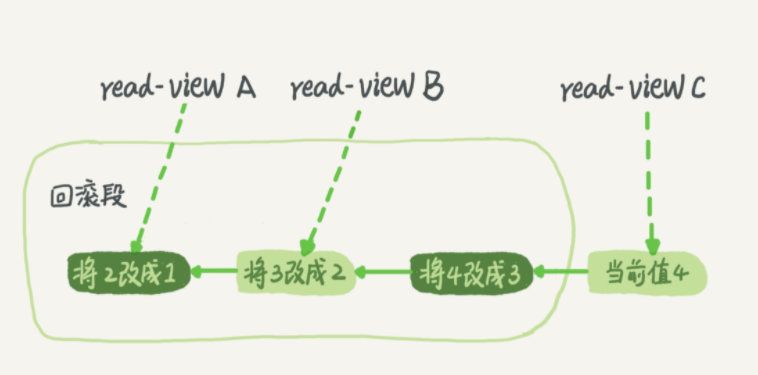

# MySQL 的 事务和隔离级别

事务是一组原子性的SQL查询，事务内的SQL语句，要么全部执行成功，要么全部执行失败。本节重点介绍事务的ACID和隔离级别。

# ACID

提到事务，大家肯定都不陌生，和数据库打交道，我们都会用到事务。银行转账是解释事务的一个经典例子。银行数据库通常会有两张表：支票表和储蓄表。现在要从用户 A 的支票账户转账 100 元人民币到储蓄账户，一般是下面三个步骤：

1. 检查支票账户的余额高于 100 元；
2. 从支票账户余额减去 100 元；
3. 在储蓄账户余额增加 100 元；

相应的 SQL 语句如下：

```sql
start transaction
select balance from checking where customer_name = 'A'
update checking set balance = balance - 100.00 where customer_name = 'A'
update savings set balance = balance + 100.00 where customer_name = 'A'
commit;
```

这三个步骤需要封装成一个事务，任何一个步骤失败，都必须回滚所有的步骤。简单的说，事务就是保证一组数据库操作，要么全部执行成功，要么全部执行失败。

一个优秀的事务处理机制，需要具备 ACID 特性，

- 即原子性（atomicity）、
- 一致性（consistency）、
- 隔离性（isolation）、
- 持久性（durability）。

## 原子性（atomicity）

一个事务被视为一个完整的最小工作单元，事务中的数据库操作，要么全部执行成功，要么全部执行失败回滚，不能只成功执行了其中的一部分数据库操作；

## 一致性（consistency）

数据库总是从一个一致性的状态转换到另一个一致性的状态。在银行转账的例子中，即使执行到第四条 SQL 语句时失败，用户的支票账户也不会损失 100 元人民币，因为执行失败时，事务进行了回滚，所做的修改并没有保存到数据库中；

## 隔离性（isolation）

通常来说，一个事物所做的修改在提交以前，对其他事务是不可见的。在银行转账的例子中，当执行完第三条 SQL 语句时，此时另外一个程序在汇总支票账户，它所查询到的用户A的支票账户，并没有减去 100 元人民币；

## 持久性（durability）

事务提交成功，所做的修改就会永久保存到数据库中，即使系统崩溃，修改的数据也不会丢失。


在 MySQL 中，**事务是在存储引擎层实现的**。MySQL 是**支持多种存储引擎的数据库，但并不是所有的存储引擎都支持事务**，比如 MyISAM 就不支持事务。

事务增加了数据库的安全性，同时也需要数据库做很多额外的工作。相比没有实现 ACID 的数据库，实现了 ACID 的数据库需要更强的 CPU、内存、以及磁盘空间。

# 隔离级别

当数据库上有多个事务同时执行的时候，就可能出现

- 脏读（dirty read）、
- 不可重复读（non-repeatable read）、
- 幻读（phantom read）

的问题，为了解决这些问题，就有了“隔离级别”的概念。

在 SQL 标准中，包含了四种隔离级别，即

- 未提交读（read uncommitted）、
- 提交读（read committed）、
- 可重复读（repeatable read）、
- 可串行化（serializable）。

在谈隔离级别之前，你首先要知道，你隔离得越严实，效率就会越低。因此很多时候，我们都要在二者之间寻找一个平衡点。

## 未提交读（read uncommitted）

一个事务还未提交，它所做的变更能被别的事务看到。事务可以读取未提交的数据，被称为脏读（dirty read），这种隔离级别在实际应用中一般很少使用；

## 提交读（read committed）

一个事务提交之后，它所做的变更才能被别的事务看到。大多数数据库的默认隔离级别是提交读（read committed），比如 Oracle；

## 可重复读（repeatable read）

一个事务在执行过程中看到的数据，总是跟这个事务在启动时看到的数据是一致的。在可重复读隔离级别下，未提交变更对其他事务也是不可见的。该级别保证了在同一个事务中，多次读取同样记录的结果是一致的。MySQL 的默认事务隔离级别是可重复读（repeatable read）；

## 可串行化（serializable）

serializable 是最高的隔离级别。对同一行数据，读写都会进行加锁。当出现锁冲突时，后面访问的事务必须等前一个事务完成，才能继续执行。实际应用场景很少用到这种隔离级别，只有在非常需要确保数据一致性，而且可以接受没有并发的情况，才会使用这种隔离级别。

下表为 ANSI SQL 隔离级别：

| 隔离级别                     | 脏读可能性 | 不可重复度可能性 | 幻读可能性 | 加锁读 |
| :--------------------------- | :--------- | :--------------- | :--------- | :----- |
| 未提交读（read uncommitted） | yes        | yes              | yes        | no     |
| 提交读（read committed）     | no         | yes              | yes        | no     |
| 可重复读（repeatable read）  | no         | no               | yes        | no     |
| 可串行化（serializable）     | no         | no               | no         | yes    |


# 实现说明

实现上，数据库里面会创建一个视图，访问的时候以视图的逻辑结果为准。

- **在“可重复读”隔离级别下**，这个视图是在事务启动时创建的，整个事务存在期间都用这个视图。
- **在“读提交”隔离级别下**，这个视图是在每个 SQL 语句开始执行的时候创建的。
- **“读未提交”隔离级别下** 直接返回记录上的最新值，没有视图概念；
- **“串行化”隔离级别下** 直接用加锁的方式来避免并行访问。

## 不同的数据库，默认隔离级别不同

- Oracle 数据库的默认隔离级别其实就是“读提交”
- MySQL 的隔离级别设置为“可重复读”

## 配置的方式

将启动参数 transaction-isolation 的值设置成 READ-COMMITTED。

你可以用 show variables 来查看当前的值。

```sql
mysql> show variables like 'transaction_isolation';
 
+-----------------------+----------------+
 
| Variable_name | Value |
 
+-----------------------+----------------+
 
| transaction_isolation | READ-COMMITTED |
 
+-----------------------+----------------+
```

总结来说，存在即合理，哪个隔离级别都有它自己的使用场景，你要根据自己的业务情况来定。我想**你可能会问那什么时候需要“可重复读”的场景呢**？我们来看一个数据校对逻辑的案例。

## 事务隔离的实现

事务隔离具体是怎么实现的。这里我们展开说明“可重复读”。

在 MySQL 中，实际上每条记录在更新的时候都会同时记录一条回滚操作。记录上的最新值，通过回滚操作，都可以得到前一个状态的值。

假设一个值从 1 被按顺序改成了 2、3、4，在回滚日志里面就会有类似下面的记录。



当前值是 4，但是在查询这条记录的时候，不同时刻启动的事务会有不同的 read-view。如图中看到的，在视图 A、B、C 里面，这一个记录的值分别是 1、2、4，同一条记录在系统中可以存在多个版本，就是数据库的多版本并发控制（MVCC）。对于 read-view A，要得到 1，就必须将当前值依次执行图中所有的回滚操作得到。

同时你会发现，即使现在有另外一个事务正在将 4 改成 5，这个事务跟 read-view A、B、C 对应的事务是不会冲突的。

你一定会问，回滚日志总不能一直保留吧，什么时候删除呢？

答案是，在不需要的时候才删除。也就是说，系统会判断，当没有事务再需要用到这些回滚日志时，回滚日志会被删除。

什么时候才不需要了呢？就是当系统里没有比这个回滚日志更早的 read-view 的时候。

### 基于上面的说明，我们来讨论一下为什么建议你尽量不要使用长事务。

长事务意味着系统里面会存在很老的事务视图。由于这些事务随时可能访问数据库里面的任何数据，所以这个事务提交之前，数据库里面它可能用到的回滚记录都必须保留，这就会导致大量占用存储空间。

在 MySQL 5.5 及以前的版本，回滚日志是跟数据字典一起放在 ibdata 文件里的，即使长事务最终提交，回滚段被清理，文件也不会变小。我见过数据只有 20GB，而回滚段有 200GB 的库。最终只好为了清理回滚段，重建整个库。

除了对回滚段的影响，长事务还占用锁资源，也可能拖垮整个库。

## 事务的启动方式

长事务有这些潜在风险，我当然是建议你尽量避免。其实很多时候业务开发同学并不是有使用长事务，通常是由于误用所致。MySQL 的事务启动方式有以下几种：

1. 显式启动事务语句， begin 或 start transaction。配套的提交语句是 commit，回滚语句是 rollback。
2. set autocommit=0，这个命令会将这个线程的自动提交关掉。意味着如果你只执行一个 select 语句，这个事务就启动了，而且并不会自动提交。这个事务持续存在直到你主动执行 commit 或 rollback 语句，或者断开连接。

有些客户端连接框架会默认连接成功后先执行一个 set autocommit=0 的命令。这就导致接下来的查询都在事务中，如果是长连接，就导致了意外的长事务。

因此，我会建议你总是使用 set autocommit=1, 通过显式语句的方式来启动事务。

但是有的开发同学会纠结“多一次交互”的问题。对于一个需要频繁使用事务的业务，第二种方式每个事务在开始时都不需要主动执行一次 “begin”，减少了语句的交互次数。如果你也有这个顾虑，我建议你使用 commit work and chain 语法。

在 autocommit 为 1 的情况下，用 begin 显式启动的事务，如果执行 commit 则提交事务。如果执行 commit work and chain，则是提交事务并自动启动下一个事务，这样也省去了再次执行 begin 语句的开销。同时带来的好处是从程序开发的角度明确地知道每个语句是否处于事务中。

你可以在 information_schema 库的 innodb_trx 这个表中查询长事务，比如下面这个语句，用于查找持续时间超过 60s 的事务。

```sql
select * from information_schema.innodb_trx where TIME_TO_SEC(timediff(now(),trx_started))>60
```

# 小结

本小节主要介绍了事务的 ACID 和隔离级别。

ACID特性：原子性（atomicity）、一致性（consistency）、隔离性（isolation）、持久性（durability）

隔离级别：未提交读（read uncommitted）、提交读（read committed）、可重复读（repeatable read）、可串行化（serializable）