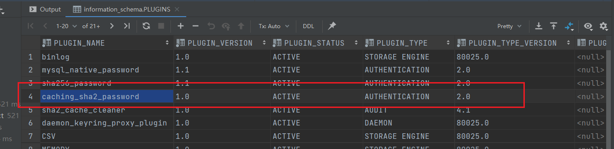

# mysql 8.0 登录 提示 plugin caching_sha2_password could not be loaded错误

使用[Sqlyog](https://so.csdn.net/so/search?q=Sqlyog&spm=1001.2101.3001.7020)报错，发现报错。mysql 版本 8.0 及以上

## 检查

```sql
select * from information_schema.plugins
```





进一步确认：

1. 登录mysql 本地：

```sql
# root登录mysql
mysql -uroot -p
# 显示数据库列表
show databases;
# use 数据库名;
use mysql;
# 检查确认
SELECT Host, User, plugin from user;
# out
+---------------+------------------+-----------------------+
| Host          | User             | plugin                |
+---------------+------------------+-----------------------+
| %             | mysqladmin       | caching_sha2_password |
| %             | zbcn             | caching_sha2_password |
| 47.99.133.237 | super            | caching_sha2_password |
| localhost     | mysql.infoschema | caching_sha2_password |
| localhost     | mysql.session    | caching_sha2_password |
| localhost     | mysql.sys        | caching_sha2_password |
| localhost     | root             | mysql_native_password |
+---------------+------------------+-----------------------+

```

确认 zbcn用户的身份验证器插件已经变为：caching_sha2_password

# 解决

```sql
#修改加密规则
ALTER USER 'zbcn'@'%' IDENTIFIED BY 'password' PASSWORD EXPIRE NEVER; 
#更新用户的密码
ALTER USER 'zbcn'@'%' IDENTIFIED WITH mysql_native_password BY 'password'; 
#刷新权限
FLUSH PRIVILEGES;
#重置密码 - xxxx为你需要修改的密码
ALTER USER 'root'@'localhost' IDENTIFIED BY 'xxxxxx';


# 再次检查
SELECT Host, User, plugin from user;
# out
+---------------+------------------+-----------------------+
| Host          | User             | plugin                |
+---------------+------------------+-----------------------+
| %             | mysqladmin       | caching_sha2_password |
| %             | zbcn             | mysql_native_password |
| 47.99.133.237 | super            | caching_sha2_password |
| localhost     | mysql.infoschema | caching_sha2_password |
| localhost     | mysql.session    | caching_sha2_password |
| localhost     | mysql.sys        | caching_sha2_password |
| localhost     | root             | mysql_native_password |
+---------------+------------------+-----------------------+

```

确认 zbcn用户的身份验证器插件已经变为： mysql_native_password 。 本地 sqlyog 登录也正常。