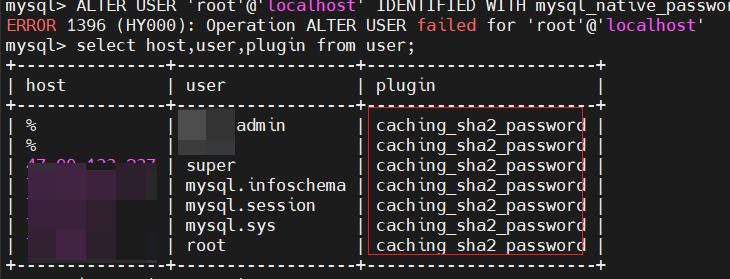
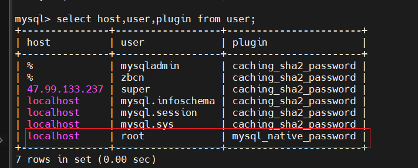

## mysql 8.0 用户密码忘记，初始化新密码方式


1. 打开命令窗口cmd，输入命令：net stop mysql，停止MySQL服务，
2. 开启跳过密码验证登录的MySQL服务`mysqld --defaults-file="D:\ProgramData\MySQL\MySQL Server 8.0\my.ini" --console --skip-grant-tables --shared-memory`
3. 再打开一个新的cmd，无密码登录MySQL，输入登录命令：mysql -u root -p  或者 `mysql`
4. 密码置为空，命令如下：

```sql
use mysql
update user set authentication_string='' where user='root';
```

5. ​	退出mysql，执行命令： `quit`

6.  关闭以 -console --skip-grant-tables --shared-memory 启动的MySQL服务，

7.  打开命令框，输入：net start mysql 启动MySQL服务。
8. 步骤4密码已经置空，所以无密码状态登录MySQL，输入登录命令：mysql -u root -p
9. 更改密码的命令，成功修改密码 `ALTER USER 'root'@'localhost' IDENTIFIED BY '新密码';`

```sql
ALTER USER ‘root'@‘localhost' IDENTIFIED WITH mysql_native_password BY ‘111111';

ALTER USER 'root'@'localhost' IDENTIFIED WITH mysql_native_password BY '123';
flush privileges
```


7. 10.验证更改后密码正确登录

   输入quit，退出当前登录，输入登录命令：mysql -u root -p

   输入密码，成功登录，到此，重置密码结束。

## mysql 用户名密码修改报 `ERROR 1396 (HY000): Operation ALTER USER failed for 'super'@'%'`

问题原因：

1. 我们可可以查看mysql 数据库中user表的 plugin字段；

   ```sql
   select host,user,plugin from user;
   ```

   

发现都是caching_sha2_password的插件，而不是mysql_native_password插件

所以我们把他改回去：

```sql
update user set plugin='mysql_native_password' where user='root';
```

再次查看：

```sql
select host,user,plugin from user;
```



再改动密码

```sql
ALTER USER 'root'@'localhost' IDENTIFIED WITH mysql_native_password BY '123456';
```

这样我们本地就可以通过root用户和密码来登录，如果想要其他ip也能连接的话，我们再改动host

```sql
update mysql.user set host='%' where user='root';
```

**最后刷新权限**

```sql
flush privileges;
```

为什么还要使用mysql_native_password？
虽然最新版MySql换了新的身份验证插件（caching_sha2_password）, 原来的身份验证插件为（mysql_native_password）。但是一些客户端工具比如Navicat 中还找不到新的身份验证插件（caching_sha2_password），因此，我们需要将mysql用户使用的 登录密码加密规则 还原成 mysql_native_password，方便客户端工具连接使用。


## 参考

- https://blog.csdn.net/qq_37774171/article/details/121912962