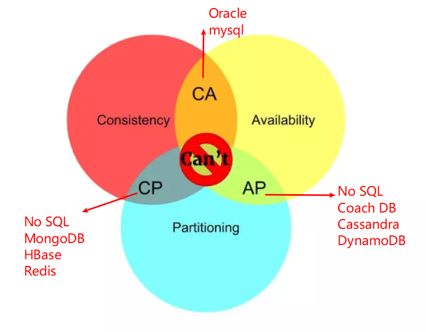
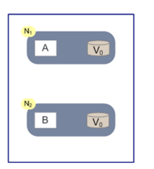
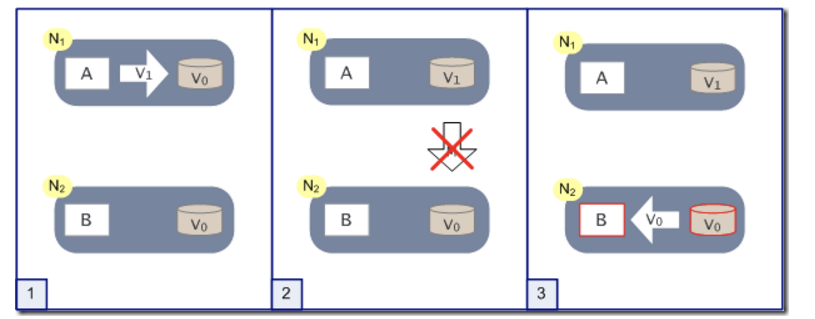

# 什么CAP 理论？

在计算机科学理论，CAP 定理（也称为 Brewer 定理），是由计算机科学家 Eric Brewer 提出的，即在分布式计算机系统不可能同时提供以下全部三个保证：

- 一致性（Consistency）：所有节点同一时间看到是相同的数据  `all nodes see the same data at the same time`；
- 可用性（Availability）：不管是否成功，确保每一个请求都能接收到响应 `Reads and writes always succeed`；
- 分区容错性（Partition tolerance）：系统任意分区后，在网络故障时，仍能操作 `the system continues to operate despite arbitrary message loss or failure of part of the system`

## Consistency 一致性

更新操作成功并返回客户端完成后，所有节点在同一时间的数据完全一致。分布式的一致性。

对于一致性，可以分为从客户端和服务端两个不同的视角。从客户端来看，一致性主要指的是多并发访问时更新过的数据如何获取的问题。从服务端来看，则是更新如何复制分布到整个系统，以保证数据最终一致。

一致性是因为有并发读写才有的问题，因此在理解一致性的问题时，一定要注意结合考虑并发读写的场景。

从客户端角度，多进程并发访问时，更新过的数据在不同进程如何获取的不同策略，决定了不同的一致性。

- **强一致性**： 对于关系型数据库，要求更新过的数据能被后续的访问都能看到
- **弱一致性**： 如果能容忍后续的部分或者全部访问不到
- **最终一致性**： 如果经过一段时间后要求能访问到更新后的数据

## Availability  可用性

可用性指“Reads and writes always succeed”，即服务一直可用，而且是正常响应时间。

**对于一个可用性的分布式系统，每一个非故障的节点必须对每一个请求作出响应。** 即：该系统使用的任何算法必须最终终止。

当同时要求分区容忍性时，这是一个很强的定义：即使是严重的网络错误，每个请求必须终止。好的可用性主要是指系统能够很好的为用户服务，不出现用户操作失败或者访问超时等用户体验不好的情况。

通常情况下，可用性和分布式数据冗余，负载均衡等有着很大的关联。

## Partition Tolerance  分区容错性

分区容错性指 “the system continues to operate despite arbitrary message loss or failure of part of the system”. 即分布式系统在遇到某节点或网络分区故障的时候，仍然能够对外提供满足一致性和可用性的服务。分区容错性和扩展性紧密相关。

在分布式应用中，可能因为一些分布式的原因导致系统无法正常运转。好的分区容错性要求能够使应用虽然是一个分布式系统，而看上去却好像是在一个可以运转正常的整体。

比如现在的分布式系统中有某一个或者几个机器宕掉了，其他剩下的机器还能够正常运转满足系统需求，或者是机器之间有网络异常，将分布式系统分隔为独立的几个部分，各个部分还能维持分布式系统的运作，这样就具有好的分区容错性。

#  CAP 只能三选二

## CA without P

如果不要求P（不允许分区），则C（强一致性）和A（可用性）是可以保证的。但其实分区不是你想不想的问题，而是始终会存在，因此CA的系统更多的是允许分区后各子系统依然保持CA。

### 实例

比如一般的关系型数据库，像是MySQL或者是Oracle，它们都保证了一致性和可用性，但是并不是分布式系统。

## CP without A

如果不要求A（可用），相当于每个请求都需要在Server之间强一致，而P（分区）会导致同步时间无限延长，如此CP也是可以保证的。很多传统的数据库分布式事务都属于这种模式。

### 实例

分布式系统中，很遗憾，这种情况几乎不存在。因为分布式系统，网络分区是必然的。如果要舍弃P，那么就是要舍弃分布式系统，CAP也就无从谈起了。可以说P是分布式系统的前提，所以这种情况是不存在的。

对于有些系统而言，一致性是安身立命之本，比如Hbase、Redis这种分布式存储，数据一致性是最基本的要求。不满足一致性的存储显然不会有用户愿意使用。

## AP wihtout C

要高可用并允许分区，则需放弃一致性。一旦分区发生，节点之间可能会失去联系，为了高可用，每个节点只能用本地数据提供服务，而这样会导致全局数据的不一致性。现在众多的NoSQL都属于此类。

### 实例

这种是大部分的分布式系统的设计，保证高可用和分区容错，但是会牺牲一致性。比如淘宝购物以及12306购票等等，淘宝可以做到全年可用性5个9的超高级别，但是此时就无法保证数据一致性了。

我们在12306买票的时候就经常会遇到。在我们点击购买的时候，系统并没有提示没票。等我们输入了验证码，付款的时候才会告知，已经没有票了。这就是因为我们在点击购买的时候，数据没有达成一致性，在付款校验的时候才检验出余票不足。这种设计会牺牲一些用户体验，但是可以保证高可用，让用户不至于无法访问或者是长时间等待，也算是一种取舍吧。

## 总结

对于多数大型互联网应用的场景，主机众多、部署分散，而且现在的集群规模越来越大，所以节点故障、网络故障是常态，而且要保证服务可用性达到 N个9 (即：99.999%)，即保证P和A，舍弃C（退而求其次保证 **最终一致性** ）。虽然某些地方会影响客户体验，但没达到造成用户流程的严重程度。

# CAP 理论只能三选二的原因？

假设整个集群里只有两个N1和N2两个节点：

N1和N2当中各自有一个应用程序AB和数据库：

- 当系统满足一致性的时候，我们认为N1和N2数据库中的数据保持一致。
- 在满足可用性的时候，我们认为无论用户访问N1还是N2，都可以获得正确的结果
- 满足分区容错性的时候，我们认为无论N1还是N2宕机或者是两者的通信中断，都不影响系统的运行。

假设一种极端情况，假设某个时刻N1和N2之间的网络通信突然中断了。如果系统满足分区容错性，那么显然可以支持这种异常。问题是在此前提下，一致性和可用性是否可以做到不受影响呢？

我们做个假象实验，如下图，突然某一时刻N1和N2之间的关联断开：

有用户向N1发送了请求更改了数据，将数据库从V0更新成了V1。由于网络断开，所以N2数据库依然是V0，如果这个时候有一个请求发给了N2，但是N2并没有办法可以直接给出最新的结果V1，这个时候该怎么办呢？

这个时候无非两种方法：

- 牺牲了一致性：一种是将错就错，将错误的V0数据返回给用户 。
- 牺牲了可用性： 阻塞等待，等待网络通信恢复，N2中的数据更新之后再返回给用户。

## 结论

在分布式系统当中，CAP三个特性我们是无法同时满足的，必然要舍弃一个。三者舍弃一个，显然排列组合一共有三种可能。