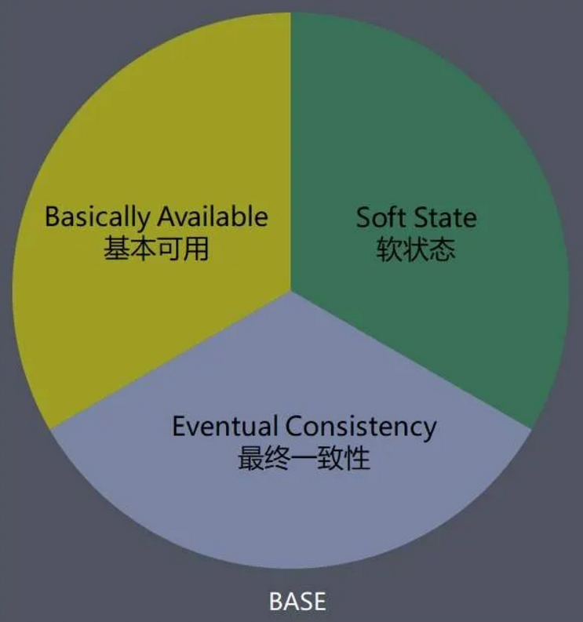
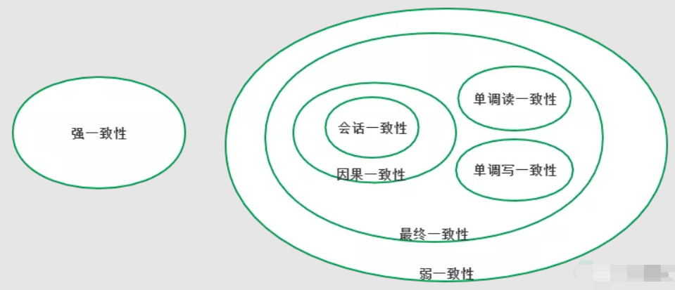

# Base 理论

Base理论是三要素的缩写：基本可用（Basically Available）、软状态（Soft-state）、最终一致性（Eventually Consistency）。

BASE是对CAP中一致性和可用性权衡的结果，其来源于大规模互联网系统分布式实践的总结，是基于CAP定理逐步演化而来的，其核心思想是即使无法做到强一致性（Strong consistency），但每个应用都可以根据自身的业务特点，采用适当的方式来使系统达到最终一致性（Eventual consistency）。

# Basically Available 基本可用

基本可用是指分布式系统在出现不可预知的故障的时候，允许损失部分可用性——但请注意，这绝不等价于系统不可用。

“基本可用”要求系统能够基本运行，一直提供服务，强调的是分布式系统在出现不可预知故障的时候，允许损失部分可用性。相比于正常的系统，可能是响应时间延长，或者是服务被降级。

## 实例

1. 响应时间上的损失：正常情况下，一个在线搜索引擎需要在0.5秒之内返回给用户相应的查询结果，但由于出现故障（比如系统部分机房发生断点或断网故障），查询结果的响应时间增加1~2秒。
2. 功能上的损失：正常情况下，在一个电子商务网站上进行购物，消费者几乎能够顺利地完成每一笔订单，但是在一些节目大促购物高峰的时候，由于消费者的购物行为激增，为了保护购物系统的稳定性，部分消费者可能会被引导到一个降级页面。

# Soft-state 软状态

弱状态也称为软状态，和硬状态相对，是指允许系统中的数据存在中间状态，并认为该中间状态的存在不会影响系统的整体可用性，即允许系统在不同节点的数据副本之间进行数据同步的过程存在延时。

相对于ACID事务中原子性要求【要么做，要么不做】，强调的是强制一致性，要求多个节点的数据副本是一致的，强调数据的一致性。这种原子性可以理解为”硬状态“。

## 实例

CSDN个人主页的粉丝数，如果有用户关注了某个博主，该博主的粉丝数需要过一段时间才会显示正确的数据。

# Eventually Consistency  最终一致性

最终一致性强调的是系统中所有的数据副本，在经过一段时间的同步后，最终能够达到一个一致的状态。

在期限过后，应当保证所有副本中的数据保持一致性，也就是达到了数据的最终一致性。

在系统设计中，最终一致性实现的时间取决于网络延时、系统负载、不同的存储选型，不同数据复制方案设计等因素。也就是说，谁都不保证用户什么时候能看到更新好的数据，但是总会看到的。

我们只要抓住一个重点：达成一致的是节点之间交互的事件发生顺序，而非时间。

## 数据一致性模型

**强一致性**：当更新操作完成后，任何多个后续进行访问时都会返回最新的值，就是用户刚提交就能看到更新了的数据，这对用户是最友好的。但根据CAP理论，这势必也要牺牲可用性。

**弱一致性**：系统在写入数据成功后，不承诺立即能读到最新的值，也不承诺什么时候能读到，但是过一段时间之后用户可以看到更新后的值。那么用户读不到最新数据的这段时间被称为“不一致窗口时间”。

**最终一致性**作为弱一致性中的特例，强调的是所有数据副本，在经过一段时间的同步后，最终能够到达一致的状态，不需要实时保证系统数据的强一致性。而到达最终一致性的时间，其实就是上文提到的不一致窗口时间。

在实际工程实践中，最终一致性存在以下五类主要变种。

### 因果一致性（Causal consistency）

因果一致性是指，如果进程A在更新完某个数据项后通知了进程B，那么进程B之后对该数据项的访问都应该能够获取到进程A更新后的最新值，并且如果进程B要对该数据项进行更新操作的话，务必基于进程A更新后的最新值，即不能发生丢失更新情况。与此同时，与进程A无因果关系的进程C的数据访问则没有这样的限制。

如微信朋友圈的评论以及对评论的答复所构成的因果关系

### 读己之所写（Read your writes）

读己之所写是指，进程A更新一个数据项之后，他自己总是能够访问到更新过的最新值，而不会看到旧值。

### 会话一致性（Session consistency）

会话一致性将对系统数据的访问过程框定在了一个会话当中：系统能保证在同一个有效地会话中实现“读己之所写”的一致性。

### 单调读一致性（Monotonic read consistency）

单调读一致性是指如果一个进程从系统中读取出一个数据项的某个值后，那么系统对于该进程后续的任何数据访问都不应该返回更旧的值。

### 单调写一致性（Monotonic write consistency）

单调写一致性是指，一个系统需要能够保证来自同一个进程的写操作被顺序的执行。

## 总结

事实上，最终一致性并不是只有那些大型分布式系统才涉及的特性，许多现代的关系型数据库都采用了最终一致性模型。在现代关系型数据库中，大多都会采用同步与异步方式来实现主备数据复制技术。

在同步方式中，数据的复制过程通常是更新事务的一部分，因此在事务完成后，主备数据库的数据就会达到一致。而在异步方式中，备库的更新往往会存在延时，这取决于事务日志在主备数据库之间传输的时间长短，如果传输时间过长或者甚至在日志传输将是旧的，因此就出现了数据不一致的情况。

当然，无论是采用多次重试还是人为数据订正，关系型数据库还是能够保证最终数据达到一致——这就是系统提供最终一致性保证的经典案例。

总的来说，BASE理论面向的是大型高可用可扩展的分布式系统，和传统事务的ACID特性是相反的，他完全不同于ACID的强一致性模型，而是提出通过牺牲强一致性来获得可用性，并允许数据在一段时间内是不一致的，但最终达到一致状态。但同时，在实际的分布式场景中，不同业务单元和组件对数据一致性的要求是不同的，因此在具体的分布式系统架构设计过程中，ACID特性与BASE理论往往又会结合在一起使用。

# 参考

- https://mp.weixin.qq.com/s/660AR6wacxk54H5unsQFug
- https://mp.weixin.qq.com/s/MtdvPyofsdDOm6ZjY1xNMg

# 参考

- https://mp.weixin.qq.com/s/MtdvPyofsdDOm6ZjY1xNMg
- https://mp.weixin.qq.com/s/660AR6wacxk54H5unsQFug