# 分布式事物

分布式事务是指事务的参与者、支持事务的服务器、资源服务器以及事务管理器「分别位于不同的分布式系统的不同节点之上」。一个大的操作由N多的小的操作共同完成。而这些小的操作又分布在不同的服务上。针对于这些操作，「要么全部成功执行，要么全部不执行」。

## ACID 事物特性

- **A （Atomicity, 原子性）**：一个事务的所有系列操作步骤被看成是一个动作，所有的步骤要么全部完成要么一个也不会完成，如果事务过程中任何一点失败，将要被改变的数据库记录就不会被真正被改变。（一组数据操作如果其中某步操作失败，之前的操作也要回滚，不允许出现部分成功部分失败的情况。）
- **C（Consistency，一致性）**：数据库的约束 级联和触发机制Trigger都必须满足事务的一致性。也就是说，通过各种途径包括外键约束等任何写入数据库的数据都是有效的，不能发生表与表之间存在外键约束，但是有数据却违背这种约束性。所有改变数据库数据的动作事务必须完成，没有事务会创建一个无效数据状态，这是不同于CAP理论的一致性"consistency". （一致性也很好理解,对于上面的两个账户,如果银行想知道自己这儿被存了多少钱,那么这个事务执行前,A账号有500块,B账号没有钱,银行账户总共500块,事务执行后A账号没有钱,B账号有500块,也就是这个500块是一定的,不可能出现A账号有500块,B账号也有500块, 那就数据不一致了,这样的话,说明事务中某些步骤执行出现了问题,产生中间数据,那么就不一致。）
- **I（Isolation，隔离性）**：对并发的数据操作有一定的隔离性。Isolation 是分等级的， 最差的情况是毫无隔离、互相干扰；最好的情况是并发操作等效于一系列串行操作（Serializable，可串行化）。Isolation 等级越高，数据库需要的资源越多，存取数据的性能（如吞吐量、延迟）越差。（主要用于实现并发控制, 隔离能够确保并发执行的事务能够顺序一个接一个执行，通过隔离，一个未完成事务不会影响另外一个未完成事务。）
- **D（Durability，持久性）**：到达数据库的请求不会“轻易”丢失。通常数据库设计文档会对“轻易”做具体的定义，比如在磁盘坏道，机器停电重启等条件下不会丢数据。一旦一个事务被提交，它应该持久保存，不会因为和其他操作冲突而取消这个事务。很多人认为这意味着事务是持久在磁盘上，但是规范没有特别定义这点。

# 本地事物

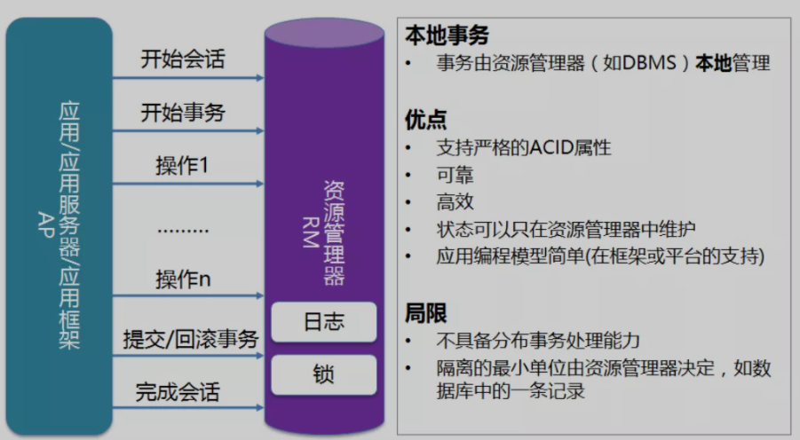

- 在单个数据库的本地并且限制在单个进程内的事务
- 本地事务不涉及多个数据来源

# 分布式事物方案

## 2PC Two Phase Commit(两阶段提交)

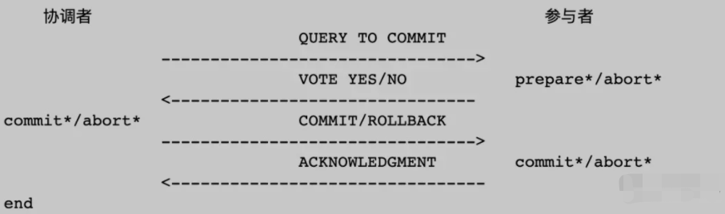

> 二阶段提交（英语：Two-phase Commit）是指在计算机网络以及数据库领域内，为了使基于分布式系统架构下的所有节点在进行事务提交时保持一致性而设计的一种算法。通常，二阶段提交也被称为是一种协议（Protocol）。

2PC是一种协议，它的作用保证在分布式系统中每个节点要不都提交事务，要么都取消事务。这个跟ACID中的A原子性的定义很像。

2PC引入一个第三方的节点协调者，即Coordinator，其他参与事务的节点为参与者，即Participants。协调者统筹整个事务行为，负责通知参与者进行Commit还是Rollback操作。

**2PC是一个强一致性协议**

### 2PC的过程比较简单，分为两个阶段：

这个协议有「两个角色」，

A节点是事务的协调者，B和C是事务的参与者。

#### 准备阶段

协调者分别给每个参与者发送Prepare消息，每个参与者收到消息后，进行“预提交”操作（不是实际的提交操作），把操作的结果（成功或失败）返回给协调者。

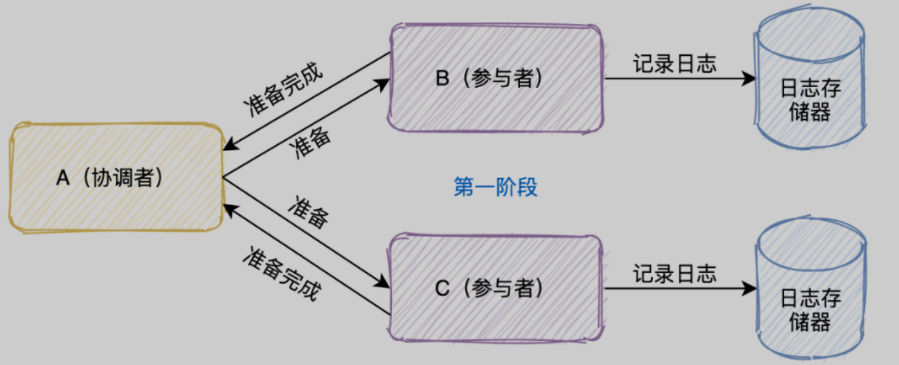

1. 协调者首先将命令「写入日志」

2. 「发一个prepare命令」给B和C节点这两个参与者

3.  B和C收到消息后，根据自己的实际情况，「判断自己的实际情况是否可以提交」

4.  将处理结果「记录到日志」系统

5.  将结果「返回」给协调者

#### 提交阶段

协调者根据准备阶段收到的参与者的返回结果进行判断，如果所有的参与者都返回成功，那么分别给每个参与者发送Commit消息，否则发送Rollback消息。

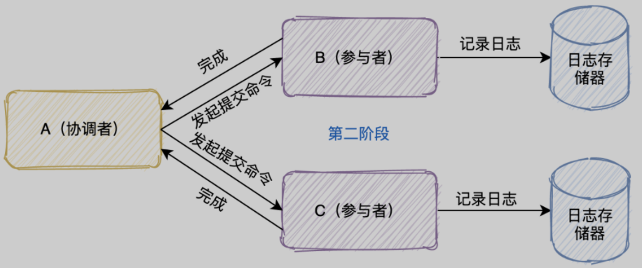

当A节点收到B和C参与者所有的确认消息后

- 「判断」所有协调者「是否都可以提交」

- - 如果可以则「写入日志」并且发起commit命令
  - 有一个不可以则「写入日志」并且发起abort命令

- 参与者收到协调者发起的命令，「执行命令」

- 将执行命令及结果「写入日志」

- 「返回结果」给协调者

**2PC是一个强一致性协议**，同时它在实际应用中还存在几个问题:

- 「单点故障」：一旦事务管理器出现故障，整个系统不可用
- 「数据不一致」：在阶段二，如果事务管理器只发送了部分 commit 消息，此时网络发生异常，那么只有部分参与者接收到 commit 消息，也就是说只有部分参与者提交了事务，使得系统数据不一致。
- 「响应时间较长」：整个消息链路是串行的，要等待响应结果，不适合高并发的场景
- 「不确定性」：当事务管理器发送 commit 之后，并且此时只有一个参与者收到了 commit，那么当该参与者与事务管理器同时宕机之后，重新选举的事务管理器无法确定该条消息是否提交成功。
- 「同步阻塞」: 2PC的两个阶段中，协调者和参与者的通信都是同步的，这会导致整个事务的长时间阻塞

### 3PC  Three Phase Commit三阶段提交

3PC即三阶段提交，它比2PC多了一个阶段，即把原来2PC的准备阶段拆分成CanCommit和PreCommit两个阶段，同时引入超时机制来解决2PC的同步阻塞 和 单点故障的问题。

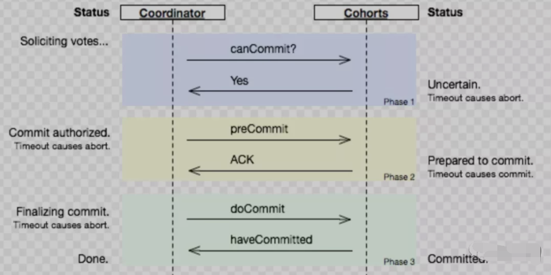

- 第一阶段：「CanCommit阶段」这个阶段所做的事很简单，就是协调者询问事务参与者，你是否有能力完成此次事务。

- - 如果都返回yes，则进入第二阶段
  - 有一个返回no或等待响应超时，则中断事务，并向所有参与者发送abort请求

- 第二阶段：「PreCommit阶段」此时协调者会向所有的参与者发送PreCommit请求，参与者收到后开始执行事务操作，并将Undo和Redo信息记录到事务日志中。参与者执行完事务操作后（此时属于未提交事务的状态），就会向协调者反馈“Ack”表示我已经准备好提交了，并等待协调者的下一步指令。

- 第三阶段：「DoCommit阶段」在阶段二中如果所有的参与者节点都可以进行PreCommit提交，那么协调者就会从“预提交状态”转变为“提交状态”。然后向所有的参与者节点发送"doCommit"请求，参与者节点在收到提交请求后就会各自执行事务提交操作，并向协调者节点反馈“Ack”消息，协调者收到所有参与者的Ack消息后完成事务。相反，如果有一个参与者节点未完成PreCommit的反馈或者反馈超时，那么协调者都会向所有的参与者节点发送abort请求，从而中断事务。

## XA 

XA是一种基于2PC协议实现的规范。在2PC中没有明确资源是什么，以及资源是怎么提交的等等，而XA就是数据库实现2PC的规范，已知常用的支持XA的关系型数据库有Mysql、Oracle等。

## TCC Try-Confirm-Cancel 补偿事务

TCC其实就是采用的补偿机制，其核心思想是：「针对每个操作，都要注册一个与其对应的确认和补偿（撤销）操作」。

相对于XA来说，TCC可以不依赖于资源管理器，即数据库，它是通过业务逻辑来控制确认和补偿操作的，所以它用了’Cancel’而非’Rollback’的字眼。它是一个应用层面的2PC。

TCC分为三个阶段：

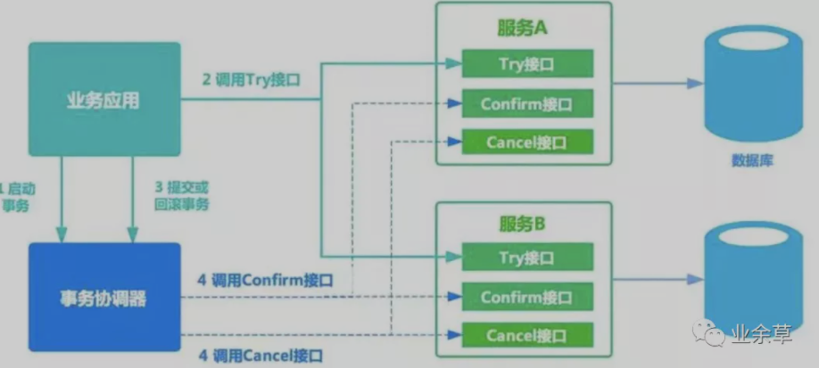

[Try,Confirm,Cancel]

- Try阶段主要是对「业务系统做检测及资源预留」，其主要分为两个阶段
- Confirm 阶段主要是对「业务系统做确认提交」，Try阶段执行成功并开始执行 Confirm阶段时，默认 Confirm阶段是不会出错的。即：只要Try成功，Confirm一定成功。（Confirm阶段，对Try阶段预留的资源进行确认提交，Try阶段执行成功是Confirm阶段执行成功的前提）
- Cancel阶段，对Try阶段预留的资源进行撤销或释放

### 下一个订单减一个库存

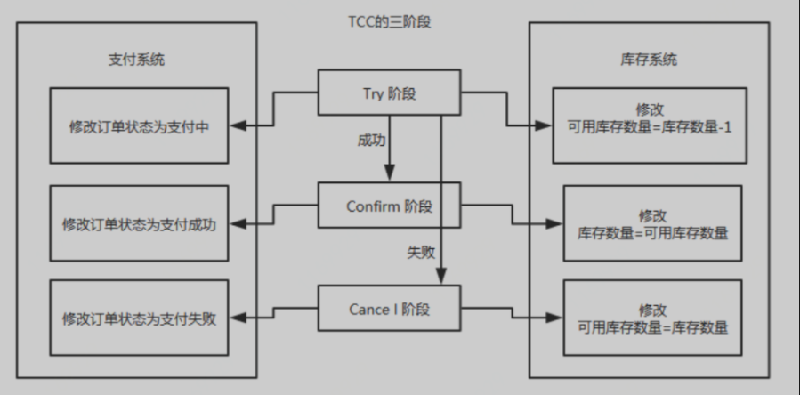

### 执行流程：

- Try阶段：订单系统将当前订单状态设置为支付中，库存系统校验当前剩余库存数量是否大于1，然后将可用库存数量设置为库存剩余数量-1，

- - 如果Try阶段「执行成功」，执行Confirm阶段，将订单状态修改为支付成功，库存剩余数量修改为可用库存数量
  - 如果Try阶段「执行失败」，执行Cancel阶段，将订单状态修改为支付失败，可用库存数量修改为库存剩余数量

### TCC 事务机制相比于上面介绍的2PC，解决了其几个缺点：

- 1.「解决了协调者单点」，由主业务方发起并完成这个业务活动。业务活动管理器也变成多点，引入集群。
- 2.「同步阻塞」：引入超时，超时后进行补偿，并且不会锁定整个资源，将资源转换为业务逻辑形式，粒度变小。
- 3.「数据一致性」，有了补偿机制之后，由业务活动管理器控制一致性

总之，TCC 就是通过代码人为实现了两阶段提交，不同的业务场景所写的代码都不一样，并且很大程度的「增加」了业务代码的「复杂度」，因此，这种模式并不能很好地被复用。

TCC还有以下缺点：

1. 对于Confirm和Cancel阶段失败后要完全靠业务应用自己去处理
2. 每个业务都需要实现Try、Confirm、Cancel三个接口，代码量比较多
3. 如果是基于现有的业务想使用TCC会比较困难。一是对于原来的接口要拆分为三个接口，入侵性比较大；二是因为要做“预留”资源的操作，有可能需要对原来的业务模型进行改造。

## 本地消息表 （最终一致性）

eBay 的架构师 Dan Pritchett，曾在一篇解释 BASE 原理的论文《Base：An Acid Alternative》中提到一个 eBay 分布式系统一致性问题的解决方案。

本地消息表方案是一个基于消息中间件的可靠性来达到事务的最终一致性的方案。

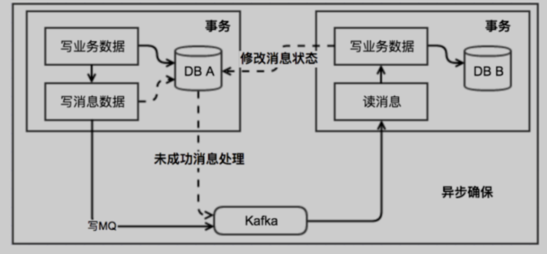

**执行流程：**

- 消息生产方: 需要额外建一个消息表，并「记录消息发送状态」。消息表和业务数据要在一个事务里提交，也就是说他们要在一个数据库里面。然后消息会经过MQ发送到消息的消费方。
  - 如果消息发送失败，会进行重试发送。(事务发起方有一个定时任务轮询消息表，把没处理的消息发送到消息中间件)
- 消息消费方： 需要「处理」这个「消息」，并完成自己的业务逻辑。
  - 如果是「业务上面的失败」，可以给生产方「发送一个业务补偿消息」，通知生产方进行回滚等操作。
  - 此时如果本地事务处理成功，表明已经处理成功了
  - 如果处理失败，那么就会重试执行。
- 生产方和消费方定时扫描本地消息表，把还没处理完成的消息或者失败的消息再发送一遍。

### 分析

- 把业务处理和写消息表放在同一个事务是为了失败/异常后可以同时回滚
- 为什么不直接发消息，而是先写消息表？

> 试想，如果发送消息超时了，即不确定消息中间件收到消息没，那么你是重试还是抛异常回滚事务呢？回滚是不行的，因为可能消息中间件已经收到消息，接收方收到消息后做处理，导致双方数据不一致了；重试也是不行的，因为有可能会一直重试失败，导致事务阻塞。

	- 基于上述分析，消息的接收方是需要做幂等操作的

### 缺点

- 消息数据和业务数据耦合，消息表需要根据具体的业务场景制定，不能公用。就算可以公用消息表，对于分库的业务来说每个库都是需要消息表的。
- 只适用于最终一致的业务场景。例如在 A -> B场景下，在不考虑网络异常、宕机等非业务异常的情况下，A成功的话，B肯定也会成功的。

## 事物消息

事务消息是通过消息中间件来解耦本地消息表和业务数据表，适用于所有对数据最终一致性需求的场景。现在支持事务消息的消息中间件只有RocketMQ，这个概念最早也是RocketMQ提出的。

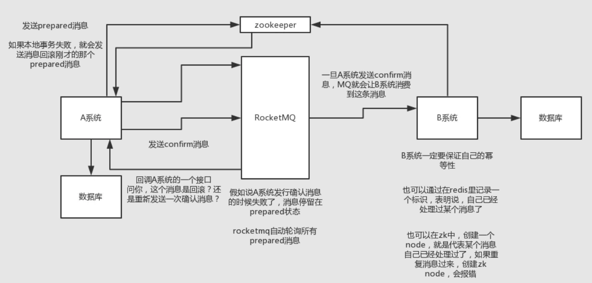

通过事务消息实现分布式事务的流程如下：

1. 发起方A 发送的事务消息会给RocketMQ ，此时消息的状态prepare，接受方B还不能拉取到此消息
2. 发起方A进行本地事务操作，果成功就告诉mq发送确认消息，如果失败就告诉mq回滚消息
3. 发起方A 给RocketMQ确认提交消息，此时接受方 B可以消费到此消息了
4. mq会自动定时轮询所有prepared消息回调 发起方 A 的接口，这个消息是不是本地事务处理失败了，所有没发送确认消息？那是继续重试还是回滚？一般来说这里发起方 A  就可以查下数据库看之前本地事务是否执行，如果回滚了，那么这里也回滚吧。这个就是避免可能本地事务执行成功了，别确认消息发送失败了。
5. 要是系统B的事务失败了，自动不断重试直到成功，如果实在是不行，要么就是针对重要的资金类业务进行回滚，比如B系统本地回滚后，想办法通知系统A也回滚；或者是发送报警由人工来手工回滚和补偿

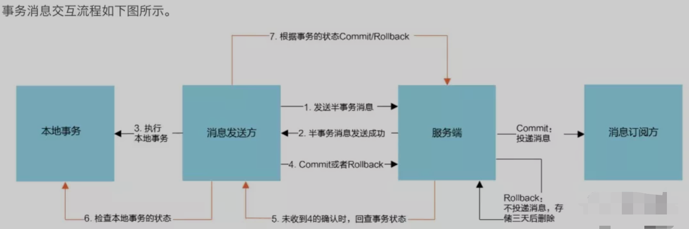

步骤1和3失败/异常该如何处理：

1. RocketMQ会定期扫描还没确认的消息，回调给发送方，询问此次事务的状态，根据发送方的返回结果把这条消息进行取消还是提交确认。
2. 可以看出事务消息的本质的借鉴了二阶段提交的思想，它跟本地消息表的做法也很像，事务消息做的事情其实就是把消息表的存储和扫描消息表这两个事情放到消息中间件来做，使得消息表和业务表解耦。

## Sagas 事物

Saga事务模型又叫做长时间运行的事务（Long-running-transaction）。它是由普林斯顿大学的H.Garcia-Molina等人提出，它描述的是另外一种在没有两阶段提交的情况下解决分布式系统中复杂的业务事务问题。Saga的论文。

该模型其核心思想就是拆分分布式系统中的长事务为多个短事务，或者叫多个本地事务，然后由 Saga工作流引擎负责协调，如果整个流程正常结束，那么就算是业务成功完成，如果在这过程中实现失败，那么Saga工作流引擎就会以相反的顺序调用补偿操作，重新进行业务回滚。

Saga也是一种补偿协议，在 Saga 模式下，分布式事务内有多个参与者，每一个参与者都是一个冲正补偿服务，需要用户根据业务场景实现其正向操作和逆向回滚操作。

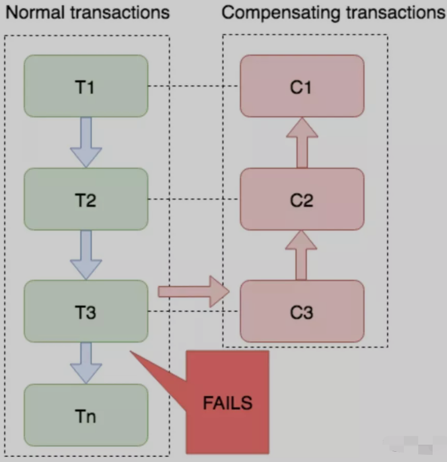

你可以看到Saga跟TCC很像，但是Saga更加宽松，一致性更弱，在Saga看来，在一阶段直接做提交/确认操作就好了，有问题再做补偿。这样的话，Saga可以拥有比XA和TCC更好的性能（XA、TCC需要锁定资源或预留资源），而且Saga强调通过事件驱动异步处理，实现高吞吐。

可以看出Saga是对TCC的一种“妥协”，从TCC的三个接口变为两个接口，一阶段直接提交缺少对资源的隔离（如果一阶段提交后，后面发现需要做补偿，但是补偿操作执行前有另外的事务更改了数据，这时数据已经变“脏”了，那么这时该如何处理是一个问题。在TCC没有这个问题，因为资源已经被hold住了），因此对使用者也是比较宽松的，对于现有业务的改造也会比较简单。

Saga实现分两种，一种是Saga状态机实现，一种是Saga AOP Proxy实现。Saga状态机实现，在关于参与者服务编排实现又有集中式和协同式两种分支。

### TCC vs Saga

TCC和Saga都属于补偿型事务模型，Saga没有Try，直接Commit，所有会产生实际的事务痕迹，而补偿做的是反向操作。TCC是二阶段的广义实现，利用了数据的中间态，Cancel是中间状态的数据进行撤销，从而不存在数据污染问题。

使用场景对比：

- TCC 适用于执行时间确定且较短、对一致性要求比较高、数据隔离强的业务
- Saga 适用于业务流程长、业务流程多的业务，在银行业金融机构使用广泛
- TCC 对现有业务改造较大，Saga则相对少点

## 最大努力通知型

业务发起方将协调服务的消息发送到MQ，下游服务接收此消息，如果处理失败，将进行重试，重试N次后依然失败，将不进行重试，放弃处理，这个应用场景要求对事物性要求不高的地方。

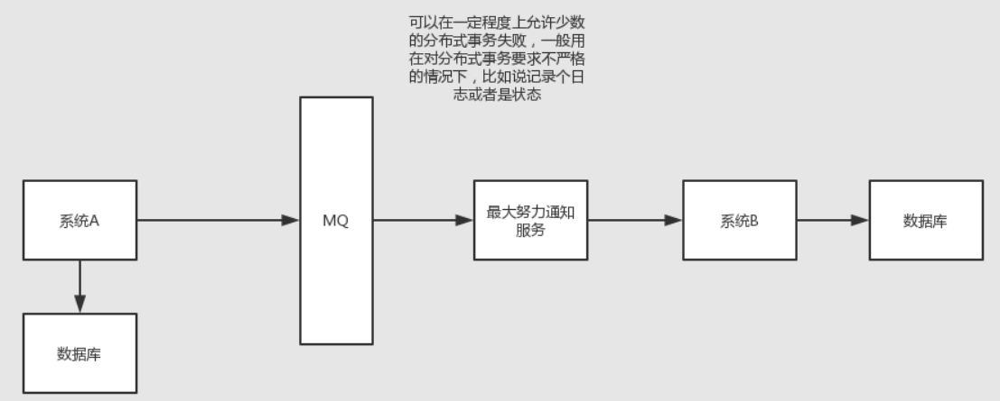

## Seata

Seata是一个由阿里做背书的分布式事务框架，致力于提供高性能和简单易用的分布式事务服务。Seata 将为用户提供了 AT、TCC、SAGA 和 XA 事务模式，为用户打造一站式的分布式解决方案。

### AT模式

AT模式是Seata通过拦截、解释用户的SQL，对业务数据进行加锁、回滚等操作的基于二阶段协议的一个实现。

它的特点是对业务无入侵，用户只需关注自己的“业务 SQL”，用户的 “业务 SQL” 作为一阶段，Seata 框架会自动生成事务的二阶段提交和回滚操作。

在一阶段，Seata 会拦截“业务 SQL”，首先解析 SQL 语义，找到“业务 SQL”要更新的业务数据，在业务数据被更新前，将其保存成“before image”，然后执行“业务 SQL”更新业务数据，在业务数据更新之后，再将其保存成“after image”，最后生成行锁。以上操作全部在一个数据库事务内完成，这样保证了一阶段操作的原子性。

二阶段如果是提交的话，因为“业务 SQL”在一阶段已经提交至数据库， 所以 Seata 框架只需将一阶段保存的快照数据和行锁删掉，完成数据清理即可。

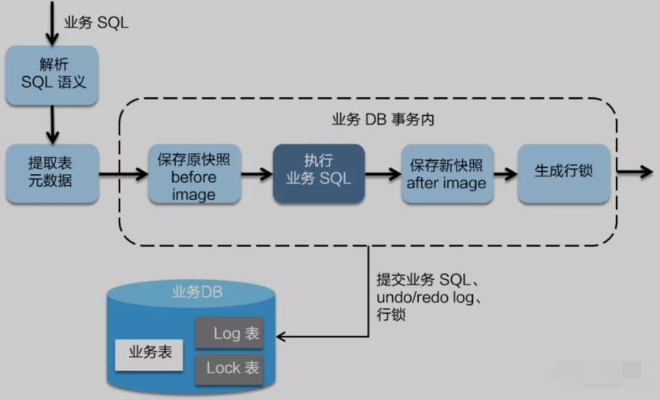

### TCC模式

Seata的TCC模式跟上面讲的TCC事务模型差不多

### Saga模式

Saga模式也是上面讲的Saga事务模型差不多。在Seata中对服务的编排引入了状态机引擎， 使得对业务流程的定义更加标准化，提高可读性，不过相对来说配置会比较复杂繁琐。同时支持注解的方式，这个在开发上会简单一点，但功能可能少一点。

# 总结

通常处理分布式事务的一般原则应是：业务规避 > 最终一致 > 强一致。

# 参考

- https://mp.weixin.qq.com/s/2cmZTDTtFDBogxlUFKtpLQ

- https://mp.weixin.qq.com/s/uCzZSLjddGAYr1QxQNlBQw
- https://mp.weixin.qq.com/s/v7rqlz4erRC9ZvEZk6mwvg