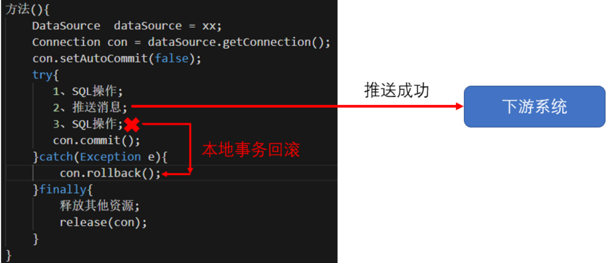
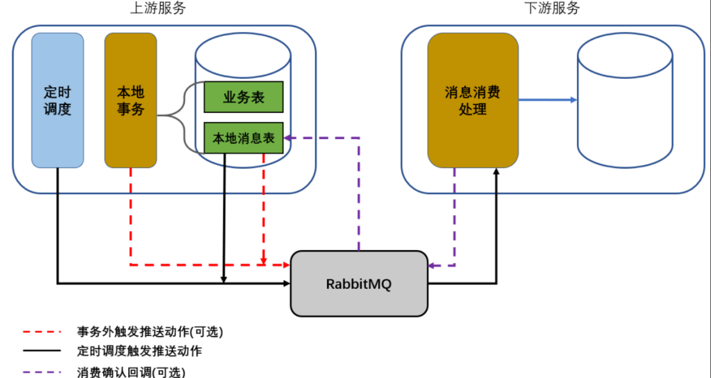
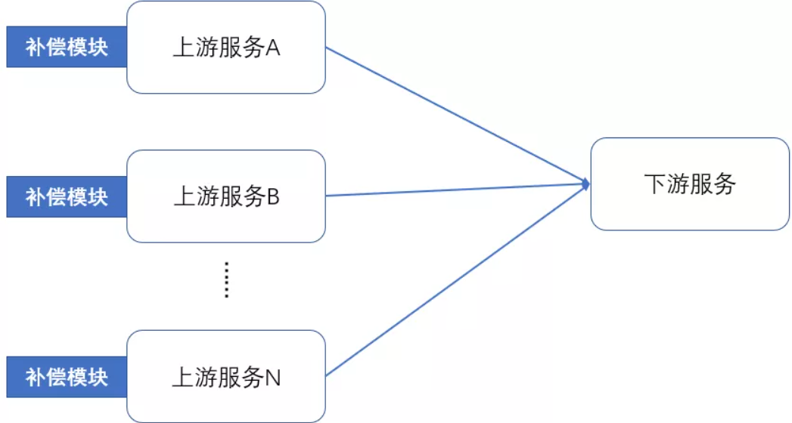
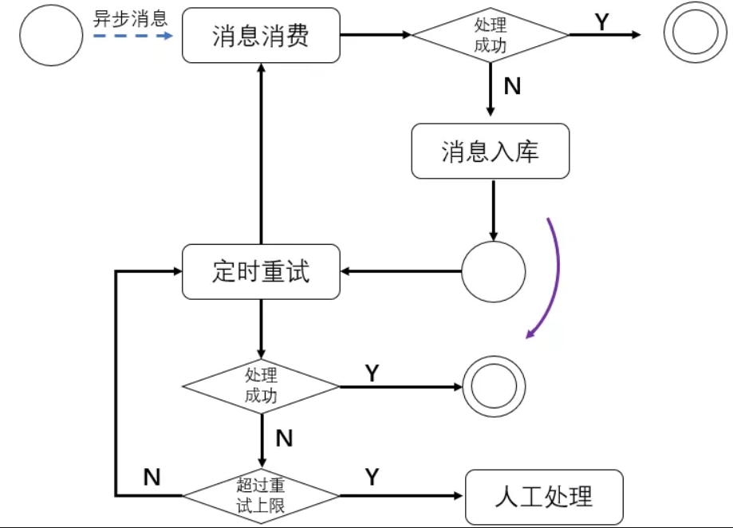
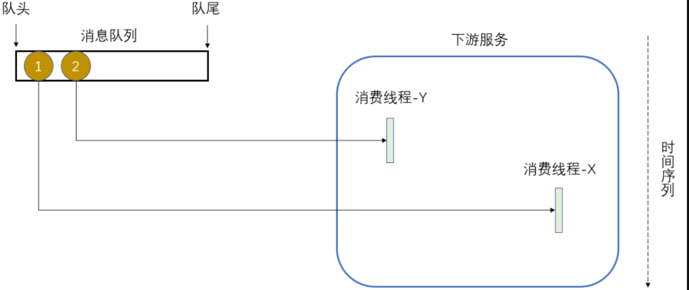
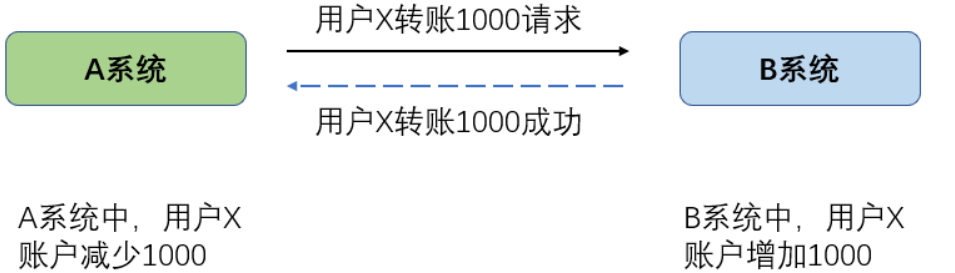
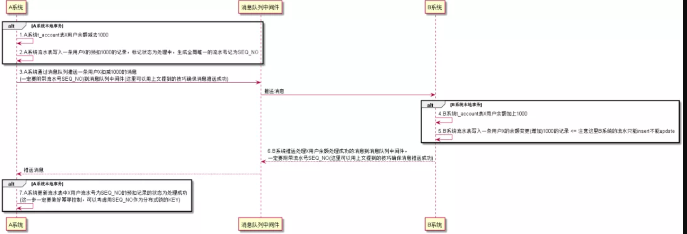

# 分布式事物解决方案


## 分布式事物

首先，做系统拆分的时候几乎都会遇到分布式事务的问题，一个仿真的案例如下：


项目初期，由于用户体量不大，订单模块和钱包模块共库共应用（大war包时代），模块调用可以简化为本地事务操作，这样做只要不是程序本身的BUG，基本可以避免数据不一致。后面因为用户体量越发增大，基于容错、性能、功能共享等考虑，把原来的应用拆分为订单微服务和钱包微服务，两个服务之间通过非本地事务操（这里可以是HTTP或者消息队列等）进行数据同步，这个时候就很有可能由于异常场景出现数据不一致的情况。

## 事务中直接RPC调用达到强一致性 (不可取方案)

以上面的订单微服务请求钱包微服务进行扣款并更新订单状态为扣款这个调用过程为例，假设采用HTTP同步调用，项目如果由 **经验不足的开发者开发这个逻辑**，可能会出现下面的伪代码：

```shell
[订单微服务请求钱包微服务进行扣款并更新订单状态]

处理订单微服务请求钱包微服务进行扣款并更新订单状态方法(){
    [开启事务]
    1、查询订单
    2、HTTP调用钱包微服务扣款
    3、更新订单状态为扣款成功
    [提交事务]
}
```

这是一个从肉眼上看起来没有什么问题的解决方法，HTTP调用直接嵌入到事务代码块内部，猜想最初开发者的想法是：HTTP调用失败抛出异常会导致事务回滚，用户重试即可；HTTP调用成功，事务正常提交，业务正常完成。这种做法看似可取，但是带来了极大的隐患，根本原因是：事务中嵌入了RPC调用。假设两种比较常见的情况：

- 上面方法中第2步由于钱包微服务本身各种原因导致扣款接口响应极慢，会导致上面的处理方法事务（准确来说是数据库连接）长时间挂起，持有的数据库连接无法释放，会导致数据库连接池的连接耗尽，很容易导致订单微服务的其他依赖数据库的接口无法响应。
- 钱包微服务是单节点部署（并不是所有的公司微服务都做得很完善），升级期间应用停机，上面方法中第2步接口调用直接失败，这样会导致短时间内所有的事务都回滚，相当于订单微服务的扣款入口是不可用的。
- 网络是不可靠的，HTTP调用或者接受响应的时候如果出现网络闪断有可能出现了服务间状态不能互相明确的情况，例如订单微服务调用钱包微服务成功，接受响应的时候出现网络问题，会出现扣款成功但是订单状态没有更新的可能（订单微服务事务回滚）。


尽管现在有Hystrix等框架可以基于线程池隔离调用或者基于熔断器快速失败，但是这是收效甚微的。因此，个人认为事务中直接RPC调用达到强一致性是完全不可取的，如果使用了这种方式实现"分布式事务"建议整改，否则只能每天祈求下游服务或者网络不出现任何问题。

## 事务中进行异步消息推送（不可靠方案）

使用消息队列进行服务之间的调用也是常见的方式之一，但是使用消息队列交互本质是异步的，无法感知下游消息消费方是否正常处理消息。用前一节的例子，假设采用消息队列异步调用，项目如果由经验不足的开发者开发这个逻辑，可能会出现下面的伪代码：

```shell
[订单微服务请求钱包微服务进行扣款并更新订单状态]

处理订单微服务请求钱包微服务进行扣款并更新订单状态方法(){
    [开启事务]
    1、查询订单
    2、推送钱包微服务扣款消息(推送消息)
    3、更新订单状态为扣款成功
    [提交事务]
}
```

上面的处理方法如果抽象一点表示如下：

```shell
方法(){
    DataSource  dataSource = xx;
    Connection con = dataSource.getConnection();
    con.setAutoCommit(false);
    try{
       1、SQL操作;
       2、推送消息;
       3、SQL操作;
       con.commit();
    }catch(Exception e){
        con.rollback();
    }finally{
        释放其他资源;
        release(con);
    }
}
```

这样做，在正常情况下，也就是能够正常调用消息队列中间件推送消息成功的情况下，事务是能够正确提交的。但是存在两个明显的问题：

1. 消息队列中间件出现了异常，无法正常调用，常见的情况是网络原因或者消息队列中间件不可用，会导致异常从而使得事务回滚。这种情况看起来似乎合情合理，但是仔细想：为什么消息队列中间件调用异常会导致业务事务回滚，如果中间件不恢复，这个接口调用岂不是相当于不可用？
2. 如果消息队列中间件正常，消息正常推送，但是第3步由于SQL存在语法错误导致事务回滚，这样就会出现了下游微服务被调用成功，本地事务却回滚的问题，导致了上下游系统数据不一致。



总的来说：事务中进行异步消息推送是一种并不可靠的实现。


## 目前业界提供的解决方案

业界目前主流的分布式事务解决方案主要有：多阶段提交方案（2PC、3PC）、补偿事务（TCC）和消息事务（主要是RocketMQ，基本思想也是多阶段提交方案，其他消息队列中间件并没有实现分布式事务），本地事物表等

详见： [分布式事物](./10_分布式事物.md)

# 项目实践中最终使用的方案

主要使用RabbitMQ，所以需要针对RabbitMQ做消息事务的适配。目前业务系统中消息异步交互存在三种场景：

1. 消息推送实时性高，可以接受丢失。
2. 消息推送实时性低，不能丢失。
3. 消息推送实时性高，不能丢失。

## 本地消息表

最终使用了**本地消息表**的解决方案，这个方案十分简单：



主要思路是：

1. 需要发送到消费方的消息的保存和业务处理绑定在同一个本地事务中，需要额外建立一张本地消息表。
2. 本地事务提交之后，可以在事务外对本地消息表进行查询并且进行消息推送，或者采用定时调度轮询本地消息表进行消息推送。
3. 下游服务消费消息成功可以回调一个确认到上游服务，这样就可以从上游服务的本地消息表删除对应的消息记录。

伪代码如下：

```shell
[消息推送实时性高，可以接受丢失-这种情况下可以不需要写入本地消息表 - start]
处理方法(){
    [本地事务开始]
    1、处理业务操作
    [本地事务提交]
    2、组装推送消息并且进行推送
}
[消息推送实时性高，可以接受丢失-这种情况下可以不需要写入本地消息表 - end]

[消息推送实时性低，不能丢失 - start]
处理方法(){
    [本地事务开始]
    1、处理业务操作
    2、组装推送消息并且写入到本地消息表
    [本地事务提交]
}

消息推送调度模块(){
    3、查询本地消息表待推送数据进行推送
}
[消息推送实时性低，不能丢失 - end]

[消息推送实时性高，不能丢失 - start]
处理方法(){
    [本地事务开始]
    1、处理业务操作
    2、组装推送消息并且写入到本地消息表
    [本地事务提交]
    3、消息推送
}

消息推送调度模块(){
    4、查询本地消息表待推送数据进行推送
}
[消息推送实时性高，不能丢失 - end]
```

对于"消息推送实时性高，可以接受丢失"这种情况，实际上不用依赖本地消息表，只要在业务操作事务提交之后组装和推送消息即可，这种情况会存在因为消息队列中间件不可用或者本地应用宕机导致消息丢失的问题（本质是因为数据是内存态，非持久化），可靠性不高，但是绝大多数情况下是没有问题的。如果使用spring-tx的声明式事务@Transactional或者编程式事务TransactionTemplate，可以使用事务同步器实现嵌入于业务操作事务代码块中的RPC操作延后到事务提交后执行，这样子RPC调用的代码物理位置就可以放置在事务代码块内，例如：

```java
@Transactional(rollbackFor = RuntimeException.class)
public void process(){
 1.处理业务逻辑
 TransactionSynchronizationManager.getSynchronizations().add(new TransactionSynchronizationAdapter() {
  @Override
  public void afterCommit() {
   2.进行消息推送
  }
 });
}
```

对于使用到本地消息表的场景，需要警惕下面几个问题：

1. 注意本地消息表尽量不要长时间积压数据，推送成功的数据需要及时删除。
2. 本地消息表的数据在查询并且推送的时候，需要设计最大重试次数上限，达到上限仍然推送失败的记录需要进行预警和人为干预。
3. 如果入库的消息体比较大，查询可能消耗的IO比较大，需要考虑拆分单独的一张消息内容表用于存放消息体内容，而经常更变的列应该单独拆分到另外一张表。

例如本地消息表的设计如下：

```sql
CREATE TABLE `t_local_message`(
  id BIGINT PRIMARY KEY COMMENT '主键',
  module INT NOT NULL COMMENT '消息模块',
  tag VARCHAR(20) NOT NULL COMMENT '消息标签',
  business_key VARCHAR(60) NOT NULL COMMENT '业务键',
  queue VARCHAR(60) NOT NULL COMMENT '队列',
  exchange VARCHAR(60) NOT NULL COMMENT '交换器',
  exchange_type VARCHAR(10) NOT NULL COMMENT '交换器类型',
  routing_key VARCHAR(60) NOT NULL COMMENT '路由键',
  retry_times TINYINT NOT NULL DEFAULT 0 COMMENT '重试次数',
  create_time DATETIME NOT NULL DEFAULT CURRENT_TIMESTAMP COMMENT '创建日期时间',
  edit_time DATETIME NOT NULL DEFAULT CURRENT_TIMESTAMP COMMENT '修改日期时间',
  seq_no VARCHAR(60) NOT NULL COMMENT '流水号',
  message_status TINYINT NOT NULL DEFAULT 0 COMMENT '消息状态',
  INDEX idx_business_key(business_key),
  INDEX idx_create_time(create_time),
  UNIQUE uniq_seq_no(seq_no)
)COMMENT '本地消息表';


CREATE TABLE `t_local_message_content`(
  id BIGINT PRIMARY KEY COMMENT '主键',
  message_id BIGINT NOT NULL COMMENT '本地消息表主键',
  message_content TEXT COMMENT '消息内容',
  UNIQUE uniq_message_id(message_id)
)COMMENT '本地消息内容表';
```

### 分布式事务小结

解决分布式事务的最佳实践就是：

- 规避使用强一致性的分布式事务实现，基本观念就是放弃ACID投奔BASE。
- 推荐使用消息队列进行系统间的解耦，消息推送方为了确保消息推送成功可以独立附加消息表把需要推送的消息和业务操作绑定在同一个事务内，使用异步或者调度的方式进行推送。
- 消息推送方（上游）需要确保消息正确投递到消息队列中间件，消息消费或者补偿方案由消息消费方（下游）自行解决，关于这一点后文一个章节专门解释。

其实，对于一致性和实时性要求相对较高的分布式事务的实现，使用消息队列解耦也有对应的解决方案。

## 幂等控制

幂等（idempotence）这个术语原文来自于HTTP/1.1协议中的定义：

> Methods can also have the property of “idempotence” in that (aside from error or expiration issues) the side-effects of N > 0 identical requests is the same as for a single request.

简单来说就是：除了错误或者过期的请求（换言之就是成功的请求），无论多次调用还是单次调用最终得到的效果是一致的。通俗来说，有一次调用成功，采用相同的请求参数无论调用多少次（重复提交）都应该返回成功。

下游服务对外提供服务接口，必须承诺实现接口的幂等性，这一点在分布式系统中极其重要。

- 对于HTTP调用，承诺幂等性可以避免表单或者请求操作重复提交造成业务数据重复。
- 对于异步消息调用，承诺幂等性通过对消息去重处理也是用于避免重复消费造成业务数据重复。

目前实践中对于幂等的处理使用了下面三个方面的控制：

1. 实现幂等的接口调用时入口使用分布式锁，使用了主流的Redisson，控制锁的粒度和锁的等待、持有时间在合理范围（所在行业要求数据必须准确无误，所以几乎用悲观锁设计所有核心接口，宁愿慢也不能错，实际上如果冲突比较低的时候为了性能优化可以考虑使用乐观锁）。
2. 业务逻辑上的防重，例如创建订单的接口先做一步通过订单号查询库表中是否已经存在对应的订单，如果存在则不做处理直接返回成功。
3. 数据库表设计对逻辑上唯一的业务键做唯一索引，这个是通过数据库层面做最后的保障。

举一个基于消息消费幂等控制的伪代码例子：

```shell
[处理消息消费]
listen(request){
    1、通过业务键构建分布式锁的KEY
    2、通过Redisson构建分布式锁并且加锁
    3、加锁代码中执行业务逻辑(包括去重判断、事务操作和非事务操作等)
    4、finally代码块中释放分布式锁
}
```

## 补偿方案

补偿方案主要是HTTP同步调用的补偿和异步消息消费失败的补偿。

### HTTP同步调用补偿

一般情况下，HTTP同步调用会得到下游系统的同步结果，对结果的处理存在下面几种常见的情况：

1. 同步结果返回正常，得到了和下游约定的最终状态，交互结束，一般认为成功就是最终状态，不需要补偿。
2. 同步结果返回正常，得到了和下游约定的非最终状态，需要定时补偿到最终状态或到达重试上限自行标记为最终状态。
3. 同步结果返回异常，最常见的是下游服务不可用返回HTTP状态码为5XX。

首先要有一个简单的认知：短时间内的HTTP重试通常情况下都是无效的。如果是瞬时的网络抖动，短时间内HTTP同步重试是可行的，大部分情况下是下游服务无法响应、下游服务重启中或者复杂的网络情况导致短时间内无法恢复，这个时候做HTTP同步重试调用往往是无效的。

如果面对的场景是内部低并发量的系统之间的进行HTTP交互，可以考虑使用基于指数退避的算法进行重试，举个例子：

```shell
1、第一次调用失败，马上进行第二次重试
2、第二次重试失败，线程休眠2秒
3、第三次重试失败，线程休眠4秒(2^2)
4、第四次重试失败，线程休眠8秒(2^3)
5、第五次重试失败，抛出异常
```

如果上面的例子中使用了Hystrix控制超时为1秒包裹着要执行的HTTP命令进行调用，上面的重试过程最大耗时小于20秒，在低并发的内部系统之间的交互是可以接受的。

但是，如果面对的是并发比较高、用户体验优先级比较高的场景，这样做显然是不合理的。为了稳妥起见，可以采取相对传统而有效的方案：HTTP调用的调用信息快照内容保存到一张本地重试表中，这个保存操作绑定在业务处理的事务中，通过定时调度对未调用成功的记录进行重试。这个方案和上文提到保证消息推送成功的方案类似，举一个仿真的例子：

```shell
[下单接口请求下游钱包服务扣钱的过程]
process(){
    [事务代码块-start]
    1、处理业务逻辑，保存订单信息，订单状态为扣钱处理中
    2、组装将要向下游钱包服务发起的HTTP调用信息，保存在本地表中
    [事务代码块-end]
    3、事务外进行HTTP调用(OkHttp客户端或者Apache的Http客户端)，调用成功更新订单状态为扣钱成功
}

定时调度(){
    4、定时查询订单状态为扣钱处理中的订单进行HTTP调用，调用成功更新订单状态为扣钱成功
}
```

### 异步消息消费失败补偿

异步消息消费失败的场景发生只能在消息消费方，也就是下游服务。从降低成本的目的上看，消息消费失败的补偿应该由消息处理的一方（消费者）自行承担，画一个系统交互图理解一下：



如果由上游服务进行补偿，存在两个明显的问题：

1. 消息补偿模块需要在所有的上游服务中编写，这是不合理的。
2. 一旦下游消费出现生产问题需要上游补偿，需要先定位出对应的消息是哪个上游服务推送，然后通过该上游服务进行补偿，处理生产问题的复杂度提高。

在最近的一些项目实践中，确定在使用异步消息交互的时候，补偿统一由消息消费方实现。最简单的方式也是使用类似本地消息表的方式，把消费失败的消息入库，并且进行重试，到达重试上限依然失败则进行预警和人工介入即可。简单的流程图如下：



## 异步消息乱序解决

异步消息乱序是使用消息队列进行异步交互场景中需要考虑和解决的问题。下面举一些可能不合乎实际但是能够说明问题的例子。

场景一：上游某个服务向用户服务通过消息队列异步修改用户的性别信息，假设消息简化如下：

```json
队列：user-service.modify.sex.qeue
消息:
{
   "userId": 长整型,
   "sex": 字符串,可选值是MAN、WOMAN和UNKNOW
}
```

用户服务一共使用了10个消费者线程监听user-service.modify.sex.qeue队列。假设上游服务先后向user-service.modify.sex.qeue队列推送下面两条消息：

```json
第一条消息：
{
   "userId": 1,
   "sex": "MAN"
}  

第二条消息：
{
   "userId": 1,
   "sex": "WOMAN"
}
```

上面的消息推送和下游处理有比较高几率出现下面的情况：



原本用户ID为1的用户先把性别改为MAN（第一次请求），后来改为WOMAN（第二次请求），最终看到更新后的性别有可能是MAN，这显然是不合理的。

这个不是很合理的例子想说明的问题是：通过异步消息交互，下游服务处理消息的时序有可能和上游发送消息的时序并不一致，这样有可能导致业务状态错乱。对于解决这个问题，提供几个可行的思路：

- 方案一：并发要求不高的情况下，可以充分利用消息队列FIFO的特性（这一点RabbitMQ实现了，其他消息队列中间件不确定），把下游服务的消费线程设置为1即可，那么上游推送的消息和下游消费消息的时序是一致的（这个方案有缺陷，因为分布式多节点部署，下游服务节点会超过两个，因此消费者线程一定会大于1）。
- 方案二：使用HTTP调用，这个要前端或者APP客户端配合，请求设计成串行的即可。
- 方案三：这是一个实验性方案，个人只在Demo中尝试过，采用取模或者Hash对队列进行分片，上面的例子基于用户ID % 10取模建立queue_0到queue_9一共10个队列，下游启动10个消费者线程，queue_0到queue_9每个队列只启动一个消费线程（例如下游服务有双节点，节点1消费queue_0到queue_4，节点2消费queue_5到queue_9），这样子能够保证单个用户ID的性别更新操作是串行的。

场景二：没有时序要求的异步消息处理，但是要求最终展示的时候是有时序的。这样说可能有点抽象，举个例子：在借呗上借了10000元，还款的时候，用户是分多次还清（例如还款方案一：2000，3000，5000；还款方案二：1000，1000，1000，7000等等），每次还的钱都不一样，最终要求账单展示的时候是按照用户的还款操作顺序。

假设借呗的上游服务和它通过异步消息交互。详细分析一下：这个场景其实对于借呗（主要是考虑收回用户的还款这个目的）来说，对用户还款的顺序并不需要感知，只需要考虑用户是否还清，但是使用异步交互，有可能导致下游无法正确得知用户还款的操作顺序。

解决方案很简单：推送消息的时候附加一个带有增长或者减少趋势的标记位即可，例如使用带有时间戳的标记位或者使用Snowflake算法生成自增趋势的长整型数作为流水号，之后按照流水号排序即可得到消息操作的顺序（这个流水号下游需要保）)，但是实际消息处理的时候并不需要感知消息的时序。

## 异步消息结合状态驱动

个人认为：异步消息结合状态驱动是可以相对完善地解决分布式事务，结合预处理(例如预扣除或者预增长)可以满足比较高一致性和实时性。先引出一个经常用来讨论分布式事务强一致性的转账场景。



解决这个问题如果使用同步调用（其实像TCC、2PC或者3PC等本质都是同步调用），在允许性能损失的情况下是能够达到比较高的一致性。这一节并不讨论同步调用的情况下怎么做，重点研究一下在使用消息队列的情况下，如何从BASE的角度"达到比较高的一致性"。先把这个例子抽象化，假设两个系统的账户表都设计成这样：

```sql
CREATE TABLE `t_account`(
    id BIGINT PRIMARY KEY COMMENT '主键',
    user_id BIGINT NOT NULL COMMENT '用户ID',
    balance DECIMAL(10,2) NOT NULL DEFAULT 0 COMMENT '账户余额',
    create_time DATETIME NOT NULL DEFAULT CURRENT_TIMESTAMP COMMENT '创建时间',
    edit_time DATETIME NOT NULL DEFAULT CURRENT_TIMESTAMP COMMENT '修改时间',
    version BIGINT NOT NULL DEFAULT 0 COMMENT '版本'
    // 省略索引
)COMMENT '账户表';
```

两个系统都可以建立一张表结构相似的金额变更流水表，上游系统用于做预扣操作和流水记录，下游系统用于做流水记录，接着我们可以梳理出新的交互时序逻辑如下：

```shell
[A系统本地事务-start]
1、A系统t_account表X用户余额减去1000
2、A系统流水表写入一条用户X的预扣1000的记录，标记状态为处理中，生成全局唯一的流水号记为SEQ_NO
[A系统本地事务-end]
3、A系统通过消息队列推送一条用户X扣减1000的消息(一定要附带流水号SEQ_NO)到消息队列中间件(这里可以用上文提到的技巧确保消息推送成功)
[B系统本地事务-start]
4、B系统t_account表X用户余额加上1000
5、B系统流水表写入一条用户X的余额变更(增加)1000的记录 <= 注意这里B系统的流水只能insert不能update
[B系统本地事务-end]
6、B系统推送处理X用户余额处理成功的消息到消息队列中间件，一定要附带流水号SEQ_NO(这里可以用上文提到的技巧确保消息推送成功)
[A系统本地事务-start]
7、A系统更新流水表中X用户流水号为SEQ_NO的预扣记录的状态为处理成功(这一步一定要做好幂等控制，可以考虑用SEQ_NO作为分布式锁的KEY)
[A系统本地事务-end]

其他：
[A系统流水表处理中的记录需要定时轮询和重试]
1、定时调度重试A系统流水表中状态为处理中的记录

[A-B系统日切对账模块]
1、日切，用A系统中处理成功的T-1日流水记录和B系统中的流水表所有T-1日的记录进行对账
```



上面的步骤看起来比较多，而且还需要编写对账和重试模块。其实，在上下游系统、消息队列中间件都正常运作的情况下，上面的这套交互方案可承受的并发量远比同步方案高，出现了服务或者消息队列中间件不可用的情况下，由于流水表有未处理的本地记录，在这些问题恢复之后可以重试，可靠性也是比较高的。另外，重试和对账的模块，对于所有涉及金额交易的处理都是必须的，这一点其实选用同步或者异步交互方式并没有关系（时序图只展示了一般和正常交互情况下的调用时序，异常情况例如超额转账、调用链中某个环节失败等细节等暂不分析）。

# 总结

通篇文章有很多方案都是使用了待处理内容写入本地表 + 事务外实时触发 + 定时调度补偿这个模式，其实我想表达的就是这个模式是目前分布式解决方案中一个相对通用的模式，可以基本满足分布式事务、同步异步补偿、实时非实时触发等多种复杂场景的处理。这个模式也存在一些明显的问题（如果实践过的话一般会遇到）：

- 库表（本地消息表）设计不合理或者处理不合理容易成为数据库的瓶颈。
- 补偿或者本地表入库处理的逻辑代码容易冗余和腐化。
- 极端情况下，异常恢复的场景存在拖垮服务的隐患。

其实，更多的时候需要结合现有的系统或者场景进行分析。毕竟，架构是迭代出来，而不是设计出来的。


# 参考

- https://mp.weixin.qq.com/s/v7rqlz4erRC9ZvEZk6mwvg