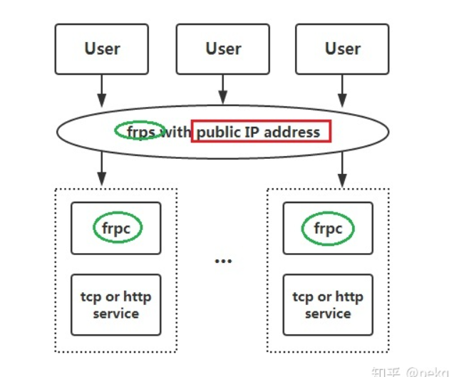

## frp 内网穿透远程桌面（Windows 10）配置


## frp 是什么

frp 是一个可用于内网穿透的高性能的反向代理应用，支持 tcp, udp 协议，为 http 和 https 应用协议提供了额外的能力，且尝试性支持了点对点穿透。关于frp的详细介绍详见[github](https://link.zhihu.com/?target=https%3A//github.com/fatedier/frp/blob/master/README_zh.md)。

## 为什么要内网穿透

当我们在公司内网可以访问 远程桌面，但是家后，在不同的网络（外网）后。却无法访问 公司内部的电脑。


## 部署步骤

从frp的架构可以看出frp的工作流程，在服务端部署frps，在要访问的机器上部署frpc，实现服务端对该机器的反向代理。通过访问服务端来实现对该机器的远程访问。



### 准备安装包

github：https://github.com/fatedier/frp

安装包下载地址：https://github.com/fatedier/frp/releases

### 服务端配置

公网机器：服务端需要公网环境，一般用一台云服务器就行了，我选择的是 Linux 服务器，Windows 服务器也是可以的。

1. 下载服务端安装包：wget https://github.com/fatedier/frp/releases/download/v0.32.1/frp_0.32.1_linux_amd64.tar.gz
2. 解压：tar -xzf frp_0.32.1_linux_amd64.tar.gz
3. 配置：

```
cd frp_0.32.1_linux_amd64
vim frps.ini
```

修改以下内容：

```
[common]
bind_port = <服务端端口>
bind_addr = 0.0.0.0

authentication_method = token
token = <认证Token>

dashboard_port = 37500
dashboard_user = admin
dashboard_pwd = <Dashboard密码>
```

然后保存，使用命令启动：

```
./frps -c ./frps.ini
后台启动：nohup ./frps -c ./frps.ini &
```

​	这里是需要配置守护进程的，推荐 pm2，简单方便，[pm2 教程传送](https://www.cnblogs.com/stulzq/p/9775973.html)

这样服务端就部署成功了，可以访问 dashboard查看监控信息。


## 客户端配置

客户端指需要被远程控制的电脑（Windows）

下载客户端：https://github.com/fatedier/frp

解压，然后编辑 `frpc.ini`，写入以下配置：

```
[common]
server_addr = <服务端公网ip>
server_port = <服务端端口>
authentication_method = token
token = <认证Token>

[RDP]
type = tcp
local_ip = 127.0.0.1
local_port = 3389
remote_port = 13389
```

## 开机自启动

服务端我没做的开机自启动，是因为的我机器就没有关过，我的任务栏一直保留由很多窗口。但是客户端有做开机自启动的必要了，因为实验室的计算集群是公用的，谁进去手残把这个cmd窗口给关了，我在家哭给他看也没用啊，关键是，虽然我们的集群是24x7x365工作的，但是学校偶尔会停电啊，关机重启是常有的事，每次都运行这些命令不符合window图形界面的用户操作习惯，为了一劳永逸的解决这个问题，我找到了一个开源的开机自启动方案。

duang,duang,duang，就是WINSW。WINSW是什么我就不BB了，自己看github的[readme](https://link.zhihu.com/?target=https%3A//github.com/kohsuke/winsw)吧。我要用他实现window下开机自启动。（ps：linux下开机自启动挺简单的，树莓派上用过很多,用过这个你会发现也挺简单的，强烈推荐）

**使用方法**

- 下载到客户端电脑。[下载地址](https://link.zhihu.com/?target=https%3A//github.com/kohsuke/winsw/releases)
- 放到和frp相同的文件夹下面，改个短小的名字 winsw.exe. 因为我懒得在命令行里面敲东西
- 新建一个winsw.xml。内容如下 详细的[配置参见](https://link.zhihu.com/?target=https%3A//github.com/kohsuke/winsw/blob/master/doc/xmlConfigFile.md)

```abap
<service>
    <id>frp</id>
    <name>frp</name>
    <description>frp remote control</description>
    <executable>frpc</executable>
    <arguments>-c frpc.ini</arguments>
    <logmode>reset</logmode>
</service>
```

- 然后以管理员的身份cmd到该文件夹下，执行如下命令

> winsw install
> winsw start

开机自启动就大功告成了。我用自己的老电脑亲测可用。

## 参考

- [frp 内网穿透远程桌面（Windows 10）配置](https://www.cnblogs.com/stulzq/p/13754597.html)
- https://zhuanlan.zhihu.com/p/55306067