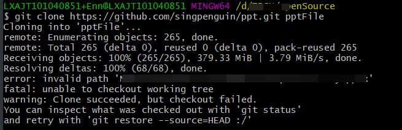
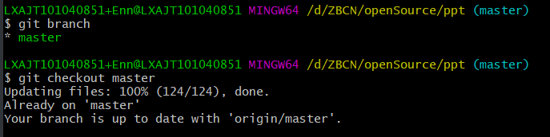

# git 操作异常问题汇总


### git clone 代码时，提示 `invalid path 'xxxxxxx'`

在Windows10上使用git clone代码的时候抛出了异常，重试了几次都是相同的错误：



下载的目录里除了.git没有任何东西。

**问题原因**：

源代码是在linux上编写的，但是在Windows10上拉取代码却出现了问题。根据提示可以看出代码clone是成功的，但是checkout的时候出现了错误。那么问题很可能是不通系统下文件属性或策略导致的。

然后在Git文档上找到一个关于NTFS保护机制的配置，core.protectNTFS：

If set to true, do not allow checkout of paths that would cause problems with the NTFS filesystem, e.g. conflict with 8.3 “short” names. Defaults to true on Windows, and false elsewhere.

**解决方式**：

Windows系统下默认值是true，也就是说不符合NTFS策略的文件不会被签出，设置为false后可以关闭保护机制。

```shell
LXAJT101040851+Enn@LXAJT101040851 MINGW64 /d/ZBCN/openSource/ppt (master)
$ git config core.protectNTFS false
```

切换出文件：



