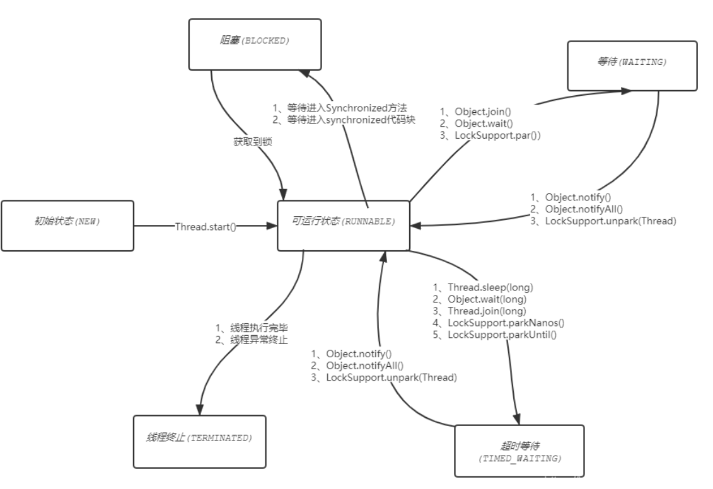
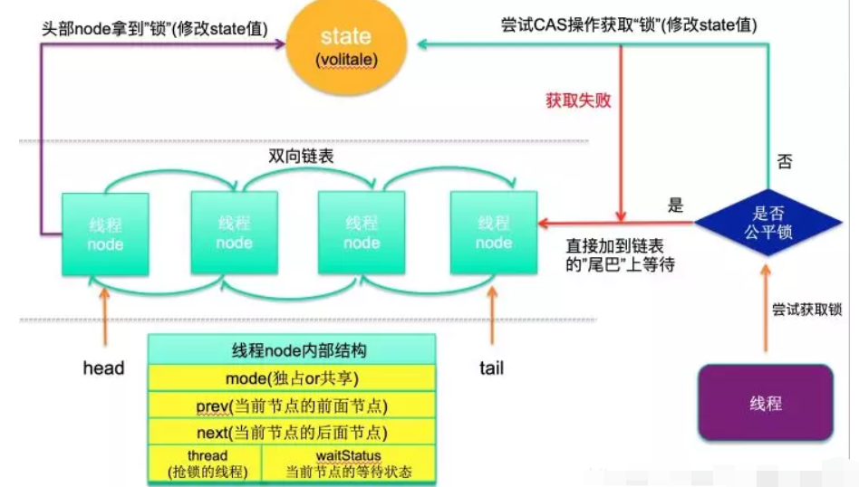

# 多线程基础

## 线程与进程的区别

1. 进程：一个执行中的程序，每个进程执行都有一个顺序（执行单元）。它是一个实体，由程序段、数据段和PCB（进程标识信息、处理器状态信息、进程控制信息）组成
2. 线程：是进程中的一个独立的控制单元，是操作系统能够进行运算调度的最小单位，一个进程中至少有一个线程。
3. 资源分配给进程，同一进程的所有线程共享该进程的所有资源，进程有独立地址空间，而线程会共享地址空间。
4. 不同的进程使用不同的内存空间，而所有的线程共享一片相同的内存空间。每个线程都拥有单独的栈内存用来存储本地数据。系统创建进程时需要为该进程重新分配系统资源。
5. **线程独有的资源**：线程ID、线程堆栈、线程优先级、寄存器组的值。**线程共享的资源**：进程代码段、全局变量、地址空间、信号的处理器、进程用户ID与进程组ID、进程打开的文件描述符。
6. 多进程是指在操作系统中能同时运行多个任务(程序)，多线程是指在同一应用程序中有多个功能流同时执行
7. 解决多线程的挑战：无锁并发编程、CAS、使用最少线程、协程（单线程多任务调度）
8. 线程间的通信方式：共享变量（wait、notify）、队列

## 线程的基本状态及关系

- 新建状态：new 一个线程对象
- 就绪状态：调用线程对象的start()方法
- 运行状态：CPU调度处于就绪状态的线程，调度策略（抢占式、时间片轮转）
- 阻塞状态：一个线程想要获取锁，而该锁被其他线程持有，分为等待阻塞（wait方法），同步阻塞（synchronized），其他阻塞（sleep或join方法）
- 停止状态：：线程执行完了或者因异常退出了run()方法，该线程结束生命周期。

## 创建线程的方法

- 继承Thread类、实现Runnable接口或Callable接口
- 实现Runnable接口无返回值，实现Callable接口有返回值，使用FutureTask类接受返回值
- suspend()方法容易发生死锁，stop方法不安全，这两个方法已经过时了。
- Sleep释放资源，不释放锁，wait释放资源，也释放锁。wait方法必须在同步代码块中调用，在while循环中

##  生产者消费者问题的五种实现

生产者消费者模型：两个线程间共享数据

-  wait() / notify()方法
- await() / signal()方法
- BlockingQueue阻塞队列：put、get方法
- Semaphore方法实现同步：acquire、release方法
- PipedInputStream / PipedOutputStream：只能用于多线程模式，用于单线程下可能会引发死锁。

# 锁

## synchronized原理

- Synchronize是Java语言的关键字，当它用来修饰一个方法或者一个代码块的时候，能够保证在同一时刻最多只有一个线程执行该段代码。synchronized关键字是不能继承的。
- 修饰的对象：①修饰代码块作用的对象是调用这个代码块的对象；②修饰方法锁是当前实例对象。③修饰静态方法 锁是当前类的Class类对象。④修饰类作用的对象是这个类的所有对象。
- 可重入锁：自己可以再次获取自己内部的锁。synchronized 锁的对象头的 markword 中会记录该锁的线程持有者和计数器，当一个线程请求成功后， JVM 会记下持有锁的线程，并将计数器计为1。此时其他线程请求该锁，则必须等待。而该持有锁的线程如果再次请求这个锁，就可以再次拿到这个锁，同时计数器会递增。当线程退出一个 synchronized 方法/块时，计数器会递减，如果计数器为 0 则释放该锁。
- synchronized加锁过程：每个对象都有一个锁，即监视器（monitor）。当monitor被占有时就表示它被锁定。线程执行monitorenter指令时尝试获取对象所对应的monitor的所有权，该线程若进入monitor会将数设置为1，重入时+1，若其他线程已经占用了monitor，则该线程进入阻塞状态，直到monitor的进入数为0，再重新尝试获取monitor的所有权。执行monitorexit的线程必须是相应的monitor的所有者。
- JDK1.6及其之前的版本中monitorenter和monitorexit字节码依赖于底层的操作系统的Mutex Lock来实现的，但是互斥锁需要将当前线程挂起并从用户态切换到内核态来执行，代价高，JDK 1.6之后对锁的实现做了大量的优化，减少或避免了Mutex Lock的使用。

## Synchronized锁的状态升级：

- 无锁（CAS）：没有对资源进行锁定，所有的线程都能访问并修改同一个资源，但同时只有一个线程能修改成功，其它线程会重试。
- 偏向锁：若锁总是由同一线程多次获得，不存在多线程竞争，那么该线程会自动获取锁进入偏向模式，对象头的结构也变为偏向锁结构。在 JDK1.8 中，默认是轻量级锁，但如果设定了 -XX:BiasedLockingStartupDelay = 0 ，那在对一个 Object 做 syncronized 的时候，会立即上一把偏向锁。当处于偏向锁状态时， markword 会记录当前线程 ID 。
- 轻量级锁：①当下一个线程参与到偏向锁竞争时，会先判断 markword 中保存的线程 ID 是否与这个线程 ID 相等，如果不相等，会立即撤销偏向锁，升级为轻量级锁。②流程：每个线程在自己的线程栈中生成一个 LockRecord ( LR )，然后每个线程通过 CAS 自旋操作（通过 native 调用 HotSpot 中 bytecodeInterpreter.cpp 文件 C++ 代码实现）将锁对象头中的 markword 设置为指向自己的 LR 的指针，哪个线程设置成功，就意味着获得锁。
- 重量级锁：①如果锁竞争加剧，如线程自旋次数或者自旋的线程数超过某阈值（JDK1.6 之后，由 JVM 自己控制该规则），就会升级为重量级锁。②此时就会向操作系统申请资源，线程挂起，进入到操作系统内核态的等待队列中，等待操作系统调度，然后映射回用户态。③在重量级锁中，由于需要做内核态到用户态的转换，而这个过程中需要消耗较多时间，也就是"重"的原因之一。
- 锁优化：减少锁的持有时间（方法锁改为对象锁）、减小锁粒度（分段锁）、锁分离（读写锁）、锁粗化（使用完公共资源后，立即释放锁）、锁清除。
- 撤销偏向锁导致 STW：偏向锁的撤销需要等待全局安全点（safe point）导致stw,暂停持有偏向锁的线程，检查持有偏向锁的线程状态。首先遍历当前JVM的所有线程，如果能找到偏向线程，则说明偏向的线程还存活，此时检查线程是否在执行同步代码块中的代码，如果是，则升级为轻量级锁，进行CAS竞争锁。频繁的RevokeBias（偏向锁撤销）会导致STW时间过长。

## synchronized与Lock的区别？

- synchronized是基于JVM层面实现的，而Lock是基于JDK层面实现的，通过队列同步器AQS实现
- synchronized修饰非静态方法时锁的是当前实例对象(this)；修饰静态方法时锁的是Class类对象；修饰类时，作用的是这个类的所有对象。若同步块内出现异常则会释放锁。
- ReentrantLock类实现了Lock接口，它拥有与 synchronized 相同的并发性和内存语义且它还具有可扩展性。是synchronized关键字的替代品
- synchronized会自动释放锁，而Lock需要手动释放锁，并且必须在finally从句中释放（lock.unlock）。
- Lock的优点：公平锁、能被中断地获取锁、尝试非阻塞的获取锁、等待唤醒机制的多个条件变量、可以在不同的范围，以不同的顺序获取和释放锁、超时获取锁
- synchronized使用monitorenter和monitorexit指令实现的，JVM根据常量池中ACC_SYNCHRONIZED标示符来实现方法的同步：当方法调用时，调用指令将会检查方法的 ACC_SYNCHRONIZED 访问标志是否被设置，如果设置了，执行线程将先获取monitor，获取成功之后才能执行方法体，方法执行完后再释放monitor。在方法执行期间，其他任何线程都无法再获得同一个monitor对象。
- synchronized用的锁是存在Java对象头里，对象头用于存储对象自身的运行时数据，如哈希码、GC分代年龄、锁状态标志、锁、偏向线程 ID、偏向时间戳等等。

##  常用的锁

- 内置锁Synchronized和显示锁ReentrantLock，Condition依赖于Lock，通过lock.newCondition()获取条件。
- CountDownLatch 闭锁，基于AQS，一个线程(或者多个)等待另外N个线程完成某个事情之后才能执行，当一个线程完成任务后，调用countDown方法，计数器值减1。当计数器为0时，表示所有的线程已经完成任务，等待的主线程被唤醒继续执行。可用于死锁检测，但不可重用。
- CyclicBarrier回环栅栏，基于ReentrantLock，N个线程相互等待（await方法），任何一个线程完成之前，所有的线程都必须等待，可重用（reset方法）
- Semaphore是基于计数的信号量。它可以设定一个阈值，多个线程竞争获取许可信号，做完自己的申请后归还，超过阈值后，线程申请许可信号将会被阻塞，适用流量控制。
- Exchanger可以在两个线程之间交换数据，只能是2个线程，不支持更多的线程之间互换数据，如线程A调用Exchange对象的exchange()方法后，他会陷入阻塞状态，直到线程B也调用了exchange()方法，然后以线程安全的方式交换数据，之后线程A和B继续运行。
- ReadWriteLock 维护了一个读锁（共享锁）和一个写锁（排他锁）。提升并发程序性能的锁分离技术，只要没有writer，读取锁可以由多个reader 线程同时保持。写入锁是独占的。适用于一写多读的情况。它最多支持65535个写读锁。读读之间不阻塞，其它情况阻塞。
- 使用Iterator迭代容器或使用使用for-each遍历容器，在迭代过程中修改容器会抛出ConcurrentModificationException异常。用CopyOnWriteArrayList在遍历操作为主的情况下来代替同步的List。

## 锁的分类

- 独享锁：会导致其它所有需要锁的线程挂起，等待持有锁的线程释放锁，如Synchronized、lock（默认）
- 可重入锁：自己可以再次获取自己内部的锁，可一定程度避免死锁，如Synchronized、lock
- 自旋锁：锁对象失败，不放弃CPU时间片，让该线程等待一段时间，不会阻塞。
- 乐观锁：每次不加锁而是假设没有冲突而去完成某项操作，如果因为冲突失败就重试，直到成功为止。适合读多写少、并发冲突少的场景，乐观锁用到的机制就是CAS
- 悲观锁：获取数据的时候会先加锁，确保数据不会被别的线程修改，适合写多读少的场景，synchronized和Lock的实现类都是悲观锁。
- 公平锁：线程获取锁的顺序按照线程加锁的顺序来分配，即FIFO
- 非公平锁：一种获取锁的抢占机制，是随机获得锁的，读写锁（默认）

##　死锁

- 死锁：指两个或两个以上的线程在执行过程中，因争夺资源而造成的一种互相等待的现象。例线程1先锁住a对象后睡3秒，然后再锁住b对象，而线程2先锁住b对象，然后睡1秒再锁住a对象，开启两个线程后它们相互等待就发生了死锁。

### 死锁发生的4个必要条件

1. 互斥条件: 个资源每次只能被一个进程使用
2. 请求与保持: 一个进程因请求资源而阻塞时，对已获得的资源保持不放
3. 不可剥夺: 进程已获得的资源在末使用完之前，不能强行剥夺
4. 循环等待: 若干进程之间形成一种头尾相接的循环等待资源关系

### 死锁的实例

略

### 死锁的解决方案

- 预防死锁：破坏产生死锁的四个必要条件中的一个或者几个
- 避免死锁：在资源的动态分配过程中，用某种方法去防止系统进入不安全状态
- 检测死锁：允许系统在运行过程中发生死锁。并可及时地检测出死锁的发生
- 解除死锁：当检测到系统中已发生死锁时，须将进程从死锁状态中解脱出来
- 银行家算法：每个新进程在进入系统时它必须申明在运行过程中，可能需要的每种资源类型的最大单元数目，其数目不应超过系统所拥有的资源总量。当某一进程请求时，系统会自动判断请求量是否小于进程最大所需，同时判断请求量是否小于当前系统资源剩余量。若两项均满足，则系统试分配资源并执行安全性检查算法。

# 线程原理

## CAS算法

- CAS(比较并交换)：一种无锁的非阻塞算法的实现,是硬件对并发的支持，针对多处理器操作而设计的一种特殊指令，用于管理对共享数据的并发访问。通过unsafe类的compareAndSwap方法实现的，参数是要修改对象，对象的偏移量，修改前的值，预期值。在 Intel 处理器中，比较并交换通过指令cmpxchg实现。当且仅当内存值V 的值等于预期值A 时，CAS 通过原子方式用更新值B 来更新V 的值，否则不会执行任何操作
- 原子类都是通过CAS实现的，如AtomicInteger，常用方法getAndAdd、getAndIncrement、addAndGet()等

### CAS的缺点

- ABA问题，即在a++之间，a可能被多个线程修改过了，只不过回到了最初的值，这时CAS会认为a的值没有变。解决方法：增加修改计数或引入版本号，AtomicStampedReference：预期引用和预期标志都与当前相等，则更新。
- 循环时间长开销大，只能保证一个共享变量的原子操作

### CAS 和 synchronize的区别？

- CAS是乐观锁，不需要阻塞，硬件级别实现的原子性；synchronize会阻塞，JVM级别实现的原子性。
- 使用场景不同，线程冲突严重时CAS会造成CPU压力过大，导致吞吐量下降，synchronize的原理是先自旋然后阻塞，线程冲突严重仍然有较高的吞吐量，因为线程都被阻塞了，不会占用CPU。

## 对volatile的理解

- volatile 禁止指令重排序并保证可见性，但不保证原子性，synchronized可以保证原子性，也可以保证可见性，volatile是synchronized的轻量级实现，性能较好。
- 指令重排序：初始化一个对象分为3步，分配内存空间、初始化对象、将内存空间的地址赋值给对应的引用。由于JVM可以对指令进行重排序，实际的顺序不是程序的执行顺序。
- volatile修饰后，CPU会加上Lock前缀指令，处理器缓存会写到主存，线程的本地内存失效，别的线程只能从主存中读取数据。而本地内存的值会立马刷新到主存中去。
- volatile并不能保证原子性，如count++ 。而AtomicInteger类提供的atomic方法可以让这种操作具有原子性如getAndIncrement()方法会原子性的进行增量操作把当前值加一，其它数据类型和引用变量也可以进行相似操作。JDK8中的LongAdder对象比AtomicLong性能更好（减少乐观锁的重试次数）。
- volatile 还能提供内存屏障，在写一个 volatile 域时，能保证任何线程都能看到你写的值，同时，在写之前，也能保证任何数值的更新对所有线程是可见的，因为内存屏障会将其他所有写的值更新到缓存。
- volatile 还能提供原子性，如读 64 位long 和 double 是非原子操作，但 volatile 类型的 double 和 long 就是原子的。因为对这两种类型的写是分为两部分。
- 可以创建 volatile 类型数组，不过只是一个指向数组的引用，而不是整个数组。

###  happen-before原则

volatile 提供 happen-before原则，确保一个线程的修改能对其他线程是可见的。

- 程序顺序规则：一个线程中的每个操作，先行发生于该线程中的任意后续操作。
- 监视器锁规则：对一个锁的解锁，先行发生于随后对这个锁的加锁
- volatile变量规则：对一个volatile域的写，先行发生于任意后续对这个volatile域的读。
- 传递性：如果A先行发生于B，而B又先行发生于C，那么A先行发生于C
- 线程启动规则：Thread对象的start()方法先行发生于此线程的每个一个动作
- 线程终止规则 ：如果在线程A内执行B.join()方法并成功返回，那线程B中的任意操作先行发生于线程A
- 线程中断规则：对线程 interrupt()方法的调用先行发生于被中断线程的代码检测到中断事件的发生

### 在多核CPU下，通过总线嗅探技术保证可见性的过程

- CPU会立即将缓存中数据写会到内存中
- 其他CPU通过嗅探总线上传播过来的数据监测自己缓存的值是不是过期了，如果过期了，就会对应的缓存中的数据置为无效。而当处理器对这个数据进行修改时，会重新从内存中把数据读取到缓存中进行处理；
- 在这种情况下，不同的CPU之间就可以感知其他CPU对变量的修改，并重新从内存中加载更新后的值。

## AQS

- 定义：AQS是构建锁的基础框架，通过内置的FIFO队列来完成资源获取线程的排队工作，其中内部状态state，头节点和尾节点，都是通过volatile修饰，保证了多线程之间的可见性。子类重写tryAcquire和tryRelease方法
- 非公平锁：执行tryAcquire()方法使用CAS操作来尝试修改状态变量state，修改成功的线程表示获取到该锁，没有修改成功，或者发现状态state已经是加锁状态，则通过一个Waiter对象封装线程，添加到等待队列中，并挂起等待被唤醒。
- 公平锁：加锁时会先调用hasQueuedPredecessors()判断AQS等待队列中是存在节点，如果存在节点则会直接入队等待。

特点：

1. ①state为-1 表示线程在睡眠状态，state=1则代表当前对象锁已经被占有，其他线程来加锁时则会失败，加锁失败的线程会被放入一个FIFO的等待队列中，队列会被UNSAFE.park()操作挂起，等待其他获取锁的线程释放锁才能够被唤醒。
2. ②持有锁的线程永远不在队列中；
3. ③AQS队列中第二个才是最先排队的线程；
4. ④如果是交替型任务或者单线程任务，即使用了Lock也不会涉及到AQS 队列；
5. ⑤AQS中尽可能避免调用CLH（FIFO双向队列）队列，因为CLH可能会调用到park，较耗时

## 阻塞队列

- BlockingQueue提供了线程安全的队列访问方式，阻塞队列实现的原理：使用通知模式实现。即当阻塞队列进行插入数据时，如果队列已满，线程将会阻塞等待直到队列非满；从阻塞队列取数据时，如果队列已空，线程将会阻塞等待直到队列非空

### 一共有7种阻塞队列（线程安全）

- ArrayBlockingQueue ：一个由数组结构组成的有界阻塞队列，底层使用了Condition来实现
- LinkedBlockingQueue ：一个由链表结构组成的无界阻塞队列，默认容量Integer.MAX_VALUE
- PriorityBlockingQueue ：一个支持优先级排序的无界阻塞队列，当调用take方法时才去排序
- SynchronousQueue：一个不存储元素的阻塞队列，每个put操作必须等待一个take操作，否则不能继续添加元素
- DelayQueue：一个支持延迟获取元素的无界阻塞队列，队列由PriorityQueue实现，其中的元素必须实现Delay接口，应用场景：缓存系统、定时任务调度
- LinkedTransferQueue：是LinkedBlockingQueue和SynchronousQueue的结合，但比LinkedBlockingQueue效率高，能存元素。它多了tryTransfer方法：若有消费者接受数据则立即传送，否则返回false,transfer方法：阻塞等待直到有消费者接收
- LinkedBlockingDeque：一个由链表结构组成的双向阻塞队列

## ThreadLocal的原理

- ThreadLocal提供了线程局部 (thread-local) 变量。而访问变量的每个线程都有自己的局部变量，它独立于变量的初始化副本（线程本地变量）

- ThreadLocal为每个线程的中并发访问的数据提供一个副本，通过访问副本来运行业务，这样的结果是耗费了内存，单大大减少了线程同步所带来性能消耗，也减少了线程并发控制的复杂度。

- 用于解决多线程中数据因并发产生不一致问题。

- ThreadLocal与线程同步无关，ThreadLocal对象建议使用static修饰

- 只要该线程对象被gc回收，就不会出现内存泄露，但在ThreadLocal设为null和线程结束这段时间不会被回收的，就发生了内存泄露。线程池中的核心线程反复利用，不会被销毁的，只要创建出来他会反复利用，虽然key是弱引用会被GC回收掉，但value强引用不会回收，由于value和Thread还存在链路关系，还是可达的，所以不会被回收，长时间后会出现内存泄漏，可使用remove()方法解决。

- 在ThreadLocal类中有一个静态内部类ThreadLocalMap(线程的局部变量空间)，用键值对的形式存储每一个线程的变量副本，ThreadLocalMap中元素的key为当前ThreadLocal对象，而value对应线程的变量副本，每个线程可能存在多个ThreadLocal。

- InheritableThreadLocal：父线程A可以向子线程B传递线程私有数据，将线程私有数据存储在inheritableThreadLocals指向的ThreadLocalMap中；在构造子线程时，将当前线程inheritableThreadLocals里的数据(ThreadLocalMap)"拷贝"给子线程的ThreadLocalMap（浅拷贝）。使用transmittable-thread-local(alibaba)父线程可以向池化的子线程(线程池)传递线程私有数据。

- 源码中用到ThreadLocal的地方：spring事务AopContext.currentProxy()、mybatis 的分页插件PageHelper（PageHelper 方法调用后紧跟 MyBatis 查询方法才是安全的）、Dubbo 的 RpcContext

- FastThreadLocal（Netty中）的效率是ThreadLocal的3倍，因为它通过indexedVariables数组保存数据通过常量下标在数组中定位元素，还利用了缓存行的特性。

- InternalThreadLocal：是 ThreadLocal 的增强版，提高性能，Dubbo中使用，设计思想借鉴了Netty 的 FastThreadLocal 。InternalThread 的内部使用的是数组，初始化大小是 32，通过下标定位，非常的快。如果遇得扩容，直接搞一个扩大一倍的数组，然后copy 原数组，多余位置用指定对象填充。而 ThreadLocal 的内部使用的是 hashCode 去获取值，多了一步计算的过程，而且用 hashCode 必然会遇到 hash 冲突的场景，ThreadLocal 还得去解决 hash 冲突，如果遇到扩容，扩容之后还需要 rehash

  

  
##  线程池的工作原理？

- 为什么使用线程池：线程是稀缺资源，合理的使用线程池对线程进行统一分配、调优和监控；多线程可以解决处理器单元内多个线程执行的问题，它可以显著减少处理器单元的闲置时间，增加处理器单元的吞吐能力。
- 线程池的处理流程：先提交任务先给核心线程池，若核心线程池未满，创建任务，否则放入等待队列，若等待队列未满就将任务存储在等待队列中，否则放入线程池中，若线程池未满，即未达到最大线程数，会创建任务，否则执行拒绝策略。
- ThreadPoolExecutor参数：(corePoolSize,maximumPoolSize,keepAliveTime,unit,BlockingQueue, ThreadFactory，RejectedExecutionHandler)，其中阻塞队列有前四种。拒绝策略：抛异常（默认）、直接运行该任务、丢弃队列最前端任务执行当前任务，丢弃该任务。
- 提交任务的方法，execute()方法向线程池提交任务，返回类型是void，它定义在Executor接口中, 而submit()方法也向线程池提交任务，但返回Future对象，它定义在ExecutorService接口中，它扩展了Executor接口，
- 关闭线程池方法：shutdownNow()、shutdown()，原理是遍历线程池中的工作线程，然后逐个调用线程的interrupt方法来中断线程。
- ScheduledThreadPoolExecutor支持周期性任务的调度，执行任务的步骤：线程1从DelayQueue中获取已到期的ScheduledFutureTask（DelayQueue.take()）。然后执行该任务，再修改该任务的time变量为下次将要被执行的时间。最后修改time后的任务放回DelayQueue中（add方法）。
- FutureTask实现Future、Runnable接口，可以交给Executor执行，也可以由调用线程直接执行，FutureTask可用于异步获取执行结果或取消执行任务的场景，适合用于耗时的计算、执行多任务计算，FutureTask在高并发环境下能确保任务只执行一次，

### 线程池运行机制

- 生命周期管理：线程池运行的状态随着线程池的运行，由内部来维护。用一个变量AtomicInteger ctl维护两个值：运行状态(runState)和线程数量 (workerCount)，高3位保存runState，低29位保存workerCount，两个变量之间互不干扰。
- 任务执行机制：①任务调度：所有任务的调度都是由execute方法完成的；②任务缓冲：以生产者消费者模式，通过一个阻塞队列来实现的。阻塞队列缓存任务，工作线程从阻塞队列中获取任务。③任务申请：由新创建的线程执行，或是线程从任务队列中获取任务然后执行，执行完任务的空闲线程会再次去从队列中申请任务再去执行。④任务拒绝：任务拒绝模块是线程池的保护部分，线程池有一个最大的容量，当线程池的任务缓存队列已满，并且线程池中的线程数目达到maximumPoolSize时，就需要拒绝掉该任务，采取任务拒绝策略，保护线程池。

### Executors工厂类提供五个方法：

- newFixedThreadPool()方法 ：创建固定大小的线程池，核心线程数等于最大线程数，使用LinkedBlockingQuene，预热后，线程池中的线程数达到corePoolSize，新任务将在无界队列中等待，不会拒绝任务所以最大线程数是一个无效参数。
- newCachedThreadPool() 方法 ：大小无界的线程池，适用于执行很多的短期异步任务的小程序，使用不存储元素的SynchronousQueue作为阻塞队列，默认缓存60s，最大线程数是最大整型值，
- newSingleThreadExecutor()方法：初始化的线程池中只有一个线程，如果该线程异常结束，会重新创建一个新的线程继续执行任务，使用LinkedBlockingQueue作为阻塞队列。
- newScheduledThreadPool()方法：创建固定大小的线程，可以延迟或定时的执行任务，当调用ScheduledThreadPoolExecutor的scheduleAtFixedRate()方法或scheduleWith- FixedDelay()方法时，向DelayQueue添加一个ScheduledFutureTask，线程池中的线程从DelayQueue中获取ScheduledFutureTask，然后执行任务。
- newWorkStealingPool()方法: (JDK8新增)根据所需的并发数来动态创建和关闭线程。能够合理的使用CPU进行对任务进行并发操作，所以适合使用在很耗时的任务。返回的是ForkJoinPool对象。

### 注意

但在使用线程池一般不允许使用Executors创建，而是通过ThreadPoolExecutor的方式，因为这样可以更加明确线程池的运行规则，规避资源耗尽的风险，因为

- FixedThreadPool和SingleThreadPool允许请求队列的长度为Integer.MAX.VALUE，可能会堆积大量请求，从而导致OOM
- CachedThreadPool和ScheduledThreadPool允许创建线程的数量为Integer.MAX.VALUE，可能会创建大量的线程，从而导致OOM

###　线程池的使用场景

- ①单个接口并发获取信息，例如：一个接口内并发rpc，缩短接口响应时间。
- ②任务快速计算，例如：在定时任务中将数据切分多线程并发计算，缩短定时任务执行时间

### 使用线程池的优点：

降低资源消耗，提高响应速度，提高线程的可管理性。

### 线程池存在的问题：

①若最大线程数设置过小，可能会触发线程池处理任务不及时，进入到等待阻塞队列，导致接口调用失败；②若阻塞队列设置过长，最大线程数设置就失效了，导致请求数量增加时，大量任务堆积在队列中，任务执行时间过长。

问题的解决方案：

①合理配置线程池：CPU密集型任务配置Ncpu+1个线程的线程池，IO密集型任务线程配置2*Ncpu。②优先级不同的任务可以使用优先级队列PriorityBlockingQueue来处理。③建议使用有界队列。无界队列可能会OOM，④线程池的监控：通过线程池提供的参数进行监控，可快速定位问题。

### ForkJoinPool：

使用一个无限队列来保存需要执行的任务，可以传入线程的数量；若不传入，则默认使用当前计算机中可用的cpu数量；使用分治法来解决问题，采用工作窃取模式，某个线程从其他队列里窃取任务来执行，通常会使用双端队列，需要继承RecursiveAction类，重写compute方法使用fork()和join()来进行调用。

# 参考

- https://baiyexing.blog.csdn.net/article/details/76634853