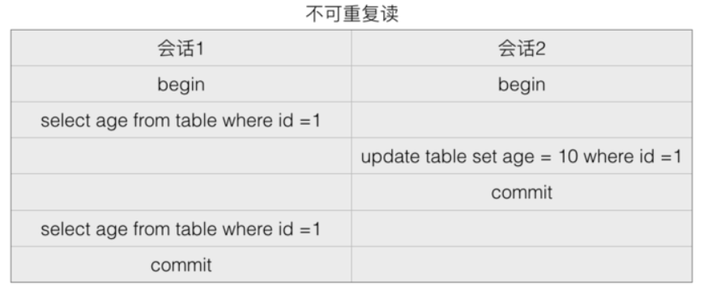
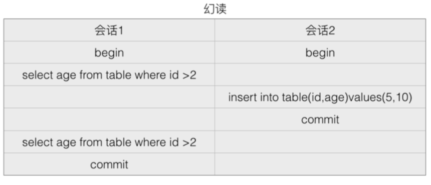
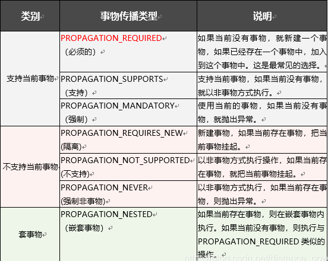

# 什么是事物

在数据库中，事物是数据库操作的最小单元，是sql作为单个逻辑单元执行的一系列操作；这些操作作为一个整体一起向系统提交，要么都执行，要么都不执行。 **事物是一组不可分割的操作集合（工作逻辑单元）**

## 事物的四大特性：（ACID）

1. 原子性(Atomicity): 事物是数据库操作的逻辑单位，事物中包含的操作要么都成功，要么都不成功。
2. 一致性（Consistency）：事物执行的结果必定使得数据库从一个一致性状态变到另一个一致性状态。当数据库只包含事物成功提交的结果时，就说事物处于一致性状态。如果数据库系统 运行中发生故障，有些事务尚未完成就被迫中断，这些未完成事务对数据库所做的修改有一部分已写入物理数据库，这时数据库就处于一种不正确的状态，或者说是 不一致的状态。 
3. 隔离性（Isolation）：一个事务的执行不能被其它事务干扰。即一个事务内部的操作及使用的数据对其它并发事务是隔离的，并发执行的各个事务之间不能互相干扰。 
4. 持久性（Durability）：指一个事务一旦提交，它对数据库中的数据的改变就应该是永久性的。接下来的其它操作或故障不应该对其执行结果有任何影响。 

# 数据库中的事务

## 如何用sql 语言实现事物

当执行第一个DML（数据操作）SQL 语言时，事物开始，当执行一下情况事物结束：

- 执行了**commit（提交）**或**rollback（回滚）**语句；
- 执行了DDL语句（如建表语句）或DCL语句（如给用户授权）。
- 数据库客户端程序退出或数据库崩溃时，为了保持数据一致性，也会结束事务

**注意：**

- 执行DML语句且没有结束事务时，如果需要查询数据库的真实改变情况，则要求在一个新的SQL Window窗口中执行查询语句：因为事务中所做的每一个操作在事务被提交之前都是临时的，在commit或rollback语句执行之前，DML语句首先影响该用户的数据库缓冲区，因为这些操作可以被恢复，而且因为是在该用户的数据缓冲区，所以在原SQL窗口中查询得到的是数据缓冲区的结果，不是数据库真实的数据；要想拿到数据库真实的数据，需要在新SQL窗口中执行查询语句，这样针对不同的用户，MySQL服务器用读一致性来确保每个用户看到的数据和上次提交时的数据相同。
- 当一个用户执行DML语句时，如果其事物没有结束，则受影响的行被锁定，此时其它用户不能改变受影响行中的数据，后面用户所执行的DML语句会一直处于执行状态，直至前一个用户所执行DML语句事务结束

## 数据库中事物的隔离级别

- 脏读：一个事务读到了另一个事务未提交的数据。


- 不可重复读：在一个事务内根据同一个条件对行记录进行多次查询，但是搜出来的结果却不一致。发生不可重复读的原因是在多次搜索期间查询条件覆盖的数据被其他事务修改了，下面借助图表来解析下不可重复读。



- 幻读：所谓幻读是指同一个事务内多次查询返回的结果集不一样（比如增加了或者减少了行记录）。比如同一个事务A内第一次查询时候有n条记录，但是第二次同等条件下查询却又n+1条记录，这就好像产生了幻觉，为啥两次结果不一样那。其实和不可重复读一样，发生幻读的原因也是另外一个事务新增或者删除或者修改了第一个事务结果集里面的数据。不同在于不可重复读是同一个记录的数据内容被修改了，幻读是数据行记录变多了或者少了：

  **幻读产生的原因时，行锁只能锁住行，即使把所有的行记录都上锁，也阻止不了新插入的记录。**



根据实际需求，通过设置数据库的事务隔离级别可以解决多个事务并发情况下出现的脏读、不可重复读和幻读问题，数据库事务隔离级别由低到高依次为Read uncommitted、Read committed、Repeatable read和Serializable等四种（与Spring中一样）

数据库不同，其支持的事务隔离级别亦不相同：MySQL数据库支持上面四种事务隔离级别，默认为Repeatable read；Oracle 数据库支持Read committed和Serializable两种事务隔离级别，默认为Read committed。

## 查看与修改数据库隔离级别

可以通过如下sql语句查看MySQL数据库事务隔离级别：

select @@global.tx_isolation,@@tx_isolation;

MySQL数据库事务隔离级别的修改分为全局修改和当前session修改，具体修改方法如下：

### 全局修改：

1. 在my.ini配置文件最后加上如下配置：

   ```shell
   #可选参数有：READ-UNCOMMITTED, READ-COMMITTED, REPEATABLE-READ, SERIALIZABLE.
   [mysqld]
   transaction-isolation = READ-UNCOMMITTED
   ```

   重启MySQL服务

   

   ### 当前session修改：
   登录MySQL数据库后执行如下命令：

```shell
set session transaction isolation level read uncommitted;
```


# Spring 中的事物

- spring 事物是在数据库事物的基础上进行封装扩展 其主要特性如下：

  a. 支持原有的数据事物的隔离级别
  b. 加入了事物传播的概念 提供多个事物的和并或隔离的功能
  c. 提供声明式事物，让业务代码与事物分离，事物变得更易用。

- spring提供了三个接口供使用事务

  a TransactionDefinition ：事务定义
  b. PlatformTransactionManager ：事务管理，提交和回滚
  c. TransactionStatus ： 事务运行时状态

  

  spring 中抛出什么异常会导致事物回滚呢？

  默认情况下，如果在事务中抛出了***\*运行时\****异常（继承自RuntimeException异常类），则回滚事务；如果没有抛出任何异常，或者抛出了***\*检查时\****异常，则依然提交事务。

  

  ## 事物的传播机制（7种）

  

  

### 常用事物传播机制：

- PROPAGATION_REQUIRED：这个也是默认的传播机制；
- PROPAGATION_NOT_SUPPORTED ：
    可以用于发送提示消息，站内信、短信、邮件提示等。不属于并且不应当影响主体业务逻辑，即使发送失败也不应该对主体业务逻辑回滚。
- PROPAGATION_REQUIRES_NEW ：
    总是新启一个事物，这个传播机制适用于不受父方法事物影响的操作，比如某些业务场景下需要记录业务日志，用于异步反查，那么不管主体业务逻辑是否完成，日志都需要记录下来，不能因为主体业务逻辑报错而丢失日志；

  # 参考

- https://blog.csdn.net/Ricardo_Y_Lu/article/details/95933579

- https://blog.csdn.net/distance_power/article/details/88746320