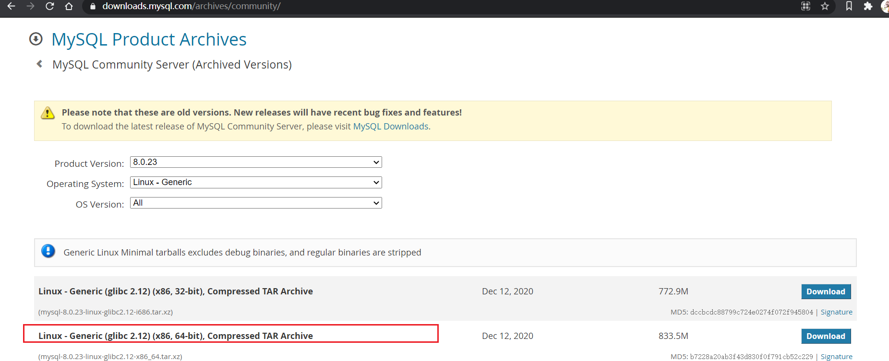

# linux 下 mysql 安装

## 下载 mysql 8.0 :  

访问路径：`https://downloads.mysql.com/archives/community/`



在lunix 上 执行下载命令：`wget 'https://cdn.mysql.com//Downloads/MySQL-8.0/mysql-8.0.23-linux-glibc2.12-x86_64.tar.xz'`

## 解压 mysql

- `tar -zxvf mysql-8.0.23-linux-glibc2.12-x86_64.tar.xz `

##　安装

- 安装前检查是否已经安装 mysql `rpm -qa | grep mysql`

如有，类似 `mysql-libs-5.1.52-1.el6_0.1.x86_64`那可以选择进行卸载:

```
rpm -e mysql-libs-5.1.52-1.el6_0.1.x86_64　　// 普通删除模式
rpm -e --nodeps mysql-libs-5.1.52-1.el6_0.1.x86_64　　// 强力删除模式，如果使用上面命令删除时，提示有依赖的其它文件，则用该命令可以对其进行强力删除
```

### 添加系统mysql组和mysql用户

检查mysql组和用户是否存在，如无创建

```shell

cat /etc/group | grep mysql
#类似
mysql:x:490:
cat /etc/passwd | grep mysql
#类似
mysql:x:496:490::/home/mysql:/bin/bash
```

以上为存在的情况，如无，执行添加命令：

```shell
groupadd mysql
useradd -r -g mysql mysql
#useradd -r参数表示mysql用户是系统用户，不可用于登录系统
```

