### Linux实例总体负载的查询及分析

Linux实例如果总体负载过高，可能会引发死机或卡顿等异常。可以参阅如下步骤进行整体排查。

1. 检查服务器进程与服务否占用过多内存，或者内存没有正常释放，导致出现内存溢出，系统宕机。
2. 检查`/var/spool/cron`等系统配置中是否有cron（计划任务）在对应时间段内执行。
3. 检查Web服务器的参数是否超过了服务器的性能，比如最大连接数过高等。
4. 检查进程数是否非常高，导致服务瘫痪，机器假死。
5. 查看系统日志中是否有异常记录。
6. 检查磁盘是否有坏块。
7. 内核消耗过大，查看是否有瞬间资源占用过大的进程或服务。
8. 查看是否有异常进程，是否存在被攻击或入侵症状。

 

### 使用sar工具查看Linux实例各项资源使用情况

sar是System Activity Reporter（系统活动情况报告）的缩写。sar工具对系统状态进行取样后，通过计算数据和比例来表达系统当前的运行状态。其特点是可以连续对系统取样，获得大量的取样数据。其取样数据和分析结果可以存入文件，所需的负载很小。

 

sar是Linux系统中较为全面的性能分析工具，可以从多个方面对系统的活动进行监控和报告，包括文件读写情况、系统调用使用情况、串口、CPU效率、内存使用情况、进程活动及IPC有关的活动情况等等。

 

#### 安装sar工具

如果您的系统中默认未安装sar工具，可参考如下步骤进行安装。

1. 登录Linux实例，执行如下命令，安装sar工具。

   放大查看复制代码

   ```
   yum install sysstat
   ```

2. 执行如下命令，启动服务。

   放大查看复制代码

   ```
   /etc/init.d/sysstat start
   ```

 

#### 查看CPU负载

执行如下命令，查看CPU负载。

放大查看复制代码

```
sar -u 1 5
```

系统显示类似如下。

放大查看复制代码

```
Linux 3.10.0-123.9.3.el7.x8664 (iZ23pddtofdZ)     07/04/2016     _x86_64    (1 CPU)
10:16:35 AM     CPU     %user     %nice   %system   %iowait    %steal     %idle
10:16:36 AM     all     14.14      0.00      1.01      0.00      0.00     84.85
10:16:37 AM     all     14.14      0.00      0.00      1.01      0.00     84.85
10:16:38 AM     all      0.00      0.00      1.01      0.00      0.00     98.99
10:16:39 AM     all      0.00      0.00      0.00      0.00      0.00    100.00
10:16:40 AM     all      1.00      0.00      0.00      0.00      0.00     99.00
Average:        all      5.86      0.00      0.40      0.20      0.00     93.54
```

> 注：
>
> - %user：用户模式下消耗的CPU时间比例。
> - %nice：通过nice改变了进程调度优先级的进程，在用户模式下消耗的CPU时间比例。
> - %system：系统模式下消耗的CPU时间比例。
> - %iowait：CPU等待磁盘I/O导致空闲状态消耗的时间比例。
> - %steal：利用Xen等操作系统虚拟化技术，等待其它虚拟CPU计算占用的时间比例。
> - %idle：CPU空闲时间比例。

 

#### 查看平均负载

执行如下命令，查看平均负载。

放大查看复制代码

```
sar -q 1 60
```

系统显示类似如下。

放大查看复制代码

```
sar -q 1 6Linux 3.10.0-123.9.3.el7.x8664 (iZ23pddtofdZ)     07/04/2016     _x86_64    (1 CPU)
10:23:13 AM   runq-sz  plist-sz   ldavg-1   ldavg-5  ldavg-15   blocked
10:23:14 AM         0       142      0.00      0.01      0.05         0
10:23:15 AM         0       142      0.00      0.01      0.05         0
10:23:16 AM         0       142      0.00      0.01      0.05         0
10:23:17 AM         0       142      0.00      0.01      0.05         0
10:23:18 AM         0       142      0.00      0.01      0.05         0
10:23:19 AM         0       142      0.00      0.01      0.05         0
Average:            0       142      0.00      0.01      0.05         0
```

> 注：指定-q参数后，可以查看运行队列中的进程数、系统上的进程大小、平均负载等信息。与其它命令相比，随时间变化查看各项指标的情况。
>
> - runq-sz：运行队列的长度，即等待运行的进程数。
> - plist-sz：进程列表中进程（processes）和线程（threads）的数量。
> - ldavg-1：最后1分钟的系统平均负载。
> - ldavg-5：过去5分钟的系统平均负载。
> - ldavg-15：过去15分钟的系统平均负载。

 

#### 查看内存负载

执行如下命令，查看内存负载。

放大查看复制代码

```
sar -r 1 3
```

系统显示类似如下。

放大查看复制代码

```
sar -r 1 3
Linux 3.10.0-123.9.3.el7.x8664 (iZ23pddtofdZ)     07/04/2016     _x86_64    (1 CPU)
10:27:34 AM kbmemfree kbmemused  %memused kbbuffers  kbcached  kbcommit   %commit  kbactive  kbinact  kbdirty
10:27:35 AM    275992    740664     72.85    181552    315340    362052     35.61    471216   115828       60
10:27:36 AM    276024    740632     72.85    181552    315340    362052     35.61    471220   115828       64
10:27:37 AM    276024    740632     72.85    181552    315340    362052     35.61    471220   115828       64
Average:       276013    740643     72.85    181552    315340    362052     35.61    471219   115828       63
```

> 注：
>
> - kbmemfree：该值和free命令中的free值基本一致，它不包括buffer和cache空间。
> - kbmemused：该值和free命令中的used值基本一致，它包括buffer和cache空间。
> - %memused：物理内存使用率，该值是kbmemused和内存总量（不包括Swap内存）的百分比。
> - kbbuffers和kbcached：这两个值和free命令中的buffer和cache一致。
> - kbcommit：保证当前系统所需要的内存，即为了确保不溢出而需要的内存，即RAM加上Swap的内存。
> - %commit：该值是kbcommit与内存总量（包括Swap内存）的百分比。

 

#### 查看页面交换发生的状况

执行如下命令，查看内存负载。

放大查看复制代码

```
sar -W 1 3
```

系统显示类似如下。

放大查看复制代码

```
Linux 3.10.0-123.9.3.el7.x8664 (iZ23pddtofdZ) 07/04/2016 _x86_64 (1 CPU)
10:28:59 AM pswpin/s pswpout/s
10:29:00 AM 0.00 0.00
10:29:01 AM 0.00 0.00
10:29:02 AM 0.00 0.00
Average: 0.00 0.00
```

> 注：
>
> - pswpin/s：每秒从交换分区到系统的交换页面（Swap page）数量。
> - pswpout/s：每秒从系统交换到Swap的交换页面（Swap page）的数量。

 

sar命令的参数说明如下，注意区分大小写。

- -A：汇总所有的报告
- -a：报告文件读写使用情况
- -B：报告附加的缓存的使用情况
- -b：报告缓存的使用情况
- -c：报告系统调用的使用情况
- -d：报告磁盘的使用情况
- -g：报告串口的使用情况
- -h：报告关于buffer使用的统计数据
- -m：报告IPC消息队列和信号量的使用情况
- -n：报告命名cache的使用情况
- -p：报告调页活动的使用情况
- -q：报告运行队列和交换队列的平均长度
- -R：报告进程的活动情况
- -r：报告没有使用的内存页面和硬盘块
- -u：报告CPU的利用率
- -v：报告进程、i节点、文件和锁表状态
- -w：报告系统交换活动状况
- -y：报告TTY设备活动状况

 

### 使用htop查看系统负载情况

htop是Linux系统中的一个互动进程查看器，可以让用户进行交互式操作，可横向或纵向滚动浏览进程列表，支持鼠标操作。用户可以安装htop，监控服务器的负载。

1. Linux系统默认不存在htop工具，可以通过如下命令进行安装。

   放大查看复制代码

   ```
   yum install htop
   ```

2. 安装成功后，可以在命令行执行htop命令启动htop监控工具。

3. htop启动后的界面如下图所示。返回结果左侧显示CPU、内存、Swap交换区的使用情况，右侧显示任务、负载、开机时间，下面的主体部分就是进程实时状况，底端是F1到F10的功能键。

   

   - F1到F10功能键的说明如下。

     放大查看

     | **功能键** | **对应功能**                  | **说明**                               |
     | ---------- | ----------------------------- | -------------------------------------- |
     | F1         | Invoke htop Help              | 查看htop帮助说明                       |
     | F2         | Htop Setup Menu               | htop配置菜单                           |
     | F3         | Search for a Process          | 搜索进程                               |
     | F4         | Incremental process filtering | 进程过滤器                             |
     | F5         | Tree View                     | 显示树形结构                           |
     | F6         | Sort by a column              | 选择排序方式                           |
     | F7         | Nice - (change priority)      | 可减少nice值，用于提高对应进程的优先级 |
     | F8         | Nice + (change priority)      | 可增加nice值，用于降低对应进程的优先级 |
     | F9         | Kill a Process                | 结束指定进程                           |
     | F10        | Quit htop                     | 结束htop                               |

   - 在htop界面，用户可以通过鼠标单击相关进程、列、功能键，也可以通过上下键或 **PgUP**、**PgDn** 键选定想要的进程，左右键或 **Home**、**End** 键移动字段，常用的快捷键如下所示。

     - Space：标记或取消标记一个或多个进程。
     - s：选择某一进程，按 **s** 键后，用strace追踪进程的系统调用。
     - l：显示进程打开的文件。如果安装了lsof，按此键可以显示进程所打开的文件。
     - M：按Memory使用率排序。
     - P：按CPU使用率排序。
     - T：按Time+使用率排序。
     - F：跟踪进程，如果排序顺序引起选定的进程在列表上随意移动，让选定条跟随该进程。这对监视一个进程非常有用。这种方式，用户可以让特定进程在屏幕上一直可见。使用方向键会停止该功能。
     - K：显示或隐藏内核线程。
     - H：显示或隐藏用户线程。
     - Ctrl和L：刷新界面

   - 鼠标单击 **Help** 或者按 **F1** ，可以显示自带帮助信息。
     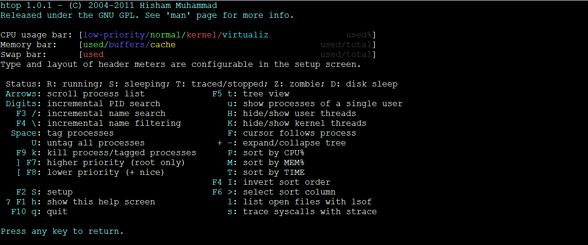

   - 鼠标单击 **Setup** 或者按 **F2**，可以进入htop配置页面。例如最后一项的设定是调整Columns（数据列）的显示，用于自定义htop进程列表中可以看到哪些字段的数据及信息。
     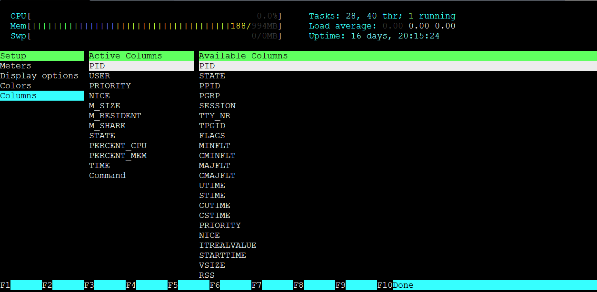

   - 鼠标单击 **Search** 或者按 **F3** 或者输入 `/`， 然后可以通过输入进程名进行搜索，例如搜索ssh进程。
     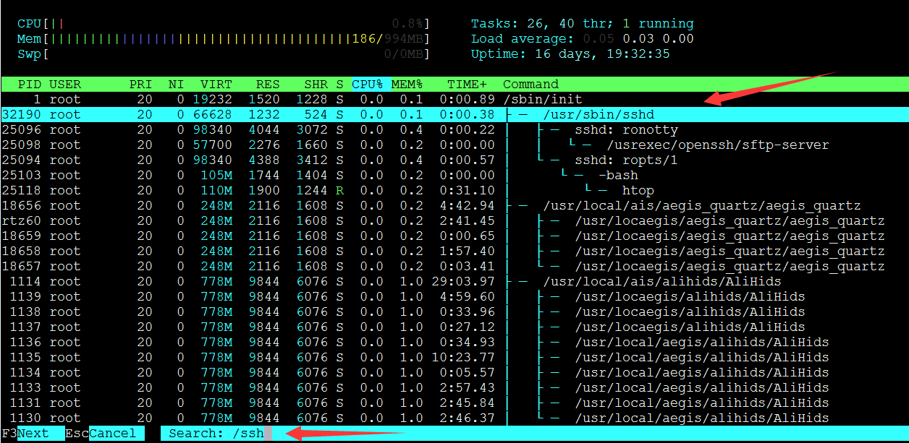

   - 输入`t`或按 **F5**，显示树形结构，与pstree显示效果类似，可以看到所有程序树状执行的结构。
     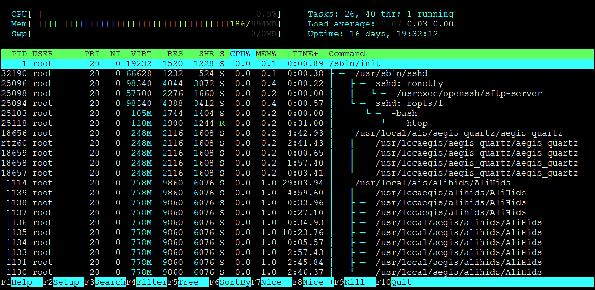

   - 按 **F6** 可以选择依照哪一列来排序，最常用的排序内容就是CPU和Memory。
     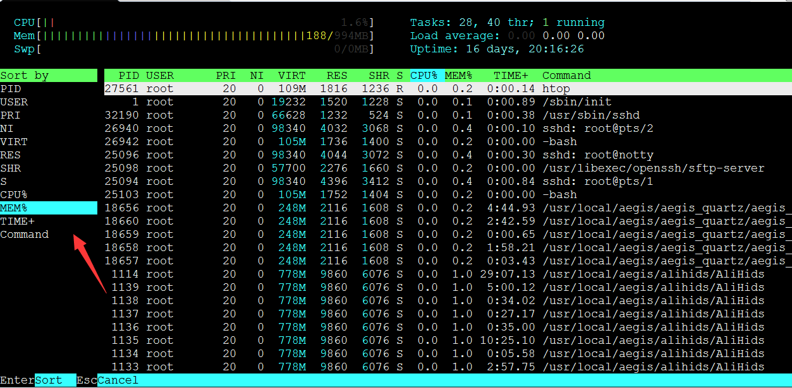

# Linux系统CPU负载的查询和案例分析

### CPU负载的查询分析

在Linux系统中，查看进程的常用命令如下所示。本文主要介绍vmstat和top。

- vmstat
- top
- ps -aux
- ps -ef

 

#### 使用vmstat命令查看

通过vmstat命令，从系统维度查看CPU资源的使用情况。命令格式类似如下，表示结果一秒刷新一次。

放大查看复制代码

```
vmstat -n 1
```

示例如下。

放大查看复制代码

```
procs -----------memory---------- ---swap-- -----io---- -system-- ------cpu-----
 r  b   swpd   free   buff  cache   si   so    bi    bo   in   cs us sy id wa st
 1  0      0 2684984 310452 2364304    0    0     5    17   19   35  4  2 94  0  0
 0  0      0 2687504 310452 2362268    0    0     0   252 1942 4326  5  2 93  0  0
 0  0      0 2687356 310460 2362252    0    0     0    68 1891 4449  3  2 95  0  0
 0  0      0 2687252 310460 2362256    0    0     0     0 1906 4616  4  1 95  0  0
```

> 注：返回结果中的主要数据列说明如下。
>
> - r：表示系统中CPU等待处理的线程。一个CPU每次只能处理一个线程，所以该数值越大，通常表示系统运行越慢。
> - us：用户模式消耗的CPU时间百分比。该值较高时，说明用户进程消耗的CPU时间比较多。如果该值长期超过50%，则需要对程序算法或代码等进行优化。
> - sy：内核模式消耗的CPU时间百分比。
> - wa：IO等待消耗的CPU时间百分比。该值较高时，说明IO等待比较严重，这可能磁盘大量作随机访问造成的，也可能是磁盘性能出现了瓶颈。
> - id：处于空闲状态的CPU时间百分比。如果该值持续为0，同时sy是us的两倍，则通常说明系统面临CPU资源短缺。

 

#### 使用top命令查看

1. 登录Linux实例，关于如何登录Linux实例，请参考[使用管理终端连接Linux实例](https://help.aliyun.com/document_detail/25433.html)。

2. 执行如下命令，从进程纬度来查看CPU、内存等资源的使用情况。命令格式类似如下。

   放大查看复制代码

   ```
   top
   ```

   系统显示类似如下。

   放大查看复制代码

   ```
   top - 17:27:13 up 27 days,  3:13,  1 user,  load average: 0.02, 0.03, 0.05
   Tasks:  94 total,   1 running,  93 sleeping,   0 stopped,   0 zombie
   %Cpu(s):  0.3 us,  0.1 sy,  0.0 ni, 99.5 id,  0.0 wa,  0.0 hi,  0.0 si,  0.1 st
   KiB Mem:   1016656 total,   946628 used,    70028 free,   169536 buffers
   KiB Swap:        0 total,        0 used,        0 free.   448644 cached Mem
   PID USER      PR  NI    VIRT    RES    SHR S %CPU %MEM     TIME+ COMMAND
   1 root      20   0       41412   3824    2308 S  0.0  0.4   0:19.01 systemd
   2 root      20   0       0      0     0  S  0.0  0.0   0:00.04 kthreadd
   ```

3. 针对负载问题，您只需关注回显的第一行和第三行信息，详细说明如下。

   1. top命令的第一行显示的内容17:27:13 up 27 days, 3:13, 1 user, load average: 0.02, 0.03, 0.05，依次为系统当前时间、系统到目前为止已运行的时间、当前登录系统的用户数量、系统负载，这与直接执行uptime命令查询结果一致。
   2. top命令的第三行会显示当前CPU资源的总体使用情况，下方会显示各个进程的资源占用情况。

4. 通过

    

   P

    

   键，可以对CPU使用率进行倒序排列，进而定位系统中占用CPU较高的进程。

   > 提示：通过 **M** 键，您可以对系统内存使用情况进行排序。如果有多核CPU，数字键1可以显示每核CPU的负载状况。

5. 执行如下命令，可以查看每个进程ID对应的程序文件。

   放大查看复制代码

   ```
   ll /proc/PID/exe
   ```

 

### 操作案例

#### 案例一：使用top命令终止CPU消耗较大的进程

通过top命令查看系统的负载问题，并定位耗用较多CPU资源的进程，在运行界面快速终止相应的异常进程。

1. 想要终止某个进程，先键入小写字母 **k**。
2. 输入想要终止的进程PID，默认为输出结果的第一个PID。如下图所示，假如想要终止PID为23的进程，输入23后回车。
   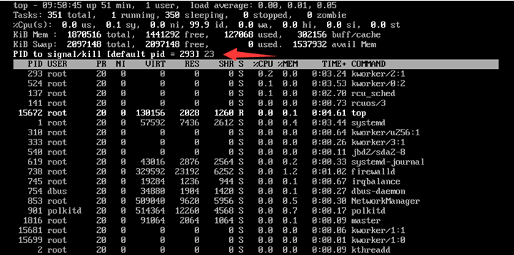

1. 操作成功后，界面会出现类似`Send pid 23 signal [15/sigterm]`的提示信息让用户进行确认。按回车确认即可。
   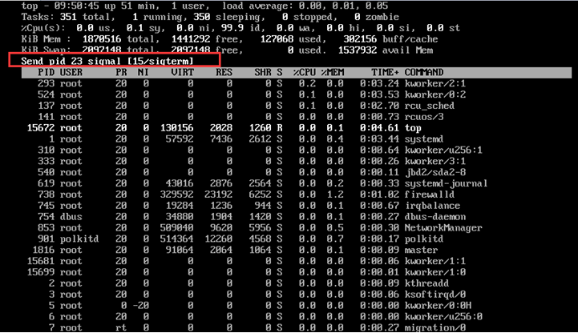

 

#### 案例二：CPU使用率较低但负载较高

**问题描述**

当前Linux系统没有业务程序运行。通过top命令观察，发现CPU很空闲，但是load average却非常高，如下图所示。

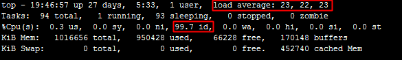

 

**处理办法**

load average是对CPU负载进行评估的，其值越高说明其任务队列越长，处于等待执行的任务越多。出现此种情况时，可能是由于僵死进程导致的。可以通过`ps -axjf`命令查看是否存在 **D+** 状态进程，该状态是指不可中断的睡眠状态。处于该状态的进程无法终止，也无法自行退出。只能通过恢复其依赖的资源或者重启系统来解决。

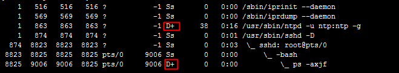

 

#### 案例三：kswapd0进程占用CPU较高

操作系统使用分页机制来管理物理内存。操作系统将磁盘的一部分划出来作为虚拟内存，由于内存的速度要比磁盘快得多，所以操作系统要按照某种换页机制将不需要的页面换到磁盘中，将需要的页面调到内存中。由于内存持续不足，这个换页动作持续进行。kswapd0是虚拟内存管理中负责换页的进程，当服务器内存不足的时候kswapd0会执行换页操作，这个换页操作是十分消耗主机CPU资源的。如果通过top命令发现该进程持续处于非睡眠状态，且运行时间较长，可以初步判定系统在持续的进行换页操作，可以将问题转向内存不足的原因来排查。

 

**问题描述**

kswapd0进程占用了系统大量CPU资源。

 

**处理办法**

1. 执行如下命令，查看kswapd0进程。

   放大查看复制代码

   ```
   top
   ```

   系统显示类似如下，发现kswapd0进程持续处于非睡眠状态，且运行时间较长并持续占用较高CPU资源，则通常是由于系统在持续的进行换页操作所致。

   
   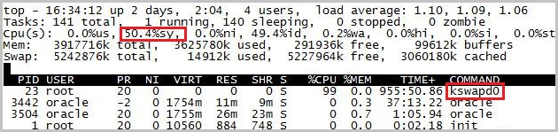

2. 通过free 、ps等指令进一步查询系统及系统内进程的内存占用情况，做进一步排查分析。

3. 针对系统当前内存不足的问题，您可以重启一些服务，释放内存。

   > **提示**：从长远的角度来看，您需要对内存大小进行升级。

# Linux系统IO负载情况的查询和案例分析

### IO负载的查询与分析

#### 使用iostat从系统纬度查看磁盘IO负载

iostat并非常见Linux发行版本自带工具，其包含在sysstat软件包中，需要先通过yum或apt-get等方式进行安装后才能使用。具体安装方法本文不再详述。

 

##### 用法说明

执行如下命令，查看磁盘IO负载。

放大查看复制代码

```
iostat -d -k 2
```

> 注：
>
> - -d：显示设备（磁盘）使用状态。
> - -k：表示让某些使用block为单位的列强制使用kB为单位。
> - 2：数据显示每隔2秒刷新一次。

系统显示类似如下。

放大查看复制代码

```
Linux 3.10.0-123.9.3.el7.x8664 (centos)     06/27/2016     _x86_64    (1 CPU)
Device:            tps    kB_read/s    kB_wrtn/s    kB_read    kB_wrtn
xvda              0.58         0.12         3.75     278001    8820028
xvdb              0.00         0.00         0.00        740          0
xvdc              0.00         0.00         0.00       1388          0
xvde              0.00         0.00         0.00       2035          0
xvdf              0.00         0.00         0.00        740          0
```

> **提示**：更多参数及返回结果说明，可以参阅iostat的man帮助。

 

#### 使用iotop从进程纬度查看磁盘IO负载

iotop也并非常见Linux发行版本自带工具，也需要先通过yum或apt-get等方式进行安装后才能使用。具体安装方法本文不再详述。

> **提示**：可以通过iotop从进程维度对系统内进程的IO使用情况进行排序。

 

##### 用法说明

执行iotop命令，可以看到类似以下界面。

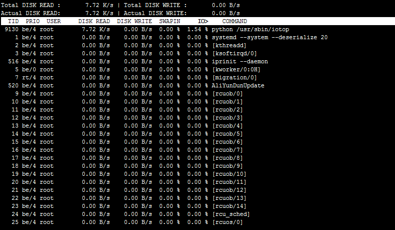

 

##### 系统显示说明

- 默认情况下按照IO使用量倒序排序，可以用左右箭头操作排序的字段。
- 按r切换排序方式。
- 按o只显示有磁盘IO活动的进程。
- 更多参数及返回结果说明，可以参阅iotop的man帮助。

 

### IO负载相关操作案例

#### kjournald进程占用IO资源高问题

##### 问题描述

使用iotop排查分析，发现kjournald进程占用了大量IO资源。

 

##### 问题原因

kjournald进程是ext3文件系统进行IO数据操作的内核进程，它会在向磁盘内写入和读取数据时占用CPU和内存资源。该问题通常是由于ext3文件系统循环的写数据，Journal size不断增大，进而占满导致。

 

##### 处理办法

执行如下命令，通过dumpe2fs指令查看相应分区的Journal size配置情况，然后尝试调大该值，看问题是否缓解。

放大查看复制代码

```
dumpe2fs /dev/xvda1 | grep Journal
```

系统显示类似如下。

放大查看复制代码

```
dumpe2fs 1.42.9 (28-Dec-2013)
Journal inode: 8
Journal backup: inode blocks
Journal features: journal_incompat_revoke
Journal size: 128M
Journal length: 32768
Journal sequence: 0x00010ffb
Journal start: 10953
```

 

#### 通过4K对齐提高IO性能

本节主要介绍如何通过如下脚本对磁盘进行格式化并自动配置4K对齐。

> **提示**：运行此脚本会自动格式化所有数据盘磁盘。如果并非新购磁盘，请在操作前，务必确认已经完成相关磁盘上的数据备份。可以通过快照进行磁盘的备份，操作方法可以参见[创建快照](https://help.aliyun.com/document_detail/25455.html)。

1. 将如下压缩包解压，将解压后脚本并上传到目标服务器。
   [auto_fdisk.zip](https://onekb.oss-cn-zhangjiakou.aliyuncs.com/50443667/fa6a03ae-3424-4485-ac82-a7d2b166b249.zip)
2. 进入脚本所在目录，使用root用户，依次执行如下命令，给脚本添加执行权限，然后运行脚本即可。

# Linux系统网络流量负载情况的查询和案例分析

### sar的使用

sar可以从网络接口层面来分析数据包的收发情况、错误信息等。使用sar来监控网络流量的常用命令如下所示。

放大查看复制代码

```
sar -n DEV [interval] [count]
```

> 注：interval参数是统计间隔，count参数是统计次数。

 

#### 使用示例

执行如下命令，使用sar每1秒统计一次网络接口的活动状况，连续显示5次。

放大查看复制代码

```
sar -n DEV 1 5
```

命令执行后会列出每个网卡5次的平均数据取值，根据实际情况来确定带宽跑满的网卡名称，对于ECS实例来说，通常内网网卡为eth0，外网网卡为eth1，系统显示类似如下，确认是eth1通过流量较大，然后执行以下步骤检查具体问题。

**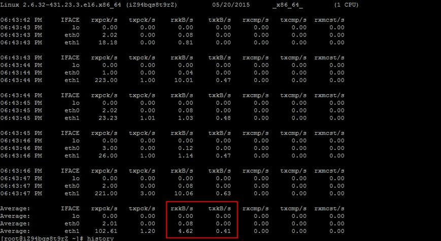**

 

#### 显示结果主要字段说明

- IFACE：网络接口名称。
- rxpck/s、txpck/s：每秒收或发的数据包数量。
- rxkB/s、txkB/s：每秒收或发的字节数，以kB/s为单位。
- rxcmp/s、txcmp/s：每秒收或发的压缩过的数据包数量。
- rxmcst/s：每秒收到的多播数据包。

 

### iftop的使用

iftop命令常见用法如下。参数-i后跟的interface表示网络接口名，比如eth0、eth1等等。如果不通过-i参数指定接口名，则默认检测第一块网卡的使用情况。

放大查看复制代码

```
iftop [-i interface]
```

 

#### 使用示例

1. 登录Linux实例，关于如何登录Linux实例，请参考[使用管理终端连接Linux实例](https://help.aliyun.com/document_detail/25433.html?spm=5176.smartservice_service_chat.help.85.41f0709a6OG9yu)。

2. 执行如下命令，安装iftop流量监控工具。

   放大查看复制代码

   ```
   yum install iftop -y
   ```

3. 执行如下命令，可以查看流量较高的是哪个端口建立的连接，以及内网流量。

   放大查看复制代码

   ```
   iftop -i eth1 -P
   ```

   > 注：-P参数将会显示请求端口。

   系统显示类型如下。

   

4. 执行如下命令，查看端口对应的进程。

   放大查看复制代码

   ```
   netstat -tunlp |grep [$Port]
   ```

   > 注：[$Port]为上一步查看的端口。

   系统显示类型如下。

   

5. 确认对应服务后，您可以通过停止服务或使用iptables服务来对指定地址进行处理，例如屏蔽IP地址或限速，以保证服务器带宽能够正常使用。

 

#### 显示结果主要字段说明

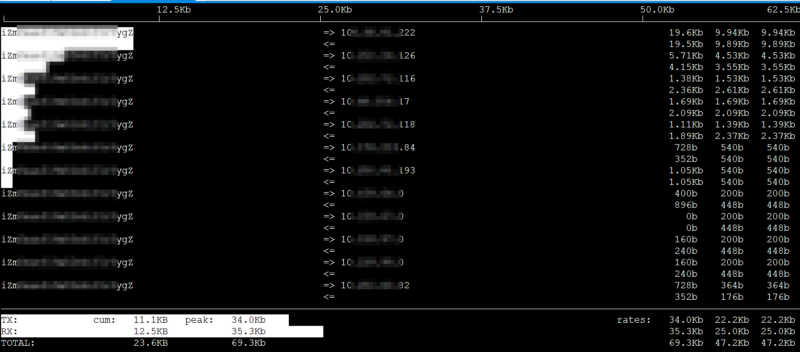

- 第一行：带宽使用情况显示。
- 中间部分为外部连接列表，即记录了哪些IP正在和本机的网络连接。
- 中间部分靠右侧部分是实时流量信息，分别是该访问IP连接到本机2秒、10 秒和40秒的平均流量。
- `=>`代表发送数据，`<=`代表接收数据。
- 底部三行。
  - 第一列：TX表示发送流量，RX表示接收流量，TOTAL表示总流量。
  - 第二列cum：表示第一列各种情况的总流量。
  - 第三列peak：表示第一列各种情况的流量峰值。
  - 第四列rates：表示第一列各种情况2秒、10秒、40秒内的平均流量。

> **提示**：iftop的流量显示单位是Mb，这里的b是比特（bit），不是字节（byte）。而ifstat显示的单位是KB中的B，也就是字节。1byte等于8bit。

 

#### 常见操作命令说明

进入iftop界面后，可以通过按下相应的字母快捷按键，来对显示结果进行调整。

- h：切换是否显示帮助。
- n：切换显示本机的IP或主机名。
- s：切换是否显示本机的host信息。
- d：切换是否显示远端目标主机的host信息。
- t：切换显示格式为2行、1行、只显示发送流量或只显示接收流量。
- N：切换显示端口号或端口服务名称。
- S：切换是否显示本机的端口信息。
- D：切换是否显示远端目标主机的端口信息。
- p：切换是否显示端口信息。
- P：切换暂停或继续显示。
- b：切换是否显示平均流量图形条。
- B：切换计算2秒或10秒或40秒内的平均流量。
- T：切换是否显示每个连接的总流量。
- l：打开屏幕过滤功能，输入要过滤的字符。比如输入相应IP地址，回车后，屏幕就只显示这个IP相关的流量信息。
- L：切换显示画面上边的刻度，刻度不同，流量图形条会有变化。
- j或k：向上或向下滚动屏幕显示的连接记录。
- 1或2或3：根据右侧显示的三列流量数据进行排序。
- <：根据左边的本机名或IP排序。
- \>：根据远端目标主机的主机名或IP排序。
- o：切换是否固定只显示当前的连接。
- f：编辑过滤代码。
- !：调用shell命令。
- q：退出。

 

### Nethogs的使用

Nethogs是一款开源的网络流量监控工具，可用于显示每个进程的带宽占用情况。这样可以更直观定位异常流量的来源。Nethogs支持IPv4和IPv6协议，支持本地网卡及PPP连接。Nethogs工具的安装方法请参阅其官方帮助文档，本文不再详述。安装完毕，直接输入nethogs启动工具即可。不带任何参数时，nethogs默认监控eth0。用户可以通过ifconfig等指令核实具体哪个网络接口（eth1、eth0）对应公网网卡。

 

#### 使用示例

1. 登录Linux实例，关于如何登录Linux实例，请参考[使用管理终端连接Linux实例](https://help.aliyun.com/document_detail/25433.html?spm=5176.smartservice_service_chat.help.86.41f0709a6OG9yu)。

2. 执行如下命令，安装nethogs流量监控工具。

   放大查看复制代码

   ```
   yum install nethogs -y
   ```

3. 通过nethogs工具来查看网卡上进程级的流量信息。若eth1网卡流量较高，则执行如下命令，查看每个进程的网络带宽情况以及进程对应的PID，确定导致带宽跑满或跑高的具体进程。

   放大查看复制代码

   ```
   nethogs eth1
   ```

   > 注：nethogs默认的监控间隔是1秒，用户可以通过-d参数来设定监控间隔。例如执行如下命令，设定监控间隔为5秒。
   > `nethogs eth1 -d 5`

   系统显示类似如下。

   

4. 若进程确定是恶意程序，可以通过执行如下命令，终止进程。

   放大查看复制代码

   ```
   kill -TERM [$Port1]
   ```

   > **提示**：如果是Web服务程序，您可以使用iftop等工具来查询具体IP来源，然后分析Web访问日志是否为正常流量。日志分析可以使用logwatch或awstats等工具进行。

 

#### 显示结果说明

在nethogs监控界面，按 **s** 可以按照Sent列进行排序，按 **r** 可以按照Received列进行排序，按 **m** 可以切换不同的统计单位显示，例如kb/s、kb、b、mb。监控界面信息说明如下所示。

- PID列表示相应流量关联程序的进程号。
- USER列表示相应进程的所属用户。
- PROGRAM列表示程序的具体执行路径。
- DEV列当前监控的网络接口名称。
- Sent列表示相应进程已经发送的数据流量。
- Received列表示程序已经接收的数据流量。

 

### 使用Web应用防火墙防御CC攻击

若您的服务遭受了CC攻击，请在Web应用防火墙控制台尽快开启CC安全防护。

1. 登录Web应用防火墙控制台，关于如何登录Web应用防火墙控制台，请参考[Web应用防火墙](https://yundun.console.aliyun.com/?spm=5176.smartservice_service_chat.help.87.41f0709a6OG9yu&p=waf#/waf/main/buy)。
2. 在CC安全防护中，单击 **状态** 按钮，并在模式中选择 **正常**。
   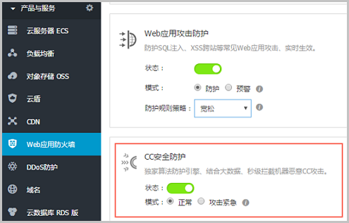

 