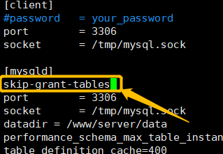
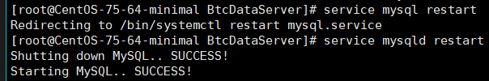

# linux mysql 重置登录账号密码

**1. 修改配置文件**

vim /etc/my.cnf

在 [mysqld] 中添加 **skip-grant-tables**



**2. 重启 mysql 服务**

```shell
service mysql restart
service mysqld restart
```



**3. 登录 mysql**

`mysql -u root`
或
`mysql -u root -p`　　输入密码时直接回车

**4. 进入 mysql 数据库修改密码**

```sql
# 切换数据库
use mysql;
# 修改密码
update user set Password="New Password" where User = 'root';
```


**5. 进入配置文件删除 skip-grant-tables**

**6. 重启服务，后再次正常登录**

```shell
service mysql restart
service mysqld restart
```

