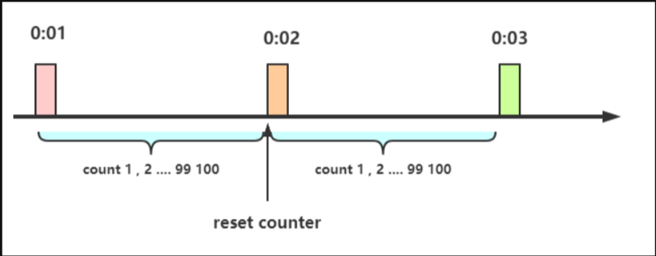
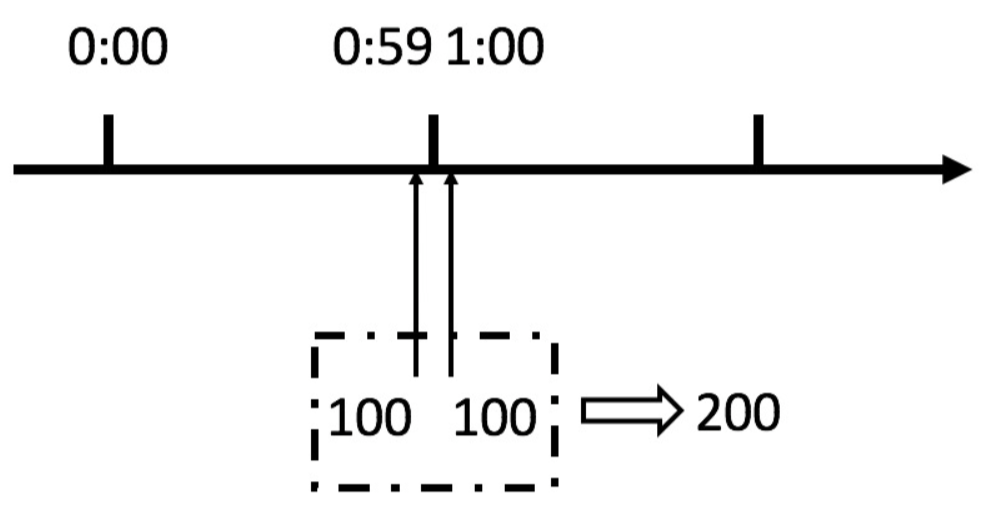
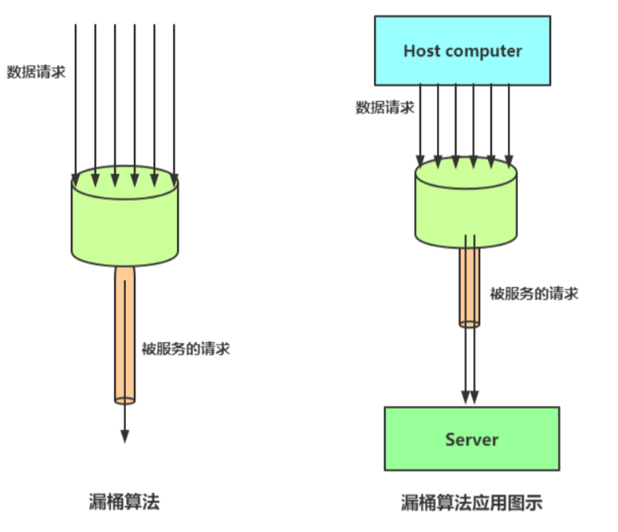
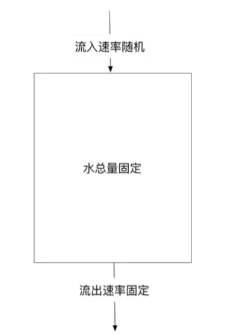
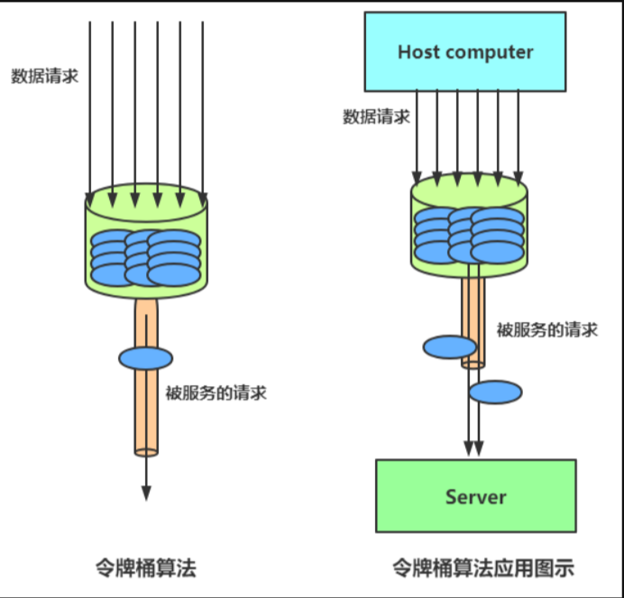
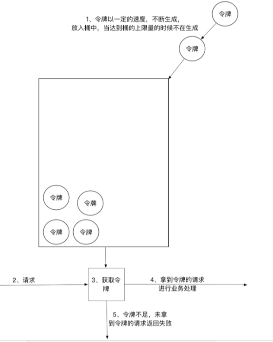

# 为什么要限流

限流在很多场景中用来限制并发和请求量，比如说秒杀抢购，保护自身系统和下游系统不被巨大流量冲垮等。

以微博为例，例如某某明星公布了恋情，访问从平时的50万增加到了500万，系统的规划能力，最多可以支撑**200万访问**，那么就要执行限流规则，保证是一个可用的状态，不至于**服务器崩溃**，所有请求不可用。

# 限流思想

保证可用的情况下，尽可能多的增加进入人的数量。其余的人排队等待，或者返回友好的提示，保证进入的用户能正常的使用系统，防止系统雪崩


# 系统项目中，哪些地方需要限流

提供给用户访问入口，以及业务判断可能存在大流量冲击的地方。

# 限流算法

常见：计数器算法、漏桶算法、令牌算法

## 计数器

在一段时间间隔（时间窗口/时间区间），处理请求的最大数量固定，超过的部分不做处理

## 漏桶

漏桶的小固定，处理速度固定，但请求速度不顾定（在突发情况请求过多时，会丢弃过多的请求）

## 令牌桶

令牌桶的大小固定，令牌的生产速度固定，但是消耗令牌（即请求）速度不固定（可以应对某些时间请求过多的情况）；每个请求都会从令牌桶中取出令牌，如果没有令牌则丢弃该次请求


# 计数器算法

## 计数器限流定义：

在一段时间间隔内（时间窗口/时间区间），处理请求的最大数量固定，超过部分不做处理。

简单粗暴，比如指定线程池大小，指定数据库连接池大小，nginx 连接数等， 这个都是属于技术器算法。

技术器算法是限流 算法中最简单，也最容易实现的算法。

举个例子，比如我们规定对于A接口，我们1分钟的访问次数不能超过100个。


设计思路：

首先，设计计数器counter，每个请求来的时候计数器 +1，如果 counter 值 大于 100 且该请求与第一次的请求的时间间隔还在一分钟以内时，说明请求已经到达上线，则拒绝请求，

如果该请求与第一次请求的时间间隔超过一分钟，且counter 的值还在限流范围内，那么就重置 counter



#### 计算器限流的实现

```java
import lombok.extern.slf4j.Slf4j;
import org.junit.Test;

import java.util.concurrent.CountDownLatch;
import java.util.concurrent.ExecutorService;
import java.util.concurrent.Executors;
import java.util.concurrent.atomic.AtomicInteger;
import java.util.concurrent.atomic.AtomicLong;

// 计速器 限速
@Slf4j
public class CounterLimiter
{

    // 起始时间
    private static long startTime = System.currentTimeMillis();
    // 时间区间的时间间隔 ms
    private static long interval = 1000;
    // 每秒限制数量
    private static long maxCount = 2;
    //累加器
    private static AtomicLong accumulator = new AtomicLong();

    // 计数判断, 是否超出限制
    private static long tryAcquire(long taskId, int turn)
    {
        long nowTime = System.currentTimeMillis();
        //在时间区间之内
        if (nowTime < startTime + interval)
        {
            long count = accumulator.incrementAndGet();

            if (count <= maxCount)
            {
                return count;
            } else
            {
                return -count;
            }
        } else
        {
            //在时间区间之外
            synchronized (CounterLimiter.class)
            {
                log.info("新时间区到了,taskId{}, turn {}..", taskId, turn);
                // 再一次判断，防止重复初始化
                if (nowTime > startTime + interval)
                {
                    accumulator.set(0);
                    startTime = nowTime;
                }
            }
            return 0;
        }
    }

    //线程池，用于多线程模拟测试
    private ExecutorService pool = Executors.newFixedThreadPool(10);

    @Test
    public void testLimit()
    {

        // 被限制的次数
        AtomicInteger limited = new AtomicInteger(0);
        // 线程数
        final int threads = 2;
        // 每条线程的执行轮数
        final int turns = 20;
        // 同步器
        CountDownLatch countDownLatch = new CountDownLatch(threads);
        long start = System.currentTimeMillis();
        for (int i = 0; i < threads; i++)
        {
            pool.submit(() ->
            {
                try
                {

                    for (int j = 0; j < turns; j++)
                    {

                        long taskId = Thread.currentThread().getId();
                        long index = tryAcquire(taskId, j);
                        if (index <= 0)
                        {
                            // 被限制的次数累积
                            limited.getAndIncrement();
                        }
                        Thread.sleep(200);
                    }


                } catch (Exception e)
                {
                    e.printStackTrace();
                }
                //等待所有线程结束
                countDownLatch.countDown();

            });
        }
        try
        {
            countDownLatch.await();
        } catch (InterruptedException e)
        {
            e.printStackTrace();
        }
        float time = (System.currentTimeMillis() - start) / 1000F;
        //输出统计结果

        log.info("限制的次数为：" + limited.get() +
                ",通过的次数为：" + (threads * turns - limited.get()));
        log.info("限制的比例为：" + (float) limited.get() / (float) (threads * turns));
        log.info("运行的时长为：" + time);
    }


}

```

## 计数器限流的严重问题

有一个严重且致命的问题， **临界问题**



从上图中我们可以看到，假设有一个恶意用户，他在0:59时，瞬间发送了100个请求，并且1:00又瞬间发送了100个请求，那么其实这个用户在 1秒里面，瞬间发送了200个请求。（在临界点处，可以突破设计边界）

用户有可能通过算法的这个漏洞，瞬间压垮我们的应用。


# 漏桶算法

基本原理为：水（对应请求）从进水口进入到桶里面，漏桶以一定的速度放水（请求放行），当水流速度过大，桶内的总水量大于桶的容量，水则会直接溢出（请求被拒绝）


限流规则：

1. 进水口（对应客户端请求）以任意速率流入进入漏桶。

2. 漏桶的容量是固定的，出水（放行）速率也是固定的。

3. 漏桶容量是不变的，如果处理速度太慢，桶内水量会超出了桶的容量，则后面流入的水滴会溢出，表示请求拒绝。


漏桶法计算原理：
水（请求）先进入到漏桶里，漏桶以一定的速度出水，当流入速度过大，当超过桶可接纳的容量时直接溢出。

可以看出漏桶法能强制限制数据的传输速度：




漏桶算法其实很简单，可以粗略的认为就是注水漏水过程，往桶中以任意速率流入水，以一定速率流出水，当水超过**桶容量**（capacity）则丢弃，因为桶容量是不变的，保证了整体的速率

以一定速率流出水：



**削峰**：有大量流量进入时，会发生溢出，从而限流保护服务可用

**缓冲**：不至于直接请求到服务器，缓冲压力

消费速度固定 因为计算性能固定

```java
import lombok.extern.slf4j.Slf4j;
import org.junit.Test;

import java.util.concurrent.CountDownLatch;
import java.util.concurrent.ExecutorService;
import java.util.concurrent.Executors;
import java.util.concurrent.atomic.AtomicInteger;

// 漏桶 限流
@Slf4j
public class LeakBucketLimiter {

    // 计算的起始时间
    private static long lastOutTime = System.currentTimeMillis();
    // 流出速率 每秒 2 次
    private static int leakRate = 2;

    // 桶的容量
    private static int capacity = 2;

    //剩余的水量
    private static AtomicInteger water = new AtomicInteger(0);

    //返回值说明：
    // false 没有被限制到
    // true 被限流
    public static synchronized boolean isLimit(long taskId, int turn) {
        // 如果是空桶，就当前时间作为漏出的时间
        if (water.get() == 0) {
            lastOutTime = System.currentTimeMillis();
            water.addAndGet(1);
            return false;
        }
        // 执行漏水
        int waterLeaked = ((int) ((System.currentTimeMillis() - lastOutTime) / 1000)) * leakRate;
        // 计算剩余水量
        int waterLeft = water.get() - waterLeaked;
        water.set(Math.max(0, waterLeft));
        // 重新更新leakTimeStamp
        lastOutTime = System.currentTimeMillis();
        // 尝试加水,并且水还未满 ，放行
        if ((water.get()) < capacity) {
            water.addAndGet(1);
            return false;
        } else {
            // 水满，拒绝加水， 限流
            return true;
        }

    }


    //线程池，用于多线程模拟测试
    private ExecutorService pool = Executors.newFixedThreadPool(10);

    @Test
    public void testLimit() {

        // 被限制的次数
        AtomicInteger limited = new AtomicInteger(0);
        // 线程数
        final int threads = 2;
        // 每条线程的执行轮数
        final int turns = 20;
        // 线程同步器
        CountDownLatch countDownLatch = new CountDownLatch(threads);
        long start = System.currentTimeMillis();
        for (int i = 0; i < threads; i++) {
            pool.submit(() ->
            {
                try {

                    for (int j = 0; j < turns; j++) {

                        long taskId = Thread.currentThread().getId();
                        boolean intercepted = isLimit(taskId, j);
                        if (intercepted) {
                            // 被限制的次数累积
                            limited.getAndIncrement();
                        }
                        Thread.sleep(200);
                    }


                } catch (Exception e) {
                    e.printStackTrace();
                }
                //等待所有线程结束
                countDownLatch.countDown();

            });
        }
        try {
            countDownLatch.await();
        } catch (InterruptedException e) {
            e.printStackTrace();
        }
        float time = (System.currentTimeMillis() - start) / 1000F;
        //输出统计结果

        log.info("限制的次数为：" + limited.get() +
                ",通过的次数为：" + (threads * turns - limited.get()));
        log.info("限制的比例为：" + (float) limited.get() / (float) (threads * turns));
        log.info("运行的时长为：" + time);
    }
}
```

#### 漏桶的问题

漏桶的出水速度固定，也就是请求放行速度是固定的。

漏桶不能有效应对突发流量，但是能起到平滑突发流量（整流）的作用。

实际上的问题：

漏桶出口的速度固定，不能灵活的应对后端能力提升。比如，通过动态扩容，后端流量从1000QPS提升到1WQPS，漏桶没有办法。

# 令牌桶限流

令牌桶算法以一个设定的速率产生令牌并放入令牌桶。每次用户请求都得申请令牌，如果令牌不足，则拒绝请求。

令牌桶算法中新请求到来时会从桶里拿走一个令牌，如果桶内没有令牌可拿，就拒绝服务。当然，令牌的数量也是有上限的。令牌的数量与时间和发放速率强相关，时间流逝的时间越长，会不断往桶里加入越多的令牌，如果令牌发放的速度比申请速度快，令牌桶会放满令牌，直到令牌占满整个令牌桶，如图所示

令牌桶限流大致的规则如下：

1. 进水口按照某个速度，向桶中放入令牌。

2. 令牌的容量是固定的，但是放行的速度不是固定的，只要桶中还有剩余令牌，一旦请求过来就能申请成功，然后放行。

3. 如果令牌的发放速度，慢于请求到来速度，桶内就无牌可领，请求就会被拒绝。

令牌的发送速率可以设置，从而可以对突发的出口流量进行有效的应对。

#### 令牌桶算法

令牌桶与漏桶相似，不同的是令牌桶桶中放了一些令牌，服务请求到达后，要获取令牌之后才会得到服务。

令牌桶算法的原理是系统会以一个恒定的速度往桶里放入令牌，而如果请求需要被处理，则需要先从桶里获取一个令牌，当桶里没有令牌可取时，则拒绝服务。






#### 令牌桶算法实现

```java
// 令牌桶 限速
@Slf4j
public class TokenBucketLimiter {
    // 上一次令牌发放时间
    public long lastTime = System.currentTimeMillis();
    // 桶的容量
    public int capacity = 2;
    // 令牌生成速度 /s
    public int rate = 2;
    // 当前令牌数量
    public AtomicInteger tokens = new AtomicInteger(0);
    ;

    //返回值说明：
    // false 没有被限制到
    // true 被限流
    public synchronized boolean isLimited(long taskId, int applyCount) {
        long now = System.currentTimeMillis();
        //时间间隔,单位为 ms
        long gap = now - lastTime;

        //计算时间段内的令牌数
        int reverse_permits = (int) (gap * rate / 1000)
        int all_permits = tokens.get() + reverse_permits;
        // 当前令牌数
        tokens.set(Math.min(capacity, all_permits));
        log.info("tokens {} capacity {} gap {} ", tokens, capacity, gap);

        if (tokens.get() < applyCount) {
            // 若拿不到令牌,则拒绝
            // log.info("被限流了.." + taskId + ", applyCount: " + applyCount);
            return true;
        } else {
            // 还有令牌，领取令牌
            tokens.getAndAdd( - applyCount);
            lastTime = now;

            // log.info("剩余令牌.." + tokens);
            return false;
        }

    }

    //线程池，用于多线程模拟测试
    private ExecutorService pool = Executors.newFixedThreadPool(10);

    @Test
    public void testLimit() {

        // 被限制的次数
        AtomicInteger limited = new AtomicInteger(0);
        // 线程数
        final int threads = 2;
        // 每条线程的执行轮数
        final int turns = 20;


        // 同步器
        CountDownLatch countDownLatch = new CountDownLatch(threads);
        long start = System.currentTimeMillis();
        for (int i = 0; i < threads; i++) {
            pool.submit(() ->
            {
                try {

                    for (int j = 0; j < turns; j++) {

                        long taskId = Thread.currentThread().getId();
                        boolean intercepted = isLimited(taskId, 1);
                        if (intercepted) {
                            // 被限制的次数累积
                            limited.getAndIncrement();
                        }

                        Thread.sleep(200);
                    }


                } catch (Exception e) {
                    e.printStackTrace();
                }
                //等待所有线程结束
                countDownLatch.countDown();

            });
        }
        try {
            countDownLatch.await();
        } catch (InterruptedException e) {
            e.printStackTrace();
        }
        float time = (System.currentTimeMillis() - start) / 1000F;
        //输出统计结果

        log.info("限制的次数为：" + limited.get() +
                ",通过的次数为：" + (threads * turns - limited.get()));
        log.info("限制的比例为：" + (float) limited.get() / (float) (threads * turns));
        log.info("运行的时长为：" + time);
    }
}

```

#### 令牌桶的好处

牌桶的好处之一就是可以方便地应对 突发出口流量（后端能力的提升）。

比如，可以改变令牌的发放速度，算法能按照新的发送速率调大令牌的发放数量，使得出口突发流量能被处理。


# 长远案例

## Guava RateLimiter

Guava是Java领域优秀的开源项目，它包含了Google在Java项目中使用一些核心库，包含集合(Collections)，缓存(Caching)，并发编程库(Concurrency)，常用注解(Common annotations)，String操作，I/O操作方面的众多非常实用的函数。 Guava的 RateLimiter提供了令牌桶算法实现：平滑突发限流(SmoothBursty)和平滑预热限流(SmoothWarmingUp)实现。

