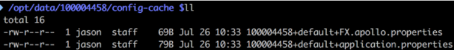

# 准备工作

## 环境要求

- Java: 1.7+
- Guava: 15.0+

## 必选设置

Apollo客户端依赖于`AppId`，`Apollo Meta Server`等环境信息来工作，做正确的配置：

### AppId

AppId是应用的身份信息，是从服务端获取配置的一个重要信息。

有以下几种方式设置，按照优先级从高到低分别为：

1. System Property

Apollo 0.7.0+支持通过System Property传入app.id信息，如

```
-Dapp.id=YOUR-APP-ID
```

1. 操作系统的System Environment

Apollo 1.4.0+支持通过操作系统的System Environment `APP_ID`来传入app.id信息，如

```
APP_ID=YOUR-APP-ID
```

1. Spring Boot application.properties

Apollo 1.0.0+支持通过Spring Boot的application.properties文件配置，如

```
app.id=YOUR-APP-ID
```

> 该配置方式不适用于多个war包部署在同一个tomcat的使用场景

4. app.properties

确保classpath:/META-INF/app.properties文件存在，并且其中内容形如：

```shell
app.id=YOUR-APP-ID
```


## Apollo Meta Server

Apollo支持应用在不同的环境有不同的配置，所以需要在运行提供给Apollo客户端当前环境的[Apollo Meta Server](https://github.com/ctripcorp/apollo/wiki/Apollo配置中心设计#133-meta-server)信息。默认情况下，meta server和config service是部署在同一个JVM进程，所以meta server的地址就是config service的地址。

为了实现meta server的高可用，推荐通过SLB（Software Load Balancer）做动态负载均衡。Meta server地址也可以填入IP，如`http://1.1.1.1:8080,http://2.2.2.2:8080`，不过生产环境还是建议使用域名（走slb），因为机器扩容、缩容等都可能导致IP列表的变化。

1.0.0版本开始支持以下方式配置apollo meta server信息，按照 **优先级从高到低**分别为：

1. 通过Java System Property

    

   ```
   apollo.meta
   ```

   - 可以通过Java的System Property `apollo.meta`来指定

   - 在Java程序启动脚本中，可以指定

     ```
     -Dapollo.meta=http://config-service-url
     ```

     - 如果是运行jar文件，需要注意格式是`java -Dapollo.meta=http://config-service-url -jar xxx.jar`

   - 也可以通过程序指定，如`System.setProperty("apollo.meta", "http://config-service-url");`

2. 通过Spring Boot的配置文件
      - 可以在Spring Boot的`application.properties`或`bootstrap.properties`中指定`apollo.meta=http://config-service-url`
      
      > 该配置方式不适用于多个war包部署在同一个tomcat的使用场景
      
3. 通过操作系统的System Environment

      ```
      APOLLO_META
      ```

      - 可以通过操作系统的System Environment `APOLLO_META`来指定
      - 注意key为全大写，且中间是`_`分隔

4. 通过

      ```
      server.properties
      ```

      配置文件

      - 可以在`server.properties`配置文件中指定`apollo.meta=http://config-service-url`
      - 对于Mac/Linux，文件位置为`/opt/settings/server.properties`
      - 对于Windows，文件位置为`C:\opt\settings\server.properties`

5. 通过

      ```
      app.properties
      ```

      配置文件

      - 可以在`classpath:/META-INF/app.properties`指定`apollo.meta=http://config-service-url`

6. 通过Java system property

   ​    

      ```
      ${env}_meta
      ```

      - 如果当前[env](https://github.com/ctripcorp/apollo/wiki/Java客户端使用指南#1241-environment)是`dev`，那么用户可以配置`-Ddev_meta=http://config-service-url`
      - 使用该配置方式，那么就必须要正确配置Environment，详见[1.2.4.1 Environment](https://github.com/ctripcorp/apollo/wiki/Java客户端使用指南#1241-environment)

7. 通过操作系统的System Environment

   ​    

      ```
      ${ENV}_META
      ```

   ​    

      (1.2.0版本开始支持)

      - 如果当前[env](https://github.com/ctripcorp/apollo/wiki/Java客户端使用指南#1241-environment)是`dev`，那么用户可以配置操作系统的System Environment `DEV_META=http://config-service-url`
      - 注意key为全大写
      - 使用该配置方式，那么就必须要正确配置Environment，详见[1.2.4.1 Environment](https://github.com/ctripcorp/apollo/wiki/Java客户端使用指南#1241-environment)

8. 通过

      ```
      apollo-env.properties
      ```

      文件

      - 用户也可以创建一个`apollo-env.properties`，放在程序的classpath下，或者放在spring boot应用的config目录下
      - 使用该配置方式，那么就必须要正确配置Environment，详见[1.2.4.1 Environment](https://github.com/ctripcorp/apollo/wiki/Java客户端使用指南#1241-environment)
      - 文件内容形如：

```
dev.meta=http://1.1.1.1:8080
fat.meta=http://apollo.fat.xxx.com
uat.meta=http://apollo.uat.xxx.com
pro.meta=http://apollo.xxx.com
```

> 如果通过以上各种手段都无法获取到Meta Server地址，Apollo最终会fallback到`http://apollo.meta`作为Meta Server地址

### 自定义Apollo Meta Server地址定位逻辑

在1.0.0版本中，Apollo提供了[MetaServerProvider SPI](https://github.com/ctripcorp/apollo/blob/master/apollo-core/src/main/java/com/ctrip/framework/apollo/core/spi/MetaServerProvider.java)，用户可以注入自己的MetaServerProvider来自定义Meta Server地址定位逻辑。

由于我们使用典型的[Java Service Loader模式](https://docs.oracle.com/javase/7/docs/api/java/util/ServiceLoader.html)，所以实现起来还是比较简单的。

有一点需要注意的是，apollo会在运行时按照顺序遍历所有的MetaServerProvider，直到某一个MetaServerProvider提供了一个非空的Meta Server地址，因此用户需要格外注意自定义MetaServerProvider的Order。规则是较小的Order具有较高的优先级，因此Order=0的MetaServerProvider会排在Order=1的MetaServerProvider的前面。

**如果你的公司有很多应用需要接入Apollo，建议封装一个jar包，然后提供自定义的Apollo Meta Server定位逻辑，从而可以让接入Apollo的应用零配置使用。比如自己写一个`xx-company-apollo-client`，该jar包依赖`apollo-client`，在该jar包中通过spi方式定义自定义的MetaServerProvider实现，然后应用直接依赖`xx-company-apollo-client`即可。**

MetaServerProvider的实现可以参考[LegacyMetaServerProvider](https://github.com/ctripcorp/apollo/blob/master/apollo-core/src/main/java/com/ctrip/framework/apollo/core/internals/LegacyMetaServerProvider.java)和[DefaultMetaServerProvider](https://github.com/ctripcorp/apollo/blob/master/apollo-client/src/main/java/com/ctrip/framework/apollo/internals/DefaultMetaServerProvider.java)。

### 跳过Apollo Meta Server服务发现

> 适用于apollo-client 0.11.0及以上版本

一般情况下都建议使用Apollo的Meta Server机制来实现Config Service的服务发现，从而可以实现Config Service的高可用。不过apollo-client也支持跳过Meta Server服务发现，主要用于以下场景：

1. Config Service部署在公有云上，注册到Meta Server的是内网地址，本地开发环境无法直接连接
   - 如果通过公网 SLB 对外暴露 Config Service的话，记得要设置 IP 白名单，避免数据泄露
2. Config Service部署在docker环境中，注册到Meta Server的是docker内网地址，本地开发环境无法直接连接
3. Config Service部署在kubernetes中，希望使用kubernetes自带的服务发现能力（Service）

针对以上场景，可以通过直接指定Config Service地址的方式来跳过Meta Server服务发现，按照优先级从高到低分别为：

1. 通过Java System Property

    

   ```
   apollo.configService
   ```

   - 可以通过Java的System Property `apollo.configService`来指定

   - 在Java程序启动脚本中，可以指定

     ```
     -Dapollo.configService=http://config-service-url:port
     ```

     - 如果是运行jar文件，需要注意格式是`java -Dapollo.configService=http://config-service-url:port -jar xxx.jar`

   - 也可以通过程序指定，如`System.setProperty("apollo.configService", "http://config-service-url:port");`

2. 通过操作系统的System Environment

   ```
   APOLLO_CONFIGSERVICE
   ```

   - 可以通过操作系统的System Environment `APOLLO_CONFIGSERVICE`来指定
   - 注意key为全大写，且中间是`_`分隔

3. 通过

   ```
   server.properties
   ```

   配置文件

   - 可以在`server.properties`配置文件中指定`apollo.configService=http://config-service-url:port`
   - 对于Mac/Linux，文件位置为`/opt/settings/server.properties`
   - 对于Windows，文件位置为`C:\opt\settings\server.properties`

## 本地缓存路径

Apollo客户端会把从服务端获取到的配置在本地文件系统缓存一份，用于在遇到服务不可用，或网络不通的时候，依然能从本地恢复配置，不影响应用正常运行。

本地缓存路径默认位于以下路径，所以请确保`/opt/data`或`C:\opt\data\`目录存在，且应用有读写权限。

- **Mac/Linux**: /opt/data/{*appId*}/config-cache
- **Windows**: C:\opt\data\{*appId*}\config-cache

本地配置文件会以下面的文件名格式放置于本地缓存路径下：

***{appId}+{cluster}+{namespace}.properties\***

- appId就是应用自己的appId，如100004458
- cluster就是应用使用的集群，一般在本地模式下没有做过配置的话，就是default
- namespace就是应用使用的配置namespace，一般是application



文件内容以properties格式存储，比如如果有两个key，一个是request.timeout，另一个是batch，那么文件内容就是如下格式：

```
request.timeout=2000
batch=2000
```

### 自定义缓存路径

1.0.0版本开始支持以下方式自定义缓存路径，按照优先级从高到低分别为：

1. 通过Java System Property

    

   ```
   apollo.cacheDir
   ```

   - 可以通过Java的System Property `apollo.cacheDir`来指定

   - 在Java程序启动脚本中，可以指定

     ```
     -Dapollo.cacheDir=/opt/data/some-cache-dir
     ```

     - 如果是运行jar文件，需要注意格式是`java -Dapollo.cacheDir=/opt/data/some-cache-dir -jar xxx.jar`

   - 也可以通过程序指定，如`System.setProperty("apollo.cacheDir", "/opt/data/some-cache-dir");`

2. 通过Spring Boot的配置文件

   - 可以在Spring Boot的`application.properties`或`bootstrap.properties`中指定`apollo.cacheDir=/opt/data/some-cache-dir`

3. 通过操作系统的System Environment

   ```
   APOLLO_CACHEDIR
   ```

   - 可以通过操作系统的System Environment `APOLLO_CACHEDIR`来指定
   - 注意key为全大写，且中间是`_`分隔

4. 通过

   ```
   server.properties
   ```

   配置文件

   - 可以在`server.properties`配置文件中指定`apollo.cacheDir=/opt/data/some-cache-dir`
   - 对于Mac/Linux，文件位置为`/opt/settings/server.properties`
   - 对于Windows，文件位置为`C:\opt\settings\server.properties`

> 注：本地缓存路径也可用于容灾目录，如果应用在所有config service都挂掉的情况下需要扩容，那么也可以先把配置从已有机器上的缓存路径复制到新机器上的相同缓存路径

## 可选设置

### Environment

nvironment可以通过以下3种方式的任意一个配置：

1. 通过Java System Property

   - 可以通过Java的System Property `env`来指定环境

   - 在Java程序启动脚本中，可以指定

     ```
     -Denv=YOUR-ENVIRONMENT
     ```

     - 如果是运行jar文件，需要注意格式是`java -Denv=YOUR-ENVIRONMENT -jar xxx.jar`

   - 注意key为全小写

2. 通过操作系统的System Environment

   - 还可以通过操作系统的System Environment `ENV`来指定
   - 注意key为全大写

3. 通过配置文件

   - 最后一个推荐的方式是通过配置文件来指定`env=YOUR-ENVIRONMENT`
   - 对于Mac/Linux，文件位置为`/opt/settings/server.properties`
   - 对于Windows，文件位置为`C:\opt\settings\server.properties`

文件内容形如：

```
env=DEV
```

目前，`env`支持以下几个值（大小写不敏感）：

- DEV （开发）
  - Development environment
- FAT (分支验收)
  - Feature Acceptance Test environment
- UAT （用户验收  灰度）
  - User Acceptance Test environment
- PRO （线上产品）
  - Production environment

更多环境定义，可以参考[Env.java](https://github.com/ctripcorp/apollo/blob/master/apollo-core/src/main/java/com/ctrip/framework/apollo/core/enums/Env.java)

### Cluster（集群）

Apollo支持配置按照集群划分，也就是说对于一个appId和一个环境，对不同的集群可以有不同的配置。

1.0.0版本开始支持以下方式集群，按照优先级从高到低分别为：

1. 通过Java System Property

    

   ```
   apollo.cluster
   ```

   - 可以通过Java的System Property `apollo.cluster`来指定

   - 在Java程序启动脚本中，可以指定

     ```
     -Dapollo.cluster=SomeCluster
     ```

     - 如果是运行jar文件，需要注意格式是`java -Dapollo.cluster=SomeCluster -jar xxx.jar`

   - 也可以通过程序指定，如`System.setProperty("apollo.cluster", "SomeCluster");`

2. 通过Spring Boot的配置文件

   - 可以在Spring Boot的`application.properties`或`bootstrap.properties`中指定`apollo.cluster=SomeCluster`

3. 通过Java System Property

   - 可以通过Java的System Property `idc`来指定环境

   - 在Java程序启动脚本中，可以指定

     ```
     -Didc=xxx
     ```

     - 如果是运行jar文件，需要注意格式是`java -Didc=xxx -jar xxx.jar`

   - 注意key为全小写

4. 通过操作系统的System Environment

   - 还可以通过操作系统的System Environment `IDC`来指定
   - 注意key为全大写

5. 通过

   ```
   server.properties
   ```

   配置文件

   - 可以在`server.properties`配置文件中指定`idc=xxx`
   - 对于Mac/Linux，文件位置为`/opt/settings/server.properties`
   - 对于Windows，文件位置为`C:\opt\settings\server.properties`

#### **Cluster Precedence**（集群顺序）

1. 如果`apollo.cluster`和`idc`（互联网数据中心 Internet Data Center）同时指定：
   - 我们会首先尝试从`apollo.cluster`指定的集群加载配置
   - 如果没找到任何配置，会尝试从`idc`指定的集群加载配置
   - 如果还是没找到，会从默认的集群（`default`）加载
2. 如果只指定了`apollo.cluster`：
   - 我们会首先尝试从`apollo.cluster`指定的集群加载配置
   - 如果没找到，会从默认的集群（`default`）加载
3. 如果只指定了`idc`：
   - 我们会首先尝试从`idc`指定的集群加载配置
   - 如果没找到，会从默认的集群（`default`）加载
4. 如果`apollo.cluster`和`idc`都没有指定：
   - 我们会从默认的集群（`default`）加载配置

### 设置内存中的配置项是否保持和页面上的顺序一致

> 适用于1.6.0及以上版本

默认情况下，apollo client内存中的配置存放在Properties中（底下是Hashtable），不会刻意保持和页面上看到的顺序一致，对绝大部分的场景是没有影响的。不过有些场景会强依赖配置项的顺序（如spring cloud zuul的路由规则），针对这种情况，可以开启OrderedProperties特性来使得内存中的配置顺序和页面上看到的一致。

配置方式按照优先级从高到低分别为：

1. 通过Java System Property

    

   ```
   apollo.property.order.enable
   ```

   - 可以通过Java的System Property `apollo.property.order.enable`来指定

   - 在Java程序启动脚本中，可以指定

     ```
     -Dapollo.property.order.enable=true
     ```

     - 如果是运行jar文件，需要注意格式是`java -Dapollo.property.order.enable=true -jar xxx.jar`

   - 也可以通过程序指定，如`System.setProperty("apollo.property.order.enable", "true");`

2. 通过Spring Boot的配置文件

   - 可以在Spring Boot的`application.properties`或`bootstrap.properties`中指定`apollo.property.order.enable=true`

3. 通过

   ```
   app.properties
   ```

   配置文件

   - 可以在`classpath:/META-INF/app.properties`指定`apollo.property.order.enable=true`

### 配置访问密钥

> 适用于1.6.0及以上版本

Apollo从1.6.0版本开始增加访问密钥机制，从而只有经过身份验证的客户端才能访问敏感配置。如果应用开启了访问密钥，客户端需要配置密钥，否则无法获取配置。

配置方式按照优先级从高到低分别为：

1. 通过Java System Property

    

   ```
   apollo.accesskey.secret
   ```

   - 可以通过Java的System Property `apollo.accesskey.secret`来指定

   - 在Java程序启动脚本中，可以指定

     ```
     -Dapollo.accesskey.secret=1cf998c4e2ad4704b45a98a509d15719
     ```

     - 如果是运行jar文件，需要注意格式是`java -Dapollo.accesskey.secret=1cf998c4e2ad4704b45a98a509d15719 -jar xxx.jar`

   - 也可以通过程序指定，如`System.setProperty("apollo.accesskey.secret", "1cf998c4e2ad4704b45a98a509d15719");`

2. 通过Spring Boot的配置文件

   - 可以在Spring Boot的`application.properties`或`bootstrap.properties`中指定`apollo.accesskey.secret=1cf998c4e2ad4704b45a98a509d15719`

3. 通过操作系统的System Environment

   - 还可以通过操作系统的System Environment `APOLLO_ACCESSKEY_SECRET`来指定
   - 注意key为全大写

4. 通过

   ```
   app.properties
   ```

   配置文件

   - 可以在`classpath:/META-INF/app.properties`指定`apollo.accesskey.secret=1cf998c4e2ad4704b45a98a509d15719`

# Maven Dependency

Apollo的客户端jar包已经上传到中央仓库，应用在实际使用时只需要按照如下方式引入即可。

```xml
<dependency>
    <groupId>com.ctrip.framework.apollo</groupId>
    <artifactId>apollo-client</artifactId>
    <version>1.1.0</version>
</dependency>
```

# 客户端的用法

Apollo支持API方式和Spring整合方式，该怎么选择用哪一种方式？

- API方式灵活，功能完备，配置值实时更新（热发布），支持所有Java环境。

- Spring方式接入简单，结合Spring有N种酷炫的玩法，如

  - Placeholder方式：
    - 代码中直接使用，如：`@Value("${someKeyFromApollo:someDefaultValue}")`
    - 配置文件中使用替换placeholder，如：`spring.datasource.url: ${someKeyFromApollo:someDefaultValue}`
    - 直接托管spring的配置，如在apollo中直接配置`spring.datasource.url=jdbc:mysql://localhost:3306/somedb?characterEncoding=utf8`
  - Spring boot的[@ConfigurationProperties](http://docs.spring.io/spring-boot/docs/current/api/org/springframework/boot/context/properties/ConfigurationProperties.html)方式
  - 从v0.10.0开始的版本支持placeholder在运行时自动更新，具体参见[PR #972](https://github.com/ctripcorp/apollo/pull/972)。（v0.10.0之前的版本在配置变化后不会重新注入，需要重启才会更新，如果需要配置值实时更新，可以参考后续[3.2.2 Spring Placeholder的使用](https://github.com/ctripcorp/apollo/wiki/Java客户端使用指南#322-spring-placeholder的使用)的说明）

- Spring方式也可以结合API方式使用，如注入Apollo的Config对象，就可以照常通过API方式获取配置了：

  ```
  @ApolloConfig
  private Config config; //inject config for namespace application
  ```

- 更多有意思的实际使用场景和示例代码，请参考[apollo-use-cases](https://github.com/ctripcorp/apollo-use-cases)

## API使用方式

API方式是最简单、高效使用Apollo配置的方式，不依赖Spring框架即可使用。

### 获取默认namespace的配置（application）

```java
Config config = ConfigService.getAppConfig(); //config instance is singleton for each namespace and is never null
String someKey = "someKeyFromDefaultNamespace";
String someDefaultValue = "someDefaultValueForTheKey";
String value = config.getProperty(someKey, someDefaultValue);
```

通过上述的**config.getProperty**可以获取到someKey对应的实时最新的配置值。

另外，配置值从内存中获取，所以不需要应用自己做缓存。

### 监听配置变化事件

监听配置变化事件只在应用真的关心配置变化，需要在配置变化时得到通知时使用，比如：数据库连接串变化后需要重建连接等。

如果只是希望每次都取到最新的配置的话，只需要按照上面的例子，调用**config.getProperty**即可。

```java
Config config = ConfigService.getAppConfig(); //config instance is singleton for each namespace and is never null
config.addChangeListener(new ConfigChangeListener() {
    @Override
    public void onChange(ConfigChangeEvent changeEvent) {
        System.out.println("Changes for namespace " + changeEvent.getNamespace());
        for (String key : changeEvent.changedKeys()) {
            ConfigChange change = changeEvent.getChange(key);
            System.out.println(String.format("Found change - key: %s, oldValue: %s, newValue: %s, changeType: %s", change.getPropertyName(), change.getOldValue(), change.getNewValue(), change.getChangeType()));
        }
    }
});
```

### 获取公共Namespace的配置

```java
String somePublicNamespace = "CAT";
Config config = ConfigService.getConfig(somePublicNamespace); //config instance is singleton for each namespace and is never null
String someKey = "someKeyFromPublicNamespace";
String someDefaultValue = "someDefaultValueForTheKey";
String value = config.getProperty(someKey, someDefaultValue);
```

### 获取非properties格式namespace的配置

#### yaml/yml格式的namespace

apollo-client 1.3.0版本开始对yaml/yml做了更好的支持，使用起来和properties格式一致。

```java
Config config = ConfigService.getConfig("application.yml");
String someKey = "someKeyFromYmlNamespace";
String someDefaultValue = "someDefaultValueForTheKey";
String value = config.getProperty(someKey, someDefaultValue);
```

#### 非yaml/yml格式的namespace

获取时需要使用`ConfigService.getConfigFile`接口并指定Format，如`ConfigFileFormat.XML`。

```java
String someNamespace = "test";
ConfigFile configFile = ConfigService.getConfigFile("test", ConfigFileFormat.XML);
String content = configFile.getContent();
```

## Spring整合方式

。。。。


# 参考

- [Java客户端使用指南 · ctripcorp/apollo Wiki · GitHub](https://github.com/ctripcorp/apollo/wiki/Java客户端使用指南)

