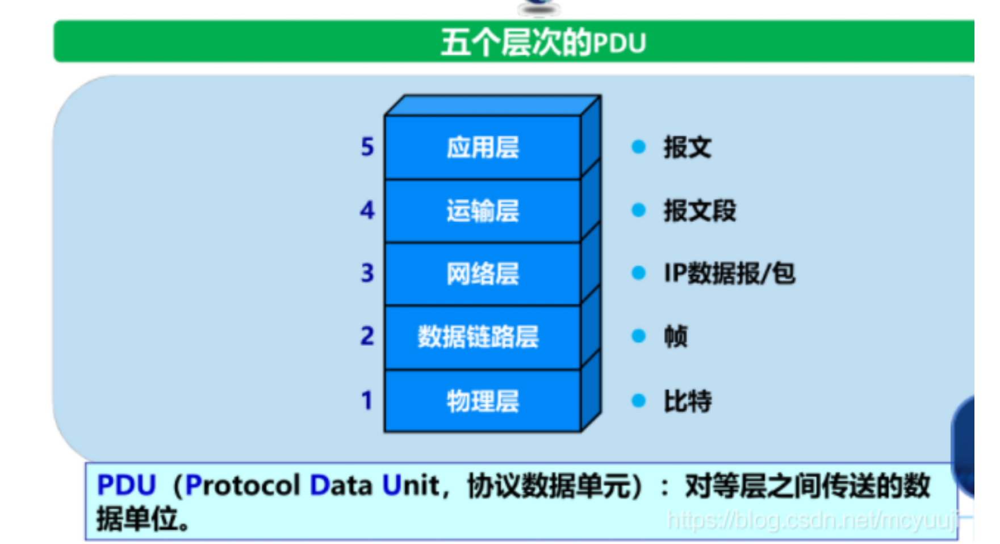

# 概述

## 基本概念

###  链路，结点，协议和服务，实体和对等实体，各层PDU (protocol data unit)

1. 链路：连接结点的称为链路，可以是铜缆，光纤，卫星等；
2. 结点：可以是计算机，集线器，交换机或路由器等；
3. 协议：两个对等实体之间的通信规则。协议规定了通信实体之间所交换的消息的格式、意义、顺序以及针对收到信息或发生的事件所采取的动作。协议有三要素：语法（数据与控制信息的结构或格式、信号电平）、语义（需要发出何种控制信息、完成何种动作以及做出何种响应、差错控制）、时序（事件顺序、速度匹配）；
4. 服务：在协议的控制下，本层向上一层提供服务，本层使用下一层所提供的服务；
5. 实体：任何可发送或接收信息的硬件或软件进程；
6. 对等实体：位于同等层中相互通信的两个实体。对等实体之间处理相同的PDU。
7. **各层PDU**：PDU:对等层之间传送的数据单位。

###  C/S模式，B/S模式，P2P模式

1. C/S模式：也即客户-服务器方式。客户是服务请求方，服务器是服务提供方。客户必须知道服务器的地址，反之不必
2. B/S模式：也即浏览器-服务器方式。在服务器安装SQLserver，MYSQL等数据库，浏览器通过web server同数据库进行数据交换
3. P2P模式：对等方式，通信在对等实体之间直接进行。每一个主机既是客户又是服务器，本质上仍是C/S

### LAN,WAN,MAN,PAN的划分

LAN,WAN,MAN,PAN的划分：按照网络的作用范围进行分类，分别为：

- 广域网WAN（几十到几千公里）、
- 城域网MAN（5~50KM）、
- 局域网LAN（1km左右）、
- 个人局域网PAN（10米左右）

### 网络性能参数：速率，带宽，吞吐量，时延，往返时间，信道利用率

1. 速率：数据的传送速率，单位是Bit/s

2. 带宽:在计算机网络中，网络带宽表示单位时间内网络中某信道所能通过的“最高数据率”，单位为bit/s

3. 吞吐量:表示在发送端与接收端之间实际的传送数据速率（bit/s）

4. 时延:指数据从网络的一端传送到另外一端所需的时间。

   1. 发送时延：是主机或路由器发送数据帧所需要的时间。公式为：数据帧长度（bit）/发送速率（bit/s）
   2. 传播时延：是电磁波在信道中传播一定的距离需要花费的时间。公式为：信道长度（m）/电磁波在信道上的传播速率（m/s）
   3. 处理时延：主机或路由器在收到分组时要花费一定的时间进行处理
   4. 排队时延：在分组进入路由器后要先在输入队列中排队等待处理

5. 往返时间:从发送方发送数据开始，到发送方收到来自接受方的确认，总共经历的时间

6. 信道利用率:指某信道有百分之几的时间是有数据通过的

  1. 信道利用率并非越高越好，因为当利用率增大时，该信道引起的时延也就迅速增加

## 2. 互联网的组成（边缘部分与核心部分的作用）

边缘部分：各种端系统如主机，手机，大型或超级计算机组成。位于网络边缘；

运行网络应用程序核心部分：互联的路由器网络。关键功能：路由和转发，其中交换机是在同一个子网内部转发数据，路由器是在不同子网之间转发数据。以数据交换的方式实现数据从源主机通过网络核心到达目的主机。

## 3.电路交换与分组交换，数据报交换和虚电路交换的特点

1. 电路交换：最经典的电路交换网络是电话网络。主要特点就是独占资源。电路交换的三个阶段：建立连接（呼叫）、通信、释放连接（挂机）。用多路复用技术解决一条链路被多路通信共享的问题

2. 分组交换：

   1. 报文：源应用发送的信息整体

      分组：由报文拆分成较小的数据块

   2. 1. 在发送端，先把较长的报文划分成较短的，固定长度的数据段
      2. 每一个数据段前面添加上首部构成分组。每一个分组的首部都含有地址等控制信息
      3. 依次把各分组发送到接收端。每个分组在互联网中独立地选择传输路径
      4. 接收端收到分组后剥去首部还原成报文

   3. 