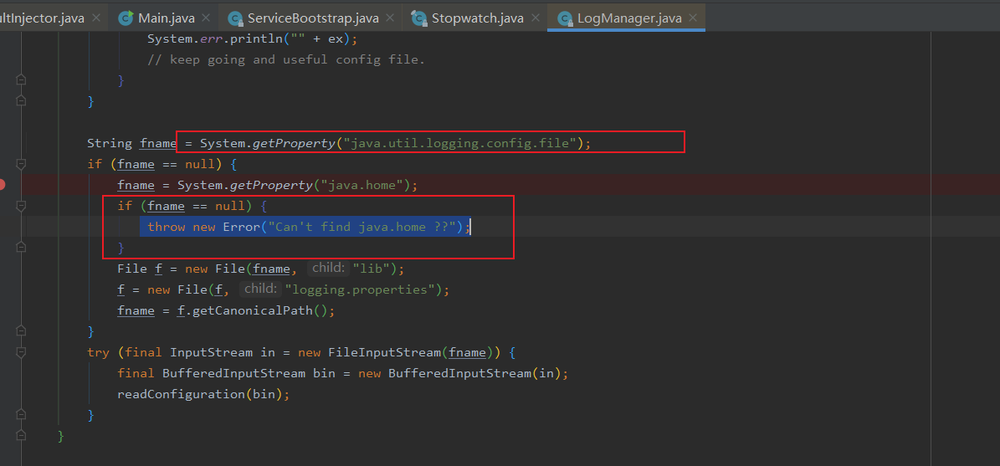

# java.lang.NoClassDefFoundError: Could not initialize java.util.Currency

昨天在服务器上出现了这个错误。这个类是JDK里面的，按理说不应该出问题。后来看了下 java.util.Currency的源代码，在static方法中，要load一个currency.data的配置文件。检查了下，服务器上的jdk果然没有这个文件。正是因为缺少了这个文件，classLoader在load这个class的过程中，static方法调用失败了，抛出异常，最后异常被包装为NoClassDefFoundError.

后来从开发机器上jdk/jre/lib/下面的copy一个currency.data过去，放到jdk/lib下面，和jdk/jre/lib下面，搞定。

# java.lang.Error: Can't find java.home ??

检查确认 是 开发环境中  的环境变量 `JAVA_HOME` 配置有错误，配置了 jre 的路径并非jdk的。修改后，问题解决。

## java.util.logging.config.file 和 java.home 都无法加载



解决方案：

`-Djava.util.logging.config.file=log.properties`仅适用于文件`log.properties`位于Java进程的当前目录中（可能非常随机）。所以你应该在这里使用绝对路径。

另一种解决方案是将文件`logging.properties`移动到`$JAVA_HOME/lib/`（或编辑应该在那里的文件）。在这种情况下，您不需要设置系统属性。


## 服务启动：集成apollo配置中心  启动服务后报错

```shell
com.ctrip.framework.apollo.internals.AbstractConfigRepository - Sync config failed, will retry. 
Cause: Could not complete get operation [Cause: java.lang.IllegalStateException: Expected BEGIN_ARRAY but was STRING at line 1 column 1 path $ [Cause: Expected BEGIN_ARRAY but was STRING at line 1 column 1 path $]]]
```

错误原因：

配置文件 apollo.meta 配错了
注意 **apollo.meta 不是 apollo配置中心(apollo Web管理平台)的ip地址**


