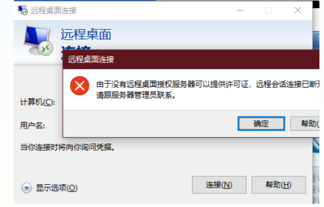
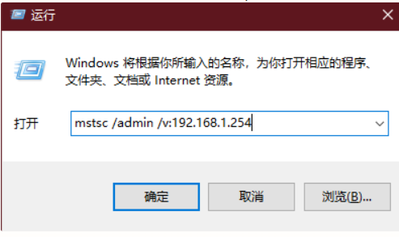

## 处理问题：windows server 2016由于没有远程桌面授权服

 windows server可以多用户同时登陆，默认最大远程登录数量为2，如果有更多人需要同时远程登录，则需要安装远程桌面授权服务，第一次安装后，免费期为120天，超过则无法正常远程登录。

解决办法如下：
  Windows server 2016服务器远程桌面登录时出现错误提示：“由于没有远程桌面授权服务器可以提供许可证，远程会话被中断。请跟服务器管理员联系。”

## 此时可以使用“mstsc /admin /v:目标ip”来强制登录服务器，但只能是管理员身份

## 解决方案

 强行远程登陆系统后，修改注册表。删除如下条目：
HKEY_LOCAL_MACHINE\SYSTEM\CurrentControlSet\Control\Terminal Server\RCM\GracePeriod
如果无法删除，是因为没有权限，修改这个条目的所有者就行了。重启后就会恢复正常。

### 打开注册表的方式1

第一步: 按“win+R”或者点击开始菜单，找到运行，在运行输入框里面输入“regedit”

第二步点击确定之后，进去注册表编辑器

### 打开注册表的方式2

第一步： 在C:\Windows\System32目录中找到“regedt32.exe”

第二步： 点击运行之后，我们可以看到已经打开了注册表编辑器

