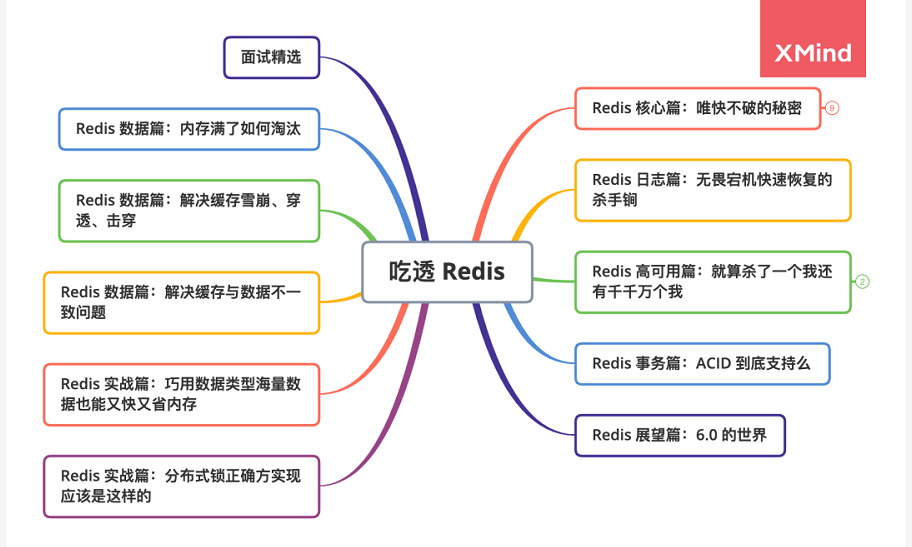
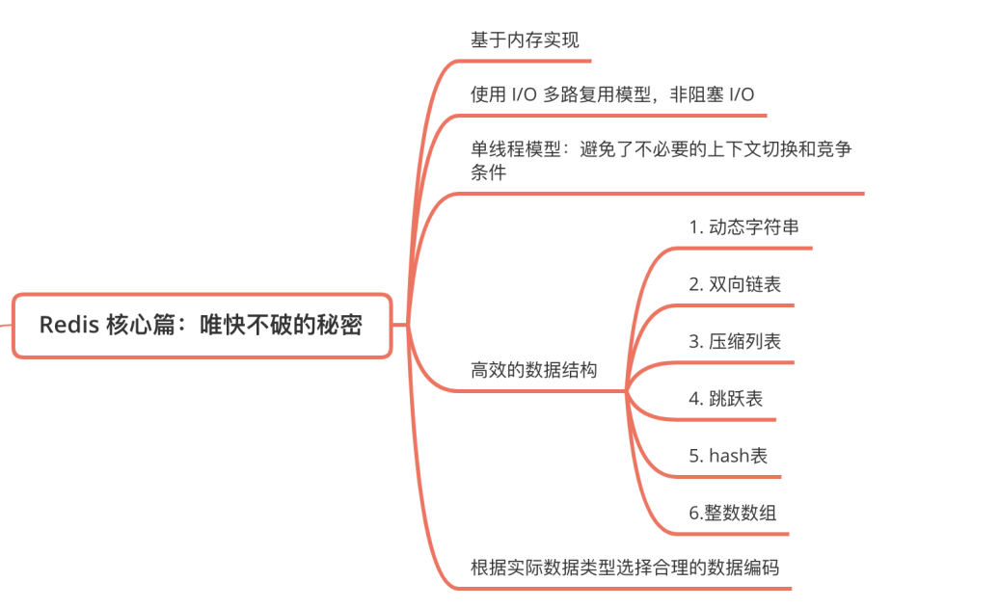
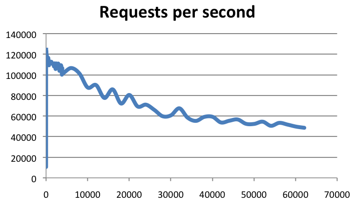
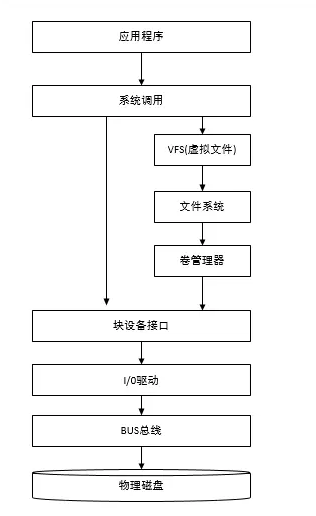
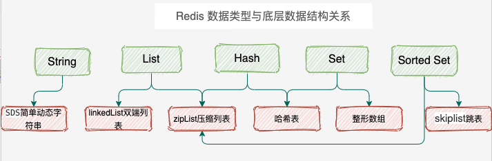
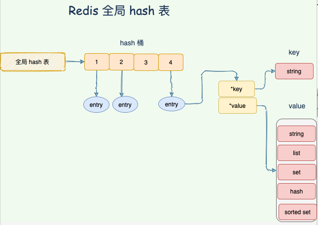
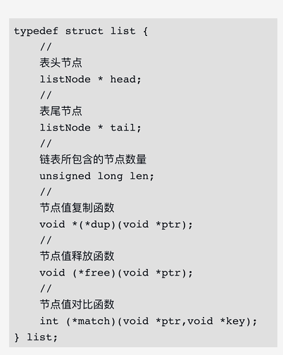
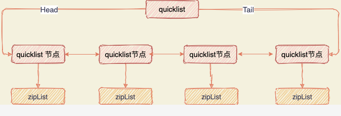

# Redis 全景图

- 应用维度：缓存使用、集群应用、数据结构的巧妙使用
- 系统维度：
  1. 高性能：线程模型，网络IO模型、数据结构、持久化机制
  2. 高可用：主从复制，哨兵集群，Cluster分片集群
  3. 高拓展：负载均衡 



## 唯快不破的秘密

Redis 为了高性能，从各方各面都进行了优化。



根据官方数据，Redis 的 QPS 可以达到约 100000（每秒请求数），有兴趣的可以参考官方的基准程序测试《How fast is Redis？》，地址：https://redis.io/topics/benchmarks



横轴是连接数，纵轴是 QPS

### 完全基于内存实现

#### 磁盘调用栈图



#### 内存操作

内存直接由 CPU 控制，也就是 CPU 内部集成的内存控制器，所以说内存是直接与 CPU 对接，享受与 CPU 通信的最优带宽。

**Redis 将数据存储在内存中，读写操作不会因为磁盘的 IO 速度限制，所以速度很快！**

最后以一张图量化系统的各种延时时间（部分数据引用 Brendan Gregg）


### 高效的数据结构

Redis 提供给我们使用的 5 种数据类型：String、List、Hash、Set、SortedSet。

在 Redis 中，常用的 5 种数据类型和应用场景如下：

- **String：** 缓存、计数器、分布式锁等。
- **List：** 链表、队列、微博关注人时间轴列表等。
- **Hash：** 用户信息、Hash 表等。
- **Set：** 去重、赞、踩、共同好友等。
- **Zset：** 访问量排行榜、点击量排行榜等。

每种数据类型都有一种或者多种数据结构来支撑，底层数据结构有 6 种。



#### Redis hash 字典

Redis 整体就是一个 哈希表来保存所有的键值对，无论数据类型是 5 种的任意一种。哈希表，本质就是一个数组，每个元素被叫做哈希桶，不管什么数据类型，每个桶里面的 entry 保存着实际具体值的指针。



整个数据库就是一个**全局哈希表**，而哈希表的时间复杂度是 O(1)，只需要计算每个键的哈希值，便知道对应的哈希桶位置，定位桶里面的 entry 找到对应数据，这个也是 Redis 快的原因之一。

**那 Hash 冲突怎么办？**

当写入 Redis 的数据越来越多的时候，哈希冲突不可避免，

Redis 通过**链式哈希**解决冲突：**也就是同一个 桶里面的元素使用链表保存**。但是当链表过长就会导致查找性能变差可能，所以 Redis 为了追求快，使用了两个全局哈希表。用于 rehash 操作，增加现有的哈希桶数量，减少哈希冲突。

开始默认使用 hash 表 1 保存键值对数据，哈希表 2 此刻没有分配空间。当数据越来多触发 rehash 操作，则执行以下操作：

1. 给 hash 表 2 分配更大的空间；
2. 将 hash 表 1 的数据重新映射拷贝到 hash 表 2 中；
3. 释放 hash 表 1 的空间。

**值得注意的是，将 hash 表 1 的数据重新映射到 hash 表 2 的过程中并不是一次性的，这样会造成 Redis 阻塞，无法提供服务。**

而是采用了**渐进式 rehash**，每次处理客户端请求的时候，先从 hash 表 1 中第一个索引开始，将这个位置的 所有数据拷贝到 hash 表 2 中，就这样将 rehash 分散到多次请求过程中，避免耗时阻塞。


### SDS 简单动态字符

字符串结构使用最广泛，通常我们用于缓存登陆后的用户信息，key = userId，value = 用户信息 JSON 序列化成字符串。

C 语言中字符串的获取 「MageByte」的长度，要从头开始遍历，直到 「\0」为止，Redis 作为唯快不破的男人是不能忍受的。

C 语言字符串结构与 SDS 字符串结构对比图如下所示：


#### SDS 与 C 字符串区别

**O(1) 时间复杂度获取字符串长度**

C 语言字符串布吉路长度信息，需要遍历整个字符串时间复杂度为 O(n)，C 字符串遍历时遇到 '\0' 时结束。

SDS 中 len 保存这字符串的长度，O(1) 时间复杂度。

**空间预分配**

SDS 被修改后，程序不仅会为 SDS 分配所需要的必须空间，还会分配额外的未使用空间。

分配规则如下：如果对 SDS 修改后，len 的长度小于 1M，那么程序将分配和 len 相同长度的未使用空间。举个例子，如果 len=10，重新分配后，buf 的实际长度会变为 10(已使用空间)+10(额外空间)+1(空字符)=21。如果对 SDS 修改后 len 长度大于 1M，那么程序将分配 1M 的未使用空间。

**惰性空间释放**

当对 SDS 进行缩短操作时，程序并不会回收多余的内存空间，而是使用 free 字段将这些字节数量记录下来不释放，后面如果需要 append 操作，则直接使用 free 中未使用的空间，减少了内存的分配。

**二进制安全**

在 Redis 中不仅可以存储 String 类型的数据，也可能存储一些二进制数据。

二进制数据并不是规则的字符串格式，其中会包含一些特殊的字符如 '\0'，在 C 中遇到 '\0' 则表示字符串的结束，但在 SDS 中，标志字符串结束的是 len 属性。

### zipList 压缩列表

压缩列表是 List 、hash、 sorted Set 三种数据类型底层实现之一。

当一个列表只有少量数据的时候，并且每个列表项要么就是小整数值，要么就是长度比较短的字符串，那么 Redis 就会使用压缩列表来做列表键的底层实现。

ziplist 是由一系列特殊编码的连续内存块组成的顺序型的数据结构，ziplist 中可以包含多个 entry 节点，每个节点可以存放整数或者字符串。

ziplist 在表头有三个字段 zlbytes、zltail 和 zllen，分别表示列表占用字节数、列表尾的偏移量和列表中的 entry 个数；压缩列表在表尾还有一个 zlend，表示列表结束。

```c++
struct ziplist<T> {
    int32 zlbytes; // 整个压缩列表占用字节数
    int32 zltail_offset; // 最后一个元素距离压缩列表起始位置的偏移量，用于快速定位到最后一个节点
    int16 zllength; // 元素个数
    T[] entries; // 元素内容列表，挨个挨个紧凑存储
    int8 zlend; // 标志压缩列表的结束，值恒为 0xFF
}
```


如果我们要查找定位第一个元素和最后一个元素，可以通过表头三个字段的长度直接定位，复杂度是 O(1)。而查找其他元素时，就没有这么高效了，只能逐个查找，此时的复杂度就是 O(N)

### 双端列表

Redis List 数据类型通常被用于队列、微博关注人时间轴列表等场景。不管是先进先出的队列，还是先进后出的栈，双端列表都很好的支持这些特性。



Redis 的链表实现的特性可以总结如下：

- 双端：链表节点带有 prev 和 next 指针，获取某个节点的前置节点和后置节点的复杂度都是 O（1）。
- 无环：表头节点的 prev 指针和表尾节点的 next 指针都指向 NULL，对链表的访问以 NULL 为终点。
- 带表头指针和表尾指针：通过 list 结构的 head 指针和 tail 指针，程序获取链表的表头节点和表尾节点的复杂度为 O（1）。
- 带链表长度计数器：程序使用 list 结构的 len 属性来对 list 持有的链表节点进行计数，程序获取链表中节点数量的复杂度为 O（1）。
- 多态：链表节点使用 void* 指针来保存节点值，并且可以通过 list 结构的 dup、free、match 三个属性为节点值设置类型特定函数，所以链表可以用于保存各种不同类型的值。

后续版本对列表数据结构进行了改造，使用 quicklist 代替了 ziplist 和 linkedlist。

**quicklist 是 ziplist 和 linkedlist 的混合体，它将 linkedlist 按段切分，每一段使用 ziplist 来紧凑存储，多个 ziplist 之间使用双向指针串接起来。**



这也是为何 Redis 快的原因，不放过任何一个可以提升性能的细节。

### skipList 跳跃表

sorted set 类型的排序功能便是通过「跳跃列表」数据结构来实现。

跳跃表（skiplist）是一种有序数据结构，它通过在每个节点中维持多个指向其他节点的指针，从而达到快速访问节点的目的。

跳跃表支持平均 O（logN）、最坏 O（N）复杂度的节点查找，还可以通过顺序性操作来批量处理节点。

跳表在链表的基础上，增加了多层级索引，通过索引位置的几个跳转，实现数据的快速定位，如下图所示：


当需要查找 40 这个元素需要经历 三次查找。

### 整数数组（intset）

当一个集合只包含整数值元素，并且这个集合的元素数量不多时，Redis 就会使用整数集合作为集合键的底层实现。结构如下：

```c#
typedef struct intset{
     //编码方式
     uint32_t encoding;
     //集合包含的元素数量
     uint32_t length;
     //保存元素的数组
     int8_t contents[];
}intset;
```

contents 数组是整数集合的底层实现：整数集合的每个元素都是 contents 数组的一个数组项（item），各个项在数组中按值的大小从小到大有序地排列，并且数组中不包含任何重复项。length 属性记录了整数集合包含的元素数量，也即是 contents 数组的长度。

## 合理的数据编码

Redis 使用对象（redisObject）来表示数据库中的键值，当我们在 Redis 中创建一个键值对时，至少创建两个对象，一个对象是用做键值对的键对象，另一个是键值对的值对象。

例如我们执行 SET MSG XXX 时，键值对的键是一个包含了字符串“MSG“的对象，键值对的值对象是包含字符串"XXX"的对象。

**redisObject**

```c++
typedef struct redisObject{
    //类型
   unsigned type:4;
   //编码
   unsigned encoding:4;
   //指向底层数据结构的指针
   void *ptr;
    //...
 }robj;
```

其中 type 字段记录了对象的类型，包含字符串对象、列表对象、哈希对象、集合对象、有序集合对象。

对于每一种数据类型来说，底层的支持可能是多种数据结构，什么时候使用哪种数据结构，这就涉及到了编码转化的问题。

那我们就来看看，不同的数据类型是如何进行编码转化的：

**String**：存储数字的话，采用 int 类型的编码，如果是非数字的话，采用 raw 编码；

**List**：List 对象的编码可以是 ziplist 或 linkedlist，字符串长度 < 64 字节且元素个数 < 512 使用 ziplist 编码，否则转化为 linkedlist 编码；

注意：这两个条件是可以修改的，在 redis.conf 中：

```conf
list-max-ziplist-entries 512
list-max-ziplist-value 64
```

**Hash**：Hash 对象的编码可以是 ziplist 或 hashtable。

当 Hash 对象同时满足以下两个条件时，Hash 对象采用 ziplist 编码：

- **Hash 对象保存的所有键值对的键和值的字符串长度均小于 64 字节。**
- **Hash 对象保存的键值对数量小于 512 个。**

否则就是 hashtable 编码。

**Set**：Set 对象的编码可以是 intset 或 hashtable，intset 编码的对象使用整数集合作为底层实现，把所有元素都保存在一个整数集合里面。

保存元素为整数且元素个数小于一定范围使用 intset 编码，任意条件不满足，则使用 hashtable 编码；

**Zset**：Zset 对象的编码可以是 ziplist 或 zkiplist，当采用 ziplist 编码存储时，每个集合元素使用两个紧挨在一起的压缩列表来存储。

Ziplist 压缩列表第一个节点存储元素的成员，第二个节点存储元素的分值，并且按分值大小从小到大有序排列。


当 Zset 对象同时满足一下两个条件时，采用 ziplist 编码：

- **Zset 保存的元素个数小于 128。**
- **Zset 元素的成员长度都小于 64 字节。**

如果不满足以上条件的任意一个，ziplist 就会转化为 zkiplist 编码。注意：这两个条件是可以修改的，在 redis.conf 中：

```conf
zset-max-ziplist-entries 128
zset-max-ziplist-value 64
```

## 单线程模型

**我们要明确的是：Redis 的单线程指的是 Redis 的网络 IO 以及键值对指令读写是由一个线程来执行的。** 对于 Redis 的持久化、集群数据同步、异步删除等都是其他线程执行。

至于为啥用单线程，我们先了解多线程有什么缺点。

### 多线程的弊端

使用多线程，通常可以增加系统吞吐量，充分利用 CPU 资源。

但是，使用多线程后，没有良好的系统设计，可能会出现如下图所示的场景，增加了线程数量，前期吞吐量会增加，再进一步新增线程的时候，系统吞吐量几乎不再新增，甚至会下降！


在运行每个任务之前，CPU 需要知道任务在何处加载并开始运行。也就是说，系统需要帮助它预先设置 CPU 寄存器和程序计数器，这称为 CPU 上下文。

这些保存的上下文存储在系统内核中，并在重新计划任务时再次加载。这样，任务的原始状态将不会受到影响，并且该任务将看起来正在连续运行。

**切换上下文时，我们需要完成一系列工作，这是非常消耗资源的操作。**

另外，当多线程并行修改共享数据的时候，为了保证数据正确，需要加锁机制就会带来额外的性能开销，面临的共享资源的并发访问控制问题。

引入多线程开发，就需要使用同步原语来保护共享资源的并发读写，增加代码复杂度和调试难度。

### 单线程又什么好处？

1. 不会因为线程创建导致的性能消耗；
2. 避免上下文切换引起的 CPU 消耗，没有多线程切换的开销；
3. 避免了线程之间的竞争问题，比如添加锁、释放锁、死锁等，不需要考虑各种锁问题。
4. 代码更清晰，处理逻辑简单。

**单线程是否没有充分利用 CPU 资源呢？**

官方答案：因为 Redis 是基于内存的操作，CPU 不是 Redis 的瓶颈，Redis 的瓶颈最**有可能是机器内存的大小或者网络带宽**。既然单线程容易实现，而且 CPU 不会成为瓶颈，那就顺理成章地采用单线程的方案了。原文地址：https://redis.io/topics/faq。

## I/O 多路复用模型

edis 采用 I/O 多路复用技术，并发处理连接。采用了 epoll + 自己实现的简单的事件框架。epoll 中的读、写、关闭、连接都转化成了事件，然后利用 epoll 的多路复用特性，绝不在 IO 上浪费一点时间。

# 唯快不破的原理总结

1. 纯内存操作，一般都是简单的存取操作，线程占用的时间很多，时间的花费主要集中在 IO 上，所以读取速度快。
2. 整个 Redis 就是一个全局 哈希表，他的时间复杂度是 O(1)，而且为了防止哈希冲突导致链表过长，Redis 会执行 rehash 操作，扩充 哈希桶数量，减少哈希冲突。并且防止一次性 重新映射数据过大导致线程阻塞，采用 渐进式 rehash。巧妙的将一次性拷贝分摊到多次请求过程后总，避免阻塞。
3. Redis 使用的是非阻塞 IO：IO 多路复用，使用了单线程来轮询描述符，将数据库的开、关、读、写都转换成了事件，Redis 采用自己实现的事件分离器，效率比较高。
4. 采用单线程模型，保证了每个操作的原子性，也减少了线程的上下文切换和竞争。
5. Redis 全程使用 hash 结构，读取速度快，还有一些特殊的数据结构，对数据存储进行了优化，如压缩表，对短数据进行压缩存储，再如，跳表，使用有序的数据结构加快读取的速度。
6. 根据实际存储的数据类型选择不同编码


# 参考

- 唯快不破的秘密：https://mp.weixin.qq.com/s/yjh6K3fDbRjcZGTRR_mNgQ

- 无畏宕机快速恢复的杀手锏：https://mp.weixin.qq.com/s/R-jZnjGNbOOL6zOtVd9omg