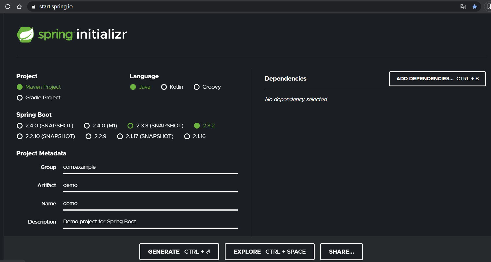

# 框架入门简介

# 快速入门

## 项目构建与解析

- 使用官方的 https://start.spring.io/ 来构建



### 依赖说明

- 依赖的父项目 `spring-boot-starter-parent`:定义了spring 中的一些基础依赖以及默认的配置内容。如 application.properties 文件的位置等。

- `spring-boot-starter-web`：全栈web 开发模块，包含嵌入式 tomcat、springMVC.
- `spring-boot-starter-test`:通用的测试模块：JUNIT, hamcrest,Mockito
- 其他 -starter- 组件。。。

## 实现 RESTful Api

略

# 配置详解

## 配置文件

> 支持 .properties 和 .yaml(.yml) 格式文件

## 自定义参数

在 `application.yml` 中配置

```yaml
book:
  id: 1234
  name: 老生
  author: 贾平凹
```

则在应用中通过@Value可以读取：

```java
@Component
public class Book {
    @Value("${book.id}")
    private Long id;
    @Value("${book.name}")
    private String name;
    @Value("${book.author}")
    private String author;
    //省略getter/setter
}
```

- 以上 `${}` 为占位符的格式。
- 另外一种是 `#{}` ,大括号内为SpEl表达式

## 参数引用

可以在 某个参数中引入上文中的其他参数

```yaml
book:
  id: 1234
  name: 老生
  author: 贾平凹
  desc: $｛book.id｝ 的书名是 ${book.name}
```


## 使用随机数

```yaml

random:
  # 随机字符串
  string.value: $｛random.value｝
  int.value: $｛random.int｝ #随机整数
  long.value: ${random.long} #long 类型
  int_1.value: $｛random.int(10)｝ #10以内随机整数
  int_2.value: $｛random.int(10,20)｝ #10-20的随机整数
```


## 命令行参数

- 前台启动 `java -jar xxx.jar --server.port=8888`
- 后台启动： `java -jar xxx.jar --server.port=8888 &` ,关闭控制台后会停止
- 后台启动 `nohup java -jar xxx.jar --server.port=8888 &` 关闭后台不会停止

### shell 脚本

- 启动

  ```shell
  #!/bin/bash
  nohup java -jar yourapp.jar --server.port=8888 &
  ```

- 停止

```shell
#!/bin/bash
PID=$(ps -ef | grep yourapp.jar | grep -v grep | awk '{ print $2 }')
if [ -z "$PID" ]
then
    echo Application is already stopped
else
    echo kill $PID
    kill $PID
fi
```

- 整合了关闭和启动的脚本: run.sh，由于会先执行关闭应用，然后再启动应用，这样不会引起端口冲突等问题，适合在持续集成系统中进行反复调用

```shell
#!/bin/bash
echo stop application
source stop.sh
echo start application
source start.sh
```

## 多环境配置

在 springboot中，多环境配置，文件名需要满足`application-{profile}.yaml ` 格式，其中的 `profile` 就是环境的标识、如下


在 `application.yml` 选择需要运行的环境

```yaml
spring:
  main:
    banner-mode: console
  # 配置文件的选择
  profiles:
    active: dev # 激活dev后缀的
    include: log # 包含后缀为log的
```


## 加载顺序（优先级从上到下）

1. 命令行中传入的参数
2. `SPRING_APPLICATION_JSON`中的属性。`SPRING_APPLICATION_JSON` 是以json格式配置在系统环境变量中的值
3. servletConfig 初始化的参数
4. `ServletContext`  中初始化的参数
5. 来自 的 JNDI 属性。`java:comp/env`
6. Java 系统属性 （）`System.getProperties()`
7. 操作系統的環境变量
8. 通过random.* 配置的随机属性
9. 位于当前[jar包](https://docs.spring.io/spring-boot/docs/2.1.11.RELEASE/reference/html/boot-features-external-config.html#boot-features-external-config-profile-specific-properties) 的__外部__，针对不同 的 ｛profile｝环境的配置文件的内容。如：`application-{profile}.properties`或者yaml 定义的配置文件
10. 位于当前 jar 包__内部__，针对不同 的 ｛profile｝环境的配置文件的内容。如：`application-{profile}.properties`或者yaml 定义的配置文件
11. 位于当前 jar 包外部的`application.properties`或者yaml 定义的配置文件
12. 位于当前 jar 包内部的`application.properties`或者yaml 定义的配置文件
13. 在@configuration 注解修改的类中，通过@propertySource 注解定义的属性
14. 应用默认属性，使用 `SpringApplication.setDefaultProperties` 定义的内容

9,11步是jar包外部读取配置文件，所以实现外部的配置就是从此处切入，为服务指定配置来代替内部的配置文件。

参考：[SpringBoot配置文件加载顺序官方文档](https://docs.spring.io/spring-boot/docs/2.1.11.RELEASE/reference/html/boot-features-external-config.html)

# 监控与管理

spring-boot-starter-actuator 为spring-boot 项目提供监控功能。

## 初始 actuator

## 原生端点

#### 应用配置类

获取应用程序中加载的应用配置，环境变量，自动化配置报告等与springboot 应用密切相关的配置类信息

#### 量度指标类信息

获取应用程序在运行过程中用于监控的量度指标。比如：内存信息，线程池信息，http 请求统计等。

#### 操作控制类

对应用程序关闭等操作类功能

# 小结

