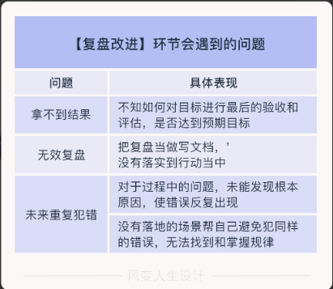

# 管理者能力模型

这3个关键环节分别是【制定计划】、【过程监控】和【复盘改进】。

1️⃣ 制定计划和目标。对目标和计划的选择和制定，直接影响整个团队的工作成效，因此需要管理者对此有清晰的思考和明智的判断。

## 如果这个环节没有做好，会出现什么情况呢？

2️⃣ 过程监控。同样的工作由他人来完成确实会比由管理者自己完成更不可控，但如果能够合理监控过程，必然能够实现好的结果。

3️⃣ 复盘改进。管理者不能停留在遇到一个问题就只解决这一个问题的层面，而需要帮助团队总结经验，提炼工作方法和规律，从而提升团队整体的工作效能。

- 计划阶段需要你确定方针和目标，制定活动计划
- 执行阶段需要你根据目标，执行具体任务，对比原计划，找出偏差。
- 复盘改进需要你总结经验，处理问题。接下来我们就会讲解具体应该怎么做。

## PDCA循环

PDCA循环由美国著名质量管理专家戴明(W、E、Deming)提出，他认为“做好一件事”可以被拆解成4个步骤：计划(Plan)、执行(Do)、检查(Check)和处理(Action)。

在质量管理中，PDCA循环得到了广泛的应用，并取得了很好的效果。实际上，要想有效地进行任何一项工作，都离不开这4个步骤，带领团队做事亦是如此。

## plan阶段

我们需要分析现状，分析原因，找出要因，制定计划。

# do 阶段

我们需要描述进展、评估风险、调整方案，并进行过程记录。

如果通过过程监控确保下属的执行一直在可控范围内，那么最终的结果自然就可以达成。

## 复盘环节

复盘改进环节包括检查(Check)和处理(Action)。

检查(Check)是在计划执行过程之中或之后，检查执行情况，看是否达到了预期的效果。

处理(Action)是根据检查的结果，通过复盘将成功的经验尽可能地标准化，并看到不足、找到原因，防止问题再次发生。遗留问题则转入下一个PDCA循环去解决。

团队管理面向的是人，这要求管理者看见自己身边的人。这看起来很简单，但做起来其实并不容易

很多技术转管理的人，因为在过往的职业生涯中处理的大部分是事情，对于人的了解非常不足，所以在管理路上频繁碰壁。

虽然团队管理比较麻烦，但其实可以归结为4项技能：选人、育人、用人、留人的能力。

## 选人

在讲选人之前，我有一个问题要考考你。

想想看，本来是希望下属能够出色完成目标，但实际情况却是他经常影响项目进程，甚至闯了祸直接拍拍屁股走人，是不是想想都令人火大？

因此，选人识人是管理者必须学会的重要能力。

当然是有的，这里给你推荐一个「SHAPE模型」，它代表了我们识别人才要看的5个要素。

🌟管理者要试着将下属放在他们能发挥专长的地方，而不是把他们放在不擅长的职位上，所以第一步便是要了解下属的专长「S（Strength）」。

🌟而「H（Heart）心」则反映出下属的热情和兴趣所在。管理者需要了解下属喜爱什么，如果我们能够将下属放在他工作热情所在的岗位或任务上，他就会充满动力。

🌟「态度A（Attitude）」是员工对待工作所展现出来的心态和行为，我觉得这一点是非常值得强调的。管理者需要的是具有积极性、愿意做事的人，像洪力就倾向于把任务交给更积极的人。

🌟接下来「个性P(Personality)」很好理解，每个人都有与生俱来的独特的性格特点。管理者要识别出员工的性格特征，将Ta放在能够反映出个性的职位或任务上，这样才能更好地发挥出员工价值。

🌟最后是「历练E（Experience）」，请注意我不只是说经验，更是指历练，可以理解为那些影响或改变TA的关键事件。

比如说，工作经历，人生重大挑战、低谷、高光时刻等等。透过这些历练也可以进一步看见下属的能力、态度等。

以后需要选人的时候，你不妨尝试使用下面这个《员工SHAPE表》

## 育人

育人，换句话说就是【辅导和培养下属】。

如果你不会培养人、没时间带人，你很大可能最后会陷入忙疯自己、心力交瘁的结局。

不仅如此，你可能还会发现辅导似乎没有成效：明明已经把解决问题的方法事无巨细地告诉了员工，但是他们仍然不理解；你已经一针见血地指出了员工的不足，但是他们并不认同……这让你有很大的挫败感和无力感，也会让你感觉到自己在辅导下属上的投入和产出并不“划算”。

## 用人

我们也许见到过这样的主管：他们的时间总是不够用，工作任务繁重不堪，经常加班加点，每天晚上都将公事带回家去处理。

如果你作为管理者也发觉自己有这样的情况，那很可能就是一种信号，表明你并未真正学会用人。这里的用人，是指要学会授权工作。很多管理者没有意识到授权的重要性，我们看看不会授权除了会让管理者陷入无尽的忙碌，还会带来什么后果。

💡首先，授权是授予权力。不过，许多管理者把工作交给下属之后，以为责任同权力一起交给下属了。

其实授权≠授责，作为管理者，你对自己部门所有的工作都应负全部的责任。不然的话，以后还有哪位下属敢从你手中接过具有挑战性的任务呢？

💡其次，授权要有适当的权限。针对特定的事情，管理者给予下属的权限要刚好能够完成所需的工作即可。如果超越了工作需要的权力，就可能造成下属滥用职权，而授权不足，可能导致下属完不成工作。你还要注意授权≠弃权，你仍然需要对下属的工作过程进行把控。

💡最后，授权的关键之处在于：决策权力的下放。这里的误区是授权≠参与。你授予了下属做事情的权力，但在过程中自己又参与到其中，或是不相干的人也横加干涉，导致被授权的下属只是一个参与者，而不是全程的决策人，那么这也不是真正做到了授权。

## 留人

一项对职业人士的调查结果显示，大约有50%的人只是为了保住“饭碗”而工作。由此可见，蓬勃的工作动力和工作热忱不是人人都有的。而且员工工作时间一长，很容易对工作失去兴趣，失去热情，造成工作效率降低，甚至产生跳槽的想法。这时，管理者就必须想办法激起员工的干劲，让整个团队保持生机和活力，也就是要学会【激励】。

我想不止是你有这样的感受，但有时基层管理者确实无法左右那些由高层负责的激励措施，诸如企业奖励制度、员工持股、福利等。但管理者们依然可以置身于自己的岗位，在自己的职责范围内去积极发掘一些可以拿来为我们所用的激励措施，比如通过工作本身带给员工动力。

如果工作能满足以下这5个特征，就能让员工感受到工作的意义，进而给员工内在的激励。

# 总结

管理就是“带人成事”，“成事”需要【业务管理能力】，“带人”则需要【团队管理能力】。

其中提高业务管理能力需要把握3个重要环节，分别是制定计划、过程监控和复盘改进。团队管理能力包含的4个技能分别是选人、育人、用人、留人。

