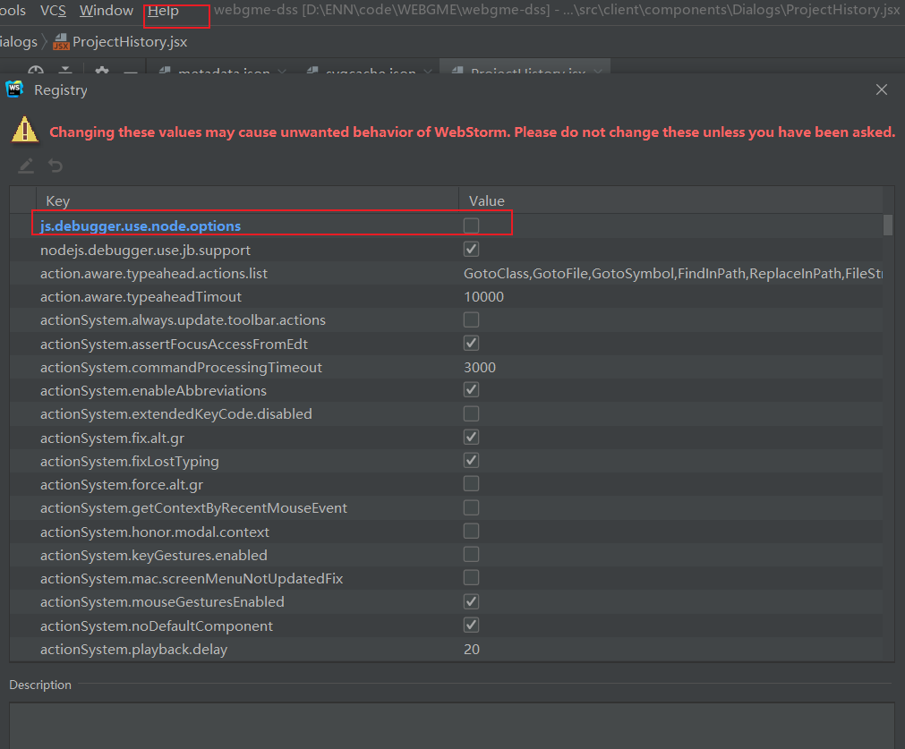

### webstorm debug 模式启动时，报错：

```shell
Debugger listening on ws://127.0.0.1:14967/66cdd084-feab-406a-924f-42d8d3c41141
For help, see: https://nodejs.org/en/docs/inspector
Error in JetBrains node debug connector:  Error: spawnSync C:/Program Files/nodejs/node.exe ENOENT
    at Object.spawnSync (internal/child_process.js:1041:20)
    at spawnSync (child_process.js:616:24)
    at execFileSync (child_process.js:643:15)
    at Object.<anonymous> (C:\Users\dvdx\AppData\Local\Temp\debugConnector.202.6397.94.js:36:3)
    at Module._compile (internal/modules/cjs/loader.js:1158:30)
    at Object.Module._extensions..js (internal/modules/cjs/loader.js:1178:10)
    at Module.load (internal/modules/cjs/loader.js:1002:32)
    at Function.Module._load (internal/modules/cjs/loader.js:901:14)
    at Module.require (internal/modules/cjs/loader.js:1044:19)
    at Module._preloadModules (internal/modules/cjs/loader.js:1298:12) {
  errno: 'ENOENT',
  code: 'ENOENT',
  syscall: 'spawnSync C:/Program Files/nodejs/node.exe',
  path: 'C:/Program Files/nodejs/node.exe',
  spawnargs: [
    'C:\\Users\\dvdx\\AppData\\Local\\Temp\\debugConnector.202.6397.94.js'
  ],
  error: [Circular],
  status: null,
  signal: null,
  output: null,
  pid: 0,
  stdout: null,
  stderr: null
}
```

解决方案：

1. 调出查找action面板：**Help > Find action**, type `registry...`
2. 取消 `js.debugger.use.node.options` 的勾选

