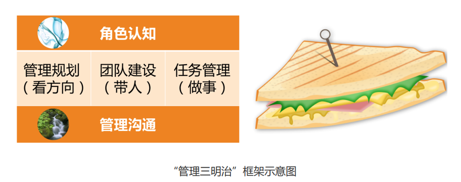
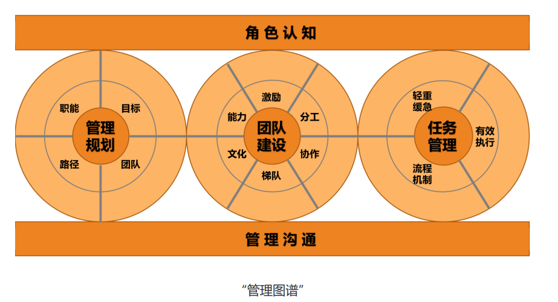
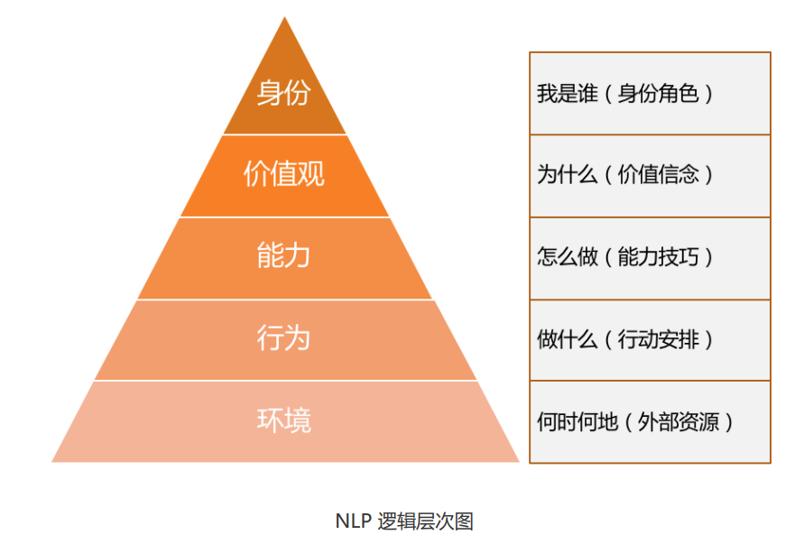
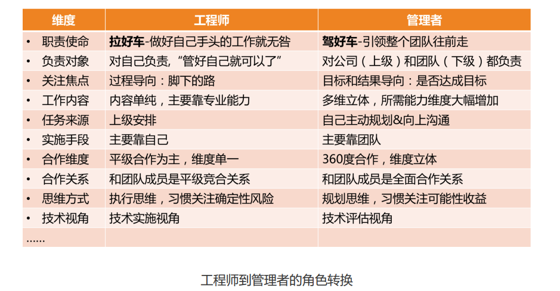

# 管理要做的事情

1. “如何打造高效执行的团队？”
   1. 如何打造团队？
   2. 如何让这个团队有高效的执行力？ 
   3. 如何定义“高效”？
2. “如何群策群力打胜仗？”
   1. 如何群策群力？
   2. 如何打胜仗？ 
   3. 如何定义打“胜”了？
3. “如何 做团队建设？”
   1. 在你眼里什么叫团队建设？这个词太泛泛了。 
   2. 你希望通过做团队建设达到什么目的？ 
   3. 如何着手做？

工业时代主要靠 加强外驱，讲究“胡萝卜加大棒”，追求严格管控；而知识经济时代，更多是靠激发内驱， 弹性工作制也好，发挥员工优势也好，都是希望员工更主动、自主，从而有更多的创造力。

“管理是由五项要素组成的一种普遍的人类活 动，这五个要素是：计划、组织、指挥、协调和控制。”    -- 关注管理的过 程性，强调“做事”

“管理就是确切地知道你要别人干什么，并使他 用最好的方法去干。” -- 关注的焦点在于干什么，以及怎么干，有明显的目标性和方法性， 强调“目标”和“做事”

“管理是一种实践，其本质不在于‘知’，而在 于‘行’；其验证不在于逻辑，而在于成果。其唯一权威就是成就。”     --的焦点在 于实践性和结果性。强调“目标”

“所谓管理，是指同别人一起，或通过别人 使活动完成得更有效的过程。”    ---背后蕴含着管理的三个要素：人、过程和有效， 用正式一点的词汇叫组织性、过程性和目标性，强调了“带人”“做事”和“目标”。

总结，便是 **角色认知、管理规划、团队建设、 任务管理和管理沟通** 五个管理要素

管理规划、团队建设和任务管 理，就是管理者的工作内容了，分别对应着 **看方向、带人和做事**，这和近代几位管理大师的 观点也是统一的。

## “管理三明治”

我们把无所不在的空气般的 **认知** 作为“天”，把承载一切管理工作的 **沟通** 作为“地”，把管 理者需要做的看 **方向、带人、做事** 在中间，就组成了管理者的管理框架，由于看上去像一 块三明治，我把它形象地称为“管理三明治”

## “管理全 景图”，或者“管理图谱”

**“主要做好三件事：带人、做事、看方向，当 然，做好这些事都要基于良好的角色认知和管理沟通。”**

# 从工程师到管理者，角色认知的转变

“NLP 逻辑层次图”，一个人的行为、能力、价值观，都源于一个最根 本的认知，就是自我角色的设定。

## 工作职责

你做工程师时，完成好上级安排给你的工作就诸事大吉；而作为一个管 理者，你要做的是带领整个团队往前走，上级只是帮你设定一个目标，剩下做什么、怎么 做，都是你要考虑的，所有对达成目标有帮助的工作都是份内的。这就是“赶车”和“拉 车”的不同。

## 负责对象

作为一名工程师，用他们自己的话 说，“管好自己就可以了”，所以主要是对自己和自己的工作负责。而作为一名管理者，由 于团队是上级和公司给你的资源，你需要对上级负责；你还得关心团队成员的发展和成长， 对下级负责。

做工程师是“一个人吃饱全家不饿”，做管理就是“上有老 下有小”。我觉得非常贴切，更高的职位的确意味着更多的责任。

## 关注焦点

工程师一般是过程导向 的，因为他们需要一步一步把工作执行到位，眼睛盯着的常常是“脚下的路”；而管理者是 目标和结果导向的，他们时时关心目标和前进方向，盯着“远方的目标”，因为他们得决定 要带着团队去哪里。

## 工作内容和能力要求

工程师属于个人贡献者，也就是 HR 口中说的 IC（Individual Contributor），是靠个人专业能力来产生业绩的，工作内容以发挥专业能 力为主，相对比较单一；而管理者要做成一项工作，除了技术判断力，还需要目标管理能 力、团队规划能力、项目管理能力、沟通协调能力、团队建设能力等等，需要看方向的、带 人的、做事的更加多维和立体的能力。

## 任务来源

工程师的工作任务来源，主要是上级安排，听上级指挥；而 管理者的工作内容，虽然也有上级工作的拆解和安排，但更多是靠自己筹划，然后和上级去 沟通确认，从被动“等活儿”变为主动规划。

## 合作维度

工程师主要的合作内容就是和平级的伙伴共同做好执行，因 此主要以平级合作为主。而作为管理者，合作的内容非常丰富，比如，需要和上级合作规划 好整个团队的目标，和下级合作做好落地执行，和平级管理者合作完成联合项目，有时候还 需要和平级的上、下级去一起协调资源和进度。所以合作的维度变得非常立体。

## 合作关系

做工程师的时候，和大家都是平等竞合关 系，以合作为主，也有“竞”的成分。

*我们通常爱把“竞”和“争”连在一起说，但“竞”和“争”还是不同的。“争”意味着大 家拼抢同一个东西，我得到的多就意味着你得到的少，此消彼长，比如摔跤、乒乓球、下棋 等都是典型的“争”。而“竞”是朝向同一方向做比较的，比如百米赛跑、跳高、跳远等田 径类比赛是典型的“竞”。*

在之前平级的时候，你和其他同事虽然不会有“争”，但是有“竞”的成分在。而当你成为 大家的上级，作为管理者来带领这个团队的时候，你和大家反而形成了全面合作的关 系，“竞”的因素不存在了。因为“竞”和“争”都是发生在同一层次上的，要在同一个场 地和同一个起跑线上，才有所谓的“竞争”；而随着你的晋升，你和之前的同事已经不在同 一个层面上工作了，也就不存在“竞”的关系了，而是彼此间荣辱与共、休戚与共、成败与 共的全面合作关系。

## 思维方式

做工程师的时候，大部分工作内容和工作要求都是执行，所 以是明显的“执行思维”，特点是关注过程和细节，更重要的是关注风险和成本，希望通过 对风险的排除和成本的掌控，来保证工作交付的确定性。

所以技术出身的人往往在项目执行，尤其是过程控制管理方面，有明显优势，他们天然就认 为这不是什么难事。当然，他们估算排期一般也会比较保守，因为他们需要确保能完成才愿 意答应。 而作为管理者，虽然也考虑风险和成本，但是更习惯于去关注做一件事能带来的可能性收 益，并以此来判断是否值得投入资源去做，我们把这种叫“规划思维”。

由于管理者总是在盘算和筹划一些可能会对公司和团队有价值的事情，而没有仔细考虑风险 和成本，所以在工程师的眼中，管理者时不时会提出一些“不靠谱”的期望和需求，但这正 是两个角色关注的东西不同造成的。而这恰恰是一种很好的合作与互补：赶车的看方向选路 径，而拉车的排除各种风险和困难，把车拉向前方。

## 技术视角

做工程师的时候，技术是用来做事情的，掌握好技术的目的就是为了做好实施，看待技术是 从如何运用的角度出发。而对于管理者来说，技术是达成目标的手段之一，所以看待技术是 从如何评估的角度出发，评估该项技术是否是最合理的手段，以及如何选择才合理，并据此 做出决策，因此常常被称为技术判断力。我们的老领导经常会告诫我们，即使做了管理，技 术判断力不能丢，就是指这种能力

# 管理常踩得坑

管理更多的是一门实践科学，从“知道”到“做到”，还需要长期地刻意练习。在 实际操练过程中，你会碰到各种各样的问题，这会是常态。但是，如果你能提前知道前面有 哪些“坑”是最容易踩到的，你也许就可以提前规避，选择跨过去或绕过去。

## 第一类误区

常见的做法和说法如下： 

1. 不主动找活儿干，总是等待上级派活儿，如果上级没有明确安排，就“放羊”。
2. 即使上级有了安排，还总是指望上级替他做决定该怎么做，选哪个方案。 
3. 在和上、下级沟通中，他主要充当“传话筒”的角色，常用句式是“老板说……”“某员 工说……”，并没有反思每次沟通要达到的目的和效果是什么。
4. 过于关注苦劳和付出，常见说法是“某某还是不错的，没有功劳也有苦劳。”

这类问题的共同原因就在于： 这位管理者还在“拉车”，而没有站在“马车夫”的位置上去驾驭整个马车；没有对整个团 队的 ownership，工作比较被动，关注执行过程。

这类问题归纳为：**过程导向、被动执行**。

由于没有从“管理者”的视角出发，所以至少会带来如下三个后果：

1. **团队方向感缺失**。大家都只是着眼于手头工作，团队得不到愿景的凝聚和激励。 
2. **团队做不出有效的业绩**。因为团队没有方向感，所以结果就很难有效。 
3. **无法带领一个团队**。由于视角局限，所以还不具备带领团队的能力。

## 第二类误区

常见的相关说法有：

1. “某某做得太慢了，还是我来做吧，他半天的工作，我两个小时就搞定了。” 
2. “团队离了我就不转了，里里外外都靠我操心，他们都担不起这个责任。” 
3. “某某的工作主要靠我……”“在我的指导下，某某才……”“这件事主要是我做 的……”

上述的这三个问题，分别用三个词来概况：

问题 1，叫“包工作”。也就是说，他作为一个管理者，把团队成员力所能及的工作都做 了。 

问题 2，叫“包责任”。也就是说，他作为团队的负责人，把团队成员每个人应该自己承 担的责任，都包在他一个人身上了。 

问题 3，叫“包功劳”。为了体现自己的能干，处处凸显自己的功劳，把团队成员的业绩 和工作成果也都放在自己头上了

归纳为：**大包大揽、唯我最强**。

大包大揽的管理者也可能会 带来这样的后果：

1. **梯队问题**：大树底下寸草不生，梯队迟迟培养不起来。因为梯队的培养需要授权，需要 让高潜人才有发挥空间并承担相应的责任。 
2. **激励问题**：由于管理者冲得太靠前，团队成员积极性受挫，遇事往后缩。 
3. **个人发展问题**：由于得不到团队成员的有效支持，自己又忙又累，做不了更大的业务。

## 第三类误区

常见的相关说法有：

1. “好好干，我不会亏待你的，我绝不会让跟着我的兄弟们吃亏！” 
2. “某某可能会不高兴，可能会离职，怎么办呢？” 
3. “某某技术比我强，我给他打好下手就行了。”

其实是两类管理者的表现. 主要问题是：

第一类是“带头大哥”式的管理者，讲究的是兄弟感情，在他们心目中，不但兄弟的工作是 我的， 兄弟人也是我的。这类管理者可能在某些情况下特别有战斗力，但是一旦情况有 变，对公司的破坏性也是非常大的，因为他忘记了他带的团队是公司的资源，而不是自己 的，所以不可能成为一个职业的管理者。

后两类问题描述的是和第一类几乎相反的一类管理者，由于团队里有资深的高级工程师， 他在技术判断力方面不如这些高工，索性就给这些高工做起了“保姆”，而忘记了自己才是 这个团队的舵手和船长，因此也不是一个职业的管理者。

归纳为：**带头大哥、当家保姆**。这类问题带来的后果大 体如下：

1. **不职业的管理风格和文化**，这会给公司带来很大的潜在风险。
2. **团队没有方向**，所以很难有正确的判断和决策。

## 第四类误区

常见的相关说法有：

1. “人手不够，没人，这真做不了，要做就得招人。” 
2. “让团队加班的话，得给大家发加班费，不然没法提升积极性。” 
3. “像某某那样的人才适合做管理，我跟他太不一样了，所以不适合做管理。” 
4. “还有个 Bug 没修复，不能发布，我们一直都是这么规定的。”

作为工程师时应该一定不止一次地遇到过，甚至也曾经 这样说过。作为一位工程师，有上面的这些言论似乎也无伤大雅，但是如果作为一个团队的 管理者还这样说的话，就明显是掉到“坑”里了。

这个“坑”是什么呢？就是：**单一视角、固化思维**。往往因为某个要素不具备就否定所有的 可能性，比如上面提到的“要想做事，就得招人”“要想提高积极性就得发加班费”“只有 某某那样的人才能做管理”“某个 Bug 没有修复就不能发布”等等，思维模式非常单一。 这样造成的后果是：

1. **习惯性卡住**。遇到问题和困难，很容易被卡住，到处都是绕不过去的鸿沟。 
2. **认知层次低**。由于被单一惯性思维所支配，认知层次和考虑问题的维度无法提升。
3. **难堪重任**。由于创造性地解决问题的能力不足，难以承担具有挑战性的工作。

## 第五类误区

常见的相关说法有：

1. “这个是测试的问题，这个是产品的问题，这个是别的部门的问题。” 
2. “产品经理一点逻辑都没有，没法沟通。” 
3. “这事不赖我们团队，是某某团队没有按时完成。” 
4. “我查过了，不是我们的问题，惩罚不到我们。”

这类问题的共同特点就是：**自扫门前雪、固守边界**。

角色和责任的边界划分，是为了分工和合作，但由于很多大型项目有赖于多个 团队一起协作完成，所以又需要有人主动站出来，去承担边界模糊的那部分职责。作为一个 员工，边界分明无可厚非，但是作为一个管理者，就需要以全局的目标为己任，才能拿到公 司要的业绩结果。

常常带来这样的后果：

1. **项目推进不畅，从而影响全局的结果**。 
2. **自我设限，因此个人成长受限**。 
3. **个人影响力无法扩展**。因为目光和手脚都局限在团队内，所以无法在更大的范围产生影 响力，也就无法成为更高级的管理者。

作为管理者，是要站高一层来看待问题的。

## 第六类误区

常见的说法有：

1. “突然不写代码了，感觉吃饭的家伙没了，心里发虚。” 
2. “管理工作太琐碎，感觉离技术越来越远，现在特别担心个人发展。” 
3. “做管理最大的挑战是，要舍弃技术，特别难。” 
4. “管理是个矛盾的事情，自己技术专业性越来越差，却要带领整个团队。”

这类问题的核心原因是把管理摆在了和技术对立的位置，同时由于管理能力还没有强大到可 以作为自己的核心竞争力，因此忧虑自己的技术会落后，从而失去生存能力。

这类问题归纳为：**“患得患失”**。这造成的后果会有：

1. 犹豫反复，无法全力以赴去做好管理，**成长缓慢**。 
2. **对技术的看法太狭隘，从而影响技术判断力的提升**。 
3. 由于**误判**，可能会错失一个好的发展平台。

## 总结

第一类：过程导向、被动执行； 

第二类：大包大揽、唯我最强； 

第三类：带头大哥、当家保姆； 

第四类：单一视角、固化思维； 

第五类：自扫门前雪、固守边界； 

第六类：患得患失。