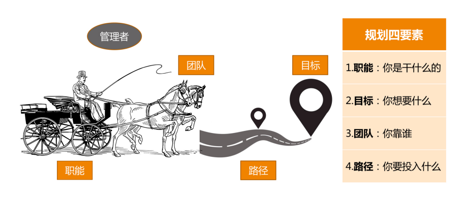
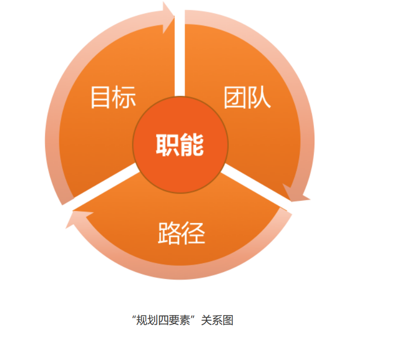
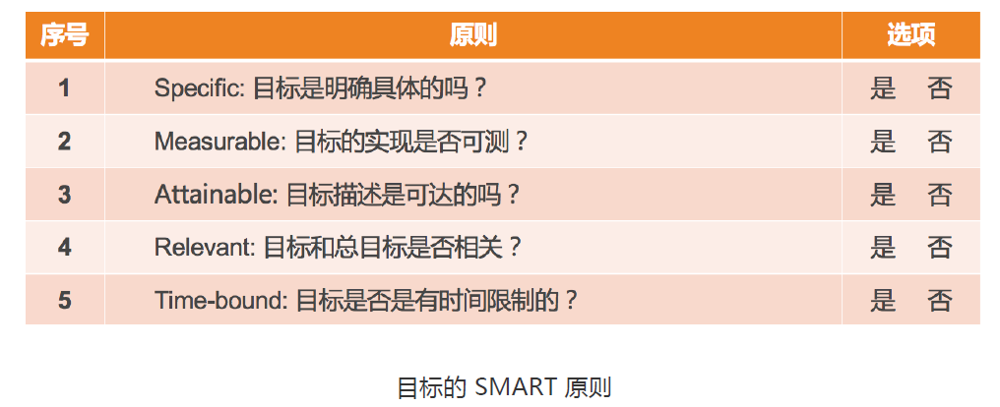
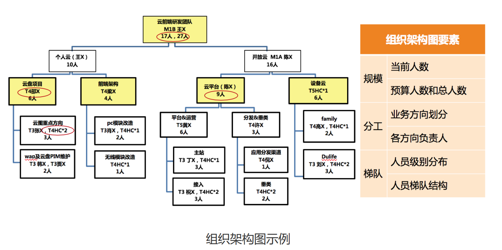
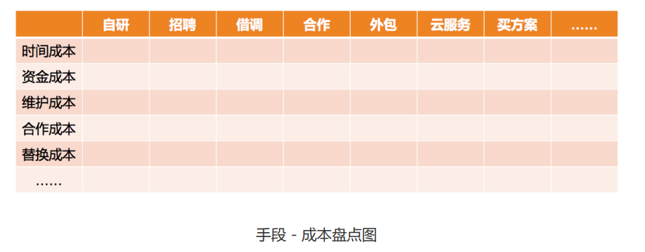

### 第三个问题，即人力资源的持续性。通俗说就是，不是所有的人力短缺，都要

### 

### 

### 

### 

### 

# 开始带团队，着手点

**问题驱动型思维** 转化为 **规划驱动型思维**

作为一个 leader，“堵漏”的工作固然要做，但是有没有一个“全盘规划”的指引，清不清楚把团队 带往何方，这才是不同 leader 领导水平的差距所在。

我们今天要谈论的“管理规划”，就是要回答“把团队带往何方”的这个方向性问题。通 过理清未来的发展来理顺当前问题的带团队思路，我称之为 **规划驱动型思维**。

**问题驱动型思维**： “新团队人员各种问题，各种人心惶惶，非常棘手，该怎么应对呢？” “新接手的服务各种问题，手忙脚乱，各种不靠谱……” “成天开会，各种业务讨论，顾不上和员工熟悉……”，这类困惑 有一个共性的问题在于，管理者都一下子陷在问题里了，期待着解决掉这些问题之后，事情 就都好了

## 第一个问题是，你需要先看一下，这是辆什么车   --职能

弄清楚它是一个背负着什么样职责和使命的团队，决定了你需要设定什么样的工作目标，并 通过哪些要素来衡量你的目标；决定了你需要什么样的人加入你的团队，以及需要多少；还 决定了你选择什么样手段，投入什么样的资源来完成工作。

这个问题是如此重要，以至于我把对于这个问题的回答，作为管理规划的第一个要素，称之 为团队“**职能**”

**你是否可以毫不迟疑、非常简练地说出你团队的职责和使命 呢？**

## 第二个必须要思考的问题是，你得看看，你要把这辆车拉到哪里去。  --目标

第二个要素，称为 **“目标”**

对于为什么要设定目标，很少会有人质疑，因为大家都认为设定目标是理所当然的事情。那 么你有没有想过，为团队设定清晰的目标，可以带来哪些好处呢？ 目标设定的最基本的初衷就是 **着眼自己想要的结果，去实现资源的有效配置**。除此之外，目 标还有非常好的几个附加效果：

首先，清晰明确的目标可以凝聚团队成员的力量，让大家劲往一处使，提升团队凝聚力； 

其次，清晰的目标还是执行力的必要要素，你可以回想团队取得的每一个执行出色的项 目，目标一定是非常清晰； 

再次，清晰的目标还能提升判断力，如果你能够对某个突发状况快速决策，你一定非常清 晰你当时想要的是什么； 

最后，清晰的目标本身就是激励，当员工很清楚自己的工作目标，方向感很清晰的时候， 他们更容易进入心流状态，即，一种投入度非常高，沉浸其中、物我两忘的工作状态。

没有目标的团队很少，但是想设定清晰明确 的目标，对于技术团队来说又是非常困难的，因为工程师的工作大部分难以量化。 

## 第三个必须要思考的问题是，你得盘点一下你有哪些马，它们情况如何。  --团队

做管理的主要工作内容是“带团队”，因为所有的工作，都是靠团队来落地完成的，他们是 真正“拉车”的人。就好像马匹是马车的动力之源一样，团队就是你达成团队目标和使命的 发动机。

盘点自己的团队，以及看看在整个“赶路“的过程中要如何升级完善自己的团队，并 思考在达成目标之后你期待收获一个什么样的团队，都是必须要考虑的问题。这就是管理规 划的第三个要素，称之为“团队”。

## 第四个必须要思考的问题是，你选择走哪条路  --路径

路径的不同选择，会带来资源投入的差异，从而，你向公司申请资源的类别 和规模也是不同的。由于公司的预算是要提前做的，因此在马车出发前，即在规划的时候， 就要算好。

不要混淆路径选择和计划制定。这二者最大的区别在于，路径选择 主要是为了预算资源，而制定计划主要是为了执行过程可控。

## 总结

我们已分别探讨了管理规划的四个要素，对应明确回答了下面这四个问题：

1. 你团队是干什么的？ 
2. 你团队想做出什么成果？ 
3. 你依靠什么样的团队？ 
4. 你需要投入哪些资源？

所谓的管理规划，其实就是要管理者说明白一个问题，即，你想要什么目标，以 及你需要投入什么资源。由于目标取决于团队的职能，而团队又是管理者的核心资源。所 以，一份合格的规划报告，至少需要体现 **职能、目标、团队、路径** 这四个要素

值得说明的是，这四个要素并不是彼此孤立和静止的，而是相互关联、动态平衡的（如下 图）。其中最稳定的要素是职能，它是管理的起点。

# 团队职能- 如何界定我团队是干什么的呢

判断自己是否真的清楚团队职能，你可以试着问一下自己这三个问题：

1. 公司为什么要给我这批资源（指这个团队）？是希望我产出什么？
2. 这个团队存在的独特价值是什么？ 
3. 你用什么维度来衡量团队的价值高低？

只有连团队 成员都非常清楚团队的职能定位时，才能收到如下的这些效果。

1. 大家都知道自己是做什么的，同时，知道做什么对于团队来说非常重要。 
2. 大家都很容易去主动思考，要提升哪方面的能力，对团队来说是最有帮助的。 
3. 大家更容易理解自己工作的价值和意义，从而增强对团队的认同度和归属感。

清晰的职能定位以及对职能的充分沟通，可以提升团队凝聚力、员工归属感和员 工自驱力，在当今时代，这是重要的管理要素！

下团队职能的两个层次：基本的**职责**和升华的**使命**

**职责，是团队职能的下限，即，至少要完成的工作，如果这些职责都搞不定，意味着团队的 基本价值都不能体现。**

一般来说，团队的基本职责，是由上级给定的，上级在把这个团队交给你负责的时候，已经 给你提了期待，只不过有的上级会明确交代，而有的上级默认你很清楚。所以，你无论如何 都需要弄清楚团队的基本职责，否则肯定会失职。

**使命，是团队职能的上限，即，如果我们团队做得好，就能承担更大的职责，体现出更大的 价值。**

如果说基本职责通常是上级给定的，那么使命愿景则常常是团队 leader 自己的规划和设 想。上级一般不会作出这样的要求，最多就是提一下期待，团队做不到也不会认为是团队失 职。但是，如果团队做到了，就会是非常亮眼的成绩，团队成员也会受到很大的激励和鼓 舞，管理者的领导能力也必定不俗。

**基本职责解决的是“团队 生存”问题，而使命解决的是“团队幸福”问题**。对于有的人来说，看不到幸福的希望，则 生存也将失去意义。

## 设定团队职责和使命的方法和步骤

### 第一步，收集信息。

可从以下四个角度来梳理职能信息：

1. **向上沟通**。听听上级对你团队的期待和要求，以及希望用什么维度来衡量你做得好还是 不好。这个信息非常重要，团队的初始定位和基本职责，一般都是上级直接给定的。
2. **向下沟通**。主要是和大家探讨对团队业务的看法和理解，以及对未来发展的期待，为以 后的沟通做好铺垫。 
3. **左看右看**。主要是看职能定位的边界在哪里，最好和兄弟团队的职能是无缝对接的。但 不要覆盖兄弟团队的职责，否则会带来各种合作上的冲突。其实，快速发展的公司，要 做的事情非常多，海阔天空，即便是广度不够，深度也还有作为空间，真没必要和兄弟 团队争抢地盘。 
4. **你的理解**。即，你对业务的理解，你对领域的理解，你对团队的期待，以及你对自己的 期待。团队的更高职责，即，团队使命和愿景，往往来自于你的设想。

### 第二步，提炼和升华

团队的职责和使命，不能只停留在 leader 的脑海中，为了方便记忆和传播，则必须从上述 信息中进行提炼和升华。提炼和升华有三个要点：

1. **职责的提炼**。基于上级的期待和要求，以及你对业务核心价值的理解，最好用上级和团 队成员、兄弟部门都易于理解的语言，对职责进行简短化提炼，并尽可能长时间稳定下 来。 
2. **使命的升华**。基于基本职责，寻找团队对于部门和公司的独特价值，并和行业发展趋势 结合，设定自己的期待。要注意使用基于“结果”的描述，而非基于“过程”的描述。 比如保证项目交付质量，是对结果的描述；而负责项目测试，则是对过程的描述。相比 之下，基于结果的描述会更有使命感。
3. **确定衡量维度**。一般来说，团队的职责和使命决定了衡量的维度，但是如果有明确的关 于衡量维度的说法，会让员工对职责和使命有更深刻的理解。常见的案例有：服务端团 队，会特别重视性能、稳定性、扩展性等维度；而前端团队，往往重视开发效率、兼容 性、安全性等维度；数据团队关注数据准确性、完整性、及时性、安全性等维度。你也 需要根据自己团队的职能，向员工明确传递，什么指标维度对团队是最重要的。

## 第三步，确认和主张。

确认主要是和自己的上级确认，得到上级的认同和 支持后，就可以向团队内外进行主张了。当然，最好是在合适的场合，比如季度会、合作沟 通会等，有计划、有步骤地把团队的职责和使命宣贯给大家。团队职能的设定和宣贯是一个 长期工程，不要期待一蹴而就。当然，如果做得好的话，效果也很快就能显现出来。

# 团队目标-如何为团队设定合理的团队目标

**团队目标分的作用为三点：**

第一，你会更加清楚目标都意味着什么，它可不是让团队有事儿干那么简单。

第二，你会掌握目标设定的要点，即使你之前没做过目标管理，你也可以实际操作了。

第三，一起探讨在团队频繁调整，公司战略都不稳定的情况下，如何管理团队目标。

## 目标对于团队管理到底都意味着什么呢？

第一，最基本的，目标包含着**你和上级的诉求**，即，你们希望收获的东西。

第二，目标意味着**资源的有效配置**。明确的目标可以让你把资源投注在有效的方向上，从“该做什么”去调配资源，而不是“能干什么”。

第三，目标意味着 **执行力**。很多管理者都把执行力和目标分开来谈，其实在我的访谈和观察
中，技术管理者在任务执行上大多是很强的，并不是短板；而表现出“执行力不够”的最大的原因，都在于目标的不清晰或多变。我让他们回想自己做的执行力最棒的项目是不是都具
有精确的目标，结果无一例外都是肯定的答案。显然，清晰的目标是高效执行的必要条件。、

第四，目标意味着**凝聚力**。很多管理者问我到底该如何提升团队的凝聚力，我都会告诉他
们：明确的团队目标和愿景，就是提升团队凝聚力的重要手段之一。大家因为相同的目标而
并肩作战，在一起取得成就的过程中建立起深厚的“革命友情”，这对凝聚力有莫大帮助。

第五，目标也意味着 **激励**。在提升员工自驱力的要素中，员工在工作中产生沉浸其中、物我
两忘的“心流”状态，就需要有清晰的目标为前提。而且，团队目标感带给员工对工作的意义感和使命感，也是提升自驱力的重要来源。

目标设定的原则，即“SMART”原则

即：
Specific **明确性**、Measurable **可衡量性**、Attainable **可达性**、Relevant  **相关性** 和 Time-bound **时限性**

### 可达性

**“踮起脚尖能够到的目标最合适”**  即，不能定一个完全实现不了的很高的目标，也不能定一个不需要努力就能实现的很低的目标。

目标的一个重要的原则：**目标是设定给团队的，而不是设定给上级的**，其目的是为了让团队集中资源做出有效的成绩

### 明确性和可衡量性

“目标要明确”   --- 把目标设定到可以衡量的程度，就叫做明确了

实例：

a)“我们的目标是提升某个服务的性能。”这不是一个明确的可以衡量的目标。
b)“我们的目标是把某个服务的单机性能从 300qps 提升到 500qps。”这就是一个可以明
确衡量的目标。

### 相关性原则

其工作内容必定是和上、下游及上级目标相关联的

### 时限性原则

所有的目标都是基于一定时限的，缺少时间限制的目标没有意义

### 总结

当你要评判一个目标是否合理时，需要从 SMART 这五个原则去逐个审视，如果都
符合了，说明你这个目标是清晰可行的。

## 目标的描述形式

大体分为两类：

一类是可以量化的指标，就是大家常说的 KPI（Key Performance Indicator，关键绩效指标） (**KPI：到某时间点，什么指标达到什么数字**)；

另外一类是不可量化的目标，用关键结果来衡量，就是我们常说的 KRA(Key Result Areas) 或 OKR(Objectives & Key Results)，总之就是对关键结果的一种描述。(**KRA/OKR：到某时间点，完成什么工作，该工作实现了哪些功能或达到了哪些效果。**)

；

## 面临诸多挑战

第一类问题是 **基于现有资源做目标，而不是基于远方的目标往前推**。 更为合理的做法
应该是，**从上级的角度来讲，你的团队需要保证哪几项重要的结果，然后再看看如何调配和补充资源。面对这类问题和挑战的钥匙叫做“以终为始的出发点”**。

第二类问题是**目标不明确**。常常会因为“过程化描述”而引发目标不明确的情况出现.

常见的说法是，“我们要在 10 月底，完成架构改造”“我们要在 12 月底，上线反作弊系
统 1.0”等等。这类描述的问题在于，主要强调“我做了什么”，而没有交代做完这些工作
后，“取得了什么效果”。 因此， **面对这类问题和挑战的钥匙叫做“结果导向的描述”**

第三类问题是**目标设定好之后**，自己和自己的上级都很清楚了，但是 **没有刻意地向团队成员
来传达**，只是按照目标拆解去安排大家的工作。这样的做法，导致团队成员对于整个团队的
方向感不清晰，那么前面我提到的那些目标能带来的效果就无法显现，比如起不到对团队的
凝聚和激励的效果。面对这类问题和挑战的钥匙叫做 **“目标的向下同步”**。

第四类问题，也是大家最头疼的一个问题，就是 **目标总是被迫变来变去**。互联网领域很少有
非常稳定的公司，业务总是在调整，自己的上级也时不时就换个新的，甚至于公司的战略也
每隔一段时间就变一次。显然，之前为团队设定的目标，也得跟着变来变去。于是，目标慢
慢变得形同虚设。 **面对这类问题和挑战的钥匙叫做“设定专业目标”，用专业目标来增强团
队的内在定力**。

### 什么是“专业目标”呢？

，“专业目标”来自你团队的内在要求，一般是由你和
团队自己设定的，属于自我要求，所以新的管理者往往会忽略不做，有的是想不到，有的是
懒得做。而恰恰是这个内在目标的设定，最能体现你的管理价值，因为这是最能展示你的自
主性的地方。

**专业目标设定的核心步骤就两步：第一，选择你要提升的关键维度；第二，设定目标，可以是量化的 KPI，也可以是非量化的 KRA。**

关于团队的关键维度，上篇文章中我提到，就好像每个人都有自己的价值观一样，每个团队
也都有自己最核心的评价维度，这是由团队职能决定的，比如服务端团队的稳定性和性能，
数据团队的准确性和安全性，功能迭代团队的高效和质量，等等，这些维度是最能体现团队
核心能力及价值的。
因此，即使上级没有提出要求，团队负责人也要为团队基于这些专业维度来设定目标，比如
作为服务端团队，可以把“半年内提升 40% 的并发性能”作为团队的专业目标，以此来不断修炼团队的内功，并作为团队的内在追求。
如此，当外部的业务目标不稳定时，相对稳定的专业目标可以让团队内部一直有个“指南
针”，从而降低目标频繁调整引起的员工焦虑，而且还避免了目标变来变去导致的“瞎忙”或“白忙”。

内在的专业目标还没有达成的时候，上级的业务目标又压下来了怎么办？这类冲突的处理办法和“重要紧急”四象限的权衡思路是一致的，**内在的专业目标属于重要的事情，而外部压过来的目标，属于紧急的事情**。重要紧急的权衡和决策是管理者的日常工作内容

# 团队-如何规划团队的组织结构

团队规划，主要从如下三个视角：

- 第一个视角是看团队目标；

- 第二个视角是看资源；

- 第三个视角是看人才培养。

## 是根据团队目标的设定去梳理团队

团队规划，则包含了对“团队目标”的设定。这里的 **“团队目标”**，不是指团队所要完成的业务目标，而是 **你希望在某个时间节点到来的时候，把团队发展成什么状态**。换句话就是，到那个时候团队会是什么样子呢？

### 三个指标来衡量团队目标

#### 团队的规模

你团队有多少人，这其中要理清楚有多少人是现有的，有多少人是接下来要新增的，即**实际人数和预算人数**，加起来就是你规划的团队总规模。

#### 是团队的分工

你的团队都负责哪些业务，每个业务配置了多少人力，以及这些人员都如何分工，人力分布和业务目标是否匹配等

#### 是团队的梯队

一个团队的梯队情况代表了团队的成熟度和复原力。梯队成熟的团队，不会因为一些偶然的因素（比如某个核心员工休假，或者某个技术负责人离职等）就随便垮掉。复原力强的团队只是短暂影响部分业务进展，但是不会伤筋动骨、元气大伤，很快就会恢复正常。这个复原力很像技术服务的健壮性，会让团队非常有韧劲，经得起折腾。

## 从资源角度来审视团队

从资源视角来看待团队，是一个成熟管理者的标志之一。因为站在公司角度来看，每个团队
都是一批人力资源，所以有个专门的职能角色叫 HR（人力资源）。

作为一个管理者，在盘点自己当前人力和预算人力的时候，需要有 **成本意识**，要考虑投入这么多资源和成本是否值得，是否合理

预算人力的时候，最好能给出十分充分的理由：

- 为什么你需要这些人？

- 为什么是这么多？

- 你的依据和估算逻辑是什么？

怎样才能够合理推算呢

1. 取决于你对业务的理解，以及你希望达成的目标。毕竟需要投入的人力和目标是息息相
   关的，和手段的选择也是密切相关的，换句话说你的各项决策都影响着资源的估算
2. 可以参照行业资源配比情况。比如行业里产品、设计、开发、测试、运维等不同角色都
   有大体的比例，虽然不可照搬，但可用于参照，尤其是业务类型相似的。

## 从人才培养角度来看梯队规划

除了团队的发展目标和资源投入视角，还需要从人才培养角度来看。即，到下一个时间节点，你需要重点培养出哪些人，给他们什么样的平台和空间，以及你有能力提供给他们什么指导和支持，期待他们能够胜任什么职能和角色。

一般来说，你重点培养的都是你团队最核心的人，也包括最有潜质的人，但是一般只涉及你
的直接下级和他们的个别下级这两层，其他层次的人才培养则是你下级管理者的职责。当
然，对于新经理来说，只需关心自己的直接下级就可以了。

关于新人的培养和引进，这里提出一个新概念叫 **“团队消化能力”**, 鉴于团队现实的梯队情
况和新人导师的精力问题，一个团队能够良性吸纳的新人是有限的；如果新人引进过快，就
会快速冲淡当前的团队状态，就和新组建一个团队差别不大了，这时很多新经理会顾此失彼，团队也近乎失控。

有的管理者倾向于有步骤、有节奏地发展，而有的管理者迫于业务压力，也就不考虑团队消化能力了。这些做法无所谓谁对谁错，只是因人而异罢了。但是无论做哪种选择，考虑你团队能消化多少新人，是你做 **团队规划**时需要关注的一个问题。

么如何估算团队消化能力呢？

1. 不可否认，带新人是需要花费老员工一些时间和精力的。所以要看看你团队都有谁能带
   人，分别带几个比较合理。所谓合理，就是需要兼顾他们对业务的投入。
2. 看看你团队的新人培养机制是否成熟健全。如果你团队有成熟的新人入职培养机制和熟
   悉业务的学习资料，那么能同时消化的新人就会多一些。所以，作为一个“踏实”的管
   理者，把这些基础的管理工作做起来，对于团队的长线发展是很有好处的。即便你的直
   接上级是个“急功近利”的老板，你也可以有自己的管理风格，不是吗？

## 团队规划报告

如果真的要给上级提交一份规划报告，关于团队部分，你应该以什么形式来呈现呢？

建议你要以你和上级约定俗成的习惯和形式来呈现。假如你们还没有明确的要求和约定，
那么你可以参照下面的形式，大体上也是三个部分。

### 绘制一张组织结构图。这张图需要体现我前面提到的团队状态三要素：

**规模**，包括当前人数、预算人数和总人数。
**分工**，体现团队人力都分布在哪些业务上，以及各个业务都由谁来负责。
**梯队**，包括团队的级别和梯队分布情况。

### 列出整个团队的资源盘点情况。大体是这样的：

A 级别：x 人，其中当前 m 人，预算新增 n 人

B 级别：y 人，其中当前 m 人，预算新增 n 人；
C 级别：z 人，其中当前 m 人，预算新增 n 人；

……

### 列出重点培养对象，以及负责业务。

张三，XX 业务核心工程师，到年底能完全负责 XX 业务，并能带新人；
李四，YY 业务负责人，到年底能带 n 人独立负责 YY 业务；
……

# 路径 - 路径选择和资源申请

## “增加人手” 的前提思考

### 第一个问题，你是否了解资源的丰富性呢？

一提到资源申请，人们大多会想到的是 **人、财、物** 这三大项。“人”，是最常见的资源。而且，“财”和“物”的预算一般也围绕着团队的人数来做，比如团建费用、培训费用、差旅费用、办公设备等等，都是基于团队人数来预算的，整体上并不复杂。

还有其他几项容易忽略的项：

**时间**: 做规划的时候，也需要了解上级对于各项工作的时间预期是什么样的。这意味着，上级允许你花多少时间来做这些工作。 上级固然有上级的期待，但你还是得有自己的判断，因为你最清楚各项工作的具体情况，需要综合你对紧急重要程度的理解做出判断。所以，请把时间当做资源来看待，这样你会更加清楚对于投入的理解。

**信息。**: 信息资源，是另外一个常被忽视的资源。有的时候，你需要更多的公司内外的信息，可能是业务的，也可能是人员的；你的工作如果需要特殊的信息和数据，需要提前和上级沟通，寻求必要的支持。

**权限**: 信息资源类似，也是出于做好某项工作的目的，你可以看看需要开通哪些之前不具备的权限，以及这些权限是否可获得。比如有的公司一线管理者是有沟通绩效权限的，而有的公司则不允许。如果你要把绩效作为重要的人才培养和激励手段的话，就得考虑你能否获取这样的权限。

除了人、财、物，你还需要很多资源的支持，所以当你评估一个平台是否有发挥空间时，可不只是看职位高低，人员多寡。你能否得到全方位的支持，也是很重要的因素。当然，前提是你知道自己需要什么。

## 第二个问题，你是否意识到手段的多样性呢？

想做一个新功能，以下的做法是不同的管理者所采用过的:

1. 自学自研；
2. 招聘专业级人才；
3. 借调工程师；
4. 跨部门合作；
5. 请外包或者外部专业人士兼职做；
6. 采购云服务；
7. 购买现成的解决方案。

在不同的公司、不同的期待之下，不同的管理者会做出不同的选择。这不同的选择会带来不
同的效果，同时也意味着不同的成本。

1. 对于自学自研来说，由于靠自己团队的力量，资金开销比较低，维护成本也可控；而由
   于需要边学边做，时间成本会比较高。
2. 对于招聘来说，不确定性比较高，招聘顺利固然好，但招聘不顺则时间完全不可预期，
   整体上时间成本比较高。
3. 对于人才借调来说，如果能借调到合适的人，各方面的成本是最低的，但是需要这个事
   情足够重要才能获得支持。在中大型公司里的管理者，可以把这个方法作为可选路径之
   一，而早期公司，一般并不具备这个条件。
4. 对于跨部门合作来说，项目推进的可控性取决于合作情况，这里最大的风险就是合作成
   本能否控制住。
5. 对于外包来说，时间和资金成本一般都可控，用来做尝试性项目或者 demo 是比较合理
   的。但如果是长期的任务，你会发现外包的解决方案可维护性比较差，迁移和替换的成
   本会比较高。
6. 采购云服务，对于中小公司来说，其实是很好的解决方案，对人才成本、维护成本、时
   间成本，都可以降得很低，特别适合初创公司，所以你看业内的云服务层出不穷，确实
   有价值。
7. 买方案，是时间成本很低，资金成本略高的一种方案。在应急的情况下，或者是公司非
   核心业务的场景下，这倒不失为一种好的解决方案。

不同的方案意味着着多大程度的成本呢，你可以尝试把你认为的“大”“中”“小”填入下表中。这个表格最大的意义不在于让你去评估每一种方案的成本大小，而在于扩展你的管理思路，看到解决问题手段的多样性，避免思路过于单一，就达到目的了。

### 第三个问题，招聘作为一种迟缓的解决问题的手段，更多地是看长线是否需要通过招聘来解决。

 **招聘作为一种迟缓的解决问题的手段，更多地是看长线是否需要。**

对于工程师思维特别重的管理者来说，他们尤其倚重技术；对于不懂技术的管理者来说，他
们又特别迷信技术。而职业的技术管理者，就需要在这之间找到一个平衡，提供一个既能够
解决问题，成本又合理的可操作的执行方案，而不是一个“走一步算一步”的对策。

### 总结

管理者要做战略，所谓战略是什么呢？其实就是筹划把资源投在什么方向，以达成什么目标。所以，**资源视角就是战略视角**。

至此，我们探讨完了管理规划的全部四个要素 **：职能、目标、团队和路径**。细心的也许会
发现，**探讨路径以及预算资源的时候，离不开目标和团队**；而**盘点团队的时候，又脱不开目标和路径**；而 **设定目标的时候，也需要基于当前团队的情况和可用资源**。

尽管我们是把目标、团队、路径分开来探讨的，但是这几个要素之间并不是割裂
的，而是相互联系的。所以，只有你把这三个要素统筹起来，梳理明白，才能“产出”一份
完整的管理规划。
