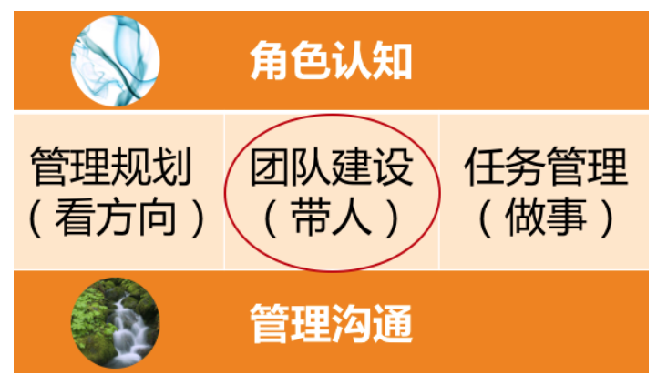

# 团队建设应该从哪里入手？

**“群策群力打胜仗”** 吗？“群策群力”就是如何带好团队，“打胜仗”就是如何取得好的业绩，“带人”+“做事”，齐了。

**群策群力打胜仗：**

第一，提升管理者的角色认知，让他们清楚自己作为 leader 都要做哪些工作；

第二，是团队融合，你希望工作坊之后，经理间有更好的互信和默契。

有人说：“带团队的核心是要做好人才培养。”
有人说：“最重要的是把合适的人放在合适的位置上。”
有人说：“对团队来说，最重要的是梯队和氛围。”
有人说：“一个好的团队是各有所长，协同配合。”
有人说：“激励很重要。”
有人说：“团队凝聚力很关键。”
有人说：“经理要以身作则。”

## 仅从团队角度来看，如何提升团队的耐力

**团队梯队：** 盘点团队新老强弱的构成。团队工作是着眼长线的工作，我们不是只赶一段路。一个团队如果没有良好的梯队，只是靠一两个成熟的高手在支撑，那么一旦这一两个高手请假、调走或者离职，整个团队就瘫痪了。所以，要把团队的战斗力放在一个更长的时间区间去考虑。

**团队文化** “团队氛围”，总之就是团队成员能够在这里找到非常好的认同感，大家也非常清楚
在这个团队里，什么是重要的，什么是不重要的，什么是应该的，什么是不应该的，都不需要去一点一点交代。我们可能平时也不会特别注意到，但是却无处不在。一个公司因为文化发生变化而带来的团队动荡，是灾难性的、难以缓解的，所以不能忽视团队文化的建设。

## 团队建设时 6 个维度的工作要素：

针对员工个体的两个要素是：能力和激励；
针对员工个体之间的两个要素是：分工和协作；
针对团队整体的两个要素是：梯队和文化。

# 如何提升团队的个人能力

**全面 review 团队建设六大要素，看看从哪个着手对你来说是事半功倍的，就从哪个要素去着手**

如果恰好员工个体的工作能力是当务之急，那么立马执行吧。

## 你要提升员工的什么能力？

“能力三核”，把人的能力分为知识、技能和才干三个层次

第二个分法，是把做好一份工作的能力分为人格力量、专业能力和通用能力

**人格力量** 通常是指一个人在面对某一情形时稳定的态度和表现，比如迎难而上、坚持不懈、积极正向、主动担当等等。这些人格力量对于个人能否搞定一件事情有时至关重要，但是培养起来却不是一朝一夕的，关键在于平时。

**专业能力** 对于技术人来说，一般就是指技术能力。工程师专业能力的评价维度和标准相对于通用能力更加有据可循。

**通用能力** 你不需要去弄清楚这个模糊的概念，你只需要去定义一些你团队所重视的通用能力就好；入选你“通用能力清单”的这些能力，可以有效地帮你的员工做好工作。比如我会把沟通表达能力、团队协作能力、快速学习能力等作为重要的通用能力，并和我的团队达成共识

我们对于一个人的评价，从来都是有双重标准的，一个标准是“及格” （期待的**下限**。），另外一个标准是“优秀”（期待的**上限**）。所谓“及格”，就是只要胜任工作的要求就好了；而“优秀”，除了胜任工作要求，还需要脱颖而出，超出团队普通表现，成为整个团队的核心人物。

不同的初衷决定了你制定什么样的标准，然后把这个标准写入员工的 IDP（个人发展计划），并双方达成一致，这就形成了个人能力提升的目标，是你们直接的一个“合作协议”。

## 如何达成 人才培养目标

“7-2-1”法则，即：10% 靠听课和看书自学，20% 靠相互交流和讨论，70% 靠工作实践。

### 帮助员工自学

- 组织员工参加培训；
- 为员工推荐和购买书籍；
- 提供学习文档、视频等；
- ……

### 关于相互交流讨论

- 组织兴趣小组、读书会等；
- 技术分享交流会、代码评审会等；
- 重点工作复盘，即 case study 等；
- ……

### 关于工作实践

- 授权和辅导。给员工独立负责重要工作的机会，并给予辅导和反馈。
- 调研工作项目化。即把调研学习的工作进行项目化管理。
- 总结并内化。对于员工完成的重要工作，有必要请他们做一个工作总结，看看从中学到了什么。员工在这个总结和反思过程中的收获，甚至比总结的结果本身更重要。
- ……

## 推”“拉”“放手”

### **“推”，- 就是给压力，推着他们学**

1. **提出明确的工作要求**。比如，在 1 周内熟悉某个业务并可以做开发。
2. **设置学习机制**。也就是强制要求遵守学习规则，并完成学习任务。
3. **peer pressure**。团队整体学习成长的氛围，会给不学习的员工带来压力。
4. **惩罚**。包括从绩效等级、晋升机会、调薪幅度等等，对于学习意愿低的员工有适当的“关照”。

### **“拉”，- 就是给方向，引导他们学。**

1. **树立榜样**。把特别有学习意愿和成长快速的员工设为标杆人物，在团队内给予认可和奖励。
2. **配备导师**。有明确导师的新人和员工，更愿意请教问题并快速融入团队。也许有的管理者会说，“我们团队氛围很好，新人来了随便问谁都可以。”而事实上，有名义上的导师，比没有指明导师要好很多，“找谁都行”，即意味着没有人对此负责。所以，请为你团队成员配备导师，新人导师最好是团队内的，而资深员工的导师，可以找团队外更资深的人。
3. **给地图**。成熟的公司往往会有技术方面的“技能图”，作为管理者，你也可以为自己团队制定一个成长的“技能图”，并标记出重要等级。这样，团队成员就有了学习和成长的方向，知道该往哪里使劲了。

### **“放手”，- 就是给发挥空间，让他们自主学习。**

1. 给员工勇挑重担的机会。在风险可控的情况下，给员工承担责任的机会，让他们去负责一些有挑战的工作。
2. 给员工自主空间，让他们独立思考，独立决策。你的辅导仅限于在他们的决策之后给出看法和建议。
3. 给员工信心和耐心，允许他们犯错、走弯路。因为很多经验都是踩坑儿踩出来的，所以不能一出问题就劈头盖脸一顿批，甚至是剥夺其做事的机会。

通常来讲，通过“推”“拉”“放手”，就可以激发很多员工的学习动力了，你甚至可以把学习和成长放入团队文化建设当中。当然，如果你要把学习作为团队文化的一部分，那就需要你自己首先有学习的“基因”。

## 关于提升员工的能力，有两个信念特别重要

**第一是相信员工能力的差异性**。即看到差异，重视丰富性。在工业时代，整齐划一、严格服从是团队管理的哲学；而在知识经济时代，员工的创造力能为团队带来更大的价值。创造力往往来源于差异的碰撞，所以作为管理者，你要特别关注能力的丰富性，标准不能太单一。

**第二是相信团队能力的系统性**。即欣赏差异，重视互补性。员工能力的差异，往往是他们对于团队的独特价值所在，管理者就是要像一位音乐指挥家一样，把各种优势各异的人统筹在一起，演奏出美妙的乐章。正如优势理论中所说的，**所谓完美的团队，就是价值观相同，优势互补的团队**。所以，作为管理者，你要看到团队能力的系统性，不要把各个员工的能力割裂来看。

## 总结

三步走：

首先，定义你所谓的员工能力；

其次，设计出一些可行的方法；

最后，激发员工的学习动力。

# 如何提升员工的工作意愿和积极性？

如何提升每个个体的战斗力呢？这主要与两个要素有关，即**个体能力**和他**使用能力的意愿**，如果要用一个公式来表示，那就是 **“个体战斗力 = 个体能力 * 个体意愿”**

## 无法启动激励的原因

第一，**激励认知不系统**。不清楚激励都有哪些手段，以及如何使用，各种零散的说法让人无所适从。  
第二，**激励可用资源匮乏**。实实在在的物质激励不受自己掌控，画大饼的精神激励，员工又不买账。  
第三，**激励达不到效果**。虽然激励的动作都做到位了，但是并没有收到激发员工动力的效果，或者效果不够令人满意。

## 我们依次看看这些问题该如何应对

## **第一个问题，关于对激励的系统认知**。

于此，我们比较熟知的就是马斯洛的需求层次模型了，这个模型可以指导我们从人的五个不同层次的需求来激发动力，不过操作起来还是有点不太清楚该怎么做。

丹尼尔·平克的《驱动力 3.0》 ： 驱动力的发展归纳为三个阶段：驱动力 1.0、2.0 和 3.0。

## 驱动力 1.0

来源于 **对生存和安全的渴望**。需求层次处于“马斯洛需求模型”的最底层。

## 驱动力 2.0

**“寻求奖励、避免惩罚”**。采取的方案是“奖励好的行为、惩罚坏的行为”，也就是人们经常念叨的“胡萝卜加大棒”。也是当前大部分管理者最常用的激励手段。

**因为无论是奖励还是惩罚，这类驱动力最大的特点是来自外部刺激。** 人对外部刺激的应对机
制是增强免疫力，所以无论是用惩罚来“威逼”，还是用奖励来“利诱”，用多了就没效果了。古人早就告诫我们 **“善用威者不轻怒，善用恩者不妄施”**，也是这个道理。

“不妄施”的做法，就是把每一个奖励的意图都明确化以加强感知。除非是过节，否则就不要“撒胡椒面”，去搞所谓“阳光普照”奖。

“表扬”这样的小奖励来举例，表扬一个员工，若遵循下面这三个原则和要素就会让你的表扬效果倍增：

1. **具体**： 就是表扬的内容和原因要非常具体，让员工和团队都知道他是因为哪一两点得到
   了认可。比如“员工 A 非常主动及时地处理了一个线上故障”“员工 B 在带新员工方面
   成绩突出”等

2. **公开**： 这个原则很简单，公开表扬有两大好处，一个是被表扬的同学受到了更大的激
   励；另外一个更大的好处是，你其实告诉了团队每个人，什么样的行为和价值观在你们
   团队是被认同和倡导的。因此，表扬要公开。

3. **及时**： 所有的期待都有时效性，表扬及时，其实就是对员工的反馈要及时。一个不及时
   的表扬不但会让激励效果大打折扣，而且还会让团队成员很不理解，“这么点事，至于挖坟拿出来说吗！”

## 驱动力 3.0

么驱动力 3.0 的核心就在于**自驱力**

**用驱动力 3.0 的思路来激励员工，不是你愿不愿的问题，而是不可回避的选择。**

原因：

1. 驱动力 2.0 的效果还是会持续变差。一方面是因为用滥了，没有新意；

2. 随着中国经济和文化发展，物质奖惩和别人的评价变得不如从前那么令人关注。很多 90 后职场人有着自己笃定的价值观

3. 在这样一个信息时代，员工的创造力更能为公司创造价值，而创造力需要更多的自主和差异。

**以驱动力 2.0 的核心价值观是“顺从”；而驱动力 3.0 的核心价值观是“自主"**

### 驱动力 3.0 实施方案

#### **提升员工工作的自主性**。即，给员工一定程度的自主掌控感。

**工作时间和地点上的自由度**

应以结果为主线开展管理工作，而不是用控制来做管理，除非你们的行业性质更强调“服从”

**工作内容上的自由度**

员工可以在一定程度上选择自己的工作内容。你在做季度规划的时候，也可以聊聊员工的意愿，看看能否兼顾个人兴趣和工作要求。

**工作方法上的自由度**

员工可以自主选择工作的实现方法，这在技术人的日常工作中是非常常见的。

**一定的自由度会让员工更有自主掌控感，从而起到激发的作用。**

#### 提升员工专精度，让员工持续有成长

这里的“专精”强调的不是要设定目标去成为某个“专家”，而是强调“自主投入”的过程，为员工创造愿意自主投入的条件，因为 **只有自主投入才能带来专精**。那么，都要创造哪些条件呢？

1. **明确的工作目标** 即，对员工的要求越清晰，他就越愿意投入努力。那么什么叫明确呢？以明确到他能着手执行为标准。

2. **目标要略有挑战**  即，对员工的要求要有一定挑战，但又不能太高。要求太高带给员工
   的是焦虑；要求太低带给员工的是无聊。难度适中的时候你才最容易沉浸其中、物我两忘。

3. **要能发挥其优势。**  每个人都愿意做自己擅长的事情，如果某项工作能发挥员工的独特优势，必定会给他带来投入的热情。可能满足不了某员工所期望的工作内容，但是还有行为模式和思维模式方面可以考虑，比如某些人特别爱和人沟通协调，那就让他用沟通讨论的方式去工作；如果有人特别善于独立思考和筹划，那就发挥他的思维优势；有的人行动特别迅速，那就让他去快速启动一项工作。总之，千万别简单认为发挥员工优势，就是鼓励员工“挑活”；优势是多层次的，所以让员工发挥优势这件事并不困难。

### 给予员工意义和使命

现在越来越多的人开始关注工作背后的意义和价值。驱动力 3.0 在不拒绝利益的同时，更强调的是工作价值的最大化，希望自己做出来的工作是有意义和价值的。

**管理者的一项重要修炼，就是去梳理团队的使命和项目的意义。**

美国心理学会主席马丁·塞利格曼在《持续的幸福》一书中，提供了一个“全面可持续幸福”（well-being）模型，即“PERMA”模型，为我们提升幸福感提供了一个可操作的框架

正面情绪、人际关系、投入、成就、人生意义，是通往全面幸福的五根支柱。若你想要提升员工工作幸福感，也可以从这五个方向去开展工作。

1. **积极正向的情绪。** 你在营造什么样的团队氛围呢？团队里是轻松愉快、互帮互助的，
   还是抱怨指责、死气沉沉的？现在你知道了，积极正向的情绪，本身就是提升员工工作动力、增强员工留任意愿的重要手段，那你能为此做点什么呢？

2. **良好的人际关系。** 在团队工作中，你做了哪些工作来提升员工的归属感、融入感呢？你是否设计了一些活动和机制，让彼此之间更愿意互相支持？每个团队会因为管理者的风格选择自己的有效形式，但一个常见做法是，为每位新人指定导师，你做了吗？

3. **自主投入**  你为员工自主投入提供条件了吗？如前面我们所提及的，为员工设定清晰
   的目标，给他们适当的挑战，并支持他们发挥自己的优势，可以帮你的员工提升自主投入的意愿，体验到“心流”带来的愉悦。

4. **取得成就**  迎接挑战并取得成就，是大部分工程师非常享受的事情，但是这需要一个前提，就是对于“成就”的刻画和设计。很多管理者往往缺乏这个意识，尤其对于一些长线
   工作，或日常的琐碎工作，员工做下来觉得没有成就感，甚至是觉得浪费时间。所以，把长线项目里程碑化，把日常工作项目化，让员工走一步有一步的成果，会提升员工的成就感

5. **意义和使命** 你可能会说：“工作就是工作，哪里有那么多的意义和使命啊。就别说
   员工了，我自己都觉得很缥缈！”但是员工越来越追求工作背后的价值和意义这件事是不可忽略的。所以，作为管理者你需要有能力为员工梳理清楚这个问题。

**实用方法:** 

**即尽量避免用“任务性”的语言，而多使用“成果性”的语言。**

常见的说法是：“把项目 A 抓紧做一下吧，下周要发布。”这在员工看起来，他收到了一项任务。但换成“成果性”的说法是：“项目 A 会帮我们验证一个结论，决定我们是否在这个方向上持续投入，下周就要做出决策，所以，你看下周能否搞定？”显然，成果性的说法会让员工更清楚自己工作的价值，完成之后也会很有成就感。

**定义团队的使命和愿景，并和团队有效传达，为大家的工作赋予更高的意义和使命**，不仅仅是规划要素、是驱动力来源，还是员工工作幸福感的五大支柱之一。

## 第二个问题，关于激励可用资源匮乏,怎么办

可以设计更为立体的激励体系了，而不是靠单一的激励来决定效果。“画饼”越来越成为管理者的必备技能，只不过不宜过大，饼太大了是没有激励效果的，要注意和员工有切实的联系。而且作为管理者，只有言行一致，保持承诺一致性，才能赢得团队的信任。

## 第三个问题，关于激励达不到效果

**效果不明显最大的原因是你只是做了一套“激励动作”**，这套“动作”可能是很多管理者前辈告诉你的，而不是你根据自己团队和员工的具体情况，结合激励框架定制化设计出来的。

实际上，**每一个激励方案都需要去思考和设计，把外驱和内驱结合起来，把长期和短期结合起来，把业务推进和职业幸福集合起来，把个人工作和团队使命结合起来。**

## 总结

**第一，激励要立体。** 需要从单一的激励维度，升级为更加立体的激励体系，从而适应新职场环境的要求。

**第二，激励在平时**。不能指望一些临时性刺激方案来做好激励，激励体系的搭建应在平
时。当员工跟你提离职的时候，它就已经不再是一个激励问题了。

**第三，激励要设计**。 由于每个人的业务特点不同、团队性质不同、管理风格不同、员工特征
不同、问题挑战不同，所以不要迷信别人给你的激励建议，我更建议你充分考虑自己面临的
实际情况，结合自己的特质和激励框架，来设计适用于自己的激励体系。

# 如何兼顾团队分工的稳定性和灵活性？

当团队个体间的 **分工和协作**都很良好的时候，就可以将个体战斗力凝聚成强大的合力了。

## 究竟为什么要分工？分工能带来什么收益呢？

**第一，为了实现规模化**， 分工不是为了高效，而是为了能容纳更多的人来一起干更大、更复杂的事情，做简单的小事情，是不需要分工的。

**第二，为了实现协作**，先有协作的需求，才有分工。换句话说，**分工是手段，协作是目的**，分工和协作是不能割裂开的。所以，如果你有一个分工方案对协作不利，就本末倒置了。

**第三，为了实现专精** 时代发展需要全才，也需要专精人才，分工为这类人才的成长提供了
很好的条件。他们可以把时间、精力和长期的练习都聚焦到某个点上，从而更容易实现对于
某项技能或某个领域的精细掌控。而且，由于精细化分工只需要每个员工关心单一工作内
容，所以管理者更容易从整体上用人之长、避人之短，让专业的人更专业。

 **我们是出于规模化、协作和专精的目的来进行分工的，在做分工的时候不能忘记了这
个初衷。**

协作好的分工可以带来除“规模化、协作和专精”以外的其他好的结果，比如人力资源配置优化、人才获取成本降低、员工工作积极性提升、执行效率变高等。而协作不好的分工也会带来很多负面，比如视野狭窄、能力单一、恶性竞争、推诿扯皮，等等。

**并不能简单地认为分工一定是件好事。分工是不是好事取决于协作水平，协作水平又
受限于管理者的管理水平**

## 常见的分工形式有哪些呢？

互联网领域最常见的组织结构有两类，一类是 **矩阵式**的，一类是  **BU（BUSINESS UNIT）式**的。

### 矩阵式结构

样简单地理解：员工按照角色被划分到不同的团队，每个团队都有自己的负责人。要做项目的时候，会有专门的项目经理来向各个角色的 leader 协调人力，然后把申请到的各个角色的人组织在一起去完成这个特定项目。一旦项目完成之后，人员将回归各自团队去迎接新的项目。

人力资源是按照角色“横向”来组织的，而项目执行是按照任务“纵向”来推动的，就形成了一个纵横交错的矩阵式结构，所以叫矩阵式组织结构。这类组织架构的好处是各个角色团队的专业度都会很高，而且角色归属感比较强，资源调配灵活；但不足之处是项目执行起来较为低效，因为每次都要重新申请人力，而且每次的项目团队都需要重新磨合。

IBM、微软的很多部门都是类似的组织方式，他们也都有一个专门做项目管理的职位叫“项
目经理”，和互联网公司既带人又做事的“项目经理”不同的是，他们主要聚焦于项目交付，而不对人的发展负责。

### BU 式结构

直译过来就是“业务单元”式，也叫事业部制，是指做某项业务所有的人员和资源都统一调配，无论这个事业部是大是小，都角色齐全。这样做的好处是团队长期合作磨合充分，协作效率高，执行速度快；不足是各种角色自己都要有，资源冗余和浪费比较多。另外，由于某些角色不在业务主干上，团队规模比较小，能力要求也不高，所以其角色专业度很难提升。

两种组织结构各有利弊，在很多互联网公司都在并行使用，甚至嵌套使用，并不冲突。不过，你还是要根据自己的业务特点、公司规模、发展阶段去选择合适的组织形式。

## 从组织内部看，分工的方式

对于一个具体的团队来说呢，工作安排分工是没有一定之规的，因为这和你的业务情况、人员状态、团队目标都紧密相关，而且很多事为了应急还会临时调整，所以怎么分派工作，还是以你的实际情况为准。

### 常见的误区、问题和建议原则。

#### 拒绝分工模糊

任何不以分工清晰为前提的边界模糊化，结果都会事与愿违。因为只有明确的分工，才能让员工清楚和认同自己的本职职责，产生归属感，并愿意主动付出多做一些。

不是反对去边界化，我只是强调， **在“边界模糊”之前，要加上“分工明确”** 这四个字。

#### 尽可能分工稳定

有稳定的分工才能体现出分工的价值，比如对某项工作的专精、员工的归属感等，所以，分工能稳定的话，就最好稳定。

但是也有两个因素会让分工稳定不下来。

一个因素 **被动调整**，是来自外部的业务调整，团队组织结构不得已随之而变，管理者就需要对团队成员进行工作再分工。此时就要遵循“尽可能稳定”的原则，因为变量越多，不确定性就越大。

一个因素是 **主动调整分工**， 意识到了长期稳定的分工带来的局限和怠惰。通过“轮岗”的方式来提升员工的能力和全局观。主动求变就意味着这种变化是在你的掌控之内。

#### 虚拟组织

为了某一个特定的目的和工作内容把大家组织到一起的。有的时候是为了一项临时性工作，工作做完之后就解散了，叫临时性虚拟组织；而有的时候是为了一项长期的工作，会一直持续很久，就会变成一个长期存在的虚拟团队。

**虚拟团队有哪些好处呢？**

1. **高效执行**  **专人专事，聚焦目标，高效执行**  以虚拟团队比一般的联合项目组，在执行上要更高效

2. **资源配置**。 对于很多工作来说，专门组建一个团队不值得，但是又时不时需要立项新项
   目，虚拟团队就为这类需求提供了解决方案。大家可以因为做事走到一起，但不是一个
   独立预算的团队。

3. **保持归属感** 为了做一些紧急项目，管理者往往会随意抽调员工，这样的事情出现的多
   了，员工的归属感会减弱，边界感会消失。慢慢地员工就认为自己是在“打杂”了，因
   为他找不到自己的位置在哪里了。而虚拟团队本身就带有“借调”的味道，并不影响员
   工认定自己“本应”的位置在哪里，所以，不会影响员工的归属感。

**使用虚拟团队这种方式需要注意的几个原则：**

1. **专人专事，不宜太多** “好钢用在刀刃上”，虚拟团队不宜太多

2. **认同员工价值** 在跨团队的合作中。既然你同意你的员工加入这个虚拟组织，无论做出来的业绩是不是你最看重的，都要认可他的价值。 管理者常常以员工的产出对自己团队价值不大为理由压低员工绩效，这是典型的让员工背负管理者的决策后果，很不可取。

3. **目标明确，职责冠名**  每个虚拟组织建立起来都是为了特定的目标，所以你组建每个虚
   拟团队的目标要非常清晰，并且和团队每个人都要传达到位。为了进一步提升责任感和
   归属感，很多 leader 会把职责冠在团队名字上，我认为非常好。比如“100 天战队”“用户体验优化小分队”“架构迁移大队”等，很是生动形象。

# 有什么方法可以有效提升团队凝聚力吗？

**分工明确只是具备了合作的前提和基础，真正能够让大家良好互动并高效产出的，是日常工作中的协作。**

## 那么该如何不断提升团队的协作水平呢

### 建立协作机制

通过机制来约定协作的动作，以此来保证大家“动作协调”。

### 提升团队凝聚力

提升团队成员间的信任度、认同度和默契度来降低协作成本，提高协作效率。

团队凝聚力和协作水平是两个非常有意思的概念，他们含义不同，又紧密相关。团队凝聚力
更侧重团队成员间的关系，体现他们的信任度和向心力如何；而协作水平则更关注做事过程
中的互动情况。

一个非常有凝聚力的团队，对于良好的协作有着直接和关键的影响，而良好的协作反过来也会提升团队成员间的认同度和默契度，从而提升团队的凝聚力。他们互为因果、彼此促进。

要想提升协作水平，**“硬件”靠机制，而“软件”靠凝聚力**。凝聚力即是团队协作的基础，又是团队协作的目标。强大的凝聚力，是战斗力强大的团队的重要特征之一。

## 如何来提升团队凝聚力呢？

### 第一个角度，设立共同愿景。

如果团队有着自己的使命，又能得到团队成员的普遍认同，大家会更容易朝着一个方向共同努力，也更容易肩并肩地一起迎接挑战，即所谓的“志同道合”。它是如此重要，下面我简要描述一下其设立步骤：

1. 明确你团队的职责、使命和工作目标。

2. 管理者自己要笃信第 1 条的内容。

3. 在各种合适的场合宣贯这一内容，比如季度会、总结会、沟通会、启动会，以及 1 对 1沟通等，都要不失时机、不突兀地把使命和愿景同步给大家。

4. 坚持不懈地做步骤 3。不要指望一蹴而就，开个会大家就都认同了的好事，现实中不会发生，只有时间长了、频次够了，才会内化，才会深深植入员工的内心。

### 第二个角度，提升员工归属。

 **如果说，设立共同的愿景，是为了让员工凝聚到共同的事业上的话，那么提升员工归属感，则是为了让员工凝聚到团队上。**

方法论：

1. **要给他一个位置，给他一个“立足之地”，也就是要分给他一份职责。** 只有当员工清楚自己能为团队做出什么贡献的时候，才会心安，才会感受到自己是团队的一份子。所以在团队分工上，要让员工清楚他肩负的职责对于团队的意义，让他觉得自己做的事有价值，这就是所谓的 **“事对”**。
2. **要营造良好的团队人际关系，让彼此间形成紧密的连接。**  团队成员间良好的关系，和团队凝聚力的提升是互为因果的，所以不要小看能促进员工间关系的一些小事，恰恰是这些小事，能够促使员工间的合作关系走上正向循环的轨道，员工会因为喜欢和团队的人相处而觉得有归属感。这就是所谓的 **“人对”**。
3. **明确亮出团队的文化价值观。**  团队的文化和价值观是否是员工认同和欣赏的，决定了他能否长期留在团队。价值观方面的冲突是很难调和的，如果员工从价值观层面就不认同团队，是很难让他找到归属感的。好在团队文化本身就是一个筛选器，最终留在团队发挥核心作用的都会是认同团队价值观的人，当然前提是团队先有明确的价值取向。因喜欢一个团队的文化和氛围而产生归属感，这就是所谓的 **“味对”**。

一个团队能让员工觉得 **“事对”“人对”“味对”**，那么，他的归属感应该是很强的。

### 第三个角度，加强相互了解。

花一点心思来稍微设计一下团建活动。无论如何，加深员工互相的了解，是提升信任和默契的良方。

### 第四个角度，共同面对挑战

“今日谁与我共同浴血，他就是我的兄弟。”显然一起扛过枪的兄弟，感情是很铁的，毕竟是经历过不离不弃的并肩作战。虽然我们现在没有仗要打，但至少有如下两个方面的事情近似打仗：

1. 一些有挑战的大型项目或紧急事故的应对。

2. 跨团队的对抗性活动，比如趣味运动会、Dota 比赛等

毋需去说教，而是让大家在“硝烟”和“炮火”中去建立深厚的感情，这就是所谓的“事上练”。

### 提升团队凝聚力的四个方面的工作，我们可归结为如下：

# 如何物色和培养核心人才？

如果能够带出一个良好的团队，持续不断地把一件又一件的事情做好，才算是一个好的团队管理者。 **团队产出是否可持续，是考量管理者价值的一个很重要的维度**, 它体现了这个团队是否健康，是否有耐力和韧劲。其中，耐力让团队走得远，韧劲让团队走得稳。

提升一个团队的耐力和韧劲，有两个要素： **梯队培养和团队文化**

一个 **团队的梯队**，就好像一个团队的“骨架子”，这“骨架子”是否健康良好，决定了团队是否健壮。

**团队文化** 就好像是团队的气质和调性，它会吸引“气味相投”的人持续加入，而把不符合团队气质的人筛选出去，越来越鲜明的团队价值观让大家紧密地聚拢在一起，从而让团队越来越“结实”，越来越“经得起折腾”，不断增强团队的耐力和韧劲。

## 梯队培养的问题

“梯队建设”，其实包含了“梯队规划”和“梯队培养”两部分内容，你可以认为规划和培养的关系，是“计划”和“实施”的关系，是“想”和“做”的关系。

“梯队培养”实际上就是选拨一些人，并把他们培养成团队的核心骨干，也就是团队的“骨架子”

包含了两个部分的工作：**一个是选拨和物色培养对象，另外一个是培养这些人。**

作为管理者的你可以有自己的人才观，但是物色培养对象应该要满足以下两个原则：

第一，要保持人才选拔和团队建设的一致性。即，你对核心人才的选择，需要和你团队建的理念保持一致，这主要体现在能力、协作和文化三个要素上。

1. 能力。主要是确保其个体能力和业务特点相互匹配，能力潜质是可成长的。一般来说，
   技术团队的梯队，个体的专业能力肯定是要不错的，至少在业务特点方面要匹配。

2. 协作. 其协作的意识和能力，和你团队的要求和期待是否匹配。一般来说，团队的核心
   骨干都要有比较好的协作意识，才可以干更大的事情，才可以发挥一个骨干需要发挥的
   作用。

3. 文化. 其行为风格和价值观，和团队文化价值观是否匹配。

第二，和你相似的人才是人才，和你互补的人才是更宝贵的人才。

**如果说上一条原则我们强调了价值观层面的一致性，那么这条原则就是在强调行为风格和思维方式的多样性。**

事实上，风格相近的人协作效率的确会高，但是会缺乏更丰富的见地和视角。而在信息时代，多元才能带来更大的创造力，所以 **在价值观相近的情况下，行事风格和思维方式与自己不一样的人，更值得你关注**。

### 人才物色出来了，要怎么培养呢？

有三件事情很重要：

#### 第一，对齐期待，达成共识。常用方式是 IDP，即个人发展计划。

**不承诺原则** 。你在和培养对象共同制定培养计划的时候，最好秉承“不承诺原则”，意即，“我培养你，但是不承诺为你做职位设定和晋升”.

**两个方面的原因：**

一是他能否成为团队核心骨干，或晋升某个岗位，是靠他自己的影响力来获取的，而不是靠你们的约定和承诺；

二是为培养失败留下退路。

#### 第二、 提供机会和发挥空间，做好授权

而能力和影响力都是在实战中积累起来的，这就需要给培养对象提供发挥空间，让他在“事上练”，所以就不可避免地要做工作授权。

**审视初衷**

审视自己想要在此次授权中收获什么，你是想把某件事做出来，还是想把人带出来，抑或是其他？

**明确期待**

就是为了让培养对象清楚你对他的期待是什么，也就是你们就授权目标达成的共识。既然是目标，也就需要符合 SMART 原则。这一点是管理者普遍能够想到的，可能会有不同的述，比如明确要求、明确口径等，都是一回事。

**听其思路**

交代好授权任务之后，你可以首先听听他对这件工作的看法和思路。你从他的思路和方案中就大体可以判断出，他独立负责这项工作的靠谱程度如何，这不失为风险把控的良方。

**重要约定**

需要对你特别关心的事情和他做一个约定，比如在什么情况下他需要告知你。这里我想强调的是，既然是授权，你最好不要动不动、时不时就去询问和干涉他的工作。

**了解进展**

就是在工作进展过程中要了解进度、评估风险，而不是任务交代完了就撒手不管了。

**给予支持**

在工作执行过程中，管理者需要给予必要的支持和帮助，这一点也是大部分管理者能够想到的。在人才培养的主动授权中，我推崇的方式是教练式的引导和启发，而不是直接告诉答案，因为经过他自己的思考，他才能更好地掌握工作技能。

**评估结果**

对于任何一次授权，针对授权对象的工作结果和表现给予有理有据的评价和及时的反馈，都是必要环节

**洞察优势**

盘点在整个授权过程中，授权对象所表现出来的突出的优势有哪些，比如特别谨慎周密、特别有责任心、思路特别灵活、特别善于合作、善于沟通表达等等。

**积极反馈**

就是对于授权对象的工作，一定要给出一些“正向”的反馈，即，有哪些做的好的方面。主要目的是告诉他，哪些做法是你们推崇和提倡的，哪些是需要持续保持和增强的，同时也能起到激励的作用。

**一条改进**

就是要给出 1～2 条改进建议，也许你认为他需要改进的地方非常多，但是你需要明白，要想取得良好的改进效果，就得逐条改进，所以，不妨先提出 1～2 条建议，剩下的以后再说

我把它们划分为 **事前、事中、事后**三个阶段。从要点的分布你可以看出，授权的重点在于事前的安排和事后的反馈。因为既然是授权，事中最好不要干涉太多，只做约定好的 check 和支持就好。

#### 第三、 建立反馈机制

**建立周期性沟通机制**

和你的重点培养对象，建立周期性的沟通机制，让沟通常规化，而不是想到了就沟通一下，想不到就不沟通，这样会比较随意，沟通不系统也不深入。至于周期是多长，就和你的具体情况、具体需要有关，两周常常是个不错的间隔周期。

**review IDP**

IDP 做出来之后只是发挥了一部分价值，即双方明确了目标和期待；对于IDP 执行情况的评估和反馈，才能体现 IDP 更大的价值。因为只有在反馈中，你们才能对齐对这件事情的看法和观点，这里不但蕴含着是非对错的价值观，还蕴含着指导和激励。

**安排第二导师，给予支持和反馈**

为了使培养对象得到更好的成长，也可以为他安排一个除你之外的“指导老师”，这个导师未必一定是团队内的，团队外的效果常常也不错。只要是你信任和认可的就好。

**团队核心人才的培养对于管理者来说，是一个非常重要的工作内容。**

# 如何建设团队文化，营造团队氛围？

虽然，对于团队文化本身，没有唯一确定的定义。但是，每个团队，都有一些约定俗成的工作方式和是非判断。在这个团队中，即便没有人告诉你什么是对的、什么是错的，你大体上也清楚什么该做、什么不该做。它虽然不像规章制度那么带有明确而强制性的约束力，却也
能引导和规范团队成员的言行举止，我们把这种潜移默化的行为准则和工作作风称为 **团队文化**。

**你希望用什么词汇来形容你团队的气质和调性呢？或者，你最愿意让什么样的员工留在你的团队里呢？** 这大抵就是你团队的文化。由于团队文化里往往蕴含着团队最推崇的价值观，所有也会把团队最核心的文化，称作 **团队的文化价值观**

我带的这十几个人、几十个人的团队也需要有吗？

答案是，不但需要，而且很重要。不信你去看看那些有凝聚力、有战斗力的团队，他们都是有鲜明的气质和调性的，比如有的是“强执行”文化，有的是“靠谱”文化，有的是“极客”文化，还有的是“温暖”文化……不一而同。

## 鲜明的团队文化及价值观，究竟能给一个团队带来什么呢？

### 第一，效率。这是由文化的秩序性带来的效果。

由于文化里包含着约定俗成的工作标准和决策依据，并且团队成员都对此持有共识，因此不必事事请示上级和彼此确认。比如，一个“强执行”的研发团队，每个人都知道依计划行事并坚决兑现承诺的重要性；一个强调“安全”的数据团队，每个人都会考虑在工作推进过程中的安全措施。统一的行为准则和协作上的默契，带来了工作效率的大幅度提升。

### 第二，空间。这是由文化的导向性带来的效果。

由于文化里约定了团队的价值导向，也就意
味着，在符合价值导向的前提下，员工可以自主选择自己的工作手段，甚至是工作内容。这为很多有主动性的员工提供了自主发挥的空间。在“员工激励”一文中我们提到，自主性能够提升员工的投入度，激发员工的自驱力。所以，明确的文化也是激励手段。

### 第三，归属。这是由文化的筛选性带来的效果

由于团队文化里蕴含着价值观，所以团队文化有“筛选器”的作用。认同该文化的人会不断加入进来，而不认同该文化的人也会逐渐淡出，久而久之，团队里都是对该文化认同度很高的员工。价值认同是一种高层次认同，一旦认同，便具有很好的稳定性和黏性，这种认同为大家带来了深深的团队归属感，共事的员工也更有凝聚力。在盖洛普的“优势理论”中有关于“完美团队”的描述，即，“价值观相同、能力互补的团队”，可见价值观对于团队的重要意义。

### 第四，耐力。这是由文化的延续性带来的效果

文化对于一个组织，是相对稳定的元素，它能够在新、老员工间传承，并不会因为个别人员的变动而明显变化，除非是团队负责人有调整，才会给团队带来明显影响。一个企业或一个团队的文化，对于其稳定性、健壮性及耐力的重要作用。用通俗的话说就是，一个拥有鲜明而稳定的价值观的团队，更扛得住“折腾”。既然团队文化能够带来这么多收益，那么要怎么打造自己团队的文化呢

## 打造团队文化的步骤

非常简单，大体分为三步，我给每一步起了一个好记的名字，分别叫“命名它”“主张它”和“追求它”。

**“命名它”**

其实就是提炼你团队的文化，用合适的词句把它表述出来。一个基本事实就是，一个团队的文化价值观，主要来源于团队负责人或核心管理者。你是什么样的作风和价值观，你团队就会是什么样的，也就是说，你的团队文化和你喜欢什么样的文化关系不大，而和你是什么样的人关系很大。

**“主张它”**

就是要把你提炼出来的团队文化，宣贯给整个团队成员，甚至还包括上级和合作的兄弟团队。在开季度会的时候，可以和全员来宣贯，并作出详细解释；在你和团队成员 1 对 1 沟通的时候，也可以适时强调；在跨团队沟通中，也可以看情形主张。

  总之，这里的关键在于，你是否有这个意识，以及是否愿意花这份心思。

**“追求它”**

每个人的视角和态度都是不同的，不设计、不强调、不引导，文化的共识是很难被捕捉到的。

而且，更为重要的是，文化的践行，更多的体现在管理工作中，而不是活动中。比如：
你在和员工约定绩效方案的时候，有没有体现团队文化和价值的内容？
你在评优和表彰员工的时候，有没有明确体现团队文化价值观？
你在选拔新人导师的时候，有没有和团队文化挂钩？
你在项目成功发布的时候，有没有总结团队文化？
你在辅导和教导员工的时候，是否有提及团队文化？

正是这些日常的管理工作，蕴含着你的团队文化，它其实一直都在。团队文化的打造，并不是要无中生有，而是要把它提炼出来，发挥更大的引导、规范和传承的价值。

# 如何和低绩效员工谈绩效

## 和低绩效员工谈绩效为什么令人头疼

首先就是自己的心理在作怪，因为在你看起来，你和低绩效员工的这次沟通，你不得不带给他一个“坏消息”，而没有人会很享受带给对方一个可能会令对方不悦的消息。这就是为什么很少有管理者会头疼跟高绩效员工谈绩效，因为他们认为高绩效是一个“好消息”，和员工怎么谈都问题不大。这是人之常情吗？其实只是因为你 **把“低绩效”和“坏消息”划上了等号，而事实上，划上等号就意味着你误会了绩效沟通的目的**。

无论是不情愿沟通“坏消息”，还是内心有歉疚和忧虑的负担，都是因为把绩效沟通的焦点放在了绩效结果和对结果的传递上，而没有看到绩效沟通有更重要的意义和价值。

### 良好的绩效沟通要达到的目的

1. **对齐。** 绩效沟通的过程，其实是很好的对齐双方观点的机会。你们可以互相同步自己的
   信息，听取对方对于这些事实的看法和判断，了解对方在乎的焦点在哪里，交换双方对
   于同一个结果的评价标准，等等。所以，一个有效的绩效沟通，会在事实信息、逻辑判
   断、双方意图、评价标准等多个层面上进行对标，从而达成共识。

2. **辅导**  绩效沟通的过程，不仅仅是告知员工绩效结果，更重要的是通过对过去工作的回顾，让员工有更多的思考和觉察。所以，绩效沟通同时也是一个辅导员工成长的过程，当然这个过程最好不是说教式的，而是教练式的。

3. **激励** 好的绩效沟通，即便对方是低绩效员工，也会通过沟通令他重燃斗志，对未来充
   满希望，从而达到激励的效果。

### 绩效管理的注意事项

#### 绩效沟通的核心并不在于谈，而在于绩效管理全过程的完整性。

如果绩效计划的制定、确认、review 都没有做到位，只是靠最后的沟通来求取共识，那是无论如何都达不到良好效果的。所以，我们先整体来看下绩效管理都包含了哪些事儿。

绩效管理五大步骤：

1. 绩效计划或绩效评估方案的制定。即，你未来给员工打绩效的依据是什么。
2. 和员工确认绩效计划。即，你和员工都要认同这个评估手段，所以很多公司的绩效计划
   都是要员工签字的。
3. 归档并维护。可能会因为员工工作内容的重大调整，中期会有一些更新。
4. 绩效评估。你需要对员工在本次绩效周期内的工作表现进行评估和打分。
5. 绩效沟通。就绩效评估结果和员工进行沟通，达到对齐共识、辅导和激励的效果。

#### 绩效沟通之前，先摆正自己的角色和姿态

先审视一下自己的角色：你是这个团队的管理者，是这个团队的负责人，你是有责任来评价团队每个员工的工作表现和业绩的。你是站在团队的视角来看待这个问题，而不是站在任何一个成员的对立面来特别针对他。即便他做的也还不错，但是你如果还是把低绩效的名额给了他，那么你一定是有自己的依据的，所以这个绩效也的确是他应得的，你并不欠他什么。你有管理者的职业素养，有管理者的工作视角，也有令人信服的评价依据，你做出来的就是最公平和最恰当的决策。所以，你需要考虑的事情是，如何和他达成共识，期待并支持他也可以像其他同事一样，变得更加出色。

所以，你的角色不仅仅是一个评判者和告知者，还更是一个辅导者和支持者。

#### 把绩效沟通当做是承上启下的新起点，而不是末日审判

绩效沟通，诚然要对过去的工作表现和成绩做出有理有据的评价，并且在相互探讨中达成共
识。对于低绩效员工来说，如何让这个沟通不那么令人沮丧和压抑呢？

“着眼未来”是个好的做法。即，过去虽然很努力，但是结果却不尽如人意，那么如何能够改变这个状况呢？“往者不可谏，来者犹可追”，你可以引导他多说一些自己对未来的打算，希望接下来做些什么，打算怎做，以及需要哪些支持和帮助。

在双方对于基本事实都认同的情况下，尤其要避免抓住过去的问题不放，如果把焦点放在对失败的探讨上，会让他感受到末日审判般的沮丧，以及对于改变这种状况的绝望与无助。而用教练式的引导方式，一起做一场着眼未来的、面向长期发展的绩效沟通，就能收获到辅导和激励的效果。

# 如何让团建活动不再 "收效甚微"

关键点：希望通过团建达到什么目的呢？

## 团建活动的关键几个误区

一.  认为团建活动是万能的。 但最总结果 **要么期待模糊，要么期待过高。**

一般在什么情况下安排团建活动呢？

   1.    高强度、高压力的工作告一段落的时候

2. 在重大挑战之前给员工打气的时候；

3. 在取得了重大工作成果的时候；

4. 在公司庆典或者春节、圣诞等节庆日的时候；

5. 在刚刚组建团队或者团队调整的时候；

6. 在整个团队工作积极性不高的时候；

7. 认为团队凝聚力不好或者彼此间合作不顺畅的时候；

8. 希望打造团队文化的时候；

安排团建活动的 三大出发点：

1. **以团队需要为初衷**  比如提高员工积极性、提升团队凝聚力、打造团队文化、提升斗
   志、提升团队韧劲等。

2. **以员工需要为初衷**  常见的是调节放松，一段高强度工作之后，缓解员工的精神压力和
   紧张情绪。

3. **以个人需要为初衷** 认为团建只是一项管理任务，需要时不时执行一次；或者只
   是单纯出于个人需要。

总结：为了团队、为了员工或为了自己，这三种活动定位。虽然我们习惯上把各种
各样的活动都统称为 TB（team building），但是我更倾向于认为，只有把团队建设作为
初衷的活动才叫做团建活动，而不是所有的活动都属于团建活动。

初衷不清晰在团建活动中有两个表现：**期待模糊**和 **期待过高**。

**期待模糊** 是指没有厘清这次团建活动要达成的效果，甚至还把团队诉求、员工诉求和个人诉
求揉在一起。

**期待过高** 是初衷不清晰的另一个表现，即，希望通过一次或几次团建就能打造出有凝聚力、
有战斗力的团队，这种想法是很魔幻的。

团建活动直接影响的要素，仅仅是前面我提到的 **员工间的协作默契** 和**团队上的团队文
化**

二、就是认为团建活动理所应当就有效果。

**缺乏设计，才是活动效果不好的主因。**

当然，作为管理者，你可能在活动设计上并不专业，思路也不见得很新颖，所以可以和别人
合作来完成。但是确保活动方案和你的初衷匹配这一点，你是不可回避的。

三、 团建活动是部门助理、HR 或行政的事情，管理者配合就好。

请务必以主人翁的姿态来看待团建活动。原因有如下：

1. 从收益看。团建活动的主体和对象，即团队，是你的，所以活动能够在团建方面给你带
   来哪些帮助，是你要考虑的，这就是所谓的团建的初衷和目的。

2. 从成本看。你付出了最大的成本，如果你不考虑收益，你就亏大了。千万别觉得团建活
   动只是花了你团队一些预算，其实更大的成本是整个团队要把这么多时间投入进来，这
   个时间和人力成本是很昂贵的。而且员工还投入了自己的意愿和耐性，你不能默认每个
   员工都是愿意参加活动的，也许很多人只是因为“团队活动不好推托”才参加的。

无论从期待的收益，还是投入的成本，你都是最在乎的那个人。因此，从现在开始，
做团队活动的主人，与部门助理、HR 和行政同事，一起去筹划，而不是完全假手于人。

## 如何做出 ”收效显著“ 的团建活动

第一问，关乎初衷：你是想做团建活动，还是调节放松，或是其他？
第二问，关乎角色：是你想做团建活动，还是只想配合一下助理、HR 或行政的工作？
第三问，关乎目标：你想达成团建的什么效果？默契还是文化？
第四问，关乎手段：活动方案和你的目标匹配吗？
