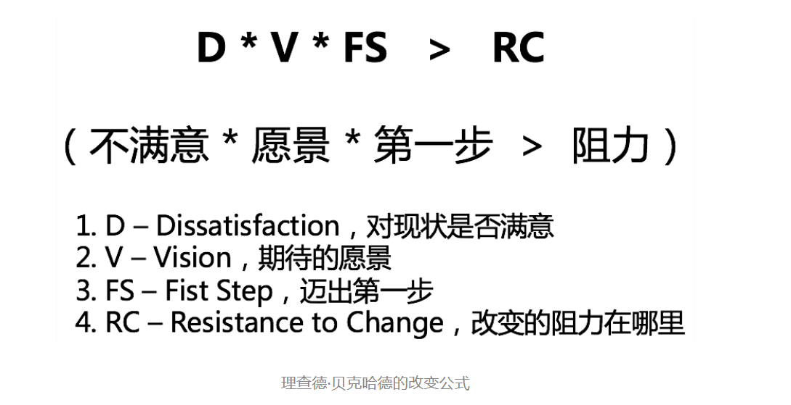

我们已经探讨了“管理三明治”五部分内容中的前四部分：角色认知、管理规划、团队建设和任务管理。接下来我们来探讨 管理沟通。

霸占前三的最有挑战的管理话题：**向上沟通、员工激励和团队凝聚力提升**

技术管理的特点：

1. 技术开发工作：使用电脑、学习语言、设计算法、开发功能、遵循规范……
2. 项目管理工作：明确需求、制定计划、把控流程、推动执行、通报进展……
3. 和下级合作：分配任务、跟进进展、辅导帮助、激发动力、评价结果……
4. 和上级合作：领取任务、领会意图、提供建议、申请资源、寻求指导……

第一，技术开发工作，主要和客观事物、自然规律打交道。客观事物和自然规律的特点就是
确定性、精确性和稳定性。

第二，项目管理工作。虽然项目管理不可避免地要跟各个角色的人打交道，但这项工作无论
是目标，还是过程，核心都是做事，都是基于规则和规范的。换句话说，还是可以照规矩办
事的。

第三，和下级合作。如果说项目管理还可以大幅度地依赖规则和规范来搞定的话，那么和下
级的合作和沟通就变成了完全和人打交道了。人大概是这个世界上最不稳定的“因素”了，
自然性、社会性、情感性交织在一起，再加上无时无刻的相互影响和波动，就别指望有什么
流程和规则是可以用于和很多人的相处了，即便是和某个确定的人相处，都很难摸到规律，
冲突和矛盾不断。不信的话，你看看网上有多少情感专家、教育专家就知道了。

第四，和上级合作。从规则感和掌控感而言，和下级合作至少有一个因素可以利用，即你的
职位和角色带来的职权。从权力角度讲，因为下级向你汇报，你对他们的工作有分配、知
情、评价的权力，你可以主导团队的一些规则和文化。从视野角度讲，团队成员的工作都在
你的视野范围内，所以你会有一种掌控感。因此，和下级的合作，虽然已经只有很少的确定
性的因素和手段可以用了，却还不是完全没有

但是，和上级的合作，对于很多技术管理者来说简直就是“噩梦”了。自己很多任务是上级
来安排的，这就很被动；上级比自己视野开阔，很多时候揣摩不透上级的意图，但是还不能
不关心；自己需要的很多资源和支持都要向上级申请，但不见得能申请到；只能给上级提供
建议，但是对方还常常不会采纳……各种各样的“不确定性”弥漫在每天的工作当中。

管理沟通让我们技术管理者们痛苦的主因是 **确定性和规则性的减弱，不确定性的大幅度上升**

### 管理沟通四个目标

1. 建立通道。即建立沟通关系和沟通渠道，说白了就是你要和谁建立沟通关系，以什么方
   式和频度进行沟通。这就很像两个技术模块相互通信要建立“连接”一样。你刚接手某
   个团队的时候，需要跟上级、下级和合作的同级都建立沟通和合作关系，即是如此。

2. 同步信息。也就是把相互不了解的信息同步给对方，让对方知悉了解此事。这个目的在
   日常沟通中非常常见，比如同步目标、汇报进度、通知通报等，即属于此类目的。

3. 表达情感。有的时候，沟通只是为了表达某种情感，比如表达焦虑和压力、快乐和感
   谢，以及成就感等等。此时沟通本身就成了目的。

4. 输出影响。在工作中，这类目的的沟通也是非常多的，比如提出建议希望对方采纳、管
   理上级的预期、和员工沟通绩效、向上级申请资源等等，都是希望别人能够采纳和满足
   自己的观点和诉求，从而达到输出自己影响的目的。

## 沟通的四个稳定要素

1. 管理逻辑。管理沟通问题，其实需要从管理逻辑和沟通方法两个视角来应对和处理。所
   谓的管理逻辑，就是从管理角色认知和管理方法来看待该问题处理的逻辑。这是可以随
   着管理认知和管理经验的不断积累而不断提升的，你的管理逻辑和管理判断力会越来越
   可靠，应对管理沟通也就越来越有掌控感，所以这是相对稳定的一个因素。

2. 沟通通道。一个沟通通道的水平，主要体现在通道是否稳定，以及沟通是否顺畅这两点
   上。决定这两点的，就是你和对方的信任水平和默契程度，这两个要素也是会持续积累
   的，而且积累的水平越高，沟通通道的品质就越高，故而沟通成本就越低。因此，这也
   是管理沟通中，比较稳定可靠的一个因素。

3. 工具流程。沟通有很多的工具、技巧、流程，对于最常见的向上、向下、横向这样特定
   的沟通场景，如果你能够持续掌握一些适合自己的工具和流程，那么这些你可以熟练使
   用的工具和流程，就变成了一个相对稳定的要素。

4. 影响力。影响力的积累不是一天两天的事情，而其发挥作用的时候也是非常稳定的，尤
   其在说服影响的沟通中，你有多大影响力，基本就决定了你能影响什么样的人，以及多
   大的事情。所以，这也是沟通可以依靠的稳定的因素。

## 沟通技巧

### “**3F**”**倾听**

**第一，事实信息（FACT）**

**第二，感受和判断（FEELING）**

**第三，意图（FOCUS）**

# 如何管理情绪 以及情绪化员工

美国学者麦克林（Mclean）根据大脑演化过程提出了三个脑层次的理论：最里面的是“爬行动物脑”，这部分脑是从爬行动物那里继承下来的，控制着人本能的、无意识的、瞬间反应的行为，属于“生存式大脑”；中间的这层大脑，是从哺乳动物遗传下来的部分，控制着情感和情绪，并沉淀和保持长期形成的习惯模式，这种模式反应也很快速，称为“情绪脑”；而最外层的大脑，是智人阶段才进化出来的，控制着视觉、想象力、辨别力、系统思考等，称为“理性脑”。这“三层脑结构”的示意图如下：

**对情绪的觉察，是情绪智力的核心能力，是跳出情绪的钥匙**  一旦你觉察到自己正处在一种不理智的愤怒当中，只要你愿意，就会有各种各样的方法和策略去消除它，并分辨得失，做出理智反应。

我们先在理智的情况下为自己建立一个觉察，审视自己：**“我是否在发怒呢？”** 这是基于这样一个认知，即“在愤怒的情绪下处理问题容易误判，如果有情绪，就先处理掉情绪再处理事情”。

判断是否在情绪中的依据：

1. 可以靠经常能关注到的一个随身物件来提示。比如你的手环、戒指，甚至是手上的一个伤疤，只要你能时不时关注到，就可以。一旦看到这个物件，你就问一下自己“我是不是在发怒”，这也是一种觉察。

2. 每天写觉察日记，反思自己在情绪管理方面是否有所失误。我身边就有伙伴用这种方式并取得了比较好的效果。

3. 可以和伙伴约定，请他帮忙提醒。一旦他发觉你情绪不对，都可以当场或事后提醒你，来加强觉察。

4. 用你的重要关切来提醒。比如，你可以和你的上级约定，把这个季度的情绪化频次作为一项 KPI 纳入自己的《绩效计划》，从而让你心里总是悬着一根弦来不断提醒自己要注意情绪。

## 管理情绪的方式

1. **认知它**。了解它是怎么产生的，以及怎么发挥作用的。如果是帮下级改进，可以先给他讲讲“三层脑结构”的事情。

2. **认同它**。接纳并疏导自己的情绪压力，而不是压抑它。看到它消极的一面，也要看到积极的一面，并和它交朋友。如果是帮下级改进，切忌一味批判他的情绪化，而是引导他看到情绪的两面性。因为很多情绪化的人，往往发怒之后会后悔，希望控制自己的情绪，只是控制不住，这个时候就会全面否定自己的情绪。

3. **觉察它**。建立对情绪的觉察，并用我们上面提到的方式不断强化，给予足够的耐心不断练习，直到它变成一种下意识的反应。如果是帮下属改进，你可以和他约定如何提示他，在他自愿的情况下，也可以像我一样，纳入 KPI 管理。

# 如何和上级沟通

## 如何建立良好的沟通渠道

**第一，沟通意愿**。这是基本前提。实际上，在我和中层管理者聊他们对下属的期待时，他们大多都会明确表示，希望我和初级管理者们澄清一个事情，那就是：“上级默认是需要管理者们主动向上沟通和反馈的，而非默认不需要。”

**第二，事务特点**。即，根据事务的特点，比如是否重大、是否紧急、是否敏感、是否正式等，来确定沟通的方式和频次。这很容易理解。

**第三，沟通风格**。如果说审视事务的特点，是根据“事”来选沟通方式，那么审视沟通对象的风格，就是根据“人”来选择沟通方式。探讨沟通风格和管理风格的工具比较多，比如大家都熟悉的 DISC，以及盖洛普的“四大优势领域”等，如果感兴趣你也可以去了解和学习一下，核心是根据沟通对象的风格特点，来选用你们更高效和易接受的沟通方式。

**第四，信任关系**。如果说前面提到的沟通意愿、事务特点和沟通风格，都是为了鼓励你主动加强沟通的话。那么对于你和上级信任关系的审视，就是让你看看，是否可以简化沟通。比如你原本需要长篇大论的汇报，对于默契度很高的上级，可能也就是一条消息的事儿；你原本需要多次沟通的问题，对于信任度很高的上级，可能只要简单一句话，甚至都可以免掉沟通。

是否需要和上级沟通,可以问自己两个问题：

1. 这次沟通能给你带来什么价值？
2. 这次沟通能给上级带来什么价值？

**通道品质足够高的话就靠沟通通道；如果沟通通道品质不高，信任和默契程度不够，就需要靠沟通工具来对齐了，沟通层次图及“3F”倾听是个不错的工具**。

# 横向沟通和非职权影响力

**影响力，是一种不使用强制性力量却能改变别人的看法和行为的能力。一般又分为职权影响力和非职权影响力**

## 职权影响力

1. **传统因素**。即在社会传统意识和社会规范当中，对于上级的基本姿态是要服从的。所以人们对于上级有一种天然的服从感。

2. **职位因素**。即从组织架构的角度，由于上级对于下级有奖惩和评价的权力，使得下级对他们有一种敬畏感，从而更容易遵从上级。

3. **资历因素**。即有资历的人，在人们的眼中是值得敬重的。虽然在互联网领域里，已经很少提及论资排辈了，但不可否认的是，你新加入一家公司时，对于公司里资深的老员工常会有一种敬重感，这是人之常情。

## 非职权影响力

**四个维度、八个因素**。

### 第一个维度  信任，是关于“人”的

“你之所以能影响我，是因为你是 XX，我信任你这个人。”

**一、人品和品格**。

**人品比较“正”的人他们更愿意信任**。 一旦对方认同你的人品，就有了很好的信任基础。

**二、历史表现**

**去承诺，然后去兑现承诺，即秉承我们常说的“承诺一致性”**

### **第二个维度是专业，是关于“能力”的**

“你之所以能影响我，是因为我觉得你更专业，你有这个能力。”

**提升权威度**。这个很容易理解，在特定领域专业度较高的人，对于方案往往有更强的话语权。

**提高逻辑性**。数据准确，论据充分，条理分明，逻辑清晰，都会大大提升你的观点和结论的可信度。

### 第三个维度是情绪，是关于“情绪情感”的

你之所以能影响我，是我被你感染和感动了。”

**通过诉诸情怀来感染人**。有的时候，对方看到你高远的视角和情怀，就会情不自禁地想帮你一把，甚至还会追随你一起努力。这就是为什么很多创业者会去宣扬自己的情怀和使命。

**通过情绪来感染人**。在你志在必得的事情上，也不妨拿出你的气魄和勇气来。

### 第四个维度是互惠，是关于“心理债务”的

“我欠你的，我会想办法还给你。”

**厘清对方的诉求，去满足对方的诉求** 双赢。在很多临时性合作、一次性合作和对外合作中，这都是合作的基础和前提

**主动提供支持和帮助** 主动提供了帮助，如果没有得到显性的回报，即便对方没有显性的回报，你也收获到了对于他的影响力，所以你并没有白白付出

**审视自己的影响力大小，都是基于某个假设对象的，如果没有预先明确影响对象，影响力就无从谈起**。

要发挥影响力去说服和影响别人，不妨在这几个方面下下功夫：

1. 厘清对方的诉求和重要关切；
2. 找到能够支持你的权威人士或权威说法；
3. 反复打磨你的思路和逻辑，让你的观点和结论很有说服力；
4. 诉诸情怀，如果你觉得沟通对象可能买账的话；
5. 展现你的决心和气魄。

# 向下沟通

## 第一类问题，关于“如何批评员工”

1. **人是 OK 的原则**。即，对事不对人。批评事，不要打击人，更不能给人贴标签。
2. **具体性原则**。指出具体哪里做的不好，让对方容易认同。
3. **面向未来的原则**。体现负面的暂时性和过去时，并提供改变的“出口”

**AID 批评法**

## 意图转换

当你遇到一些不符合期待的问题时，建议先从“我不要……”这种意图中走出来，问问自己“我要什么”。然后再来审视采取什么手段是最合适的，这就叫**意图转换**

## 第二类问题，关于和下级员工沟通不顺畅

对于内向沉默的员工，可以使用下图的“积极引导四步法”，引导员工打开话匣子，主要话题不必局限于工作，跟员工建立起沟通关系和沟通通道，是首要任务。

对于总聊不到一个频道上的员工，可以使用我们在第 29 篇文章中介绍的“沟通层次图”，从事实、感受（判断）和意图三个层面来和对方进行频道对齐

对于捉摸不透的员工，也可以使用“沟通层次图”或“3F 倾听”来分辨对方表达的内容，为了避免误会，可以做一些回放和复述，使用类似下面的话术：“你是不是这个意思？”“你看我的理解对不对？”这样就可以大幅度减少沟通偏差了。

对于如何给员工的表现进行反馈，我推荐使用“主动积极式反馈”，如果你感兴趣的话，可以去网上搜索一下这个工具，也很容易理解。

## **第三类问题，关于如何应对“牛人”下属**。

关于如何和“牛人”技术高工相处，我的心得如下：

## **第四类问题，关于如何应对一些“刺头”员工**。

首先，判断刺头员工是否可用，具体如下四象限：

如果有需要改变的怎么办呢？关于如何促使一个人做出改变，美国学者理查德·贝克哈德的改变公式，可以给我们一些指导：

# 管理沟通

**一线员工是用工作量来评估价值的，他们只要做出了自己该做的，就是有价值的；而管理者是用团队业绩来评估价值的，即便不是管理者个人的原因，只要结果是团队不出业绩，那么管理者的价值就很难体现**。

**沟通姿态问题：总是在防卫，随时准备战斗**。

**防卫姿态对于管理者做好工作不会有正向价值，长此以往，就等于关闭了别人提供帮助的大门，任其自生自灭，这显然是个双输的结果**。所以，工作中最好还是以做事为主，少考虑一些个人感受。如果就事论事地去沟通问题，反而会赢得更多合作者的尊重

**沟通方式问题：先给人贴标签，对人不对事**。

导致的问题：

1. 别人成了你眼中的“屡教不改”，你看不到别人的改变。
2. 你在别人心中失去了管理者的威信，大家会觉得你没有管理者的胸襟和风范。
3. 和你同心同德的人越来越少，团队人心涣散。

**沟通意识问题：沟通没有形成闭环**。

**不能默认对方一定能收到，而且不能默认对方理解的和你想的是一致的**。

**沟通初衷问题：只给抱怨不给建议**。

**发泄抱怨则意味着我们内心深处已经对此无能无力了**。而实际上，我们也许并不需要完美地解决这个问题，而只需要把一个 40 分的状态改善到 60 分就行了，或者即便没有改善到 60 分，我们也把事情往好的方向上推进了一点点，这也是我们的价值。而抱怨除了把负面情绪感染给团队之外，收获不到任何正向的价值。

应对这类问题，需要做的是**意图转换**，从“我不要……”转换到“我想要……”

关于管理沟通的误区，到这里，我们一共探讨了五类：

1. **视角问题：沟通仅从自己出发，对管理者的角色和视角认知不够**。
2. **姿态问题：总是在防卫，随时准备战斗**。
3. **方式问题：先给人贴标签，对人不对事**。
4. **意识问题：沟通没有形成闭环**。
5. **初衷问题：只给抱怨不给建议**。

**管理沟通框架、沟通层次图、情绪管理**，以及**向上、横向**和**向下三大沟通场景**
