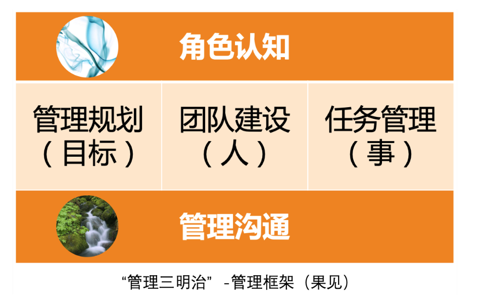
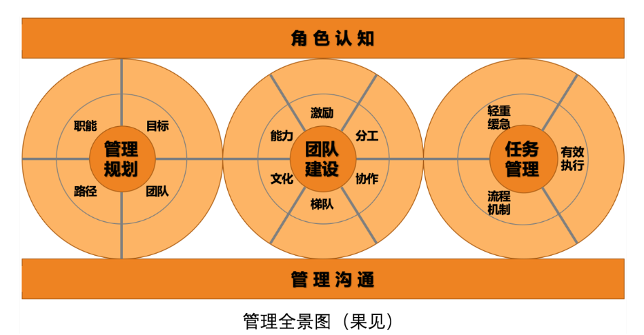
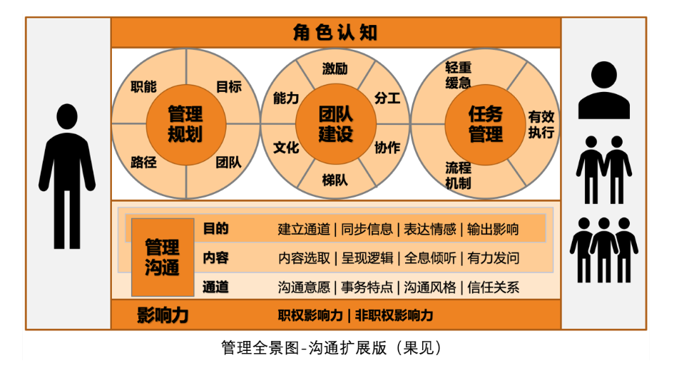

# 管理框架

# 管理全景图

# 沟通扩展版“管理全景图”

1. **角色认知**，关于角色认知和角色澄清的方法论

2. **管理规划**，关于带着团队看方向的方法论
   
   - **职能**，关于如何澄清团队职能定位——回答团队核心价值的方法论
   - **目标**，关于目标设定和目标管理的方法论
   - **团队**，关于团队规划的方法论
   - **路径**，关于路径选择和成本预算的方法论

3. **团队建设**，关于如何带人的方法论
   
   - **能力**，关于如何培养员工工作能力的方法论
   - **激励**，关于如何提升员工工作意愿和积极性的方法论
   - **分工**，关于如何做团队分工和组织架构设计的方法论
   - **协作**，关于如何提升团队凝聚力和默契的方法论
   - **梯队**，关于如何进行梯队建设的方法论
   - **文化**，关于如何打造团队文化价值观的方法论

4. **任务管理**，关于如何做事的方法论
   
   - **轻重缓急**，关于如何排优先级的方法论
   - **有效执行**，关于如何做项目管理或项目执行的方法论
   - **流程机制**，关于如何通过流程机制来提升工作质量和效率的方法论

5. **管理沟通**，关于如何有效沟通的方法论
   
   - **目的**，关于如何明确沟通初衷和目的的方法论
   - **内容**，关于如何确保信息有效传递的方法论
   - **通道**，关于如何建立和增进沟通关系的方法论
   - **职权影响力**，关于不断理解职能影响力的方法论
   - **非职权影响力**，关于提升和运用职权之外的影响力的方法论
