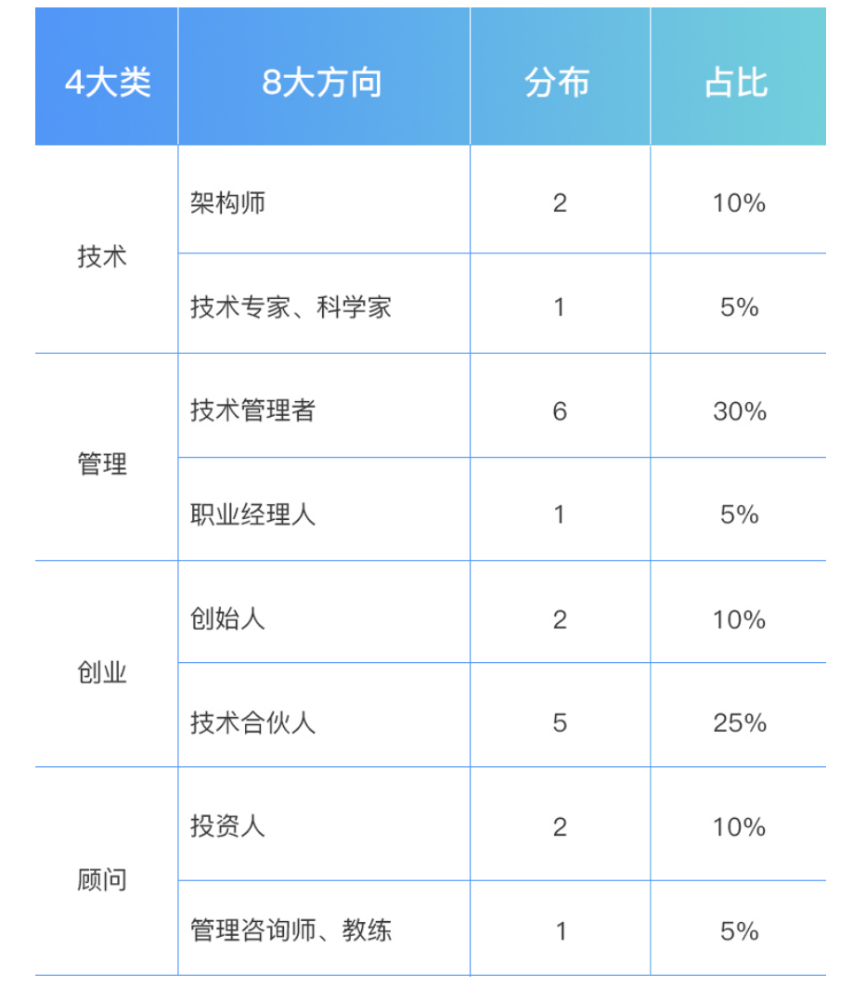
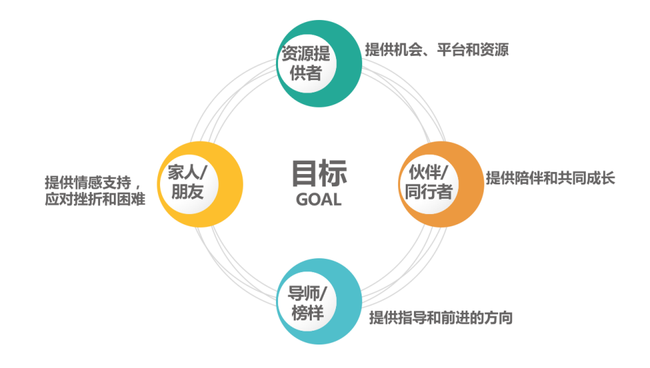

# 为什么要做技术管理？

why   为什么做管理

what 管理做什么

how  怎么做管理

## 管理角色认知

1. **自我倾听**： 主要围绕 “why” 的问题。理顺新经理内心的纠结与彷徨，让你心无旁骛地走上管理之路。
2. **角色认知**：提供给你一个管理工作的“全景图”，以方便你按图索骥地了解管理工作所涵盖的方方面面。
3. **管理方法**：这其中，管理规划（看方向）、团队建设（带人）和任务管理（做事），合称为“管理三部曲”，分别探讨“看方向”“带人”和“做事”的这三个关键的管理内容。
4. **管理沟通**： 探讨管理沟通的工具和技巧，并探讨 **向上、向下、横向** 等典型沟通场景下的沟通要点。
5. **管理之路**： 主要探讨如何积累管理方法论，以及如何成为自己所期待的管理者。

“如果干得好，管理是最崇高的职业之一。没有哪一个职业能像管理一样为他人提供学习和成长的机会，让他们懂得承担责任并取得成绩，以及为团队的成功做出贡献。”

​																																		-- 《你要如何衡量你的人生》 克里斯坦森

# 工程师们的职业方向

四个大类：分别是 **技术类、管理类、创业类和顾问类**

##  技术类

#### 广

一个方向侧重于“广”，着眼技术的整体性、架构性和业务解决方案，我们姑且称为“架构 师”或“首席架构师”。他们往往是一个产品或服务的技术方案的“总设计师”，他们常 见的作品包括社区类服务架构、云服务架构、搜索架构、电商服务架构、O2O 服务架构、 数据平台架构等等，每一个产品背后都有一位或几位技术架构师。

#### 专

另外一个方向侧重于“专”，着眼于某个专项技术的深度、专业度和精细度，我们姑且称 为“某领域技术专家”或“科学家”，比如图像技术、语音技术、机器学习、推荐算法等 等。他们往往是一个专业领域里的“武林高手”，他们的作品被广泛应用在每一个专业领 域。

## 管理类

管理类也有两个不同的方向，即技术管理者和职业经理人。

#### 技术管理者

是从工程师到技术团队的一线经理，再慢慢做到部门经理 等二线经理，然后是某个大技术体系或整个技术部的技术副总裁，如果还包括产品、设计等 所有“产品交付”类团队，就成为了一个常规意义上的 CTO，但总体上，都是技术管理 者。

#### 职业经理人

不限于管理技术类团队，往往负责 的是一个完整的业务，很像是这个业务的 CEO，有些公司也会叫 GM（general manager）。这个角色并不限定在具体一个业务，还可以根据公司需要去负责一个新业 务，迁移性比较强，比较接近我们常说的“职业经理人”。这样的管理者会关心一个业务经 营的方方面面，但本质还是公司高管，在公司整体框架下工作。

## 创业类

#### 创始人

一个方向是作为创始人牵头创业，做领头羊。创业成功后就成为我们所说的“企业家”，像 李彦宏、马化腾、周鸿祎等，这都是技术人牵头创业的典范。

#### 技术合伙人 & 技术高管

全盘负责公司的技术，以技术管理为公司“安邦定 国”

## 顾问类

#### 投资顾问

一个方向是投资顾问，也就是做投资人，有做投前的，也有做投后的，基于对一个创业团队 和项目的完整判断，从外围以资本运作和投后服务来支持创业公司发展。他们在做投资人之 前，往往都有着相当丰富的企业经营管理经验、宽广的视野和敏锐的洞察力。

#### 管理顾问

提供培训、咨询服务，偏人力发展和团队建设。这个方向 是通过支持管理者和 HR 来支持公司的发展，往往以多年的管理经验、管理理论、教练技 术和培训经验为依托。

## 总结

1. 整体分布情况比较分散，大家 10 年后都有了自己的选择。 
2.  技术管理者和创业公司的技术合伙人相对集中，两个方向加起来超过一半。 
3. 10 年后仍坚持做技术的比例比较低，在 20% 左右。

## 技能清单

# 是否需要做管理呢？

反思自己“做管理”的初衷。是非常重要的，因为 它不仅决定了你能在这条路上走多久，还决定了你能走多远、走多好，甚至走得是否开心。

## 怎么走上管理之路的？ -- 初衷

### 外区力

第一类：不得已的选择

“我对技术没有热情，也没有技术特长，所以只能做管理。” “做技术又不能做一辈子，很多前辈都转管理了，我也要转。” “没有办法，公司发展太快了，老板要求我带团队。”

第二类：别人眼里的成功

“如果能做到公司高管，别人都会认为我是一个优秀和成功的人。” “能够做管理带团队，这样在家人眼中会很风光。”

第三类：不辜负组织的期待

“上级说我适合做管理，我不能辜负他对我的期望。” “公司需要我带团队，这是公司对我的信任，我一定得做好。”

第四类：对做管理的主观遐想

“不用凡事亲力亲为，安排下级去做就好了，应该会轻松些。” “做管理越晋升越轻松，你看高管都不坐班。”

如果你因为这样的“外驱力”而选择了管理，时间一长你就会觉 得管理工作越来越烦人，而且并不如自己所期待的那样风光，甚至会怀疑自己当初是否选错 了路。

### 内在动力和真正诉求

1. “管理的价值观”的，即你是否认同管理的价值呢？
2. 你是否对管理充满热情，并享受这些工作呢？
3. 你是否看重在管理方面的成长呢？

## 管理的挑战  --- 投入

### 更大的责任。

在互联网领域，管理者带一个团队，更多 是意味着要承担更大的期待和责任。即便有时看上去有一定权力，但归根结底，还是为了更 好地实现团队目标，基本体会不到行使权力的快感。

### 更立体的视角

在做工程师的时候，只要做好上级交代的任务就好了。而一旦做管理， 为了带好整个团队，就需要考虑上级、下级、平级的期待和诉求，而且不能只是关心“眼 前”，还得关心“从前”和“以后”，提升看待问题的系统性。

###  更灵活的思维方式

多年的技术工作训练，你一定有很强的确定性的思维方式，讲究界 限清晰、对错分明、言出必行、不出差错，往往靠谱就是你的代名词；而很多管理工作却是 充满着不确定性的，有些工作的执行边界也是模糊的，甚至是非对错都很难界定清楚。在各 种不确定因素中，却要去追求一个明确的目标，这对于很多新的技术管理者来说，思维方式 会受到很大冲击。

## 管理的获得  ---成长

### 成长感

你到了一个更大的平台上，你的能力和视野将得到大幅度提升。这会给你带来明显的 成长感。

### 成就感

你不但能力变强了，你还有团队了，你能搞定更大、更复杂的事情，做出更大的成 绩。这会带给你更强的成就感。

### 影响力

你可以带着团队做出越来越多的成就，你的团队也越来越优秀，团队成员都得到了成 长，你甚至还会影响到合作团队。你的影响力显著提升了。

### 获得感

你的能力、成绩、影响力全面提升，你得到了更多的精神和物质的回报。你所有的付 出、成长和积累，都将或早或晚地换回等值的回馈。你的获得感也将得到满足。

关于你的初衷、你的投入、你的成长以及你的回报之间的逻辑。

**“服从让我们撑过白天，而投入才能 让我们撑过夜晚。”这告诉了我们一个很简单的事实：外驱让我们可以做好本职工作，而内 驱才能让我们成就卓越。**

# 走上管理岗位的契机

## 天时

做管理的“天时”，其实就是机会、时机、大环境、时代背景。

如果你要做管理，最好选择那些发展快的行业和公司，这意味着更多的机会。 当然更多的机会也意味着更多的挑战，如果你希望工作得舒服轻松一些，依然可以去稳定的 行业和企业工作，但在稳定的行业要走上管理岗位，可能就需要漫长的等待了。

**去能积累的公司做管理，会是更合理的选择。**

## 地利

做管理的“地利”，就是你的优势、能力，以及你所负责的工作内容。

**更容易成为管理者**：

1. 负责最全局的模块，核心是“广”
2. 负责最核心的技术模块，核心是“深”

如果你 主动去了解技术和业务的全局，并主动争取做一些大型项目的负责人，你就具备了做管理 的“地利”，前提是你先认识到这一点。

## 人和

做管理的“人和”，就是你能否得到他人的支持。

第一类，为你提供机会、平台和资源的支持。一般是你的上级，他们是否支持你做管理非常 重要。 

第二类，为你提供陪伴和共同成长的支持。一般是和你平级的管理者，尤其是那些你愿意与 之持续交流、切磋管理问题的伙伴。当然也可以是之前的同学和朋友，还可以是一些管理社 群。总之，你可以根据自己的情况和喜好来看看，谁可以做你的管理伙伴。 

第三类，为你提供指导和前进的方向。一般是你的导师、指导人、管理教练或上级。你可以 设定你认可的管理榜样，多和他交流，多听听他的看法和意见，这会让你的管理之路顺畅很 多。 

第四类，为你提供情感支持，让你勇于面对困难和挫折，在管理之路上走得更远。一般来 说，你的家人和朋友，可以担当这样的角色。

“天时”“地利”“人和”这三类外部因素都具备了（如下图），你自然可以更顺利 地走上管理岗位。

**想被提拔为一个管理者最好的方式，就是你首先成为一个实际上的管理者，我们 常常把这样的晋升理念叫“既定事实”，而这种理念在互联网行业里被广泛认同。**

# 做管理后的自我成长

## 转管理后的担忧

1. 有人会一脸无奈地对我说：“管理的事儿太杂，都没时间写代码了，越来越心虚……” 
2. 有人语重心长地告诉我：“做管理最大的挑战是，要舍弃技术，特别难。” 
3. 有人会抬头反问我：“管理和技术到底该怎么平衡？” 
4. 有人会故作轻松地笑道：“突然不写代码了，感觉吃饭的家伙没了，哈哈。” 
5. 有人则会满心忧虑：“管理工作太琐碎，感觉离技术越来越远，现在特别担心个人发展。”
6. 有人忿忿地跟我说：“管理是一个有违人性的事情，自己的技术专业性越来越 差，但是却要带领整个团队。”

**担忧的原因**

1.  转管理之前没有仔细了解过管理
2. 才开始做管理，还无法靠管理“安身立命”
3. 认为技术才是自己的“大本营”

“患得”“患失”  从对自己安身立命的安全感角度来看，可以说是一种青黄不接的状态。他们 对于做管理，还没有摸到门道，不知道该怎么搞定，经常出现一些让自己不知所措的状况， 倍感心焦；而之前已经熟练掌握的技术能力，因为在上面花的时间越来越少，感觉正在离自 己而去，怎不令人烦恼呢！

## 成长方式

### 视角一 ---患失

1. **把技术提到更高视角来看待**。做技术的时候，把技术做好就是最大的目标；而做了管 理之后，你会把技术作为一个手段来看待，看它究竟能为目标带来什么。但这并不意味着你 就不再关心技术，只是关心的层次不同了，你开始需要借助每个人的技术能力去做更大的事 情了。

2.  **换一种学习方式来掌握技术** 。你要深刻地认识到，亲自写代码固然是很好的学习技术 的方式，但是作为 leader，你需要快速掌握更多的技术，并且快速判断该如何搭配使用， 所以你一定得有更高效的学习方式才行。

   1. 建立你的学习机制。你可以想想在团队内建立什么样的学习机制，可以帮助你借助团队 的力量来提升技术判断力，并结合自己的情况来创建。 
   2. 请教专家。在了解某一个领域的情况时，借助你的平台，找你能找到的最厉害的专家高 手进行请教，他们之所以成为高手，一般都能给出高屋建瓴、醍醐灌顶的认知。 
   3. 共创。在这个知识型工作者的时代，和自己埋头思考相比，共创成果往往会出乎你想 象，特别能增长见识，你可以看看在团队中如何建立共创机制。

   **无论从哪个方面讲，你都并没有放弃技术，只是换了一种方 式去学习和运用技术**

### 视角二 ---患得

1. 做管理对个人成长和个人发展来说，不会失败。因为管理总体上是一项修炼，只要你 持续不断地实践、练习，你的造诣就会越来越高，最后你一定可以胜任某个规模或某个职能 的团队。我们通常所谓的“不胜任”，只是说不匹配，而不是说你就完全做不了管理。而 且，管理是很个性化的工作，你完全可以使用自己擅长的方式，去达成管理效果。
2. 一线技术管理者，即便“做不好”也并非没有“回头路”。刚刚从工程师岗位转到管 理者岗位时，离技术很近，如果尝试下来，感觉管理工作确实不是自己想要的，那么，回过 头来继续做工程师，几乎是没有门槛的。所以，如果当下不知道自己适不适合做管理，不如 全力以赴去尝试一段时间，你其实还有充足的时间来慢慢做这个决定，不需要有后顾之忧。
3. 做管理所积累的能力，完全可以迁移到做“技术带头人”或“技术 leader”这个角 色上。所以，你都不用担心管理的工作会白做，或者本来可以做技术的时间被耽误了。因 为，即便你再回头去做工程师，也需要练习去做高级工程师或架构师，需要尝试去负责一个 完整的技术方向，此时，你做管理时锻炼的全局视野、规划能力、结果导向意识、项目管理 方法、沟通协调能力等等，都会派上用场。

**你一定会有所得，会在做管理过程中有丰富的收获，既然 一定能“得到”，所以不需要去“患得”。 第三个药方，有点猛，叫做“认清现实**

### 视角三 - -- 认清现实

**你要么做技术管理，用更高的视角来看待技术；要么你继续 做工程师，也要用更高的视角去看待技术。**

1. 从目标出发去看待技术。只有目标明确，才能选择最佳的技术方案，做出最好的技 术决策。
2. 从评估的角度去看待技术。做工程师的时候，把一个技术方案设计好、实现出来就 好了，而做了架构师之后，你需要非常清楚一个技术方案是通过哪些维度来评估其好坏优 劣的。并且，当一个技术问题暴露出来之后，得迅速判断会造成什么影响，损失的边界在 哪里，有多紧急，以决定要不要放下手头的项目去立一个紧急项目。
3. 从借助自己的技术到借助大家的技术。做技术的时候，了解自己能做什么就好了。 但是无论是做管理者还是架构师，你都需要带人做事了，这个时候你就需要熟悉团队里每 个人的技术情况，知道谁能胜任做什么事情，适合做什么事，然后借助大家的技术去做 事。

**：既然你避无可避，不如奋力向前。**

